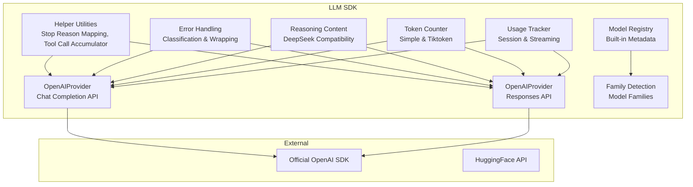
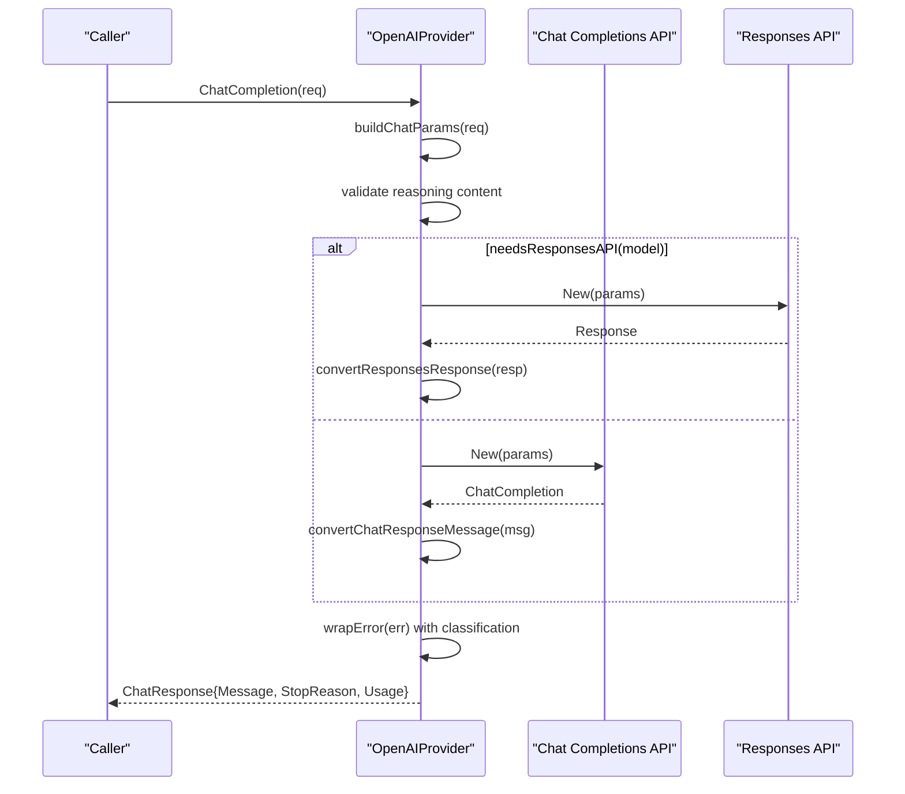
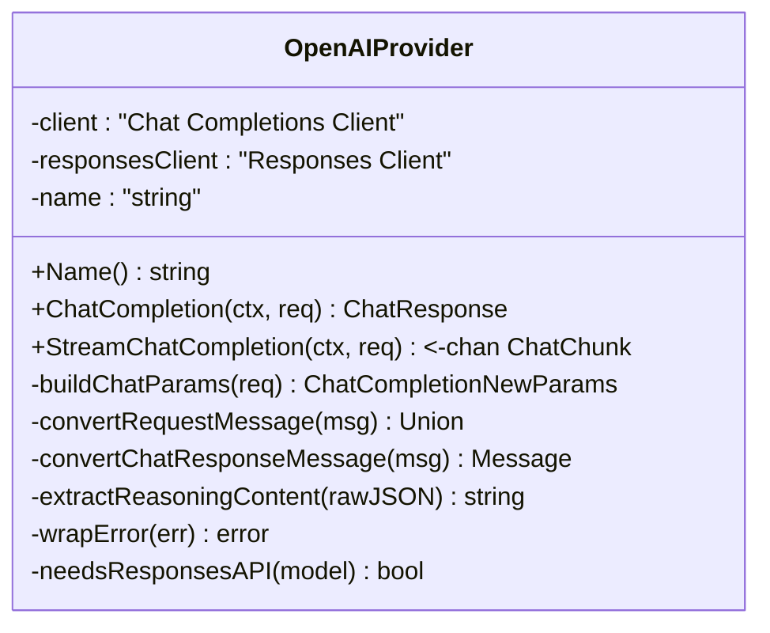
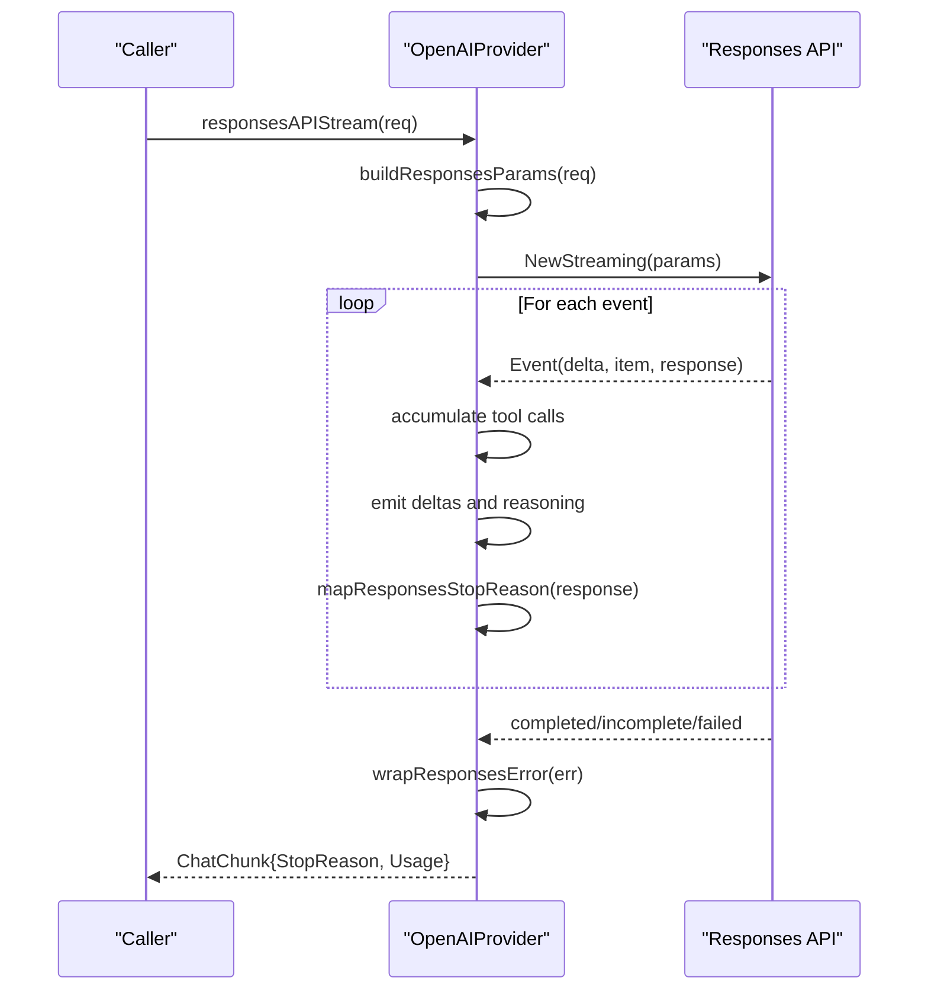
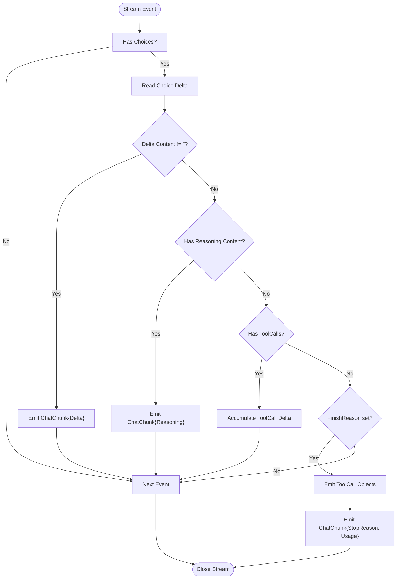
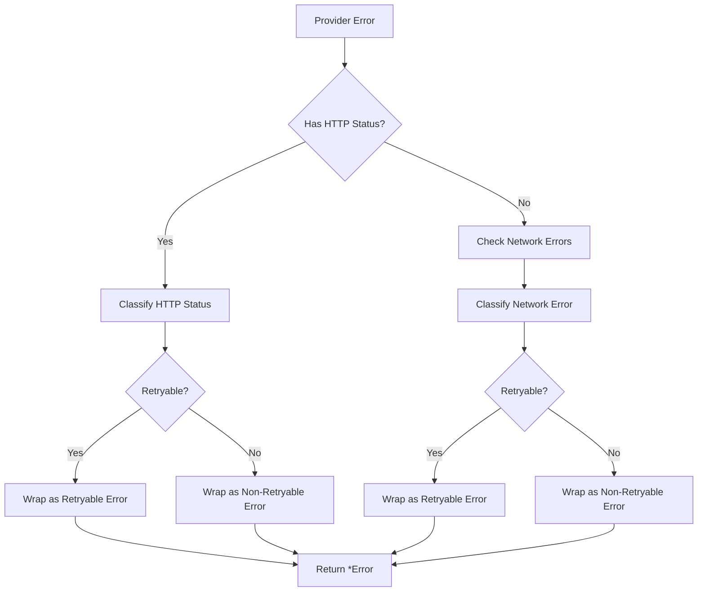
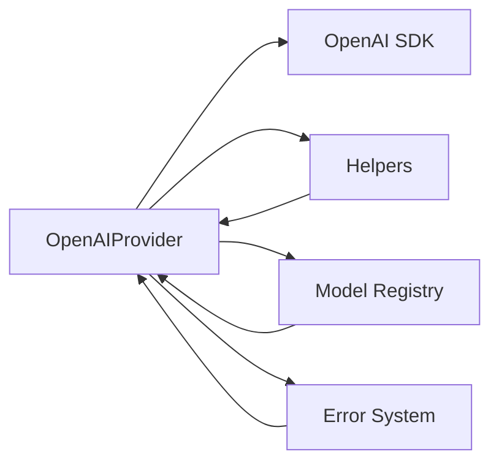

# OpenAI Provider Implementation

<cite>
**Referenced Files in This Document**
- [provider_openai.go](file://sdk/llm/provider_openai.go)
- [provider_openai_responses.go](file://sdk/llm/provider_openai_responses.go)
- [provider_openai_test.go](file://sdk/llm/provider_openai_test.go)
- [provider_openai_responses_test.go](file://sdk/llm/provider_openai_responses_test.go)
- [provider_helpers.go](file://sdk/llm/provider_helpers.go)
- [errors.go](file://sdk/llm/errors.go)
- [tokencount.go](file://sdk/llm/tokencount.go)
- [usage.go](file://sdk/llm/usage.go)
- [family.go](file://sdk/llm/family.go)
- [modelregistry.go](file://sdk/llm/modelregistry.go)
- [config.example.yaml](file://config.example.yaml)
</cite>

## Update Summary
**Changes Made**
- Enhanced error handling documentation with comprehensive error wrapping and classification
- Added detailed reasoning content support documentation for DeepSeek compatibility
- Expanded streaming implementation details with improved tool call accumulation
- Updated model family detection and routing logic
- Enhanced test coverage documentation reflecting 880-line comprehensive test suite

## Table of Contents
1. [Introduction](#introduction)
2. [Project Structure](#project-structure)
3. [Core Components](#core-components)
4. [Architecture Overview](#architecture-overview)
5. [Detailed Component Analysis](#detailed-component-analysis)
6. [Enhanced Error Handling and Response Processing](#enhanced-error-handling-and-response-processing)
7. [Dependency Analysis](#dependency-analysis)
8. [Performance Considerations](#performance-considerations)
9. [Troubleshooting Guide](#troubleshooting-guide)
10. [Conclusion](#conclusion)

## Introduction
This document explains the OpenAI provider implementation in C0WRK. It covers the API wrapper design, request/response transformation logic, streaming implementation, supported models and endpoints, authentication mechanisms, response parsing, error handling, rate limiting integration, token counting and usage tracking, and practical configuration examples. The implementation supports both the Chat Completions API and the Responses API for OpenAI Codex models, and it integrates with the broader LLM framework for tool calling, token accounting, and usage reporting. Recent enhancements include comprehensive error handling, reasoning content support, and extensive test coverage validating all major functionality.

## Project Structure
The OpenAI provider resides in the LLM SDK and interacts with:
- Provider wrappers for Chat Completions and Responses APIs
- Enhanced error handling and classification system
- Comprehensive reasoning content processing for DeepSeek compatibility
- Tool call accumulation utilities for streaming responses
- Token counting utilities and usage tracking
- Model family detection and metadata registry
- Extensive test coverage validating all functionality

**Diagram sources**
- [provider_openai.go:1-327](file://sdk/llm/provider_openai.go#L1-L327)
- [provider_openai_responses.go:1-313](file://sdk/llm/provider_openai_responses.go#L1-L313)
- [provider_helpers.go:1-157](file://sdk/llm/provider_helpers.go#L1-L157)
- [errors.go:1-118](file://sdk/llm/errors.go#L1-L118)
- [tokencount.go:1-184](file://sdk/llm/tokencount.go#L1-L184)
- [usage.go:1-161](file://sdk/llm/usage.go#L1-L161)
- [modelregistry.go:1-532](file://sdk/llm/modelregistry.go#L1-L532)
- [family.go:1-74](file://sdk/llm/family.go#L1-L74)

**Section sources**
- [provider_openai.go:1-327](file://sdk/llm/provider_openai.go#L1-L327)
- [provider_openai_responses.go:1-313](file://sdk/llm/provider_openai_responses.go#L1-L313)
- [provider_helpers.go:1-157](file://sdk/llm/provider_helpers.go#L1-L157)
- [errors.go:1-118](file://sdk/llm/errors.go#L1-L118)
- [tokencount.go:1-184](file://sdk/llm/tokencount.go#L1-L184)
- [usage.go:1-161](file://sdk/llm/usage.go#L1-L161)
- [modelregistry.go:1-532](file://sdk/llm/modelregistry.go#L1-L532)
- [family.go:1-74](file://sdk/llm/family.go#L1-L74)

## Core Components
- OpenAIProvider: Implements Provider for OpenAI Chat Completions API and automatically routes Codex models to the Responses API.
- OpenAIProvider (Responses): Dedicated client for the Responses API used by Codex models.
- Enhanced error handling: Comprehensive error classification, wrapping, and retryable status determination.
- Reasoning content processing: Advanced support for DeepSeek-style reasoning_content fields in both request and response processing.
- Tool call accumulation: Improved streaming tool call delta accumulation with better state management.
- Token counting: Approximate and accurate counters (tiktoken) plus context-aware token tracking.
- Usage tracking: Session-wide usage aggregation and per-call corrections for context budgets.
- Model registry and families: Built-in metadata for OpenAI models and model family detection.

**Section sources**
- [provider_openai.go:20-82](file://sdk/llm/provider_openai.go#L20-L82)
- [provider_openai_responses.go:19-41](file://sdk/llm/provider_openai_responses.go#L19-L41)
- [errors.go:11-118](file://sdk/llm/errors.go#L11-L118)
- [provider_helpers.go:5-24](file://sdk/llm/provider_helpers.go#L5-L24)
- [tokencount.go:11-121](file://sdk/llm/tokencount.go#L11-L121)
- [usage.go:9-68](file://sdk/llm/usage.go#L9-L68)
- [modelregistry.go:212-333](file://sdk/llm/modelregistry.go#L212-L333)
- [family.go:20-73](file://sdk/llm/family.go#L20-L73)

## Architecture Overview
The provider architecture cleanly separates concerns with enhanced error handling and comprehensive testing:
- Provider selection: Based on model family detection, Codex models use the Responses API while others use Chat Completions.
- Request transformation: Converts internal Message and ToolDefinition structures to provider-specific parameters with reasoning content support.
- Streaming: Accumulates tool call deltas and emits content, reasoning content, and tool call fragments progressively.
- Response parsing: Converts provider responses to internal Message and ChatResponse structures with reasoning content preservation.
- Enhanced error handling: Wraps provider errors into a unified error type with status codes, retryability hints, and comprehensive classification.
- Token accounting: Tracks usage per call and corrects context budgets post-call.

**Diagram sources**
- [provider_openai.go:53-82](file://sdk/llm/provider_openai.go#L53-L82)
- [provider_openai.go:149-192](file://sdk/llm/provider_openai.go#L149-L192)
- [provider_openai_responses.go:31-41](file://sdk/llm/provider_openai_responses.go#L31-L41)
- [provider_openai_responses.go:271-303](file://sdk/llm/provider_openai_responses.go#L271-L303)
- [errors.go:105-118](file://sdk/llm/errors.go#L105-L118)

## Detailed Component Analysis

### OpenAIProvider (Chat Completions)
- Construction: Accepts API key and optional custom BaseURL; creates two clients (Chat Completions and Responses) for model-family routing.
- ChatCompletion: Builds parameters with reasoning content support, calls the Chat Completions API, validates response, converts to internal format, and extracts usage.
- Enhanced error handling: Comprehensive error wrapping with HTTP status classification and retryable status determination.
- StreamChatCompletion: Streams deltas with reasoning content support, accumulates tool calls, captures usage when available, and emits stop reason and final usage.

**Diagram sources**
- [provider_openai.go:20-51](file://sdk/llm/provider_openai.go#L20-L51)
- [provider_openai.go:53-147](file://sdk/llm/provider_openai.go#L53-L147)
- [provider_openai.go:297-327](file://sdk/llm/provider_openai.go#L297-L327)

**Section sources**
- [provider_openai.go:27-46](file://sdk/llm/provider_openai.go#L27-L46)
- [provider_openai.go:53-82](file://sdk/llm/provider_openai.go#L53-L82)
- [provider_openai.go:84-147](file://sdk/llm/provider_openai.go#L84-L147)
- [provider_openai.go:149-192](file://sdk/llm/provider_openai.go#L149-L192)
- [provider_openai.go:216-279](file://sdk/llm/provider_openai.go#L216-L279)
- [provider_openai.go:281-289](file://sdk/llm/provider_openai.go#L281-L289)
- [provider_openai.go:297-327](file://sdk/llm/provider_openai.go#L297-L327)

### OpenAIProvider (Responses API)
- Purpose: Handles OpenAI Codex models that require the Responses API.
- Non-streaming: Builds Responses API parameters with reasoning support, calls New, and converts the response to internal format.
- Enhanced streaming: Processes event types for output text, reasoning summary text, function call arguments, and completion/incomplete/failed states; emits tool calls and usage with comprehensive error handling.

**Diagram sources**
- [provider_openai_responses.go:43-120](file://sdk/llm/provider_openai_responses.go#L43-L120)
- [provider_openai_responses.go:122-161](file://sdk/llm/provider_openai_responses.go#L122-L161)
- [provider_openai_responses.go:163-214](file://sdk/llm/provider_openai_responses.go#L163-L214)
- [errors.go:305-313](file://sdk/llm/errors.go#L305-L313)

**Section sources**
- [provider_openai_responses.go:19-41](file://sdk/llm/provider_openai_responses.go#L19-L41)
- [provider_openai_responses.go:43-120](file://sdk/llm/provider_openai_responses.go#L43-L120)
- [provider_openai_responses.go:122-161](file://sdk/llm/provider_openai_responses.go#L122-L161)
- [provider_openai_responses.go:163-214](file://sdk/llm/provider_openai_responses.go#L163-L214)
- [provider_openai_responses.go:245-269](file://sdk/llm/provider_openai_responses.go#L245-L269)
- [provider_openai_responses.go:271-303](file://sdk/llm/provider_openai_responses.go#L271-L303)

### Request/Response Transformation and Streaming
- Request transformation:
  - Messages: system, user, assistant (with tool calls), tool.
  - Tools: Function definitions with sanitized JSON schema.
  - Parameters: model, max tokens, temperature, reasoning effort.
  - Reasoning content: DeepSeek-compatible reasoning_content field support.
- Streaming:
  - Content deltas are emitted immediately.
  - Reasoning content deltas are extracted from raw JSON for DeepSeek compatibility.
  - Tool call arguments are accumulated across deltas and emitted as complete ToolCall objects upon finish or stop.
  - Usage is captured from the final stream event when available.

**Diagram sources**
- [provider_openai.go:84-147](file://sdk/llm/provider_openai.go#L84-L147)
- [provider_helpers.go:45-99](file://sdk/llm/provider_helpers.go#L45-L99)
- [provider_openai.go:297-310](file://sdk/llm/provider_openai.go#L297-L310)

**Section sources**
- [provider_openai.go:149-192](file://sdk/llm/provider_openai.go#L149-L192)
- [provider_openai.go:216-279](file://sdk/llm/provider_openai.go#L216-L279)
- [provider_helpers.go:45-99](file://sdk/llm/provider_helpers.go#L45-L99)

### Authentication and Endpoint Configuration
- Authentication: API key passed via SDK options; BaseURL optional for custom endpoints (e.g., DeepSeek, Grok, OpenRouter, Ollama, LM-Studio).
- Provider selection: Custom BaseURL enables compatibility mode; default BaseURL targets OpenAI.

**Section sources**
- [provider_openai.go:30-46](file://sdk/llm/provider_openai.go#L30-L46)
- [provider_openai_responses.go:19-29](file://sdk/llm/provider_openai_responses.go#L19-L29)

### Supported Models and Endpoints
- OpenAI flagship models: gpt-5.x, o3, o1, gpt-4o, gpt-4o-mini, etc.
- OpenAI standard models: gpt-4.1 series.
- OpenAI Codex models: codex-mini-latest, gpt-5.3-codex; routed to Responses API.
- Model family detection: Used to select prompt templates and parameter adaptations.

**Section sources**
- [family.go:20-73](file://sdk/llm/family.go#L20-L73)
- [modelregistry.go:212-333](file://sdk/llm/modelregistry.go#L212-L333)
- [provider_openai.go:291-296](file://sdk/llm/provider_openai.go#L291-L296)

## Enhanced Error Handling and Response Processing

### Comprehensive Error Classification
The provider now includes sophisticated error handling with comprehensive classification and retryable status determination:

- **HTTP Status Classification**: Automatic retryable status detection for 429, 502, 503, and 529.
- **Network Error Classification**: Transient network error detection including timeouts, connection issues, DNS errors, and unexpected EOF.
- **Provider Error Wrapping**: Unified error type with provider name, status code, retryable flag, and original error.
- **Fallback Error Handling**: Graceful handling of non-HTTP errors with zero status code.

**Diagram sources**
- [errors.go:48-88](file://sdk/llm/errors.go#L48-L88)
- [errors.go:105-118](file://sdk/llm/errors.go#L105-L118)
- [provider_openai.go:312-320](file://sdk/llm/provider_openai.go#L312-L320)
- [provider_openai_responses.go:305-313](file://sdk/llm/provider_openai_responses.go#L305-L313)

### Reasoning Content Processing
Enhanced support for DeepSeek-style reasoning_content fields:

- **Request Processing**: Assistant messages always include reasoning_content field, even when empty, to satisfy DeepSeek requirements.
- **Response Processing**: Extract reasoning_content from raw JSON responses for both standard OpenAI and DeepSeek extensions.
- **Schema Preservation**: Reasoning content fields are preserved during message conversion and JSON marshaling/unmarshaling.
- **Synthetic Message Support**: Proper handling of synthetic assistant messages without tool calls but with empty reasoning content.

**Section sources**
- [provider_openai.go:222-271](file://sdk/llm/provider_openai.go#L222-L271)
- [provider_openai.go:273-295](file://sdk/llm/provider_openai.go#L273-L295)
- [provider_openai.go:297-310](file://sdk/llm/provider_openai.go#L297-L310)
- [provider_openai_test.go:174-219](file://sdk/llm/provider_openai_test.go#L174-L219)
- [provider_openai_test.go:342-450](file://sdk/llm/provider_openai_test.go#L342-L450)

### Streaming Tool Call Accumulation
Improved streaming tool call handling:

- **Delta Accumulation**: Tool call arguments are accumulated across multiple streaming deltas.
- **State Management**: Better tracking of tool call state across streaming events.
- **Completion Detection**: Proper emission of completed tool calls when finish reason is received.
- **Error Handling**: Graceful handling of streaming errors with error stop reason.

**Section sources**
- [provider_helpers.go:62-116](file://sdk/llm/provider_helpers.go#L62-L116)
- [provider_openai.go:85-153](file://sdk/llm/provider_openai.go#L85-L153)
- [provider_openai_responses.go:43-120](file://sdk/llm/provider_openai_responses.go#L43-L120)

## Dependency Analysis
- Provider-to-SDK: Both providers depend on the official OpenAI SDK for HTTP requests and streaming.
- Provider-to-Helpers: Shared mapping and tool call accumulation utilities.
- Provider-to-Metadata: Model family detection and registry inform prompt adaptation and capability flags.
- Enhanced Error System: Comprehensive error classification and wrapping system.

**Diagram sources**
- [provider_openai.go:3-11](file://sdk/llm/provider_openai.go#L3-L11)
- [provider_helpers.go:1-157](file://sdk/llm/provider_helpers.go#L1-L157)
- [modelregistry.go:1-532](file://sdk/llm/modelregistry.go#L1-L532)
- [errors.go:1-118](file://sdk/llm/errors.go#L1-L118)

**Section sources**
- [provider_openai.go:3-11](file://sdk/llm/provider_openai.go#L3-L11)
- [provider_helpers.go:1-157](file://sdk/llm/provider_helpers.go#L1-L157)
- [modelregistry.go:1-532](file://sdk/llm/modelregistry.go#L1-L532)
- [errors.go:1-118](file://sdk/llm/errors.go#L1-L118)

## Performance Considerations
- Streaming efficiency: Tool call arguments are accumulated locally to minimize intermediate allocations and ensure complete ToolCall objects are emitted only when ready.
- Token counting: Use tiktoken for accuracy on OpenAI models; fallback to approximate counting for speed when accuracy is not required.
- Usage tracking: Observers are copied under lock to avoid races; batching usage updates reduces contention.
- Model family detection: Quick string-based checks prevent expensive lookups for most models.
- Error classification: Efficient error categorization avoids expensive error inspection operations.

## Troubleshooting Guide
- Authentication failures:
  - Verify API key configuration and ensure environment variable substitution resolves correctly.
  - For custom endpoints, confirm BaseURL correctness and network accessibility.
- Rate limiting:
  - Expect retryable errors on 429; configure retry/backoff policies accordingly.
- Model routing issues:
  - Codex models must use the Responses API; ensure model IDs match the Codex family to trigger the correct API path.
- Streaming anomalies:
  - Tool calls may arrive in fragmented deltas; ensure consumers handle accumulated ToolCall objects emitted upon finish.
- Token accounting:
  - For streaming, usage may appear in the final chunk; ensure downstream logic handles optional usage fields.
- Reasoning content issues:
  - DeepSeek models require reasoning_content fields; ensure proper handling of empty reasoning content for tool call messages.
- Error handling:
  - Check error retryable status using IsRetryable(err) to determine if operation should be retried.

**Section sources**
- [provider_openai_test.go:18-43](file://sdk/llm/provider_openai_test.go#L18-L43)
- [provider_openai_test.go:403-434](file://sdk/llm/provider_openai_test.go#L403-L434)
- [provider_openai.go:291-296](file://sdk/llm/provider_openai.go#L291-L296)
- [errors.go:39-46](file://sdk/llm/errors.go#L39-L46)
- [provider_openai_test.go:848-880](file://sdk/llm/provider_openai_test.go#L848-L880)

## Conclusion
The OpenAI provider implementation in C0WRK offers a robust, extensible integration supporting both Chat Completions and Responses APIs, comprehensive streaming with tool call assembly, accurate token accounting, and seamless usage tracking. Recent enhancements include comprehensive error handling with classification and retryable status determination, advanced reasoning content support for DeepSeek compatibility, and extensive test coverage validating all functionality. The implementation cleanly separates concerns, leverages the official SDK, and integrates with the broader LLM framework for model metadata, prompting, and orchestration.