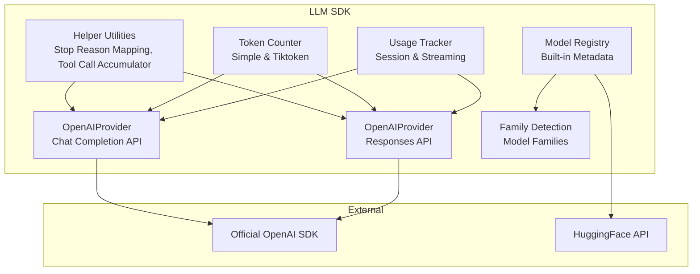
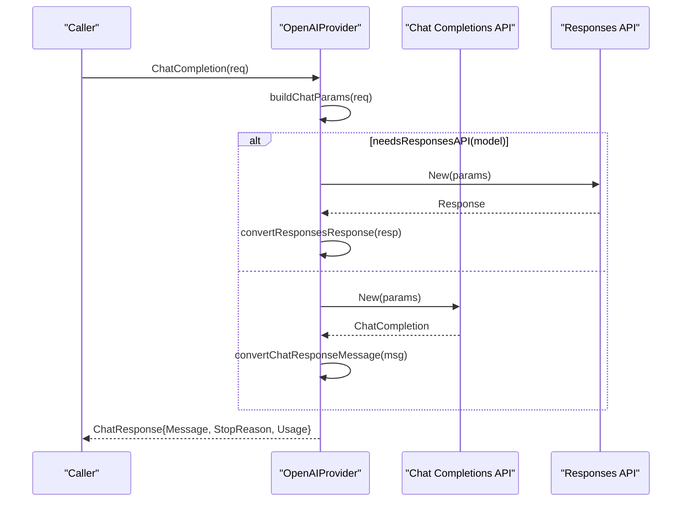
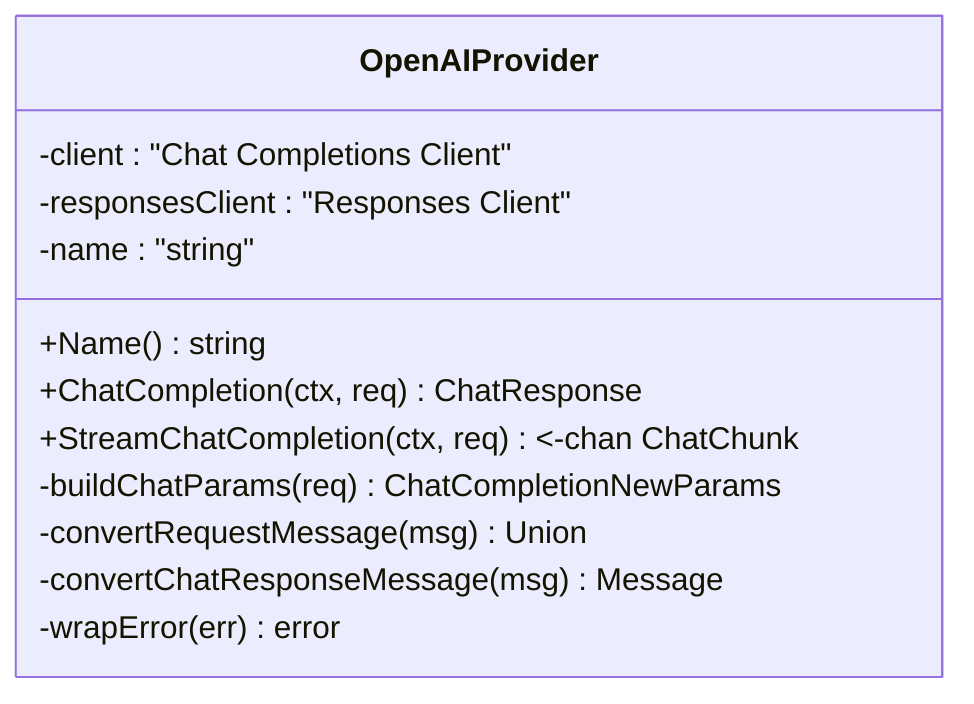
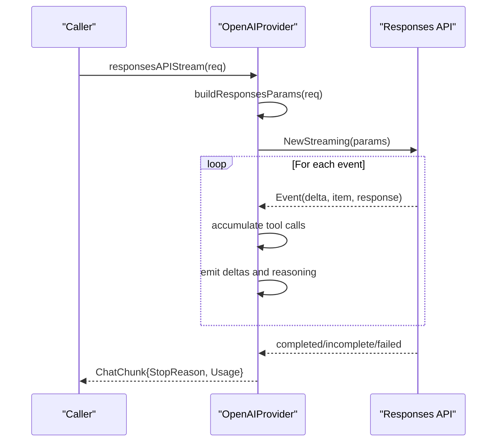
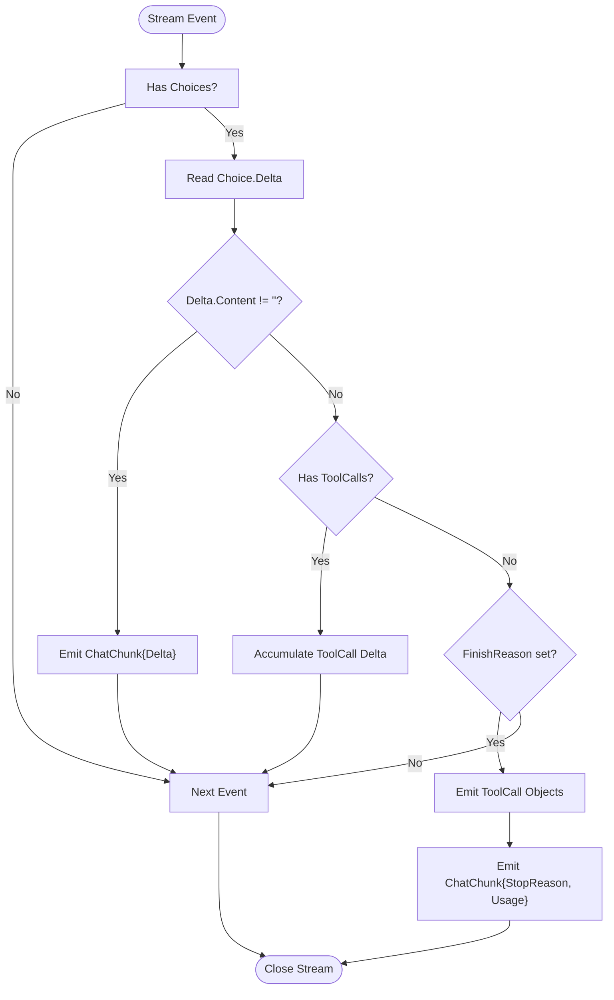
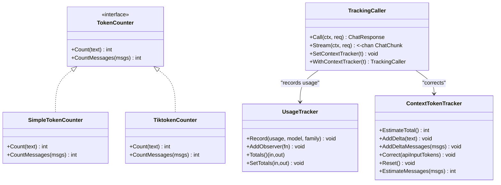
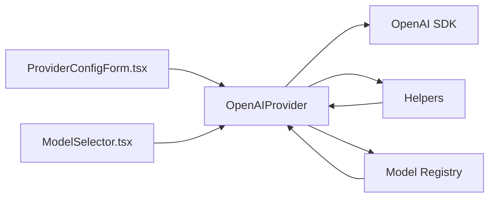

# OpenAI Provider Implementation

<cite>
**Referenced Files in This Document**
- [provider_openai.go](file://sdk/llm/provider_openai.go)
- [provider_openai_responses.go](file://sdk/llm/provider_openai_responses.go)
- [tokencount.go](file://sdk/llm/tokencount.go)
- [usage.go](file://sdk/llm/usage.go)
- [family.go](file://sdk/llm/family.go)
- [modelregistry.go](file://sdk/llm/modelregistry.go)
- [provider_helpers.go](file://sdk/llm/provider_helpers.go)
- [provider_openai_test.go](file://sdk/llm/provider_openai_test.go)
- [provider_openai_responses_test.go](file://sdk/llm/provider_openai_responses_test.go)
- [ProviderConfigForm.tsx](file://frontend/src/components/settings/ProviderConfigForm.tsx)
- [ModelSelector.tsx](file://frontend/src/components/settings/ModelSelector.tsx)
- [config.example.yaml](file://config.example.yaml)
</cite>

## Table of Contents
1. [Introduction](#introduction)
2. [Project Structure](#project-structure)
3. [Core Components](#core-components)
4. [Architecture Overview](#architecture-overview)
5. [Detailed Component Analysis](#detailed-component-analysis)
6. [Dependency Analysis](#dependency-analysis)
7. [Performance Considerations](#performance-considerations)
8. [Troubleshooting Guide](#troubleshooting-guide)
9. [Conclusion](#conclusion)

## Introduction
This document explains the OpenAI provider implementation in C0WRK. It covers the API wrapper design, request/response transformation logic, streaming implementation, supported models and endpoints, authentication mechanisms, response parsing, error handling, rate limiting integration, token counting and usage tracking, and practical configuration examples. The implementation supports both the Chat Completions API and the Responses API for OpenAI Codex models, and it integrates with the broader LLM framework for tool calling, token accounting, and usage reporting.

## Project Structure
The OpenAI provider resides in the LLM SDK and interacts with:
- Provider wrappers for Chat Completions and Responses APIs
- Token counting utilities and usage tracking
- Model family detection and metadata registry
- Frontend configuration forms for credentials and model selection

**Diagram sources**
- [provider_openai.go:1-296](file://sdk/llm/provider_openai.go#L1-L296)
- [provider_openai_responses.go:1-313](file://sdk/llm/provider_openai_responses.go#L1-L313)
- [provider_helpers.go:1-140](file://sdk/llm/provider_helpers.go#L1-L140)
- [tokencount.go:1-184](file://sdk/llm/tokencount.go#L1-L184)
- [usage.go:1-161](file://sdk/llm/usage.go#L1-L161)
- [modelregistry.go:1-532](file://sdk/llm/modelregistry.go#L1-L532)
- [family.go:1-74](file://sdk/llm/family.go#L1-L74)

**Section sources**
- [provider_openai.go:1-296](file://sdk/llm/provider_openai.go#L1-L296)
- [provider_openai_responses.go:1-313](file://sdk/llm/provider_openai_responses.go#L1-L313)
- [provider_helpers.go:1-140](file://sdk/llm/provider_helpers.go#L1-L140)
- [tokencount.go:1-184](file://sdk/llm/tokencount.go#L1-L184)
- [usage.go:1-161](file://sdk/llm/usage.go#L1-L161)
- [modelregistry.go:1-532](file://sdk/llm/modelregistry.go#L1-L532)
- [family.go:1-74](file://sdk/llm/family.go#L1-L74)

## Core Components
- OpenAIProvider: Implements Provider for OpenAI Chat Completions API and automatically routes Codex models to the Responses API.
- OpenAIProvider (Responses): Dedicated client for the Responses API used by Codex models.
- Helper utilities: Stop reason mapping, system prompt extraction, and tool call accumulation across streaming deltas.
- Token counting: Approximate and accurate counters (tiktoken) plus context-aware token tracking.
- Usage tracking: Session-wide usage aggregation and per-call corrections for context budgets.
- Model registry and families: Built-in metadata for OpenAI models and model family detection.

**Section sources**
- [provider_openai.go:20-82](file://sdk/llm/provider_openai.go#L20-L82)
- [provider_openai_responses.go:19-41](file://sdk/llm/provider_openai_responses.go#L19-L41)
- [provider_helpers.go:5-24](file://sdk/llm/provider_helpers.go#L5-L24)
- [tokencount.go:11-121](file://sdk/llm/tokencount.go#L11-L121)
- [usage.go:9-68](file://sdk/llm/usage.go#L9-L68)
- [modelregistry.go:212-333](file://sdk/llm/modelregistry.go#L212-L333)
- [family.go:20-73](file://sdk/llm/family.go#L20-L73)

## Architecture Overview
The provider architecture cleanly separates concerns:
- Provider selection: Based on model family detection, Codex models use the Responses API while others use Chat Completions.
- Request transformation: Converts internal Message and ToolDefinition structures to provider-specific parameters.
- Streaming: Accumulates tool call deltas and emits content and tool call fragments progressively.
- Response parsing: Converts provider responses to internal Message and ChatResponse structures.
- Error handling: Wraps provider errors into a unified error type with status codes and retryability hints.
- Token accounting: Tracks usage per call and corrects context budgets post-call.

**Diagram sources**
- [provider_openai.go:53-82](file://sdk/llm/provider_openai.go#L53-L82)
- [provider_openai.go:149-192](file://sdk/llm/provider_openai.go#L149-L192)
- [provider_openai_responses.go:31-41](file://sdk/llm/provider_openai_responses.go#L31-L41)
- [provider_openai_responses.go:271-303](file://sdk/llm/provider_openai_responses.go#L271-L303)

## Detailed Component Analysis

### OpenAIProvider (Chat Completions)
- Construction: Accepts API key and optional custom BaseURL; creates two clients (Chat Completions and Responses) for model-family routing.
- ChatCompletion: Builds parameters, calls the Chat Completions API, validates response, converts to internal format, and extracts usage.
- StreamChatCompletion: Streams deltas, accumulates tool calls, captures usage when available, and emits stop reason and final usage.

**Diagram sources**
- [provider_openai.go:20-51](file://sdk/llm/provider_openai.go#L20-L51)
- [provider_openai.go:53-147](file://sdk/llm/provider_openai.go#L53-L147)

**Section sources**
- [provider_openai.go:27-46](file://sdk/llm/provider_openai.go#L27-L46)
- [provider_openai.go:53-82](file://sdk/llm/provider_openai.go#L53-L82)
- [provider_openai.go:84-147](file://sdk/llm/provider_openai.go#L84-L147)
- [provider_openai.go:149-192](file://sdk/llm/provider_openai.go#L149-L192)
- [provider_openai.go:216-279](file://sdk/llm/provider_openai.go#L216-L279)
- [provider_openai.go:281-289](file://sdk/llm/provider_openai.go#L281-L289)

### OpenAIProvider (Responses API)
- Purpose: Handles OpenAI Codex models that require the Responses API.
- Non-streaming: Builds Responses API parameters, calls New, and converts the response to internal format.
- Streaming: Processes event types for output text, reasoning, function call arguments, and completion/incomplete/failed states; emits tool calls and usage.

**Diagram sources**
- [provider_openai_responses.go:43-120](file://sdk/llm/provider_openai_responses.go#L43-L120)
- [provider_openai_responses.go:122-161](file://sdk/llm/provider_openai_responses.go#L122-L161)
- [provider_openai_responses.go:163-214](file://sdk/llm/provider_openai_responses.go#L163-L214)

**Section sources**
- [provider_openai_responses.go:19-41](file://sdk/llm/provider_openai_responses.go#L19-L41)
- [provider_openai_responses.go:43-120](file://sdk/llm/provider_openai_responses.go#L43-L120)
- [provider_openai_responses.go:122-161](file://sdk/llm/provider_openai_responses.go#L122-L161)
- [provider_openai_responses.go:163-214](file://sdk/llm/provider_openai_responses.go#L163-L214)
- [provider_openai_responses.go:245-269](file://sdk/llm/provider_openai_responses.go#L245-L269)
- [provider_openai_responses.go:271-303](file://sdk/llm/provider_openai_responses.go#L271-L303)

### Request/Response Transformation and Streaming
- Request transformation:
  - Messages: system, user, assistant (with tool calls), tool.
  - Tools: Function definitions with sanitized JSON schema.
  - Parameters: model, max tokens, temperature, reasoning effort.
- Streaming:
  - Content deltas are emitted immediately.
  - Tool call arguments are accumulated across deltas and emitted as complete ToolCall objects upon finish or stop.
  - Usage is captured from the final stream event when available.

**Diagram sources**
- [provider_openai.go:84-147](file://sdk/llm/provider_openai.go#L84-L147)
- [provider_helpers.go:45-99](file://sdk/llm/provider_helpers.go#L45-L99)

**Section sources**
- [provider_openai.go:149-192](file://sdk/llm/provider_openai.go#L149-L192)
- [provider_openai.go:216-279](file://sdk/llm/provider_openai.go#L216-L279)
- [provider_helpers.go:45-99](file://sdk/llm/provider_helpers.go#L45-L99)

### Authentication and Endpoint Configuration
- Authentication: API key passed via SDK options; BaseURL optional for custom endpoints (e.g., DeepSeek, Grok, OpenRouter, Ollama, LM-Studio).
- Provider selection: Custom BaseURL enables compatibility mode; default BaseURL targets OpenAI.

**Section sources**
- [provider_openai.go:30-46](file://sdk/llm/provider_openai.go#L30-L46)
- [provider_openai_responses.go:19-29](file://sdk/llm/provider_openai_responses.go#L19-L29)

### Supported Models and Endpoints
- OpenAI flagship models: gpt-5.x, o3, o1, gpt-4o, gpt-4o-mini, etc.
- OpenAI standard models: gpt-4.1 series.
- OpenAI Codex models: codex-mini-latest, gpt-5.3-codex; routed to Responses API.
- Model family detection: Used to select prompt templates and parameter adaptations.

**Section sources**
- [family.go:20-73](file://sdk/llm/family.go#L20-L73)
- [modelregistry.go:212-333](file://sdk/llm/modelregistry.go#L212-L333)
- [provider_openai.go:291-296](file://sdk/llm/provider_openai.go#L291-L296)

### Error Handling and Rate Limiting
- Error wrapping: Converts provider SDK errors to a unified error type with status codes; retryable flag set for rate-limit scenarios.
- Rate limiting: Status code 429 is treated as retryable; upstream backoff policy governs retries.

**Section sources**
- [provider_openai.go:281-289](file://sdk/llm/provider_openai.go#L281-L289)
- [provider_openai_test.go:403-434](file://sdk/llm/provider_openai_test.go#L403-L434)

### Token Counting, Usage Tracking, and Cost Calculation
- Token counting:
  - SimpleTokenCounter: Fast approximation using character-to-token ratio.
  - TiktokenCounter: Accurate counting for OpenAI models using tiktoken encodings.
  - NewTokenCounter: Factory that selects counter type based on configuration.
- Usage tracking:
  - UsageTracker: Aggregates input/output tokens across calls and notifies observers.
  - TrackingCaller: Wraps a Caller to record usage and correct context token trackers after each call/stream.
- Cost calculation:
  - ModelRegistry includes per-1M token costs for input, output, cache reads/writes for supported models.
  - Cost computation is performed by higher-level components using the metadata.

**Diagram sources**
- [tokencount.go:11-121](file://sdk/llm/tokencount.go#L11-L121)
- [tokencount.go:123-184](file://sdk/llm/tokencount.go#L123-L184)
- [usage.go:9-68](file://sdk/llm/usage.go#L9-L68)
- [usage.go:70-161](file://sdk/llm/usage.go#L70-L161)

**Section sources**
- [tokencount.go:11-121](file://sdk/llm/tokencount.go#L11-L121)
- [tokencount.go:123-184](file://sdk/llm/tokencount.go#L123-L184)
- [usage.go:9-68](file://sdk/llm/usage.go#L9-L68)
- [usage.go:70-161](file://sdk/llm/usage.go#L70-L161)
- [modelregistry.go:16-36](file://sdk/llm/modelregistry.go#L16-L36)
- [modelregistry.go:212-503](file://sdk/llm/modelregistry.go#L212-L503)

## Dependency Analysis
- Provider-to-SDK: Both providers depend on the official OpenAI SDK for HTTP requests and streaming.
- Provider-to-Helpers: Shared mapping and tool call accumulation utilities.
- Provider-to-Metadata: Model family detection and registry inform prompt adaptation and capability flags.
- Frontend-to-Provider: Configuration forms supply API keys and BaseURLs; model selector provides model IDs.

**Diagram sources**
- [provider_openai.go:3-11](file://sdk/llm/provider_openai.go#L3-L11)
- [provider_helpers.go:1-140](file://sdk/llm/provider_helpers.go#L1-L140)
- [modelregistry.go:1-532](file://sdk/llm/modelregistry.go#L1-L532)
- [ProviderConfigForm.tsx:1-87](file://frontend/src/components/settings/ProviderConfigForm.tsx#L1-L87)
- [ModelSelector.tsx:1-62](file://frontend/src/components/settings/ModelSelector.tsx#L1-L62)

**Section sources**
- [provider_openai.go:3-11](file://sdk/llm/provider_openai.go#L3-L11)
- [provider_helpers.go:1-140](file://sdk/llm/provider_helpers.go#L1-L140)
- [modelregistry.go:1-532](file://sdk/llm/modelregistry.go#L1-L532)
- [ProviderConfigForm.tsx:1-87](file://frontend/src/components/settings/ProviderConfigForm.tsx#L1-L87)
- [ModelSelector.tsx:1-62](file://frontend/src/components/settings/ModelSelector.tsx#L1-L62)

## Performance Considerations
- Streaming efficiency: Tool call arguments are accumulated locally to minimize intermediate allocations and ensure complete ToolCall objects are emitted only when ready.
- Token counting: Use tiktoken for accuracy on OpenAI models; fallback to approximate counting for speed when accuracy is not required.
- Usage tracking: Observers are copied under lock to avoid races; batching usage updates reduces contention.
- Model family detection: Quick string-based checks prevent expensive lookups for most models.

## Troubleshooting Guide
- Authentication failures:
  - Verify API key configuration in the provider configuration form and ensure environment variable substitution resolves correctly.
  - For custom endpoints, confirm BaseURL correctness and network accessibility.
- Rate limiting:
  - Expect retryable errors on 429; configure retry/backoff policies accordingly.
- Model routing issues:
  - Codex models must use the Responses API; ensure model IDs match the Codex family to trigger the correct API path.
- Streaming anomalies:
  - Tool calls may arrive in fragmented deltas; ensure consumers handle accumulated ToolCall objects emitted upon finish.
- Token accounting:
  - For streaming, usage may appear in the final chunk; ensure downstream logic handles optional usage fields.
- Frontend configuration:
  - API key masking and apply buttons are controlled by provider type; ensure the correct provider is selected before applying settings.

**Section sources**
- [provider_openai_test.go:18-43](file://sdk/llm/provider_openai_test.go#L18-L43)
- [provider_openai_test.go:403-434](file://sdk/llm/provider_openai_test.go#L403-L434)
- [provider_openai.go:291-296](file://sdk/llm/provider_openai.go#L291-L296)
- [ProviderConfigForm.tsx:31-83](file://frontend/src/components/settings/ProviderConfigForm.tsx#L31-L83)
- [ModelSelector.tsx:24-61](file://frontend/src/components/settings/ModelSelector.tsx#L24-L61)

## Conclusion
The OpenAI provider implementation in C0WRK offers a robust, extensible integration supporting both Chat Completions and Responses APIs, comprehensive streaming with tool call assembly, accurate token accounting, and seamless usage tracking. Its design cleanly separates concerns, leverages the official SDK, and integrates with the broader LLM framework for model metadata, prompting, and orchestration.