# Provider Interface Design

<cite>
**Referenced Files in This Document**
- [provider.go](file://sdk/llm/provider.go)
- [message.go](file://sdk/llm/message.go)
- [router.go](file://sdk/llm/router.go)
- [provider_helpers.go](file://sdk/llm/provider_helpers.go)
- [errors.go](file://sdk/llm/errors.go)
- [modelregistry.go](file://sdk/llm/modelregistry.go)
- [provider_anthropic.go](file://sdk/llm/provider_anthropic.go)
- [provider_openai.go](file://sdk/llm/provider_openai.go)
- [provider_gemini.go](file://sdk/llm/provider_gemini.go)
- [provider_lmstudio.go](file://sdk/llm/provider_lmstudio.go)
- [interfaces.go](file://sdk/orchestration/interfaces.go)
- [orchestrator.go](file://sdk/orchestration/orchestrator.go)
- [executor.go](file://sdk/agent/executor.go)
- [types.go](file://sdk/agent/types.go)
</cite>

## Table of Contents
1. [Introduction](#introduction)
2. [Project Structure](#project-structure)
3. [Core Components](#core-components)
4. [Architecture Overview](#architecture-overview)
5. [Detailed Component Analysis](#detailed-component-analysis)
6. [Dependency Analysis](#dependency-analysis)
7. [Performance Considerations](#performance-considerations)
8. [Troubleshooting Guide](#troubleshooting-guide)
9. [Conclusion](#conclusion)

## Introduction
This document explains the LLM provider interface design in C0WRK. It covers the Provider interface contract, Caller interface for single LLM calls, and the Name method for logging. It documents ChatRequest and ChatResponse structures, message formatting requirements, and error handling patterns. It also describes the duck-typing compatibility approach used to avoid circular imports, provides examples of implementing custom providers, and explains the relationship between providers and the broader orchestrator system. Thread-safety considerations and context propagation patterns are addressed.

## Project Structure
The LLM provider design lives primarily under sdk/llm, with integration points in sdk/orchestration and sdk/agent. The key files include:
- Provider interface and core types
- Provider implementations for Anthropic, OpenAI-compatible, Gemini, and LM Studio
- Router for selecting and invoking providers
- Error classification and context window validation
- Orchestration and agent integration

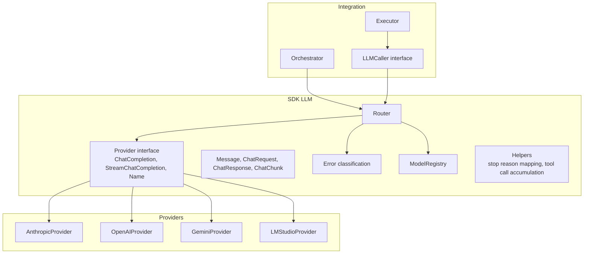

**Diagram sources**
- [provider.go:12-23](file://sdk/llm/provider.go#L12-L23)
- [message.go:23-50](file://sdk/llm/message.go#L23-L50)
- [router.go:31-47](file://sdk/llm/router.go#L31-L47)
- [provider_anthropic.go:27-50](file://sdk/llm/provider_anthropic.go#L27-L50)
- [provider_openai.go:20-51](file://sdk/llm/provider_openai.go#L20-L51)
- [provider_gemini.go:30-76](file://sdk/llm/provider_gemini.go#L30-L76)
- [provider_lmstudio.go:24-76](file://sdk/llm/provider_lmstudio.go#L24-L76)
- [orchestrator.go:17-47](file://sdk/orchestration/orchestrator.go#L17-L47)
- [executor.go:49-116](file://sdk/agent/executor.go#L49-L116)
- [types.go:82-85](file://sdk/agent/types.go#L82-L85)

**Section sources**
- [provider.go:12-23](file://sdk/llm/provider.go#L12-L23)
- [router.go:31-47](file://sdk/llm/router.go#L31-L47)

## Core Components
- Provider interface: Defines the contract for all LLM providers, including synchronous and streaming completions and a Name method for logging.
- Caller interface: Used by the agent layer to make single LLM calls without depending on the orchestrator’s router, enabling duck-typing compatibility.
- ChatRequest and ChatResponse: Standardized request/response structures for LLM interactions.
- Message and ToolCall: Message roles and tool call semantics used across providers.
- Router: Selects and invokes providers, performs context window validation, and manages retries.
- Error classification: Provides retryable/non-retryable classification and context window overflow errors.

**Section sources**
- [provider.go:6-23](file://sdk/llm/provider.go#L6-L23)
- [message.go:8-70](file://sdk/llm/message.go#L8-L70)
- [router.go:31-107](file://sdk/llm/router.go#L31-L107)
- [errors.go:11-118](file://sdk/llm/errors.go#L11-L118)

## Architecture Overview
The provider system is designed around a unified Provider interface and a Router that encapsulates provider selection, validation, and retries. The agent layer interacts with the Router via the LLMCaller interface, which is duck-typed to avoid circular imports between orchestrator and agent packages.

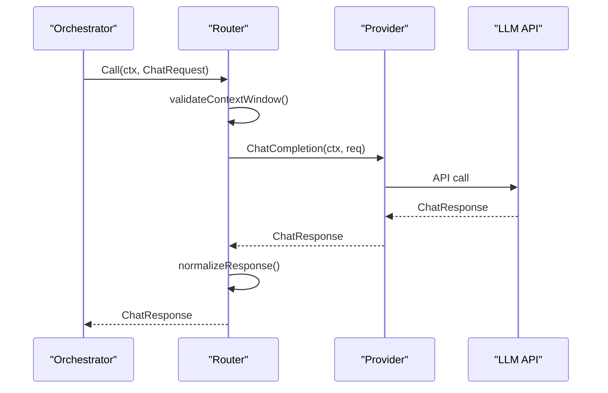

**Diagram sources**
- [router.go:219-275](file://sdk/llm/router.go#L219-L275)
- [provider.go:14-19](file://sdk/llm/provider.go#L14-L19)

**Section sources**
- [router.go:219-335](file://sdk/llm/router.go#L219-L335)
- [provider.go:14-23](file://sdk/llm/provider.go#L14-L23)

## Detailed Component Analysis

### Provider Interface Contract
- ChatCompletion(ctx, req): Synchronous completion returning a ChatResponse.
- StreamChatCompletion(ctx, req): Streaming completion returning a channel of ChatChunk.
- Name(): Returns the provider name for logging.

These methods are implemented by all providers uniformly, enabling the Router to switch providers transparently.

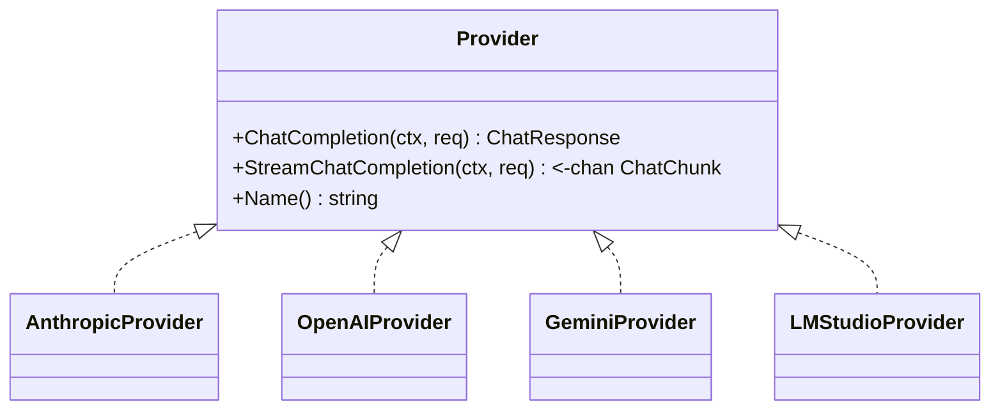

**Diagram sources**
- [provider.go:14-23](file://sdk/llm/provider.go#L14-L23)
- [provider_anthropic.go:27-50](file://sdk/llm/provider_anthropic.go#L27-L50)
- [provider_openai.go:20-51](file://sdk/llm/provider_openai.go#L20-L51)
- [provider_gemini.go:30-76](file://sdk/llm/provider_gemini.go#L30-L76)
- [provider_lmstudio.go:24-76](file://sdk/llm/provider_lmstudio.go#L24-L76)

**Section sources**
- [provider.go:14-23](file://sdk/llm/provider.go#L14-L23)

### Caller Interface and Duck-Typing Compatibility
The Caller interface enables the agent layer to call LLMs without importing orchestrator types, avoiding circular dependencies. The comment explicitly states that Caller is structurally identical to agent.LLMCaller to ensure duck-typing compatibility.

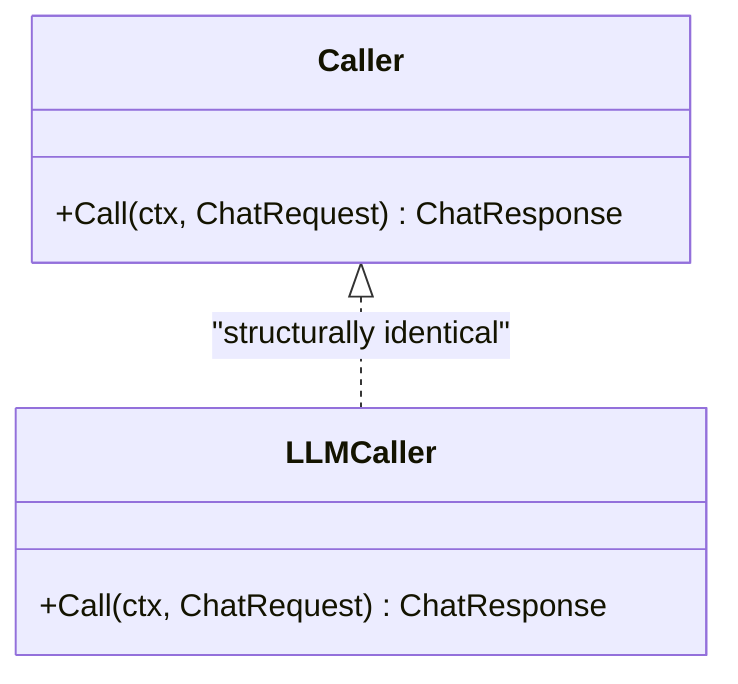

**Diagram sources**
- [provider.go:6-10](file://sdk/llm/provider.go#L6-L10)
- [types.go:82-85](file://sdk/agent/types.go#L82-L85)

**Section sources**
- [provider.go:6-10](file://sdk/llm/provider.go#L6-L10)
- [types.go:82-85](file://sdk/agent/types.go#L82-L85)

### ChatRequest and ChatResponse Structures
- ChatRequest: Model, Messages, Tools, MaxTokens, Temperature, ReasoningEffort.
- ChatResponse: Model, Family, Message, Reasoning, Usage, StopReason.
- Message: Role, Content, ToolCalls, ToolCallID.
- ToolCall: ID, Name, Input (JSON).
- ChatChunk: Delta, Reasoning, ToolCall, StopReason, Usage.

Message formatting requirements:
- Roles: system, user, assistant, tool.
- System messages are extracted and passed as a separate system prompt to providers.
- Tool messages carry ToolCallID for tool responses.
- Providers normalize empty content for tool-role messages when required by their SDKs.

**Section sources**
- [message.go:23-70](file://sdk/llm/message.go#L23-L70)
- [provider_openai.go:216-258](file://sdk/llm/provider_openai.go#L216-L258)
- [provider_anthropic.go:235-275](file://sdk/llm/provider_anthropic.go#L235-L275)
- [provider_gemini.go:121-187](file://sdk/llm/provider_gemini.go#L121-L187)
- [provider_lmstudio.go:494-594](file://sdk/llm/provider_lmstudio.go#L494-L594)

### Provider Implementations

#### AnthropicProvider
- Builds anthropic.MessagesRequest from ChatRequest, handling system prompt extraction and tool definitions.
- Supports reasoning effort via Thinking configuration.
- Streaming: accumulates tool input JSON across deltas and emits ToolCall chunks.
- Error mapping: maps API errors to *Error with retryable flags.

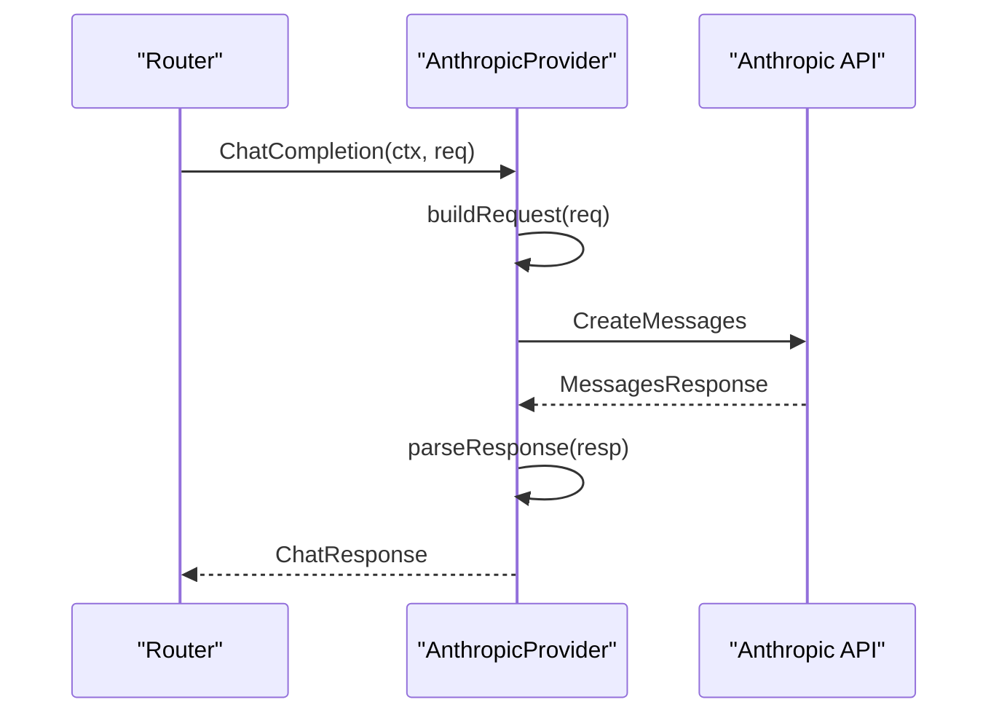

**Diagram sources**
- [provider_anthropic.go:52-65](file://sdk/llm/provider_anthropic.go#L52-L65)
- [provider_anthropic.go:173-233](file://sdk/llm/provider_anthropic.go#L173-L233)
- [provider_anthropic.go:277-323](file://sdk/llm/provider_anthropic.go#L277-L323)

**Section sources**
- [provider_anthropic.go:52-171](file://sdk/llm/provider_anthropic.go#L52-L171)
- [provider_anthropic.go:277-337](file://sdk/llm/provider_anthropic.go#L277-L337)

#### OpenAIProvider
- Uses official OpenAI SDK for Chat Completions and Responses APIs.
- Handles tool calls and reasoning effort via OpenAI’s parameters.
- Streaming: uses a StreamToolCallAccumulator to reconstruct tool calls across deltas.
- Error mapping: wraps SDK errors with HTTP status classification.

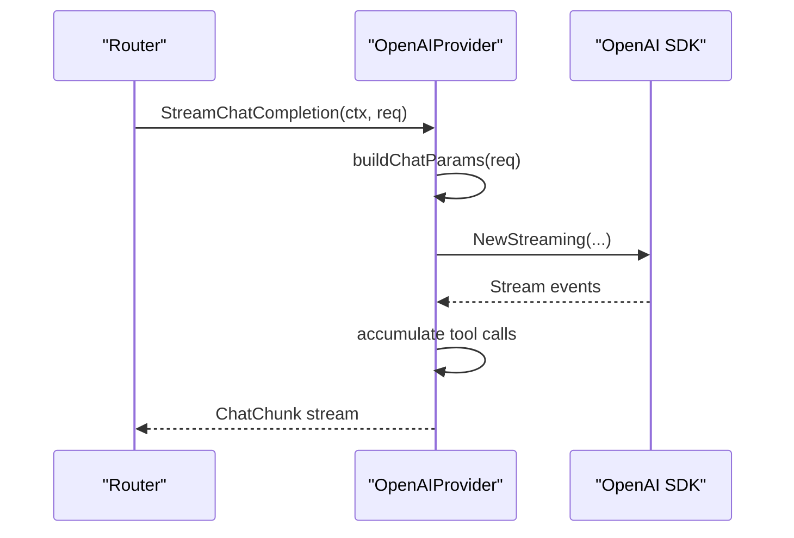

**Diagram sources**
- [provider_openai.go:84-147](file://sdk/llm/provider_openai.go#L84-L147)
- [provider_openai.go:149-192](file://sdk/llm/provider_openai.go#L149-L192)
- [provider_helpers.go:45-94](file://sdk/llm/provider_helpers.go#L45-L94)

**Section sources**
- [provider_openai.go:53-147](file://sdk/llm/provider_openai.go#L53-L147)
- [provider_helpers.go:45-94](file://sdk/llm/provider_helpers.go#L45-L94)

#### GeminiProvider
- Uses Google’s Gen AI SDK with support for Vertex AI and Gemini API backends.
- Converts system instructions and tool definitions to Gemini Content and Function Declarations.
- Streaming: converts candidate parts to ChatChunk deltas, including reasoning and tool calls.
- Error mapping: maps API errors to *Error with HTTP status codes.

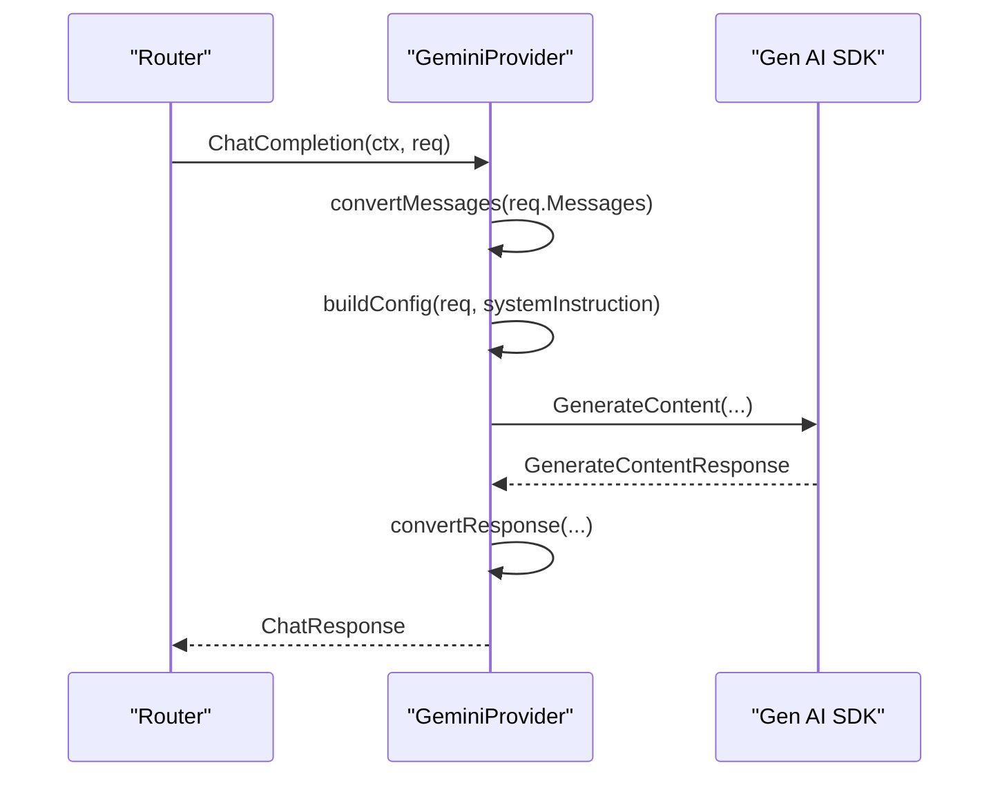

**Diagram sources**
- [provider_gemini.go:78-89](file://sdk/llm/provider_gemini.go#L78-L89)
- [provider_gemini.go:121-187](file://sdk/llm/provider_gemini.go#L121-L187)
- [provider_gemini.go:247-298](file://sdk/llm/provider_gemini.go#L247-L298)

**Section sources**
- [provider_gemini.go:78-119](file://sdk/llm/provider_gemini.go#L78-L119)
- [provider_gemini.go:247-385](file://sdk/llm/provider_gemini.go#L247-L385)

#### LMStudioProvider
- Implements both LM Studio native API and OpenAI-compatible endpoints.
- Streaming: parses SSE events for content deltas, reasoning deltas, tool call start/arguments, and chat end.
- Error handling: wraps HTTP errors with status codes and parses JSON error bodies.

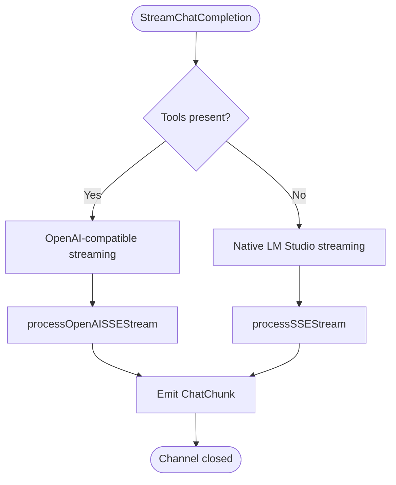

**Diagram sources**
- [provider_lmstudio.go:292-358](file://sdk/llm/provider_lmstudio.go#L292-L358)
- [provider_lmstudio.go:360-492](file://sdk/llm/provider_lmstudio.go#L360-L492)
- [provider_lmstudio.go:682-746](file://sdk/llm/provider_lmstudio.go#L682-L746)

**Section sources**
- [provider_lmstudio.go:292-358](file://sdk/llm/provider_lmstudio.go#L292-L358)
- [provider_lmstudio.go:360-492](file://sdk/llm/provider_lmstudio.go#L360-L492)
- [provider_lmstudio.go:682-746](file://sdk/llm/provider_lmstudio.go#L682-L746)

### Router and Context Window Validation
The Router:
- Creates providers from configuration.
- Applies default temperature based on model family.
- Validates context window against ModelRegistry metadata.
- Performs retries with exponential backoff and jitter.
- Normalizes responses and sets model family.

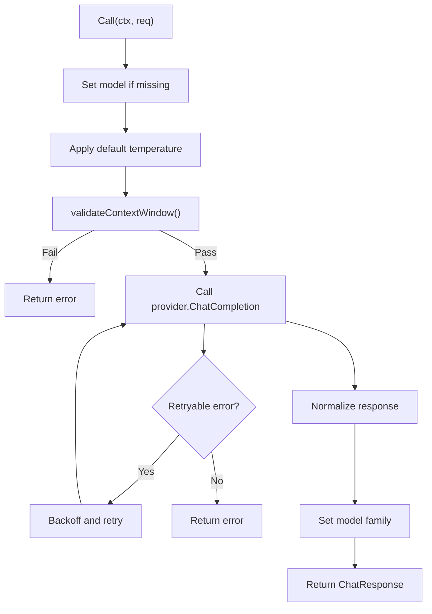

**Diagram sources**
- [router.go:219-275](file://sdk/llm/router.go#L219-L275)
- [router.go:157-192](file://sdk/llm/router.go#L157-L192)
- [router.go:194-217](file://sdk/llm/router.go#L194-L217)

**Section sources**
- [router.go:219-335](file://sdk/llm/router.go#L219-L335)
- [router.go:157-192](file://sdk/llm/router.go#L157-L192)
- [router.go:194-217](file://sdk/llm/router.go#L194-L217)

### Error Handling Patterns
- Error classification: HTTP status codes and network errors are classified as retryable or not.
- Context window overflow: special sentinel error with non-retryable flag.
- Provider-specific error wrapping: providers map SDK errors to *Error with provider name and retryable flags.

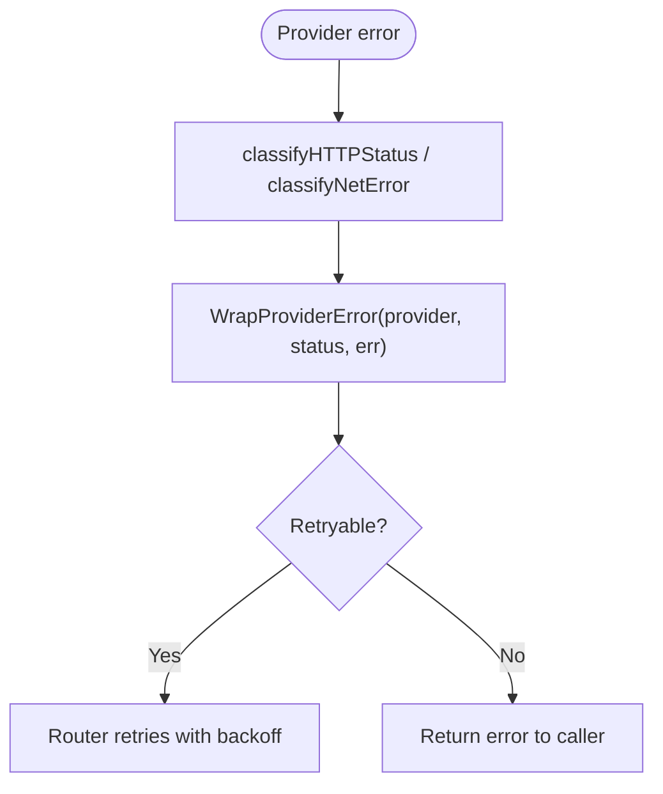

**Diagram sources**
- [errors.go:48-118](file://sdk/llm/errors.go#L48-L118)
- [router.go:234-272](file://sdk/llm/router.go#L234-L272)

**Section sources**
- [errors.go:11-118](file://sdk/llm/errors.go#L11-L118)
- [router.go:234-272](file://sdk/llm/router.go#L234-L272)

### Message Formatting and Tool Call Semantics
- System messages are extracted and concatenated before sending to providers.
- Tool calls are represented as ToolCall with ID, Name, and JSON Input.
- Providers normalize tool call IDs and handle provider-specific constraints (e.g., Anthropic tool ID sanitization).
- Streaming providers accumulate tool call arguments across deltas and emit ToolCall chunks.

**Section sources**
- [provider_helpers.go:26-43](file://sdk/llm/provider_helpers.go#L26-L43)
- [provider_anthropic.go:13-20](file://sdk/llm/provider_anthropic.go#L13-L20)
- [provider_openai.go:216-258](file://sdk/llm/provider_openai.go#L216-L258)
- [provider_gemini.go:121-187](file://sdk/llm/provider_gemini.go#L121-L187)
- [provider_lmstudio.go:494-594](file://sdk/llm/provider_lmstudio.go#L494-L594)

### Implementing a Custom Provider
To implement a new provider:
1. Define a struct that embeds or holds the provider’s client and name.
2. Implement Provider interface methods:
   - ChatCompletion(ctx, req) -> *ChatResponse, error
   - StreamChatCompletion(ctx, req) -> <-chan ChatChunk, error
   - Name() string
3. Convert ChatRequest to provider-specific request format.
4. Convert provider-specific response to ChatResponse/ChatChunk.
5. Map provider errors to *Error via WrapProviderError or provider-specific wrapper.
6. Integrate with Router by adding a case in createProviderFromConfig.

Example integration points:
- Provider creation in Router.createProviderFromConfig.
- Router.NewRouter registers metadata sources for providers that expose them.

**Section sources**
- [router.go:109-140](file://sdk/llm/router.go#L109-L140)
- [router.go:49-107](file://sdk/llm/router.go#L49-L107)

### Relationship Between Providers and the Orchestrator System
- Orchestrator composes strategy interfaces (Planner, Reflector, etc.) and coordinates execution.
- Executor uses LLMCaller to call the Router, which selects the active provider.
- Router validates context window and applies default temperatures before calling providers.
- Providers are interchangeable; the Orchestrator remains agnostic of provider specifics.

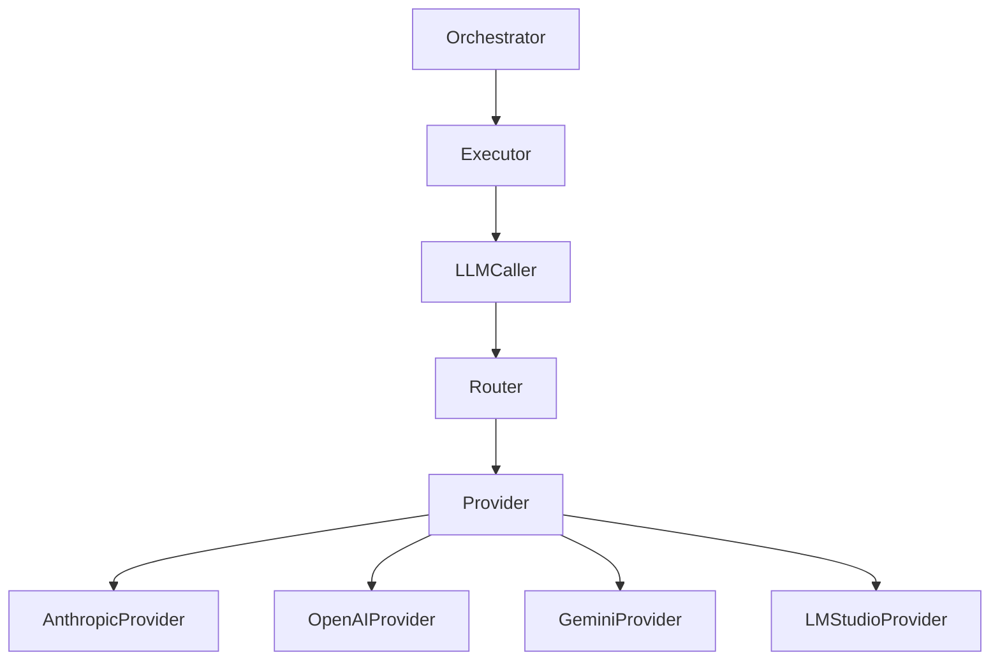

**Diagram sources**
- [orchestrator.go:420-451](file://sdk/orchestration/orchestrator.go#L420-L451)
- [executor.go:205-294](file://sdk/agent/executor.go#L205-L294)
- [router.go:31-107](file://sdk/llm/router.go#L31-L107)
- [provider.go:14-23](file://sdk/llm/provider.go#L14-L23)

**Section sources**
- [orchestrator.go:420-451](file://sdk/orchestration/orchestrator.go#L420-L451)
- [executor.go:205-294](file://sdk/agent/executor.go#L205-L294)
- [router.go:31-107](file://sdk/llm/router.go#L31-L107)

## Dependency Analysis
- Provider implementations depend on external SDKs (Anthropic, OpenAI, Gen AI).
- Router depends on ModelRegistry for context window validation and metadata sources.
- Router depends on error classification utilities.
- Agent layer depends on LLMCaller interface, which is duck-typed to avoid circular imports.

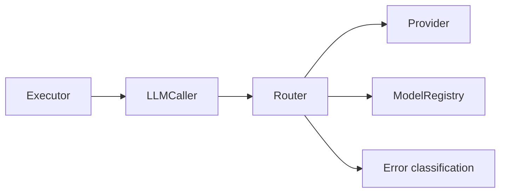

**Diagram sources**
- [router.go:31-107](file://sdk/llm/router.go#L31-L107)
- [modelregistry.go:42-137](file://sdk/llm/modelregistry.go#L42-L137)
- [errors.go:11-118](file://sdk/llm/errors.go#L11-L118)
- [executor.go:205-294](file://sdk/agent/executor.go#L205-L294)
- [types.go:82-85](file://sdk/agent/types.go#L82-L85)

**Section sources**
- [router.go:31-107](file://sdk/llm/router.go#L31-L107)
- [modelregistry.go:42-137](file://sdk/llm/modelregistry.go#L42-L137)
- [errors.go:11-118](file://sdk/llm/errors.go#L11-L118)
- [executor.go:205-294](file://sdk/agent/executor.go#L205-L294)
- [types.go:82-85](file://sdk/agent/types.go#L82-L85)

## Performance Considerations
- Streaming providers should buffer appropriately and respect context cancellation to avoid goroutine leaks.
- Router applies backoff with jitter to reduce thundering herd effects.
- Context window validation prevents expensive API calls that would fail due to token limits.
- Tool call accumulation in streaming responses minimizes intermediate allocations.

[No sources needed since this section provides general guidance]

## Troubleshooting Guide
Common issues and diagnostics:
- Context window exceeded: Router returns a non-retryable error indicating estimated vs. allowed tokens.
- Retryable vs. non-retryable errors: Use IsRetryable to determine if an error can be retried.
- Network errors: Transient network errors (timeouts, connection refused, DNS, EOF) are classified as retryable.
- Provider-specific errors: Providers wrap SDK errors with provider name and retryable flags.

**Section sources**
- [errors.go:90-118](file://sdk/llm/errors.go#L90-L118)
- [errors.go:39-46](file://sdk/llm/errors.go#L39-L46)
- [router.go:234-272](file://sdk/llm/router.go#L234-L272)

## Conclusion
The LLM provider interface design in C0WRK centers on a unified Provider contract, robust error classification, and a Router that enforces context window validation and retries. The duck-typing compatibility of the Caller interface decouples the agent layer from orchestrator internals. Provider implementations for Anthropic, OpenAI-compatible, Gemini, and LM Studio demonstrate standardized message formatting, tool call semantics, and streaming behavior. The integration with the Orchestrator and Executor enables flexible, provider-agnostic plan-and-execute workflows while maintaining strong error handling and performance characteristics.