# Utility Functions and Helpers

<cite>
**Referenced Files in This Document**
- [tokencount.go](file://sdk/llm/tokencount.go)
- [usage.go](file://sdk/llm/usage.go)
- [provider_helpers.go](file://sdk/llm/provider_helpers.go)
- [schema_sanitize.go](file://sdk/llm/schema_sanitize.go)
- [reasoning.go](file://sdk/llm/reasoning.go)
- [reasoning_test.go](file://sdk/llm/reasoning_test.go)
- [family.go](file://sdk/llm/family.go)
- [message.go](file://sdk/llm/message.go)
- [modelregistry.go](file://sdk/llm/modelregistry.go)
- [router.go](file://sdk/llm/router.go)
- [provider.go](file://sdk/llm/provider.go)
- [provider_openai.go](file://sdk/llm/provider_openai.go)
- [provider_anthropic.go](file://sdk/llm/provider_anthropic.go)
- [provider_gemini.go](file://sdk/llm/provider_gemini.go)
- [provider_lmstudio.go](file://sdk/llm/provider_lmstudio.go)
- [builder.go](file://core/builder.go)
- [router_test.go](file://core/router_test.go)
- [reflector.go](file://core/reflector.go)
- [reflector_test.go](file://core/reflector_test.go)
</cite>

## Update Summary
**Changes Made**
- Added comprehensive reasoning effort management system documentation
- Updated reasoning configuration section with resolveBaseEffort function
- Enhanced testing infrastructure documentation for reasoning system
- Added AgentReasoningMode support documentation
- Updated orchestrator integration examples with reasoning effort management

## Table of Contents
1. [Introduction](#introduction)
2. [Project Structure](#project-structure)
3. [Core Components](#core-components)
4. [Architecture Overview](#architecture-overview)
5. [Detailed Component Analysis](#detailed-component-analysis)
6. [Dependency Analysis](#dependency-analysis)
7. [Performance Considerations](#performance-considerations)
8. [Troubleshooting Guide](#troubleshooting-guide)
9. [Conclusion](#conclusion)

## Introduction
This document explains the utility functions and helper components in C0WRK's LLM SDK that power token counting, usage tracking, cost estimation, reasoning configuration, schema sanitization, and response validation. It also covers how these utilities integrate with provider implementations and orchestrator workflows, along with performance characteristics, accuracy considerations, and best practices for monitoring usage and controlling costs.

**Updated** Added comprehensive reasoning effort management system with resolveBaseEffort function, AgentReasoningMode support, and enhanced testing infrastructure.

## Project Structure
The LLM utilities live primarily under sdk/llm and are organized by responsibility:
- Token counting and context tracking
- Usage tracking and reporting
- Provider helpers (stop reason mapping, system prompt extraction, streaming tool call accumulation, message normalization)
- Schema sanitization for provider-specific JSON Schema strictness
- Reasoning effort mapping to provider-specific parameters with base effort resolution
- Model family detection and metadata registry
- Router that validates context windows and routes calls to providers
- Provider implementations that consume these utilities

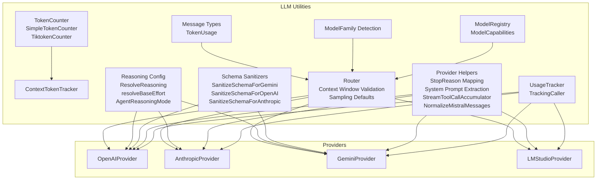

**Diagram sources**
- [tokencount.go:11-184](file://sdk/llm/tokencount.go#L11-L184)
- [usage.go:9-161](file://sdk/llm/usage.go#L9-L161)
- [provider_helpers.go:5-140](file://sdk/llm/provider_helpers.go#L5-L140)
- [schema_sanitize.go:9-433](file://sdk/llm/schema_sanitize.go#L9-L433)
- [reasoning.go:3-111](file://sdk/llm/reasoning.go#L3-L111)
- [modelregistry.go:16-532](file://sdk/llm/modelregistry.go#L16-L532)
- [family.go:5-74](file://sdk/llm/family.go#L5-L74)
- [message.go:8-70](file://sdk/llm/message.go#L8-L70)
- [router.go:31-336](file://sdk/llm/router.go#L31-L336)
- [provider_openai.go:20-200](file://sdk/llm/provider_openai.go#L20-L200)
- [provider_anthropic.go:27-200](file://sdk/llm/provider_anthropic.go#L27-L200)
- [provider_gemini.go:30-200](file://sdk/llm/provider_gemini.go#L30-L200)
- [provider_lmstudio.go:24-200](file://sdk/llm/provider_lmstudio.go#L24-L200)

**Section sources**
- [tokencount.go:11-184](file://sdk/llm/tokencount.go#L11-L184)
- [usage.go:9-161](file://sdk/llm/usage.go#L9-L161)
- [provider_helpers.go:5-140](file://sdk/llm/provider_helpers.go#L5-L140)
- [schema_sanitize.go:9-433](file://sdk/llm/schema_sanitize.go#L9-L433)
- [reasoning.go:3-111](file://sdk/llm/reasoning.go#L3-L111)
- [modelregistry.go:16-532](file://sdk/llm/modelregistry.go#L16-L532)
- [family.go:5-74](file://sdk/llm/family.go#L5-L74)
- [message.go:8-70](file://sdk/llm/message.go#L8-L70)
- [router.go:31-336](file://sdk/llm/router.go#L31-L336)
- [provider.go:6-24](file://sdk/llm/provider.go#L6-L24)

## Core Components
- Token counting
  - SimpleTokenCounter: fast approximation using a fixed character-to-token ratio.
  - TiktokenCounter: precise counting via tiktoken-go for OpenAI encodings.
  - NewTokenCounter: factory that selects counter by tokenizer type.
  - ContextTokenTracker: hybrid estimator that predicts between API calls and corrects with actual API usage.
- Usage tracking and reporting
  - UsageTracker: accumulates input/output tokens across a session and notifies observers.
  - TrackingCaller: wraps a Caller to record usage and correct context tracker after each call (including streaming).
- Provider helpers
  - Stop reason mapping for standardized finish reasons.
  - System prompt extraction from message lists.
  - Streaming tool call accumulator for incremental tool call assembly.
  - Mistral-specific message normalization.
- Schema sanitization
  - Gemini strictness: enum normalization, unsupported keywords removal, array items typing, recursive processing.
  - OpenAI strictness: $ref resolution, forbidden keywords filtering, additionalProperties enforcement, required normalization.
  - Anthropic passthrough placeholder.
- Reasoning configuration
  - Effort levels mapped to provider-specific parameters (Anthropic budget, OpenAI effort, Gemini thinking level/budget).
  - Base effort resolution from model metadata with resolveBaseEffort function.
  - Agent-specific reasoning modes with AgentReasoningMode for different agent types.
- Model family and registry
  - ModelFamily detection from model IDs.
  - ModelRegistry with multi-tier resolution and caching including reasoning capability detection.
- Router
  - Context window validation with safety margins and output token reserves.
  - Default temperature application based on model capabilities and sampling function.
  - Retry/backoff logic and request normalization.

**Updated** Enhanced reasoning system with comprehensive effort management including base effort resolution and agent-specific modes.

**Section sources**
- [tokencount.go:11-184](file://sdk/llm/tokencount.go#L11-L184)
- [usage.go:9-161](file://sdk/llm/usage.go#L9-L161)
- [provider_helpers.go:5-140](file://sdk/llm/provider_helpers.go#L5-L140)
- [schema_sanitize.go:9-433](file://sdk/llm/schema_sanitize.go#L9-L433)
- [reasoning.go:3-111](file://sdk/llm/reasoning.go#L3-L111)
- [family.go:5-74](file://sdk/llm/family.go#L5-L74)
- [modelregistry.go:16-532](file://sdk/llm/modelregistry.go#L16-L532)
- [router.go:31-336](file://sdk/llm/router.go#L31-L336)

## Architecture Overview
The utilities integrate across the call stack: Router validates context and prepares requests, Providers consume helpers for message conversion and schema sanitation, UsageTracker and TrackingCaller collect usage metrics, and ContextTokenTracker keeps running estimates synchronized with API-reported usage. The reasoning system integrates at the orchestrator level with base effort resolution and agent-specific modes.

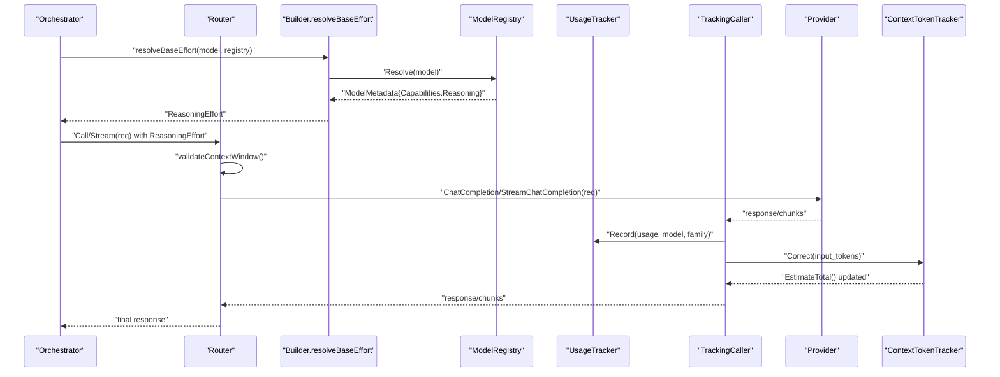

**Diagram sources**
- [router.go:157-192](file://sdk/llm/router.go#L157-L192)
- [usage.go:89-142](file://sdk/llm/usage.go#L89-L142)
- [tokencount.go:123-184](file://sdk/llm/tokencount.go#L123-L184)
- [builder.go:571-583](file://core/builder.go#L571-L583)
- [modelregistry.go:77-137](file://sdk/llm/modelregistry.go#L77-L137)
- [provider_openai.go:53-82](file://sdk/llm/provider_openai.go#L53-L82)
- [provider_anthropic.go:52-65](file://sdk/llm/provider_anthropic.go#L52-L65)
- [provider_gemini.go:78-89](file://sdk/llm/provider_gemini.go#L78-L89)

## Detailed Component Analysis

### Token Counting and Context Tracking
- SimpleTokenCounter
  - Approximates tokens as length divided by a fixed ratio with ceiling rounding.
  - Counts roles, content, and tool call names/inputs; adds small framing overhead per message.
- TiktokenCounter
  - Uses tiktoken-go with configurable encoding; thread-safe via mutex around encode calls.
  - Same message counting pattern with overhead.
- NewTokenCounter
  - Selects counter by tokenizer type:
    - tiktoken/<encoding>: creates TiktokenCounter; falls back to Simple on error.
    - anthropic-api: SimpleTokenCounter (rely on API correction).
    - approximate/empty/unknown: SimpleTokenCounter with warning.
- ContextTokenTracker
  - Predictive counter plus last-known input tokens and pending delta.
  - EstimateTotal returns predicted total; AddDelta/AddDeltaMessages increment pending delta.
  - Correct updates lastKnownUsed and resets pending delta; Reset clears counters.

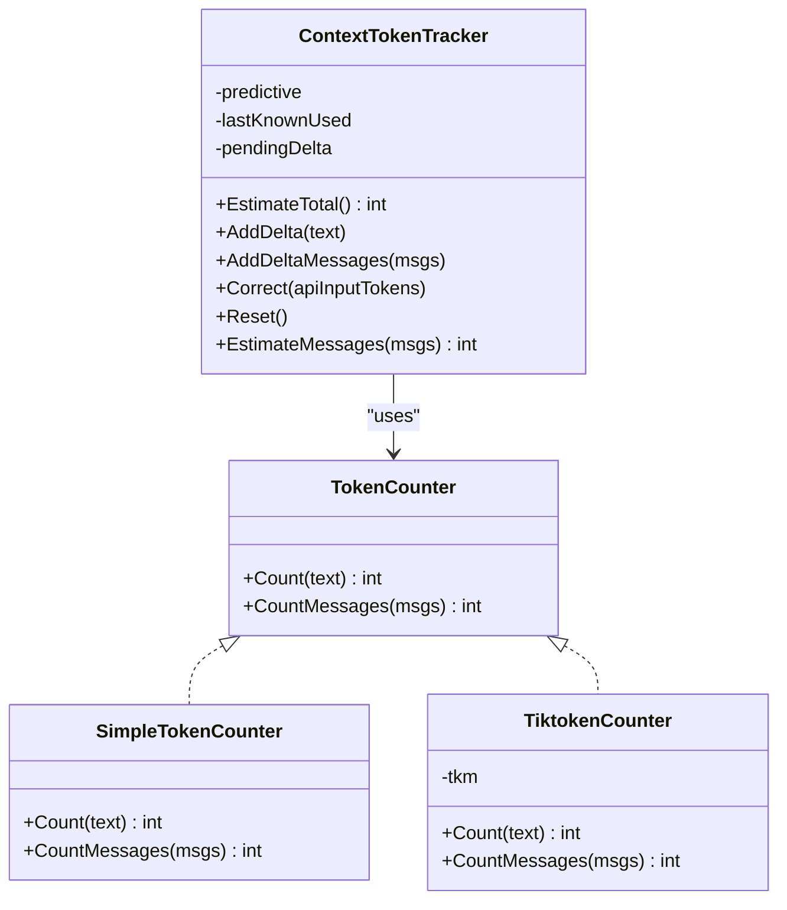

**Diagram sources**
- [tokencount.go:11-184](file://sdk/llm/tokencount.go#L11-L184)

**Section sources**
- [tokencount.go:11-184](file://sdk/llm/tokencount.go#L11-L184)

### Usage Tracking and Reporting
- UsageTracker
  - Thread-safe accumulation of input/output tokens; snapshot observers under lock to avoid races.
  - Provides Totals, SetTotals, and AddObserver.
- TrackingCaller
  - Wraps a Caller to:
    - Record usage from Call() responses and streaming final chunks.
    - Correct the active ContextTokenTracker after each call.
    - Support parallel execution via WithContextTracker to share session-level tracker while correcting separate per-step trackers.

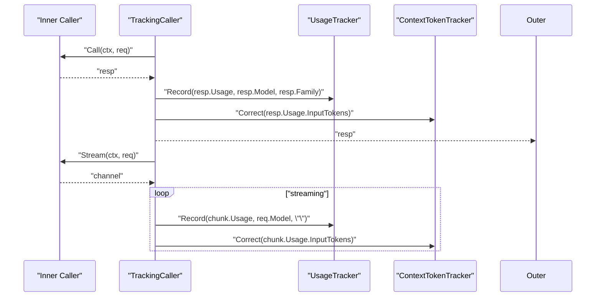

**Diagram sources**
- [usage.go:70-161](file://sdk/llm/usage.go#L70-L161)

**Section sources**
- [usage.go:9-161](file://sdk/llm/usage.go#L9-L161)

### Provider Helpers
- Stop reason mapping
  - MapStopReason standardizes provider-specific finish reasons using a mapping table; empty reason maps to end_turn.
- System prompt extraction
  - ExtractSystemPrompt concatenates system messages with newline and returns remaining messages.
- Streaming tool call accumulation
  - StreamToolCallAccumulator reconstructs complete ToolCall objects from incremental deltas across chunks; emits on finish.
- Mistral message normalization
  - Normalizes tool call IDs to 9 characters and inserts dummy assistant messages between tool and user messages.

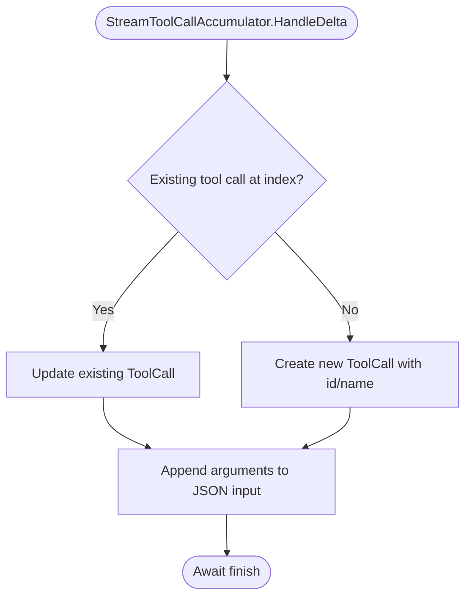

**Diagram sources**
- [provider_helpers.go:45-94](file://sdk/llm/provider_helpers.go#L45-L94)

**Section sources**
- [provider_helpers.go:5-140](file://sdk/llm/provider_helpers.go#L5-L140)

### Schema Sanitization
- Gemini
  - Removes unsupported keywords; converts numeric enums to strings; strips properties/required from non-object types; ensures array items have explicit type; recursively processes nested schemas.
- OpenAI strict mode
  - Resolves $ref against $defs/definitions; filters forbidden keywords; infers object type when properties/required present; enforces additionalProperties=false; normalizes required array to include all property names deterministically.
- Anthropic
  - Passthrough placeholder for future enhancements.

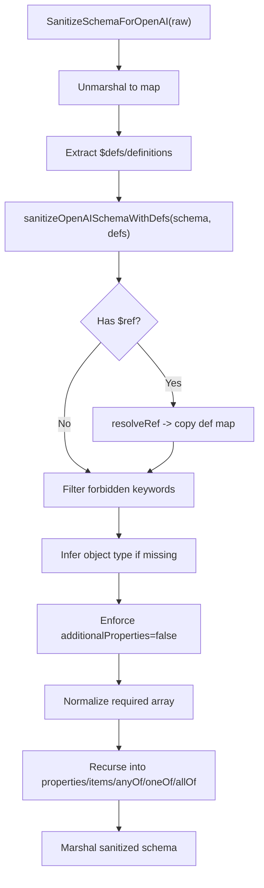

**Diagram sources**
- [schema_sanitize.go:168-426](file://sdk/llm/schema_sanitize.go#L168-L426)

**Section sources**
- [schema_sanitize.go:9-433](file://sdk/llm/schema_sanitize.go#L9-L433)

### Reasoning System Integration
- ReasoningEffort levels: minimal, low, medium, high, maximum.
- ReasoningConfig encapsulates provider-specific parameters:
  - Anthropic: BudgetTokens.
  - OpenAI: OpenAIEffort ("low", "medium", "high").
  - Gemini: ThinkingLevel and ThinkingBudget.
- ResolveReasoning maps effort to provider-specific config based on family.
- resolveBaseEffort determines base reasoning effort from model metadata, returning empty for non-reasoning models.
- AgentReasoningMode adjusts effort for agent roles (full for orchestrator/planner, reduced for auxiliary agents).
- Enhanced testing infrastructure validates reasoning behavior across families and agent types.

**Updated** Comprehensive reasoning system with base effort resolution and agent-specific modes.

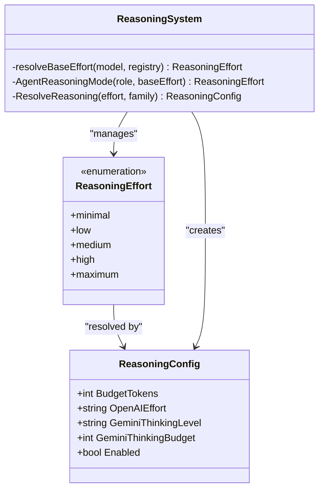

**Diagram sources**
- [reasoning.go:3-111](file://sdk/llm/reasoning.go#L3-L111)
- [builder.go:571-583](file://core/builder.go#L571-L583)

**Section sources**
- [reasoning.go:3-111](file://sdk/llm/reasoning.go#L3-L111)
- [reasoning_test.go:1-142](file://sdk/llm/reasoning_test.go#L1-L142)
- [builder.go:571-583](file://core/builder.go#L571-L583)

### Model Families and Registry
- ModelFamily detection from model IDs supports Anthropic, OpenAI flagship/standard/codex, Gemini, Mistral, DeepSeek, Kimi/Moonshot, and default.
- ModelRegistry resolves metadata via:
  - Overrides
  - Built-in registry
  - HuggingFace API lookup and cache
  - External sources (e.g., LM Studio, Gemini)
  - Fallback defaults
- Metadata includes context window, output limit, tokenizer type, family, capabilities, and cost fields.
- ModelCapabilities now includes Reasoning flag for determining base effort support.

**Updated** ModelRegistry now includes Reasoning capability detection for base effort resolution.

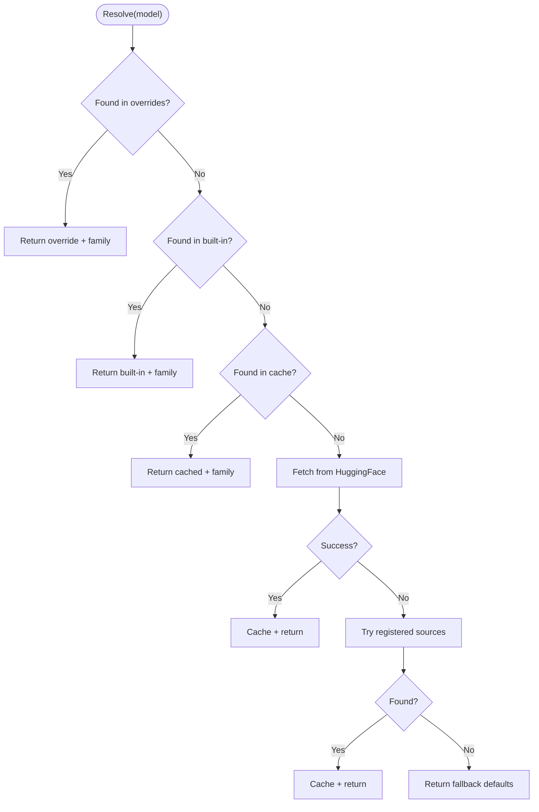

**Diagram sources**
- [modelregistry.go:68-137](file://sdk/llm/modelregistry.go#L68-L137)

**Section sources**
- [family.go:5-74](file://sdk/llm/family.go#L5-L74)
- [modelregistry.go:16-532](file://sdk/llm/modelregistry.go#L16-L532)

### Router and Context Window Validation
- Router composes providers, retries with exponential backoff and jitter, and applies default temperature based on sampling function and model capabilities.
- validateContextWindow estimates token usage using TokenCounter and compares against effective context window minus output reserve and safety margin.
- applyDefaultTemperature sets temperature defaults when supported by the model.
- Router.SetBaseReasoningEffort allows setting base reasoning effort for routing decisions.

**Updated** Router now supports reasoning effort configuration for routing decisions.

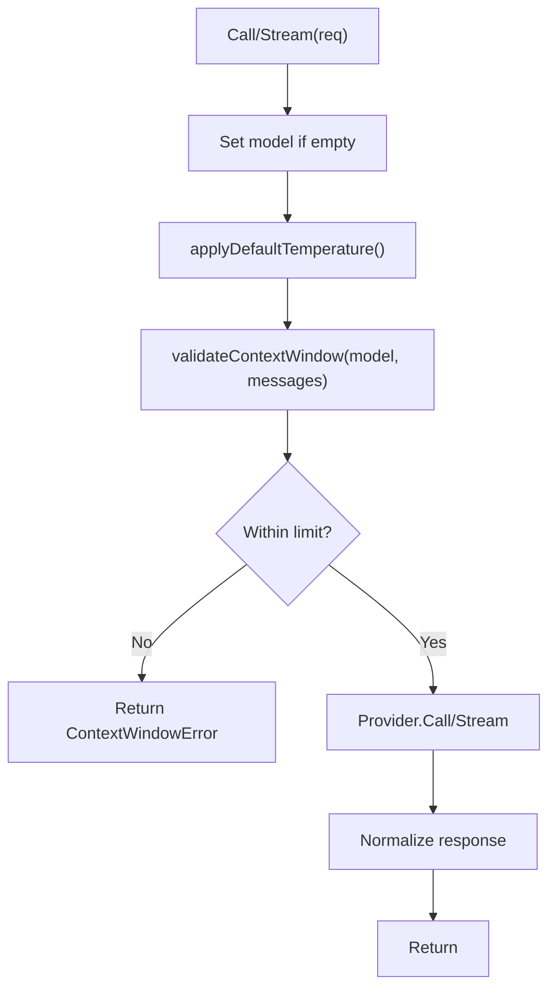

**Diagram sources**
- [router.go:157-217](file://sdk/llm/router.go#L157-L217)

**Section sources**
- [router.go:31-336](file://sdk/llm/router.go#L31-L336)

### Provider Integrations and Orchestration Workflows
- OpenAIProvider
  - Uses Responses API for specific models; builds OpenAI params, applies reasoning effort, and sanitizes tool schemas with OpenAI strict mode.
- AnthropicProvider
  - Extracts system prompt, builds MessagesRequest, handles streaming with thinking deltas and tool call accumulation.
- GeminiProvider
  - Converts messages to Gemini Content, applies config, and streams content with stop reasons and usage.
- LMStudioProvider
  - Implements both native LM Studio API and OpenAI-compatible endpoints; supports stats and tool call streaming.

**Updated** Providers now handle reasoning effort parameters based on resolved configurations.

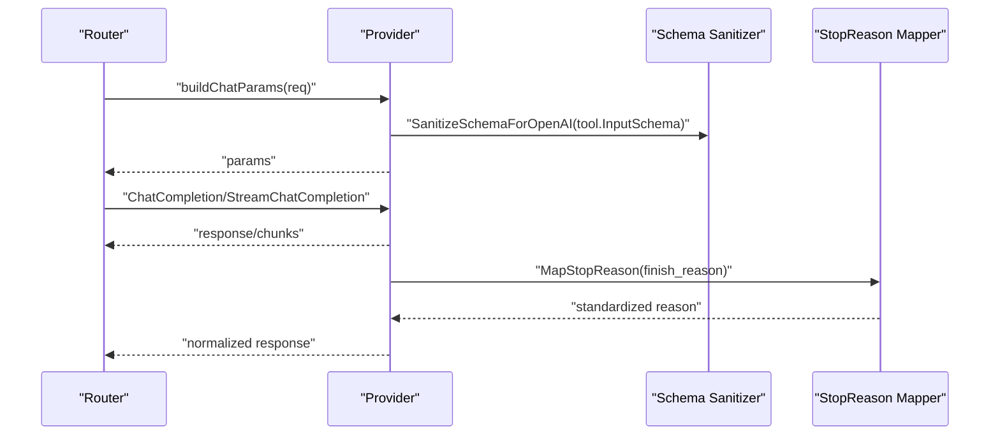

**Diagram sources**
- [provider_openai.go:149-200](file://sdk/llm/provider_openai.go#L149-L200)
- [provider_anthropic.go:173-200](file://sdk/llm/provider_anthropic.go#L173-L200)
- [provider_gemini.go:121-200](file://sdk/llm/provider_gemini.go#L121-L200)
- [provider_helpers.go:13-24](file://sdk/llm/provider_helpers.go#L13-L24)

**Section sources**
- [provider_openai.go:20-200](file://sdk/llm/provider_openai.go#L20-L200)
- [provider_anthropic.go:27-200](file://sdk/llm/provider_anthropic.go#L27-L200)
- [provider_gemini.go:30-200](file://sdk/llm/provider_gemini.go#L30-L200)
- [provider_lmstudio.go:24-200](file://sdk/llm/provider_lmstudio.go#L24-L200)

### Orchestrator Integration and Reasoning Management
- Builder.resolveBaseEffort determines base reasoning effort from active model metadata, returning empty for non-reasoning models.
- Router.SetBaseReasoningEffort sets base reasoning effort for routing decisions.
- AgentReasoningMode applies agent-specific reasoning reduction for auxiliary agents.
- Enhanced testing validates reasoning behavior across different model families and agent types.

**Updated** Comprehensive orchestrator integration with reasoning effort management system.

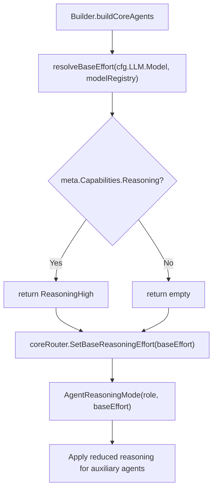

**Diagram sources**
- [builder.go:571-583](file://core/builder.go#L571-L583)
- [router.go:47-50](file://core/router.go#L47-L50)
- [reasoning.go:91-110](file://sdk/llm/reasoning.go#L91-L110)

**Section sources**
- [builder.go:571-583](file://core/builder.go#L571-L583)
- [router.go:47-50](file://core/router.go#L47-L50)
- [reasoning.go:91-110](file://sdk/llm/reasoning.go#L91-L110)
- [router_test.go:406-428](file://core/router_test.go#L406-L428)
- [reflector.go:40-43](file://core/reflector.go#L40-L43)
- [reflector_test.go:350-399](file://core/reflector_test.go#L350-L399)

## Dependency Analysis
- Coupling
  - Router depends on ModelRegistry, TokenCounter, and SamplingFunc; it orchestrates Provider calls.
  - Providers depend on utility helpers for message conversion, schema sanitation, and stop reason mapping.
  - UsageTracker and TrackingCaller depend on Caller interface and TokenUsage.
  - ContextTokenTracker depends on TokenCounter for predictive estimates.
  - Reasoning system integrates with ModelRegistry for base effort determination and with orchestrator components for agent-specific modes.
- Cohesion
  - Each utility module focuses on a single concern: counting, usage, sanitization, reasoning, or routing.
- External dependencies
  - tiktoken-go for precise token counting.
  - Official provider SDKs for OpenAI, Anthropic, and Google GenAI.
  - HTTP client for LM Studio and HuggingFace metadata retrieval.

**Updated** Enhanced dependency analysis to include reasoning system integration.

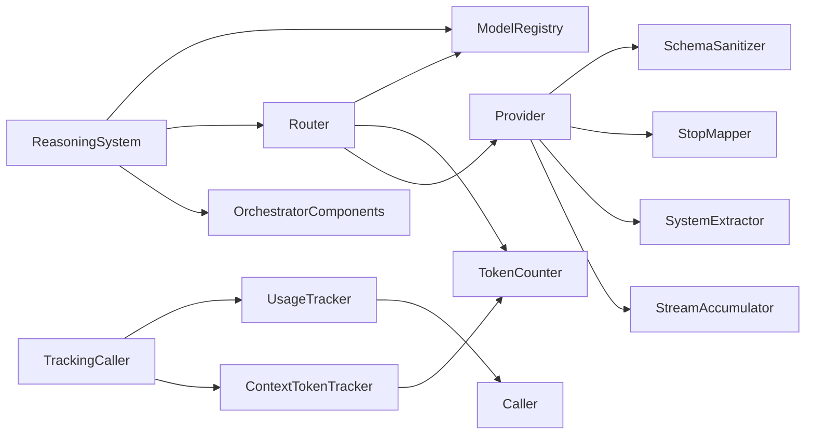

**Diagram sources**
- [router.go:31-107](file://sdk/llm/router.go#L31-L107)
- [usage.go:70-161](file://sdk/llm/usage.go#L70-L161)
- [tokencount.go:123-184](file://sdk/llm/tokencount.go#L123-L184)
- [schema_sanitize.go:9-433](file://sdk/llm/schema_sanitize.go#L9-L433)
- [provider_helpers.go:5-140](file://sdk/llm/provider_helpers.go#L5-L140)
- [reasoning.go:28-42](file://sdk/llm/reasoning.go#L28-L42)
- [builder.go:571-583](file://core/builder.go#L571-L583)

**Section sources**
- [router.go:31-107](file://sdk/llm/router.go#L31-L107)
- [usage.go:70-161](file://sdk/llm/usage.go#L70-L161)
- [tokencount.go:123-184](file://sdk/llm/tokencount.go#L123-L184)
- [schema_sanitize.go:9-433](file://sdk/llm/schema_sanitize.go#L9-L433)
- [provider_helpers.go:5-140](file://sdk/llm/provider_helpers.go#L5-L140)
- [reasoning.go:28-42](file://sdk/llm/reasoning.go#L28-L42)
- [builder.go:571-583](file://core/builder.go#L571-L583)

## Performance Considerations
- Token counting
  - SimpleTokenCounter is O(n) per string and O(m) per message list where m is number of messages; negligible overhead.
  - TiktokenCounter is slower due to encoding; use only when precision is required (e.g., Anthropic API where local counts are approximate).
  - ContextTokenTracker minimizes repeated counting by maintaining a pending delta and correcting with actual API usage.
- Usage tracking
  - UsageTracker snapshots observers under lock to avoid races; keep observer callbacks lightweight.
  - TrackingCaller wraps streaming channels; ensure downstream consumers drain promptly to avoid blocking goroutines.
- Router
  - validateContextWindow uses predictive counting; tune safety margin to balance false positives vs. risk.
  - Backoff with jitter reduces thundering herd; adjust max retries and backoff bounds per provider SLAs.
- Schema sanitization
  - OpenAI sanitizer performs recursive processing; cache sanitized schemas when reused frequently.
  - Gemini sanitizer enforces stricter typing; ensure tool schemas conform to avoid repeated sanitization work.
- Reasoning system
  - Base effort resolution is performed once per orchestrator initialization and cached in components.
  - AgentReasoningMode applies constant-time transformations without additional overhead.
  - Testing infrastructure validates reasoning behavior efficiently across model families.

**Updated** Added performance considerations for reasoning system integration.

## Troubleshooting Guide
- Context window exceeded
  - Symptom: ContextWindowError during Call/Stream.
  - Actions: Reduce input messages, increase safety margin, or switch to a larger-context model; verify tokenizer type alignment.
- Unexpected stop reasons
  - Symptom: Provider-specific finish reasons not matching expectations.
  - Actions: Use MapStopReason with the appropriate mapping table; confirm provider-specific reason constants.
- Streaming tool calls missing
  - Symptom: Tool calls not emitted until finish.
  - Actions: Ensure StreamToolCallAccumulator.HandleDelta is called for each delta and Emit is invoked upon finish.
- OpenAI strict mode failures
  - Symptom: Tool schema rejected by provider.
  - Actions: Sanitize with SanitizeSchemaForOpenAI; verify $ref resolution and required arrays normalization.
- Anthropic tool call ID invalid
  - Symptom: API rejects tool call IDs.
  - Actions: Sanitize IDs with sanitizeAnthropicToolID before sending requests.
- Cost control
  - Use UsageTracker observers to monitor cumulative input/output tokens; pair with ContextTokenTracker for real-time estimates.
- Reasoning effort issues
  - Symptom: Models not using reasoning despite configuration.
  - Actions: Verify ModelRegistry metadata includes Reasoning=true; check resolveBaseEffort returns non-empty for the model.
- Agent reasoning mode problems
  - Symptom: Auxiliary agents not getting reduced reasoning.
  - Actions: Ensure AgentReasoningMode receives non-empty base effort; verify model supports reasoning capability.
- Testing reasoning behavior
  - Symptom: Tests failing for reasoning system.
  - Actions: Use provided test cases to validate ResolveReasoning, AgentReasoningMode, and resolveBaseEffort behavior.

**Updated** Added troubleshooting guidance for reasoning system issues.

**Section sources**
- [router.go:157-192](file://sdk/llm/router.go#L157-L192)
- [provider_helpers.go:13-24](file://sdk/llm/provider_helpers.go#L13-L24)
- [schema_sanitize.go:168-426](file://sdk/llm/schema_sanitize.go#L168-L426)
- [provider_anthropic.go:13-20](file://sdk/llm/provider_anthropic.go#L13-L20)
- [usage.go:9-161](file://sdk/llm/usage.go#L9-L161)
- [tokencount.go:123-184](file://sdk/llm/tokencount.go#L123-L184)
- [reasoning.go:91-110](file://sdk/llm/reasoning.go#L91-L110)
- [reasoning_test.go:100-142](file://sdk/llm/reasoning_test.go#L100-L142)
- [router_test.go:406-428](file://core/router_test.go#L406-L428)

## Conclusion
C0WRK's LLM utilities provide a robust foundation for token accounting, usage reporting, schema compliance, and reasoning configuration across multiple providers. By combining fast approximate counting with API-driven corrections, structured usage tracking, and provider-specific sanitization and normalization, the system enables reliable context window management, accurate cost monitoring, and smooth integration with orchestrator workflows. The comprehensive reasoning effort management system adds sophisticated agent-specific reasoning control with base effort resolution from model metadata, ensuring optimal performance and cost control across different model families and agent types. Adopt the best practices outlined here to maintain performance, accuracy, and cost control in production deployments.