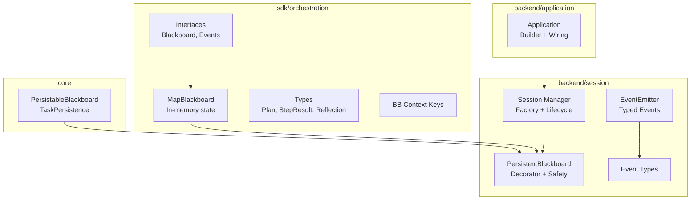
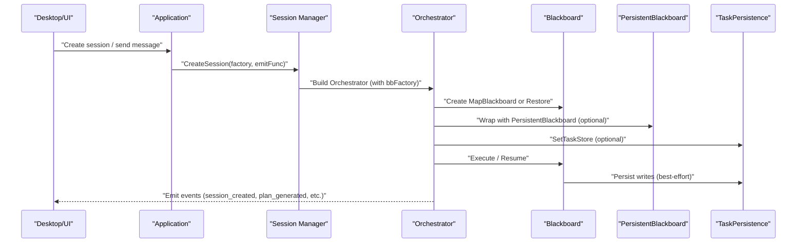
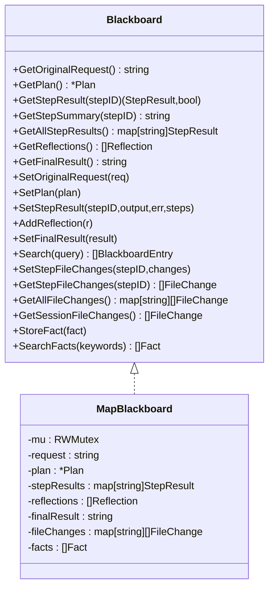
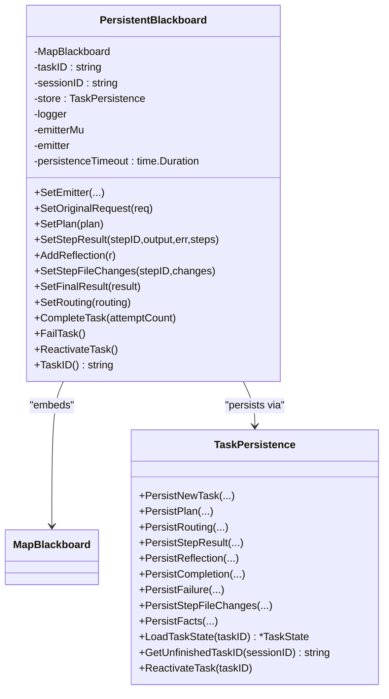
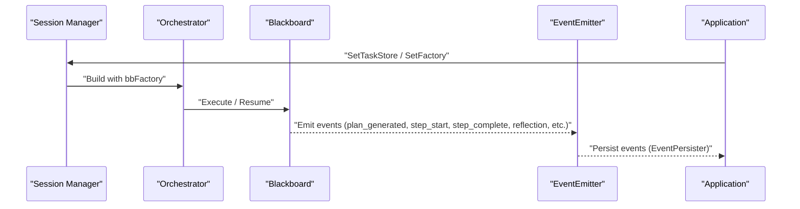
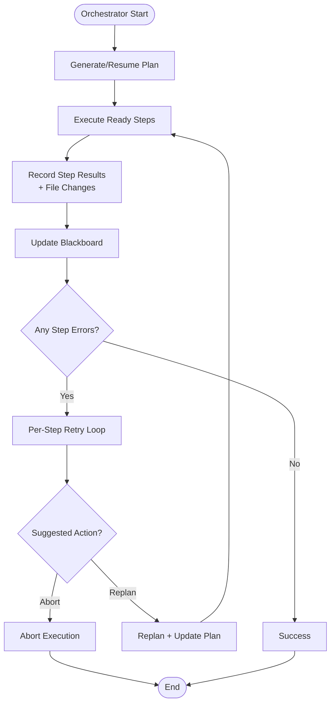
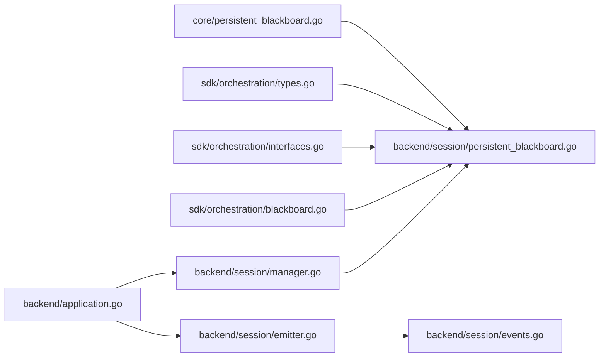

# Blackboard Architecture

<cite>
**Referenced Files in This Document**
- [blackboard.go](file://sdk/orchestration/blackboard.go)
- [interfaces.go](file://sdk/orchestration/interfaces.go)
- [types.go](file://sdk/orchestration/types.go)
- [bbcontext.go](file://sdk/orchestration/bbcontext.go)
- [persistent_blackboard.go](file://core/persistent_blackboard.go)
- [persistent_blackboard.go](file://backend/session/persistent_blackboard.go)
- [events.go](file://backend/session/events.go)
- [emitter.go](file://backend/session/emitter.go)
- [manager.go](file://backend/session/manager.go)
- [application.go](file://backend/application.go)
- [orchestrator.go](file://sdk/orchestration/orchestrator.go)
- [blackboard_test.go](file://sdk/orchestration/blackboard_test.go)
- [persistent_blackboard_test.go](file://backend/session/persistent_blackboard_test.go)
</cite>

## Table of Contents
1. [Introduction](#introduction)
2. [Project Structure](#project-structure)
3. [Core Components](#core-components)
4. [Architecture Overview](#architecture-overview)
5. [Detailed Component Analysis](#detailed-component-analysis)
6. [Dependency Analysis](#dependency-analysis)
7. [Performance Considerations](#performance-considerations)
8. [Troubleshooting Guide](#troubleshooting-guide)
9. [Conclusion](#conclusion)
10. [Appendices](#appendices)

## Introduction
This document explains C0WRK’s blackboard architecture for shared state management in the orchestration engine. The blackboard is a central, thread-safe state container that enables coordinated execution across multiple components: the orchestrator, planner, executor, tools, and persistence layer. It supports both in-memory and persistent modes, event-driven updates, and robust session management. The blackboard pattern allows decoupled components to read and write shared state while maintaining consistency, enabling features such as plan execution, reflection, replanning, and artifact tracking.

## Project Structure
The blackboard system spans several packages:
- sdk/orchestration: Defines the core blackboard interface, in-memory implementation, and orchestration types.
- core: Exposes the persistent blackboard interface and task persistence abstractions used by backend components.
- backend/session: Implements the persistent blackboard decorator and session/event infrastructure.
- backend/application: Integrates persistence, event emission, and orchestrator factory wiring.

**Diagram sources**
- [blackboard.go:16-28](file://sdk/orchestration/blackboard.go#L16-L28)
- [interfaces.go:61-87](file://sdk/orchestration/interfaces.go#L61-L87)
- [persistent_blackboard.go:13-49](file://core/persistent_blackboard.go#L13-L49)
- [persistent_blackboard.go:24-39](file://backend/session/persistent_blackboard.go#L24-L39)
- [emitter.go:50-78](file://backend/session/emitter.go#L50-L78)
- [events.go:12-186](file://backend/session/events.go#L12-L186)
- [manager.go:80-98](file://backend/session/manager.go#L80-L98)
- [application.go:41-53](file://backend/application.go#L41-L53)

**Section sources**
- [blackboard.go:16-28](file://sdk/orchestration/blackboard.go#L16-L28)
- [persistent_blackboard.go:13-49](file://core/persistent_blackboard.go#L13-L49)
- [persistent_blackboard.go:24-39](file://backend/session/persistent_blackboard.go#L24-L39)
- [emitter.go:50-78](file://backend/session/emitter.go#L50-L78)
- [events.go:12-186](file://backend/session/events.go#L12-L186)
- [manager.go:80-98](file://backend/session/manager.go#L80-L98)
- [application.go:41-53](file://backend/application.go#L41-L53)

## Core Components
- Blackboard interface: Defines read/write operations for the shared state (original request, plan, step results, reflections, final result, file changes, facts).
- MapBlackboard: Thread-safe, in-memory implementation with defensive copying and search capabilities.
- PersistableBlackboard: Extends Blackboard with persistence lifecycle methods and task completion/failure/reactivation.
- PersistentBlackboard: Decorator that wraps MapBlackboard and persists writes to a TaskPersistence store with best-effort guarantees and timeouts.
- TaskPersistence: Abstraction for storing task state, including plan, routing, step results, reflections, file changes, facts, and completion/failure.
- TaskState: Restored state snapshot used to hydrate a PersistentBlackboard.
- EventEmitter: Typed event emitter for session lifecycle and orchestration events.
- Session Manager: Creates orchestrators, wires persistence, and manages session lifecycle and task factories.

**Section sources**
- [interfaces.go:61-87](file://sdk/orchestration/interfaces.go#L61-L87)
- [blackboard.go:16-28](file://sdk/orchestration/blackboard.go#L16-L28)
- [types.go:36-88](file://sdk/orchestration/types.go#L36-L88)
- [persistent_blackboard.go:13-49](file://core/persistent_blackboard.go#L13-L49)
- [persistent_blackboard.go:24-39](file://backend/session/persistent_blackboard.go#L24-L39)
- [events.go:12-186](file://backend/session/events.go#L12-L186)
- [manager.go:80-98](file://backend/session/manager.go#L80-L98)

## Architecture Overview
The blackboard architecture integrates orchestration, persistence, and eventing:

**Diagram sources**
- [application.go:104-126](file://backend/application.go#L104-L126)
- [manager.go:380-502](file://backend/session/manager.go#L380-L502)
- [orchestrator.go:56-83](file://sdk/orchestration/orchestrator.go#L56-L83)
- [persistent_blackboard.go:24-39](file://backend/session/persistent_blackboard.go#L24-L39)
- [emitter.go:16-21](file://backend/session/emitter.go#L16-L21)

## Detailed Component Analysis

### Blackboard Pattern Implementation
- Centralized shared state: All components access a single Blackboard instance to coordinate execution.
- Thread-safety: MapBlackboard uses read-write mutexes for concurrent reads/writes.
- Defensive copying: Returned data structures are copies to prevent external mutation.
- Search and aggregation: Supports searching across step results, file changes, and reflections; aggregates file changes across steps.

**Diagram sources**
- [interfaces.go:61-87](file://sdk/orchestration/interfaces.go#L61-L87)
- [blackboard.go:16-28](file://sdk/orchestration/blackboard.go#L16-L28)

**Section sources**
- [blackboard.go:66-133](file://sdk/orchestration/blackboard.go#L66-L133)
- [blackboard.go:139-221](file://sdk/orchestration/blackboard.go#L139-L221)
- [blackboard.go:237-334](file://sdk/orchestration/blackboard.go#L237-L334)
- [blackboard.go:348-433](file://sdk/orchestration/blackboard.go#L348-L433)
- [blackboard.go:439-485](file://sdk/orchestration/blackboard.go#L439-L485)
- [blackboard_test.go:12-23](file://sdk/orchestration/blackboard_test.go#L12-L23)
- [blackboard_test.go:167-184](file://sdk/orchestration/blackboard_test.go#L167-L184)
- [blackboard_test.go:186-205](file://sdk/orchestration/blackboard_test.go#L186-L205)
- [blackboard_test.go:361-385](file://sdk/orchestration/blackboard_test.go#L361-L385)
- [blackboard_test.go:410-438](file://sdk/orchestration/blackboard_test.go#L410-L438)

### Persistent Blackboard Decorator
- Purpose: Wrap MapBlackboard to persist writes to a TaskPersistence store while delegating reads to the in-memory implementation.
- Best-effort persistence: All persistence operations run inside a timeout and panic guard; failures are logged and optionally surfaced via an Emitter.
- Lifecycle methods: CompleteTask, FailTask, ReactivateTask, TaskID, and SetRouting integrate with task lifecycle and routing decisions.
- Restoration: RestoreBlackboard loads TaskState and hydrates a PersistentBlackboard.

**Diagram sources**
- [persistent_blackboard.go:24-39](file://backend/session/persistent_blackboard.go#L24-L39)
- [persistent_blackboard.go:114-156](file://backend/session/persistent_blackboard.go#L114-L156)
- [persistent_blackboard.go:200-221](file://backend/session/persistent_blackboard.go#L200-L221)
- [persistent_blackboard.go:232-276](file://backend/session/persistent_blackboard.go#L232-L276)
- [persistent_blackboard.go:34-49](file://core/persistent_blackboard.go#L34-L49)

**Section sources**
- [persistent_blackboard.go:71-108](file://backend/session/persistent_blackboard.go#L71-L108)
- [persistent_blackboard.go:114-156](file://backend/session/persistent_blackboard.go#L114-L156)
- [persistent_blackboard.go:200-221](file://backend/session/persistent_blackboard.go#L200-L221)
- [persistent_blackboard.go:232-276](file://backend/session/persistent_blackboard.go#L232-L276)
- [persistent_blackboard.go:13-49](file://core/persistent_blackboard.go#L13-L49)
- [persistent_blackboard_test.go:162-183](file://backend/session/persistent_blackboard_test.go#L162-L183)
- [persistent_blackboard_test.go:185-204](file://backend/session/persistent_blackboard_test.go#L185-L204)
- [persistent_blackboard_test.go:206-239](file://backend/session/persistent_blackboard_test.go#L206-L239)
- [persistent_blackboard_test.go:241-263](file://backend/session/persistent_blackboard_test.go#L241-L263)
- [persistent_blackboard_test.go:284-306](file://backend/session/persistent_blackboard_test.go#L284-L306)
- [persistent_blackboard_test.go:308-322](file://backend/session/persistent_blackboard_test.go#L308-L322)
- [persistent_blackboard_test.go:392-407](file://backend/session/persistent_blackboard_test.go#L392-L407)
- [persistent_blackboard_test.go:418-465](file://backend/session/persistent_blackboard_test.go#L418-L465)
- [persistent_blackboard_test.go:488-523](file://backend/session/persistent_blackboard_test.go#L488-L523)
- [persistent_blackboard_test.go:545-593](file://backend/session/persistent_blackboard_test.go#L545-L593)

### Event-Driven Updates and Session Management
- EventEmitter: Emits typed events for routing, plan generation, step execution, reflections, retries, and service messages. Supports scoping by plan step and retry attempt.
- Session Manager: Creates sessions, orchestrators, and blackboard factories. Wires task persistence and restoration into the orchestrator.
- Application: Builds the orchestrator factory, sets up persistence, and combines UI emission with event persistence.

**Diagram sources**
- [application.go:104-126](file://backend/application.go#L104-L126)
- [manager.go:380-502](file://backend/session/manager.go#L380-L502)
- [emitter.go:161-174](file://backend/session/emitter.go#L161-L174)
- [emitter.go:176-196](file://backend/session/emitter.go#L176-L196)
- [emitter.go:198-252](file://backend/session/emitter.go#L198-L252)
- [emitter.go:414-442](file://backend/session/emitter.go#L414-L442)

**Section sources**
- [emitter.go:16-21](file://backend/session/emitter.go#L16-L21)
- [emitter.go:161-174](file://backend/session/emitter.go#L161-L174)
- [emitter.go:176-196](file://backend/session/emitter.go#L176-L196)
- [emitter.go:198-252](file://backend/session/emitter.go#L198-L252)
- [emitter.go:414-442](file://backend/session/emitter.go#L414-L442)
- [events.go:12-186](file://backend/session/events.go#L12-L186)
- [manager.go:143-150](file://backend/session/manager.go#L143-L150)
- [manager.go:251-263](file://backend/session/manager.go#L251-L263)
- [application.go:104-126](file://backend/application.go#L104-L126)

### State Synchronization and Coordination
- Context propagation: Blackboard is attached to context via a dedicated key, enabling tools and executors to access shared state.
- Orchestration loop: Orchestrator coordinates planning, execution, reflection, and replanning, updating the blackboard with step results, file changes, and reflections.
- Fact memory: Keyword-tagged facts enable inter-step communication and retrieval.
- File change tracking: Tracks per-step and aggregated file changes, supporting rollback and artifact visibility.

**Diagram sources**
- [orchestrator.go:128-126](file://sdk/orchestration/orchestrator.go#L128-L126)
- [orchestrator.go:348-346](file://sdk/orchestration/orchestrator.go#L348-L346)
- [orchestrator.go:470-471](file://sdk/orchestration/orchestrator.go#L470-L471)
- [orchestrator.go:496-504](file://sdk/orchestration/orchestrator.go#L496-L504)
- [bbcontext.go:5-21](file://sdk/orchestration/bbcontext.go#L5-L21)

**Section sources**
- [bbcontext.go:5-21](file://sdk/orchestration/bbcontext.go#L5-L21)
- [orchestrator.go:466-471](file://sdk/orchestration/orchestrator.go#L466-L471)
- [orchestrator.go:496-504](file://sdk/orchestration/orchestrator.go#L496-L504)
- [orchestrator.go:516-513](file://sdk/orchestration/orchestrator.go#L516-L513)
- [blackboard.go:348-433](file://sdk/orchestration/blackboard.go#L348-L433)

### Implementation Details
- Summary generation: Auto-generates concise summaries with character and token-based caps.
- Search: Case-insensitive substring search across step summaries, full outputs, and reflections.
- File change aggregation: Processes step changes deterministically and merges duplicates (CREATE then DELETE omitted).
- Fact retrieval: Keyword-based relevance scoring with defensive copies.

**Section sources**
- [blackboard.go:491-523](file://sdk/orchestration/blackboard.go#L491-L523)
- [blackboard.go:439-485](file://sdk/orchestration/blackboard.go#L439-L485)
- [blackboard.go:278-334](file://sdk/orchestration/blackboard.go#L278-L334)
- [blackboard.go:355-410](file://sdk/orchestration/blackboard.go#L355-L410)

### Usage Patterns and Examples
- Creating a session with persistence: The session manager constructs a BlackboardFactory that returns a PersistentBlackboard backed by TaskPersistence. The orchestrator is wired with SetTaskStore and a restore function.
- Resuming execution: The orchestrator resumes from an existing blackboard, rebuilding plan step statuses and carrying forward completed steps.
- Event-driven UI updates: EventEmitter emits typed events for plan progress, step execution, and reflections; Application combines UI emission with event persistence.

**Section sources**
- [manager.go:251-263](file://backend/session/manager.go#L251-L263)
- [manager.go:288-294](file://backend/session/manager.go#L288-L294)
- [manager.go:409-422](file://backend/session/manager.go#L409-L422)
- [manager.go:448-454](file://backend/session/manager.go#L448-L454)
- [application.go:78-84](file://backend/application.go#L78-L84)
- [orchestrator.go:85-126](file://sdk/orchestration/orchestrator.go#L85-L126)

## Dependency Analysis
The blackboard system exhibits clear separation of concerns:
- sdk/orchestration depends on core types and defines the blackboard contract and in-memory implementation.
- backend/session depends on core for persistence interfaces and implements the decorator and eventing.
- backend/application orchestrates wiring between persistence, eventing, and orchestrator construction.

**Diagram sources**
- [persistent_blackboard.go:13-49](file://core/persistent_blackboard.go#L13-L49)
- [persistent_blackboard.go:24-39](file://backend/session/persistent_blackboard.go#L24-L39)
- [types.go:36-88](file://sdk/orchestration/types.go#L36-L88)
- [interfaces.go:61-87](file://sdk/orchestration/interfaces.go#L61-L87)
- [blackboard.go:16-28](file://sdk/orchestration/blackboard.go#L16-L28)
- [application.go:104-126](file://backend/application.go#L104-L126)
- [manager.go:380-502](file://backend/session/manager.go#L380-L502)
- [emitter.go:50-78](file://backend/session/emitter.go#L50-L78)
- [events.go:12-186](file://backend/session/events.go#L12-L186)

**Section sources**
- [persistent_blackboard.go:13-49](file://core/persistent_blackboard.go#L13-L49)
- [persistent_blackboard.go:24-39](file://backend/session/persistent_blackboard.go#L24-L39)
- [application.go:104-126](file://backend/application.go#L104-L126)
- [manager.go:380-502](file://backend/session/manager.go#L380-L502)

## Performance Considerations
- Concurrency: MapBlackboard uses read-write locks to minimize contention; consider batching frequent writes to reduce lock pressure.
- Summary caps: Configure max summary length and token budgets to balance readability and memory footprint.
- Persistence overhead: Best-effort persistence with timeouts prevents stalls; monitor persistence warnings via the Emitter.
- Event volume: EventEmitter scopes events by plan step and retry attempt to reduce noise and improve UI responsiveness.

[No sources needed since this section provides general guidance]

## Troubleshooting Guide
- Persistence failures: The decorator runs persistence inside a timeout and panic guard; failures are logged and optionally emitted as service messages. Check logs and verify TaskPersistence availability.
- Task not found: RestoreBlackboard returns nil when a task is not found; ensure correct taskID/sessionID pairing.
- Inconsistent state: Verify that all writes go through the decorator to ensure persistence; confirm that restoration hydrates all fields (plan, step results, reflections, file changes, facts).
- Event delivery: Confirm that the combined emit function routes events to both UI and persistence.

**Section sources**
- [persistent_blackboard.go:71-108](file://backend/session/persistent_blackboard.go#L71-L108)
- [persistent_blackboard.go:232-276](file://backend/session/persistent_blackboard.go#L232-L276)
- [persistent_blackboard_test.go:467-477](file://backend/session/persistent_blackboard_test.go#L467-L477)
- [application.go:78-84](file://backend/application.go#L78-L84)

## Conclusion
C0WRK’s blackboard architecture provides a robust, event-driven foundation for shared state management across orchestration, persistence, and session lifecycles. The MapBlackboard offers thread-safe, defensive state access, while the PersistentBlackboard decorator ensures durable state with best-effort guarantees. Together with typed events and a session manager, the system enables reliable coordination among components, supports resumable execution, and maintains strong consistency for artifacts and inter-step communication.

[No sources needed since this section summarizes without analyzing specific files]

## Appendices

### API Surface Summary
- Blackboard: Read/write operations for orchestration state.
- PersistableBlackboard: Task lifecycle methods and routing integration.
- TaskPersistence: CRUD for task state and lifecycle.
- EventEmitter: Typed event emission with scoping.
- Session Manager: Orchestrator factory and session lifecycle.

**Section sources**
- [interfaces.go:61-87](file://sdk/orchestration/interfaces.go#L61-L87)
- [persistent_blackboard.go:13-49](file://core/persistent_blackboard.go#L13-L49)
- [events.go:12-186](file://backend/session/events.go#L12-L186)
- [manager.go:80-98](file://backend/session/manager.go#L80-L98)