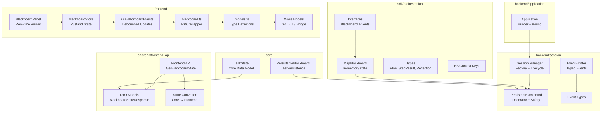
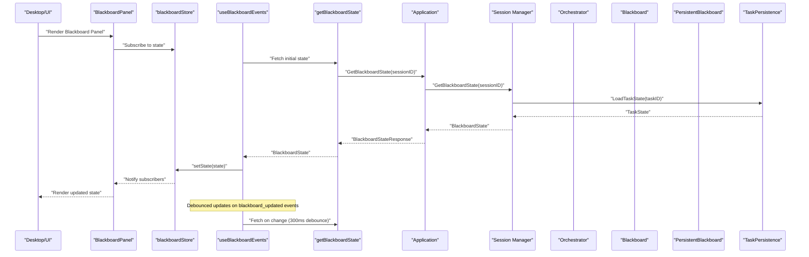
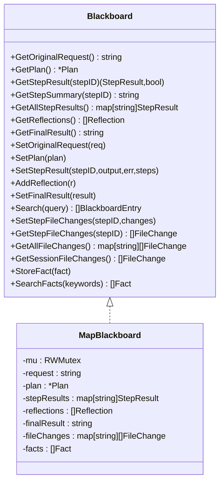
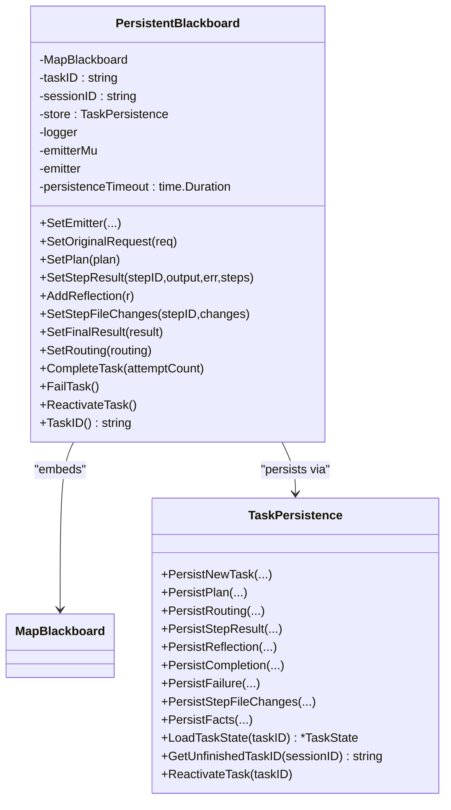
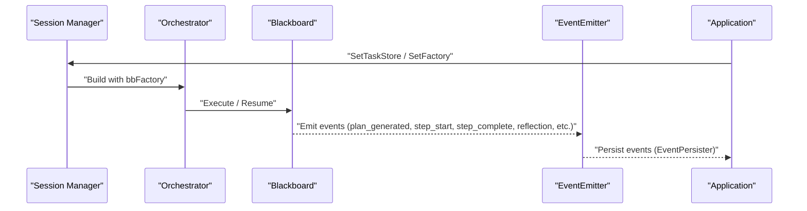
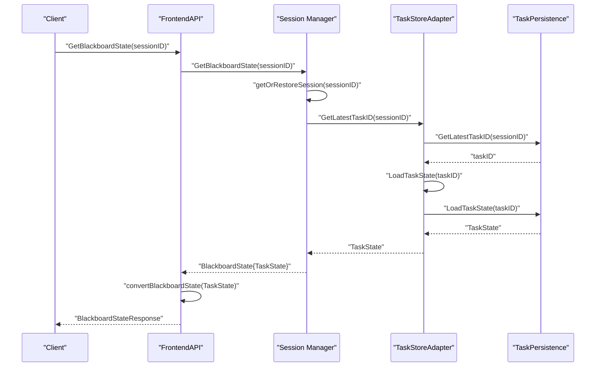
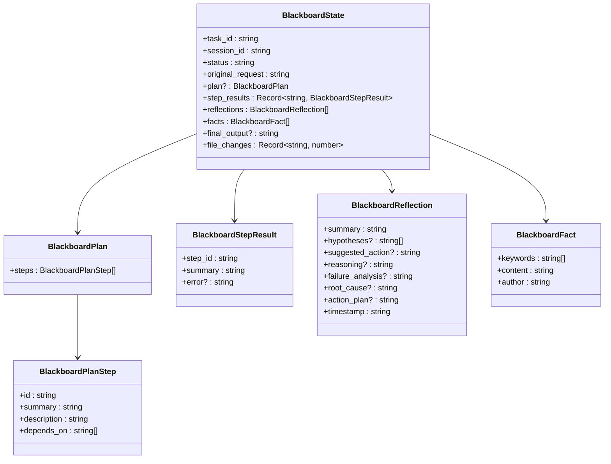
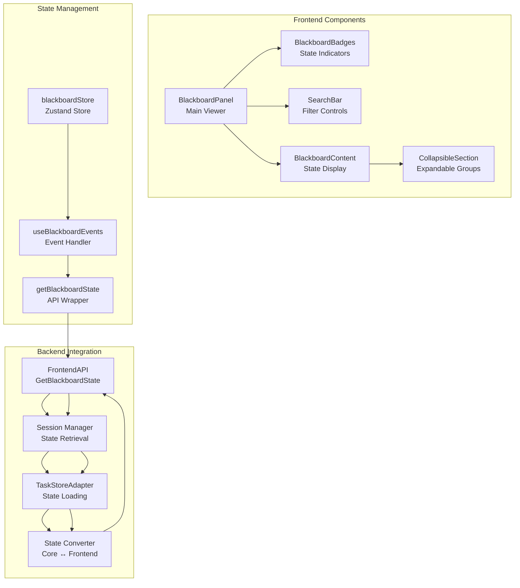
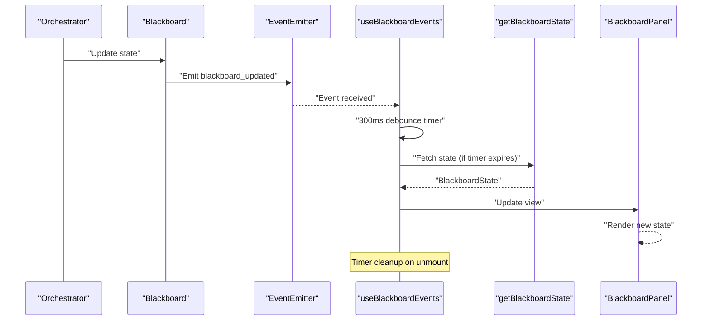
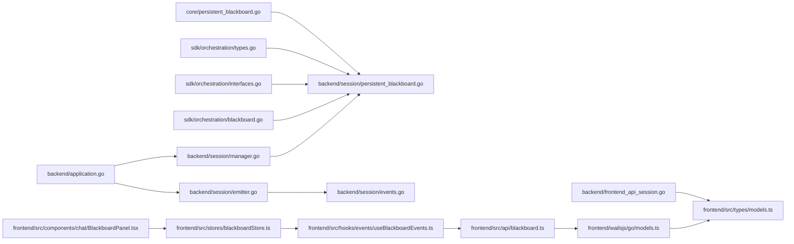

# Blackboard Architecture

<cite>
**Referenced Files in This Document**
- [blackboard.go](file://sdk/orchestration/blackboard.go)
- [interfaces.go](file://sdk/orchestration/interfaces.go)
- [types.go](file://sdk/orchestration/types.go)
- [bbcontext.go](file://sdk/orchestration/bbcontext.go)
- [persistent_blackboard.go](file://core/persistent_blackboard.go)
- [persistent_blackboard.go](file://backend/session/persistent_blackboard.go)
- [events.go](file://backend/session/events.go)
- [emitter.go](file://backend/session/emitter.go)
- [manager.go](file://backend/session/manager.go)
- [application.go](file://backend/application.go)
- [frontend_api_session.go](file://backend/frontend_api_session.go)
- [api_types.go](file://backend/api_types.go)
- [orchestrator.go](file://sdk/orchestration/orchestrator.go)
- [blackboard_test.go](file://sdk/orchestration/blackboard_test.go)
- [persistent_blackboard_test.go](file://backend/session/persistent_blackboard_test.go)
- [BlackboardPanel.tsx](file://frontend/src/components/chat/BlackboardPanel.tsx)
- [blackboardStore.ts](file://frontend/src/stores/blackboardStore.ts)
- [useBlackboardEvents.ts](file://frontend/src/hooks/events/useBlackboardEvents.ts)
- [blackboard.ts](file://frontend/src/api/blackboard.ts)
- [models.ts](file://frontend/src/types/models.ts)
- [events.ts](file://frontend/src/types/events.ts)
- [models.ts](file://frontend/wailsjs/go/models.ts)
</cite>

## Update Summary
**Changes Made**
- Enhanced GetBlackboardState API endpoint with comprehensive state retrieval capabilities
- Added comprehensive TypeScript models for blackboard state management with detailed type definitions
- Improved real-time monitoring capabilities with debounced state updates and event-driven architecture
- Expanded frontend integration with robust state visualization and user interaction features
- Enhanced backend conversion logic for seamless data transfer between Go and TypeScript

## Table of Contents
1. [Introduction](#introduction)
2. [Project Structure](#project-structure)
3. [Core Components](#core-components)
4. [Architecture Overview](#architecture-overview)
5. [Detailed Component Analysis](#detailed-component-analysis)
6. [Enhanced GetBlackboardState API](#enhanced-getblackboardstate-api)
7. [Comprehensive TypeScript Models](#comprehensive-typescript-models)
8. [Real-Time Blackboard Viewer System](#real-time-blackboard-viewer-system)
9. [Event-Driven Architecture](#event-driven-architecture)
10. [Dependency Analysis](#dependency-analysis)
11. [Performance Considerations](#performance-considerations)
12. [Troubleshooting Guide](#troubleshooting-guide)
13. [Conclusion](#conclusion)
14. [Appendices](#appendices)

## Introduction
This document explains C0WRK's blackboard architecture for shared state management in the orchestration engine. The blackboard is a central, thread-safe state container that enables coordinated execution across multiple components: the orchestrator, planner, executor, tools, and persistence layer. It supports both in-memory and persistent modes, event-driven updates, and robust session management. The blackboard pattern allows decoupled components to read and write shared state while maintaining consistency, enabling features such as plan execution, reflection, replanning, and artifact tracking.

**Updated** Enhanced with comprehensive GetBlackboardState API endpoint for real-time state retrieval, extensive TypeScript models for type-safe state management, and advanced real-time monitoring capabilities with debounced updates and event-driven architecture.

## Project Structure
The blackboard system spans several packages with enhanced API integration:
- sdk/orchestration: Defines the core blackboard interface, in-memory implementation, and orchestration types.
- core: Exposes the persistent blackboard interface and task persistence abstractions used by backend components.
- backend/session: Implements the persistent blackboard decorator and session/event infrastructure with enhanced state retrieval.
- backend/application: Integrates persistence, event emission, and orchestrator factory wiring.
- backend/frontend_api_session.go: Provides comprehensive GetBlackboardState endpoint with detailed state conversion.
- frontend: Contains the real-time blackboard viewer with React components, state management, and enhanced event handling.

**Diagram sources**
- [blackboard.go:16-28](file://sdk/orchestration/blackboard.go#L16-L28)
- [interfaces.go:61-87](file://sdk/orchestration/interfaces.go#L61-L87)
- [persistent_blackboard.go:13-49](file://core/persistent_blackboard.go#L13-L49)
- [persistent_blackboard.go:24-39](file://backend/session/persistent_blackboard.go#L24-L39)
- [emitter.go:50-78](file://backend/session/emitter.go#L50-L78)
- [events.go:12-186](file://backend/session/events.go#L12-L186)
- [manager.go:80-98](file://backend/session/manager.go#L80-L98)
- [application.go:41-53](file://backend/application.go#L41-L53)
- [frontend_api_session.go:193-209](file://backend/frontend_api_session.go#L193-L209)
- [frontend_api_session.go:211-282](file://backend/frontend_api_session.go#L211-L282)
- [BlackboardPanel.tsx:10-52](file://frontend/src/components/chat/BlackboardPanel.tsx#L10-L52)
- [blackboardStore.ts:44-53](file://frontend/src/stores/blackboardStore.ts#L44-L53)
- [useBlackboardEvents.ts:12-45](file://frontend/src/hooks/events/useBlackboardEvents.ts#L12-L45)
- [blackboard.ts:7-16](file://frontend/src/api/blackboard.ts#L7-L16)
- [models.ts:198-244](file://frontend/src/types/models.ts#L198-L244)
- [models.ts:110-139](file://frontend/wailsjs/go/models.ts#L110-L139)

**Section sources**
- [blackboard.go:16-28](file://sdk/orchestration/blackboard.go#L16-L28)
- [persistent_blackboard.go:13-49](file://core/persistent_blackboard.go#L13-L49)
- [persistent_blackboard.go:24-39](file://backend/session/persistent_blackboard.go#L24-L39)
- [emitter.go:50-78](file://backend/session/emitter.go#L50-L78)
- [events.go:12-186](file://backend/session/events.go#L12-L186)
- [manager.go:80-98](file://backend/session/manager.go#L80-L98)
- [application.go:41-53](file://backend/application.go#L41-L53)
- [frontend_api_session.go:193-209](file://backend/frontend_api_session.go#L193-L209)

## Core Components
- Blackboard interface: Defines read/write operations for the shared state (original request, plan, step results, reflections, final result, file changes, facts).
- MapBlackboard: Thread-safe, in-memory implementation with defensive copying and search capabilities.
- PersistableBlackboard: Extends Blackboard with persistence lifecycle methods and task completion/failure/reactivation.
- PersistentBlackboard: Decorator that wraps MapBlackboard and persists writes to a TaskPersistence store with best-effort guarantees and timeouts.
- TaskPersistence: Abstraction for storing task state, including plan, routing, step results, reflections, file changes, facts, and completion/failure.
- TaskState: Restored state snapshot used to hydrate a PersistentBlackboard with comprehensive field coverage.
- EventEmitter: Typed event emitter for session lifecycle and orchestration events.
- Session Manager: Creates orchestrators, wires persistence, and manages session lifecycle and task factories.
- **Updated** Frontend API: Enhanced GetBlackboardState endpoint with comprehensive state retrieval and conversion logic.
- **Updated** Blackboard Viewer: React components for real-time state visualization with advanced filtering and monitoring capabilities.

**Section sources**
- [interfaces.go:61-87](file://sdk/orchestration/interfaces.go#L61-L87)
- [blackboard.go:16-28](file://sdk/orchestration/blackboard.go#L16-L28)
- [types.go:36-88](file://sdk/orchestration/types.go#L36-L88)
- [persistent_blackboard.go:13-49](file://core/persistent_blackboard.go#L13-L49)
- [persistent_blackboard.go:24-39](file://backend/session/persistent_blackboard.go#L24-L39)
- [events.go:12-186](file://backend/session/events.go#L12-L186)
- [manager.go:80-98](file://backend/session/manager.go#L80-L98)
- [frontend_api_session.go:193-209](file://backend/frontend_api_session.go#L193-L209)

## Architecture Overview
The blackboard architecture integrates orchestration, persistence, eventing, and enhanced real-time monitoring:

**Diagram sources**
- [BlackboardPanel.tsx:10-52](file://frontend/src/components/chat/BlackboardPanel.tsx#L10-L52)
- [blackboardStore.ts:44-53](file://frontend/src/stores/blackboardStore.ts#L44-L53)
- [useBlackboardEvents.ts:12-45](file://frontend/src/hooks/events/useBlackboardEvents.ts#L12-L45)
- [blackboard.ts:7-16](file://frontend/src/api/blackboard.ts#L7-L16)
- [frontend_api_session.go:193-209](file://backend/frontend_api_session.go#L193-L209)
- [manager.go:1204-1248](file://backend/session/manager.go#L1204-L1248)

## Detailed Component Analysis

### Blackboard Pattern Implementation
- Centralized shared state: All components access a single Blackboard instance to coordinate execution.
- Thread-safety: MapBlackboard uses read-write mutexes for concurrent reads/writes.
- Defensive copying: Returned data structures are copies to prevent external mutation.
- Search and aggregation: Supports searching across step results, file changes, and reflections; aggregates file changes across steps.

**Diagram sources**
- [interfaces.go:61-87](file://sdk/orchestration/interfaces.go#L61-L87)
- [blackboard.go:16-28](file://sdk/orchestration/blackboard.go#L16-L28)

**Section sources**
- [blackboard.go:66-133](file://sdk/orchestration/blackboard.go#L66-L133)
- [blackboard.go:139-221](file://sdk/orchestration/blackboard.go#L139-L221)
- [blackboard.go:237-334](file://sdk/orchestration/blackboard.go#L237-L334)
- [blackboard.go:348-433](file://sdk/orchestration/blackboard.go#L348-L433)
- [blackboard.go:439-485](file://sdk/orchestration/blackboard.go#L439-L485)
- [blackboard_test.go:12-23](file://sdk/orchestration/blackboard_test.go#L12-L23)
- [blackboard_test.go:167-184](file://sdk/orchestration/blackboard_test.go#L167-L184)
- [blackboard_test.go:186-205](file://sdk/orchestration/blackboard_test.go#L186-L205)
- [blackboard_test.go:361-385](file://sdk/orchestration/blackboard_test.go#L361-L385)
- [blackboard_test.go:410-438](file://sdk/orchestration/blackboard_test.go#L410-L438)

### Persistent Blackboard Decorator
- Purpose: Wrap MapBlackboard to persist writes to a TaskPersistence store while delegating reads to the in-memory implementation.
- Best-effort persistence: All persistence operations run inside a timeout and panic guard; failures are logged and optionally surfaced via an Emitter.
- Lifecycle methods: CompleteTask, FailTask, ReactivateTask, TaskID, and SetRouting integrate with task lifecycle and routing decisions.
- Restoration: RestoreBlackboard loads TaskState and hydrates a PersistentBlackboard.

**Diagram sources**
- [persistent_blackboard.go:24-39](file://backend/session/persistent_blackboard.go#L24-L39)
- [persistent_blackboard.go:114-156](file://backend/session/persistent_blackboard.go#L114-L156)
- [persistent_blackboard.go:200-221](file://backend/session/persistent_blackboard.go#L200-L221)
- [persistent_blackboard.go:232-276](file://backend/session/persistent_blackboard.go#L232-L276)
- [persistent_blackboard.go:34-49](file://core/persistent_blackboard.go#L34-L49)

**Section sources**
- [persistent_blackboard.go:71-108](file://backend/session/persistent_blackboard.go#L71-L108)
- [persistent_blackboard.go:114-156](file://backend/session/persistent_blackboard.go#L114-L156)
- [persistent_blackboard.go:200-221](file://backend/session/persistent_blackboard.go#L200-L221)
- [persistent_blackboard.go:232-276](file://backend/session/persistent_blackboard.go#L232-L276)
- [persistent_blackboard.go:13-49](file://core/persistent_blackboard.go#L13-L49)
- [persistent_blackboard_test.go:162-183](file://backend/session/persistent_blackboard_test.go#L162-L183)
- [persistent_blackboard_test.go:185-204](file://backend/session/persistent_blackboard_test.go#L185-L204)
- [persistent_blackboard_test.go:206-239](file://backend/session/persistent_blackboard_test.go#L206-L239)
- [persistent_blackboard_test.go:241-263](file://backend/session/persistent_blackboard_test.go#L241-L263)
- [persistent_blackboard_test.go:284-306](file://backend/session/persistent_blackboard_test.go#L284-L306)
- [persistent_blackboard_test.go:308-322](file://backend/session/persistent_blackboard_test.go#L308-L322)
- [persistent_blackboard_test.go:392-407](file://backend/session/persistent_blackboard_test.go#L392-L407)
- [persistent_blackboard_test.go:418-465](file://backend/session/persistent_blackboard_test.go#L418-L465)
- [persistent_blackboard_test.go:488-523](file://backend/session/persistent_blackboard_test.go#L488-L523)
- [persistent_blackboard_test.go:545-593](file://backend/session/persistent_blackboard_test.go#L545-L593)

### Event-Driven Updates and Session Management
- EventEmitter: Emits typed events for routing, plan generation, step execution, reflections, retries, and service messages. Supports scoping by plan step and retry attempt.
- Session Manager: Creates sessions, orchestrators, and blackboard factories. Wires task persistence and restoration into the orchestrator.
- Application: Builds the orchestrator factory, sets up persistence, and combines UI emission with event persistence.

**Diagram sources**
- [application.go:104-126](file://backend/application.go#L104-L126)
- [manager.go:380-502](file://backend/session/manager.go#L380-L502)
- [emitter.go:161-174](file://backend/session/emitter.go#L161-L174)
- [emitter.go:176-196](file://backend/session/emitter.go#L176-L196)
- [emitter.go:198-252](file://backend/session/emitter.go#L198-L252)
- [emitter.go:414-442](file://backend/session/emitter.go#L414-L442)

**Section sources**
- [emitter.go:16-21](file://backend/session/emitter.go#L16-L21)
- [emitter.go:161-174](file://backend/session/emitter.go#L161-L174)
- [emitter.go:176-196](file://backend/session/emitter.go#L176-L196)
- [emitter.go:198-252](file://backend/session/emitter.go#L198-L252)
- [emitter.go:414-442](file://backend/session/emitter.go#L414-L442)
- [events.go:12-186](file://backend/session/events.go#L12-L186)
- [manager.go:143-150](file://backend/session/manager.go#L143-L150)
- [manager.go:251-263](file://backend/session/manager.go#L251-L263)
- [application.go:104-126](file://backend/application.go#L104-L126)

### State Synchronization and Coordination
- Context propagation: Blackboard is attached to context via a dedicated key, enabling tools and executors to access shared state.
- Orchestration loop: Orchestrator coordinates planning, execution, reflection, and replanning, updating the blackboard with step results, file changes, and reflections.
- Fact memory: Keyword-tagged facts enable inter-step communication and retrieval.
- File change tracking: Tracks per-step and aggregated file changes, supporting rollback and artifact visibility.

**Diagram sources**
- [orchestrator.go:128-126](file://sdk/orchestration/orchestrator.go#L128-L126)
- [orchestrator.go:348-346](file://sdk/orchestration/orchestrator.go#L348-L346)
- [orchestrator.go:470-471](file://sdk/orchestration/orchestrator.go#L470-L471)
- [orchestrator.go:496-504](file://sdk/orchestration/orchestrator.go#L496-L504)
- [bbcontext.go:5-21](file://sdk/orchestration/bbcontext.go#L5-L21)

**Section sources**
- [bbcontext.go:5-21](file://sdk/orchestration/bbcontext.go#L5-L21)
- [orchestrator.go:466-471](file://sdk/orchestration/orchestrator.go#L466-L471)
- [orchestrator.go:496-504](file://sdk/orchestration/orchestrator.go#L496-L504)
- [orchestrator.go:516-513](file://sdk/orchestration/orchestrator.go#L516-L513)
- [blackboard.go:348-433](file://sdk/orchestration/blackboard.go#L348-L433)

### Implementation Details
- Summary generation: Auto-generates concise summaries with character and token-based caps.
- Search: Case-insensitive substring search across step summaries, full outputs, and reflections.
- File change aggregation: Processes step changes deterministically and merges duplicates (CREATE then DELETE omitted).
- Fact retrieval: Keyword-based relevance scoring with defensive copies.

**Section sources**
- [blackboard.go:491-523](file://sdk/orchestration/blackboard.go#L491-L523)
- [blackboard.go:439-485](file://sdk/orchestration/blackboard.go#L439-L485)
- [blackboard.go:278-334](file://sdk/orchestration/blackboard.go#L278-L334)
- [blackboard.go:355-410](file://sdk/orchestration/blackboard.go#L355-L410)

## Enhanced GetBlackboardState API

### Comprehensive State Retrieval Endpoint
The GetBlackboardState API provides robust state retrieval with comprehensive coverage of all blackboard components:

- **Task State Loading**: Retrieves the most recent task state for a session, falling back from in-memory to database storage.
- **State Conversion**: Maps core.TaskState to frontend DTO with detailed field preservation including plan, step results, reflections, facts, and file changes.
- **Error Handling**: Graceful handling of missing sessions, tasks, and persistence layers with informative error messages.
- **Type Safety**: Strongly typed responses with comprehensive field validation and conversion logic.

**Diagram sources**
- [frontend_api_session.go:193-209](file://backend/frontend_api_session.go#L193-L209)
- [frontend_api_session.go:211-282](file://backend/frontend_api_session.go#L211-L282)
- [manager.go:1205-1249](file://backend/session/manager.go#L1205-L1249)

### State Conversion Logic
The conversion process transforms core.TaskState into frontend-compatible DTOs with comprehensive field mapping:

- **Plan Conversion**: Converts core.Plan to BlackboardPlanResponse with step arrays and dependency information.
- **Step Results**: Maps StepResult to BlackboardStepResponse with step_id, summary, and error details.
- **Reflections**: Converts Reflection to BlackboardReflectionResponse with comprehensive analysis fields.
- **Facts**: Transforms Fact to BlackboardFactResponse with keywords, content, and author information.
- **File Changes**: Aggregates file changes by counting per-step modifications.

**Section sources**
- [frontend_api_session.go:193-209](file://backend/frontend_api_session.go#L193-L209)
- [frontend_api_session.go:211-282](file://backend/frontend_api_session.go#L211-L282)
- [manager.go:1205-1249](file://backend/session/manager.go#L1205-L1249)

## Comprehensive TypeScript Models

### Frontend State Model
The TypeScript models provide comprehensive type safety for blackboard state management:

- **BlackboardState**: Root state interface with task_id, session_id, status, original_request, plan, step_results, reflections, facts, final_output, and file_changes.
- **BlackboardPlan**: Plan structure with steps array containing step details including id, summary, description, and depends_on dependencies.
- **BlackboardStepResult**: Individual step result with step_id, summary, and optional error information.
- **BlackboardReflection**: Comprehensive reflection data with summary, hypotheses, suggested_action, reasoning, failure_analysis, root_cause, action_plan, and timestamp.
- **BlackboardFact**: Fact data with keywords array, content, and author information.

**Diagram sources**
- [models.ts:198-244](file://frontend/src/types/models.ts#L198-L244)
- [models.ts:211-220](file://frontend/src/types/models.ts#L211-L220)
- [models.ts:222-226](file://frontend/src/types/models.ts#L222-L226)
- [models.ts:228-237](file://frontend/src/types/models.ts#L228-L237)
- [models.ts:239-243](file://frontend/src/types/models.ts#L239-L243)

### Backend Response Models
The backend response models provide Go-side type definitions for seamless Wails integration:

- **BlackboardStateResponse**: Complete response structure mirroring frontend models with proper JSON serialization.
- **BlackboardPlanResponse**: Plan structure with steps array and dependency tracking.
- **BlackboardStepResponse**: Step result with error handling and summary information.
- **BlackboardReflectionResponse**: Reflection data with comprehensive analysis fields.
- **BlackboardFactResponse**: Fact data with keyword tagging and author attribution.

**Section sources**
- [models.ts:198-244](file://frontend/src/types/models.ts#L198-L244)
- [models.ts:110-139](file://frontend/wailsjs/go/models.ts#L110-L139)
- [models.ts:37-93](file://frontend/wailsjs/go/models.ts#L37-L93)
- [models.ts:198-244](file://frontend/src/types/models.ts#L198-L244)

## Real-Time Blackboard Viewer System

### Advanced Frontend Architecture
The real-time blackboard viewer provides comprehensive state visualization with enhanced features:

- **BlackboardPanel**: Main React component that renders the blackboard state with collapsible sections, search functionality, and responsive design.
- **blackboardStore**: Zustand-based state management with loading states, error handling, and stable selectors for efficient re-renders.
- **useBlackboardEvents**: Enhanced custom hook with debounced state updates via session events and proper cleanup handling.
- **getBlackboardState**: API wrapper that communicates with the backend through Wails RPC with comprehensive error handling.

**Diagram sources**
- [BlackboardPanel.tsx:10-52](file://frontend/src/components/chat/BlackboardPanel.tsx#L10-L52)
- [blackboardStore.ts:44-53](file://frontend/src/stores/blackboardStore.ts#L44-L53)
- [useBlackboardEvents.ts:12-45](file://frontend/src/hooks/events/useBlackboardEvents.ts#L12-L45)
- [blackboard.ts:7-16](file://frontend/src/api/blackboard.ts#L7-L16)
- [frontend_api_session.go:193-209](file://backend/frontend_api_session.go#L193-L209)
- [frontend_api_session.go:211-282](file://backend/frontend_api_session.go#L211-L282)

### Enhanced State Visualization Features
- **Real-time Updates**: Debounced RPC calls (300ms) prevent excessive API requests while ensuring timely state refresh.
- **Advanced Search**: Filter facts, reflections, and step results by content or keywords with case-insensitive matching.
- **Collapsible Sections**: Organized display of plan steps, step results, facts, reflections, and final output with expandable groups.
- **Badge Indicators**: Show counts for steps, facts, and reflections for quick state assessment with color-coded indicators.
- **Responsive Design**: Adapts to sidebar and file viewer panel states with proper spacing and layout adjustments.
- **Error Handling**: Comprehensive error states with user-friendly messages and loading indicators.

**Section sources**
- [BlackboardPanel.tsx:10-189](file://frontend/src/components/chat/BlackboardPanel.tsx#L10-L189)
- [blackboardStore.ts:1-53](file://frontend/src/stores/blackboardStore.ts#L1-53)
- [useBlackboardEvents.ts:1-58](file://frontend/src/hooks/events/useBlackboardEvents.ts#L1-58)
- [blackboard.ts:1-16](file://frontend/src/api/blackboard.ts#L1-16)

### Backend State Retrieval Enhancement
The backend provides comprehensive state retrieval through enhanced mechanisms:

- **GetBlackboardState Endpoint**: Returns current blackboard state for any session with robust error handling.
- **State Conversion**: Maps core.TaskState to frontend DTO with proper serialization and field validation.
- **Task State Loading**: Uses TaskStoreAdapter to load state from persistence layer with fallback logic.
- **Fallback Logic**: Handles cases where no task state is available with graceful degradation.
- **Type Safety**: Strongly typed responses ensure reliable data handling across the API boundary.

**Section sources**
- [frontend_api_session.go:193-209](file://backend/frontend_api_session.go#L193-L209)
- [frontend_api_session.go:211-282](file://backend/frontend_api_session.go#L211-L282)
- [manager.go:1205-1249](file://backend/session/manager.go#L1205-L1249)

## Event-Driven Architecture

### Sophisticated Change Notification System
The blackboard system implements a comprehensive event-driven architecture for real-time monitoring:

- **blackboard_updated Events**: Emitted whenever blackboard state changes occur with detailed change type information.
- **Debounced Fetching**: 300ms debounce prevents API overload during rapid state changes while maintaining responsiveness.
- **Session-Specific Updates**: Events are scoped to individual sessions for isolation and proper cleanup.
- **Type Safety**: Strongly typed event payloads ensure reliable data handling with comprehensive validation.
- **Cleanup Management**: Proper cleanup of event listeners and timers prevents memory leaks and resource exhaustion.

**Diagram sources**
- [useBlackboardEvents.ts:12-45](file://frontend/src/hooks/events/useBlackboardEvents.ts#L12-L45)
- [events.ts:65](file://frontend/src/types/events.ts#L65)

### Advanced State Monitoring Capabilities
- **Comprehensive Coverage**: Monitors all aspects of blackboard state including plans, step results, reflections, and facts.
- **Performance Optimization**: Debounce mechanism balances real-time updates with performance considerations.
- **Robust Error Handling**: Comprehensive error handling with user-friendly error messages and loading states.
- **Resource Management**: Proper cleanup of event listeners and timers prevents memory leaks.
- **Stable Selectors**: Zustand store provides efficient state updates with stable selector patterns.

**Section sources**
- [events.ts:65](file://frontend/src/types/events.ts#L65)
- [useBlackboardEvents.ts:1-58](file://frontend/src/hooks/events/useBlackboardEvents.ts#L1-58)
- [blackboardStore.ts:1-53](file://frontend/src/stores/blackboardStore.ts#L1-53)

## Dependency Analysis
The blackboard system exhibits clear separation of concerns with enhanced frontend integration and comprehensive type safety:
- sdk/orchestration depends on core types and defines the blackboard contract and in-memory implementation.
- backend/session depends on core for persistence interfaces and implements the decorator and eventing with enhanced state retrieval.
- backend/application orchestrates wiring between persistence, eventing, and orchestrator construction.
- backend/frontend_api_session provides the bridge between backend state and frontend visualization with comprehensive conversion logic.
- frontend components handle real-time state presentation, user interaction, and enhanced event handling with robust state management.

**Diagram sources**
- [persistent_blackboard.go:13-49](file://core/persistent_blackboard.go#L13-L49)
- [persistent_blackboard.go:24-39](file://backend/session/persistent_blackboard.go#L24-L39)
- [types.go:36-88](file://sdk/orchestration/types.go#L36-L88)
- [interfaces.go:61-87](file://sdk/orchestration/interfaces.go#L61-L87)
- [blackboard.go:16-28](file://sdk/orchestration/blackboard.go#L16-L28)
- [application.go:104-126](file://backend/application.go#L104-L126)
- [manager.go:380-502](file://backend/session/manager.go#L380-L502)
- [emitter.go:50-78](file://backend/session/emitter.go#L50-L78)
- [events.go:12-186](file://backend/session/events.go#L12-L186)
- [frontend_api_session.go:193-209](file://backend/frontend_api_session.go#L193-L209)
- [models.ts:198-244](file://frontend/src/types/models.ts#L198-L244)
- [models.ts:110-139](file://frontend/wailsjs/go/models.ts#L110-L139)

**Section sources**
- [persistent_blackboard.go:13-49](file://core/persistent_blackboard.go#L13-L49)
- [persistent_blackboard.go:24-39](file://backend/session/persistent_blackboard.go#L24-L39)
- [application.go:104-126](file://backend/application.go#L104-L126)
- [manager.go:380-502](file://backend/session/manager.go#L380-L502)
- [frontend_api_session.go:193-209](file://backend/frontend_api_session.go#L193-L209)
- [models.ts:198-244](file://frontend/src/types/models.ts#L198-L244)
- [models.ts:110-139](file://frontend/wailsjs/go/models.ts#L110-L139)

## Performance Considerations
- Concurrency: MapBlackboard uses read-write locks to minimize contention; consider batching frequent writes to reduce lock pressure.
- Summary caps: Configure max summary length and token budgets to balance readability and memory footprint.
- Persistence overhead: Best-effort persistence with timeouts prevents stalls; monitor persistence warnings via the Emitter.
- Event volume: EventEmitter scopes events by plan step and retry attempt to reduce noise and improve UI responsiveness.
- **Updated** Real-time monitoring: Debounced 300ms fetch intervals balance responsiveness with performance; adjust debounce timing based on workload characteristics.
- **Updated** Frontend optimization: Zustand store provides efficient state updates with stable selectors; consider implementing selective re-rendering for large state objects.
- **Updated** Type conversion: Efficient conversion between core.TaskState and frontend DTOs with minimal memory allocation.
- **Updated** Event cleanup: Proper cleanup of event listeners and timers prevents memory leaks and resource exhaustion.

## Troubleshooting Guide
- Persistence failures: The decorator runs persistence inside a timeout and panic guard; failures are logged and optionally emitted as service messages. Check logs and verify TaskPersistence availability.
- Task not found: RestoreBlackboard returns nil when a task is not found; ensure correct taskID/sessionID pairing.
- Inconsistent state: Verify that all writes go through the decorator to ensure persistence; confirm that restoration hydrates all fields (plan, step results, reflections, file changes, facts).
- Event delivery: Confirm that the combined emit function routes events to both UI and persistence.
- **Updated** Real-time viewer issues: Check network connectivity for RPC calls, verify debounce timer configuration, and ensure proper event subscription cleanup with automatic timer management.
- **Updated** State synchronization: Monitor for race conditions in state updates and verify proper event ordering in the frontend component lifecycle with debounced fetch logic.
- **Updated** Type conversion errors: Verify that all fields in TaskState are properly mapped to frontend DTOs; check for missing or mismatched field types.
- **Updated** Memory leaks: Ensure proper cleanup of event listeners and timers in useBlackboardEvents hook; verify cleanup functions are called on component unmount.

**Section sources**
- [persistent_blackboard.go:71-108](file://backend/session/persistent_blackboard.go#L71-L108)
- [persistent_blackboard.go:232-276](file://backend/session/persistent_blackboard.go#L232-L276)
- [persistent_blackboard_test.go:467-477](file://backend/session/persistent_blackboard_test.go#L467-L477)
- [application.go:78-84](file://backend/application.go#L78-L84)
- [useBlackboardEvents.ts:1-58](file://frontend/src/hooks/events/useBlackboardEvents.ts#L1-58)

## Conclusion
C0WRK's blackboard architecture provides a robust, event-driven foundation for shared state management across orchestration, persistence, and session lifecycles. The MapBlackboard offers thread-safe, defensive state access, while the PersistentBlackboard decorator ensures durable state with best-effort guarantees. Together with typed events and a session manager, the system enables reliable coordination among components, supports resumable execution, and maintains strong consistency for artifacts and inter-step communication.

**Updated** The enhanced GetBlackboardState API endpoint, comprehensive TypeScript models, and improved real-time monitoring capabilities significantly strengthen the architecture's observability and developer experience. The comprehensive state retrieval system provides detailed insights into execution progress, while the type-safe models ensure reliable data handling across the entire stack. The debounced event-driven architecture with proper cleanup mechanisms ensures optimal performance while maintaining real-time responsiveness for critical debugging and monitoring scenarios.

## Appendices

### API Surface Summary
- Blackboard: Read/write operations for orchestration state.
- PersistableBlackboard: Task lifecycle methods and routing integration.
- TaskPersistence: CRUD for task state and lifecycle.
- EventEmitter: Typed event emission with scoping.
- Session Manager: Orchestrator factory and session lifecycle.
- **Updated** Frontend API: Enhanced GetBlackboardState endpoint with comprehensive state retrieval and conversion logic.
- **Updated** Blackboard Viewer: React components for state visualization with advanced filtering and monitoring capabilities.
- **Updated** TypeScript Models: Comprehensive type definitions for blackboard state management with detailed field coverage.

**Section sources**
- [interfaces.go:61-87](file://sdk/orchestration/interfaces.go#L61-L87)
- [persistent_blackboard.go:13-49](file://core/persistent_blackboard.go#L13-L49)
- [events.go:12-186](file://backend/session/events.go#L12-L186)
- [manager.go:80-98](file://backend/session/manager.go#L80-L98)
- [frontend_api_session.go:193-209](file://backend/frontend_api_session.go#L193-L209)
- [models.ts:198-244](file://frontend/src/types/models.ts#L198-L244)
- [models.ts:110-139](file://frontend/wailsjs/go/models.ts#L110-L139)

### Data Model Reference
- **BlackboardState**: Comprehensive state representation including task_id, session_id, status, original_request, plan, step_results, reflections, facts, final_output, and file_changes.
- **BlackboardPlan**: Plan structure with steps array containing step details including id, summary, description, and depends_on dependencies.
- **BlackboardStepResult**: Individual step result with step_id, summary, and optional error information.
- **BlackboardReflection**: Comprehensive reflection data with summary, hypotheses, suggested_action, reasoning, failure_analysis, root_cause, action_plan, and timestamp.
- **BlackboardFact**: Fact data with keywords array, content, and author information.
- **BlackboardStateResponse**: Backend DTO mirroring frontend models with proper JSON serialization and field validation.

**Section sources**
- [models.ts:198-244](file://frontend/src/types/models.ts#L198-L244)
- [frontend_api_session.go:211-282](file://backend/frontend_api_session.go#L211-L282)
- [models.ts:110-139](file://frontend/wailsjs/go/models.ts#L110-L139)