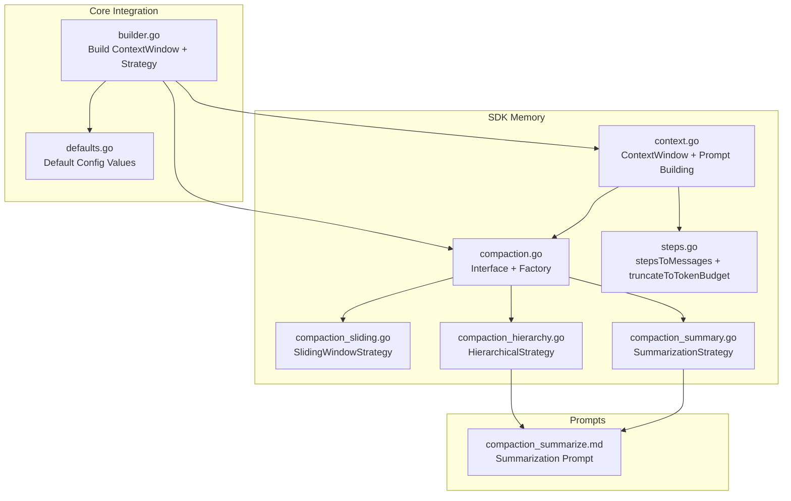
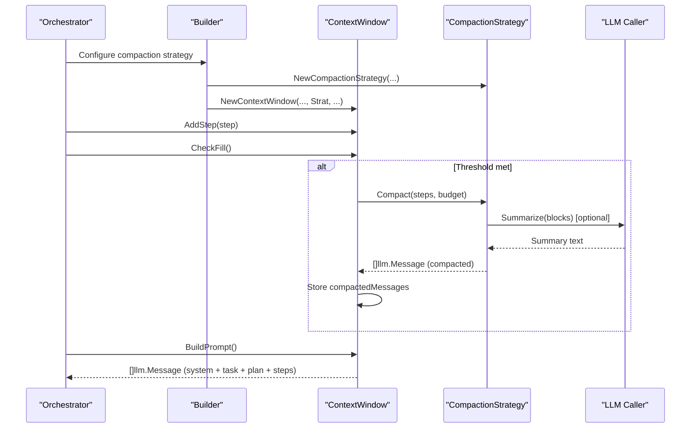
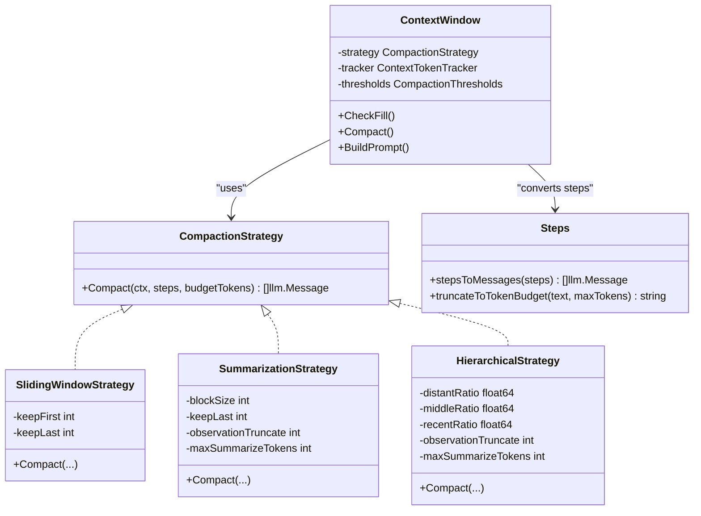

# Context Compaction Strategies

<cite>
**Referenced Files in This Document**
- [compaction.go](file://sdk/memory/compaction.go)
- [compaction_sliding.go](file://sdk/memory/compaction_sliding.go)
- [compaction_summary.go](file://sdk/memory/compaction_summary.go)
- [compaction_hierarchy.go](file://sdk/memory/compaction_hierarchy.go)
- [context.go](file://sdk/memory/context.go)
- [steps.go](file://sdk/memory/steps.go)
- [compaction_test.go](file://sdk/memory/compaction_test.go)
- [context_test.go](file://sdk/memory/context_test.go)
- [builder.go](file://core/builder.go)
- [defaults.go](file://backend/config/defaults.go)
- [compaction_summarize.md](file://core/prompts/compaction_summarize.md)
</cite>

## Table of Contents
1. [Introduction](#introduction)
2. [Project Structure](#project-structure)
3. [Core Components](#core-components)
4. [Architecture Overview](#architecture-overview)
5. [Detailed Component Analysis](#detailed-component-analysis)
6. [Dependency Analysis](#dependency-analysis)
7. [Performance Considerations](#performance-considerations)
8. [Troubleshooting Guide](#troubleshooting-guide)
9. [Conclusion](#conclusion)

## Introduction
This document explains C0WRK’s context compaction strategies for managing long-running agent sessions. It covers the CompactionStrategy interface and three concrete implementations:
- Sliding window compaction
- Summarization-based compaction
- Hierarchical compaction

It also documents token budgeting, step prioritization, compaction decision-making, and trade-offs between memory efficiency and context preservation. Strategy selection guidance and performance characteristics for typical tasks are included.

## Project Structure
The compaction system lives in the SDK memory module and integrates with the orchestrator builder and configuration defaults.

**Diagram sources**
- [compaction.go:1-105](file://sdk/memory/compaction.go#L1-L105)
- [compaction_sliding.go:1-55](file://sdk/memory/compaction_sliding.go#L1-L55)
- [compaction_summary.go:1-153](file://sdk/memory/compaction_summary.go#L1-L153)
- [compaction_hierarchy.go:1-208](file://sdk/memory/compaction_hierarchy.go#L1-L208)
- [context.go:1-438](file://sdk/memory/context.go#L1-L438)
- [steps.go:1-102](file://sdk/memory/steps.go#L1-L102)
- [builder.go:480-540](file://core/builder.go#L480-L540)
- [defaults.go:27-60](file://backend/config/defaults.go#L27-L60)
- [compaction_summarize.md:1-27](file://core/prompts/compaction_summarize.md#L1-L27)

**Section sources**
- [compaction.go:1-105](file://sdk/memory/compaction.go#L1-L105)
- [context.go:1-438](file://sdk/memory/context.go#L1-L438)
- [builder.go:480-540](file://core/builder.go#L480-L540)
- [defaults.go:27-60](file://backend/config/defaults.go#L27-L60)

## Core Components
- CompactionStrategy interface: Defines the contract for compacting step history into a bounded set of messages.
- CompactionConfig: Holds strategy-specific configuration (sliding window, summarization, hierarchical).
- CompactionDeps: External dependencies (token counter, summarizer, max summarization token budget).
- ContextWindow: Manages the LLM context window, tracks token usage, decides when to compact, and builds the final prompt.

Key responsibilities:
- Strategy selection and instantiation
- Token budgeting and truncation
- Step prioritization (preserve recent steps, summarize older ones)
- Decision-making based on fill thresholds

**Section sources**
- [compaction.go:10-105](file://sdk/memory/compaction.go#L10-L105)
- [context.go:27-128](file://sdk/memory/context.go#L27-L128)

## Architecture Overview
The orchestrator constructs a ContextWindow with a chosen CompactionStrategy. During execution, steps are appended and tracked. When fill thresholds are reached, the strategy compacts the step history into a bounded message set. The ContextWindow then builds the final prompt by combining system/task/plan messages with the compacted step messages.

**Diagram sources**
- [builder.go:480-540](file://core/builder.go#L480-L540)
- [context.go:400-438](file://sdk/memory/context.go#L400-L438)
- [compaction.go:44-90](file://sdk/memory/compaction.go#L44-L90)
- [compaction_summary.go:69-128](file://sdk/memory/compaction_summary.go#L69-L128)
- [compaction_hierarchy.go:81-124](file://sdk/memory/compaction_hierarchy.go#L81-L124)

## Detailed Component Analysis

### CompactionStrategy Interface and Factory
- Interface: Compact(ctx, steps, budgetTokens) -> []llm.Message
- Factory: NewCompactionStrategy(name, cfg, deps) selects and constructs a strategy by name, applying defaults for missing values.
- StrategyDisplayName: Human-friendly names for UI/logging.

Implementation highlights:
- SlidingWindowStrategy: Keeps first K and last N steps; inserts a system message summarizing omitted steps.
- SummarizationStrategy: Groups oldest steps into blocks, summarizes each block via LLM, preserves last N steps verbatim.
- HierarchicalStrategy: Divides steps into three zones (distant, middle, recent) with different compression levels; recent zone preserved verbatim.

**Section sources**
- [compaction.go:10-105](file://sdk/memory/compaction.go#L10-L105)
- [compaction_sliding.go:11-55](file://sdk/memory/compaction_sliding.go#L11-L55)
- [compaction_summary.go:13-153](file://sdk/memory/compaction_summary.go#L13-L153)
- [compaction_hierarchy.go:14-208](file://sdk/memory/compaction_hierarchy.go#L14-L208)

### Sliding Window Strategy
Behavior:
- If total steps ≤ keepFirst + keepLast, convert all steps to messages.
- Otherwise:
  - Keep first K steps
  - Insert a system message summarizing the omitted middle steps
  - Keep last N steps

Trade-offs:
- Memory efficient for very long histories
- Loses granular details of middle steps
- Fast, no LLM calls

Parameters:
- keepFirst, keepLast (configured via CompactionConfig.SlidingWindow)

**Section sources**
- [compaction_sliding.go:11-55](file://sdk/memory/compaction_sliding.go#L11-L55)
- [compaction.go:17-20](file://sdk/memory/compaction.go#L17-L20)

### Summarization Strategy
Behavior:
- If total steps ≤ keepLast, convert all steps to messages.
- Otherwise:
  - Summarize oldest steps in blocks of blockSize
  - Preserve last N steps verbatim
  - Each block becomes a single system message

Token budgeting:
- Builds a block text from steps
- Optionally truncates to maxSummarizeTokens using a conservative character-to-token estimate
- Calls the provided Summarize function (via Deps)

Fallbacks:
- If Summarize fails, emits a placeholder summary
- If Summarize is nil, emits a placeholder summary

Parameters:
- blockSize, keepLast, observationTruncate, MaxSummarizeTokens, TokenCounter

**Section sources**
- [compaction_summary.go:13-153](file://sdk/memory/compaction_summary.go#L13-L153)
- [steps.go:92-102](file://sdk/memory/steps.go#L92-L102)
- [compaction.go:33-42](file://sdk/memory/compaction.go#L33-L42)

### Hierarchical Strategy
Behavior:
- Divides steps into three zones:
  - Distant (oldest): large blocks (~15 steps per summary)
  - Middle: medium blocks (~5 steps per summary)
  - Recent: preserved verbatim
- Normalizes ratios if not summing to 1.0
- Uses a dedicated system prompt for summarization

Token budgeting:
- Same truncation logic as summarization strategy
- Zone-specific observation truncation (distant zone truncates more aggressively)

Fallbacks:
- If Summarize fails, emits a placeholder summary
- If Summarize is nil, emits a placeholder summary

Parameters:
- DistantRatio, MiddleRatio, RecentRatio, observationTruncate, MaxSummarizeTokens, TokenCounter

**Section sources**
- [compaction_hierarchy.go:14-208](file://sdk/memory/compaction_hierarchy.go#L14-L208)
- [steps.go:92-102](file://sdk/memory/steps.go#L92-L102)
- [compaction.go:33-42](file://sdk/memory/compaction.go#L33-L42)

### ContextWindow: Token Budgeting and Decision-Making
Responsibilities:
- Tracks token usage via ContextTokenTracker
- Computes effective max as context window minus output limit minus safety margin
- Provides fill checks (predictive, warning, emergency, reject)
- Builds final prompt in priority order: system, user task, system plan, step messages
- Applies tool output pruning to reduce noise while preserving critical results

Compaction decision-making:
- CheckFill() returns status based on fill percent versus thresholds
- Compact() invokes strategy with EffectiveMax() as the budget and stores compacted messages

Step prioritization:
- Recent steps are preserved verbatim by strategies
- Tool output pruning protects recent tool results and specific tools

**Section sources**
- [context.go:27-128](file://sdk/memory/context.go#L27-L128)
- [context.go:167-200](file://sdk/memory/context.go#L167-L200)
- [context.go:208-388](file://sdk/memory/context.go#L208-L388)
- [context.go:400-438](file://sdk/memory/context.go#L400-L438)

### Integration and Configuration
- Builder constructs ContextWindow with a CompactionStrategy and passes a Summarize function that calls the LLM router with a dedicated system prompt for summarization.
- Defaults are applied for compaction parameters and thresholds.

**Section sources**
- [builder.go:480-540](file://core/builder.go#L480-L540)
- [defaults.go:27-60](file://backend/config/defaults.go#L27-L60)
- [compaction_summarize.md:1-27](file://core/prompts/compaction_summarize.md#L1-L27)

## Dependency Analysis

**Diagram sources**
- [compaction.go:10-105](file://sdk/memory/compaction.go#L10-L105)
- [compaction_sliding.go:11-55](file://sdk/memory/compaction_sliding.go#L11-L55)
- [compaction_summary.go:13-153](file://sdk/memory/compaction_summary.go#L13-L153)
- [compaction_hierarchy.go:14-208](file://sdk/memory/compaction_hierarchy.go#L14-L208)
- [context.go:27-128](file://sdk/memory/context.go#L27-L128)
- [steps.go:10-102](file://sdk/memory/steps.go#L10-L102)

**Section sources**
- [compaction.go:10-105](file://sdk/memory/compaction.go#L10-L105)
- [context.go:27-128](file://sdk/memory/context.go#L27-L128)

## Performance Considerations
- Memory efficiency:
  - Sliding window: O(1) extra messages beyond first/last segments; minimal overhead.
  - Summarization: Adds LLM calls proportional to number of blocks; higher latency.
  - Hierarchical: Balances compression across zones; moderate LLM cost.
- Token budgeting:
  - Strategies truncate blocks conservatively to stay under maxSummarizeTokens.
  - ContextWindow uses EffectiveMax() as the compaction budget.
- Throughput:
  - Sliding window fastest; summarization slowest; hierarchical in between.
- Accuracy of context preservation:
  - Hierarchical preserves recent steps verbatim and summarizes zones differently, offering the best balance for long runs.

[No sources needed since this section provides general guidance]

## Troubleshooting Guide
Common issues and remedies:
- Summarization failures:
  - Strategies fall back to placeholder summaries when Summarize returns an error.
  - Ensure the Summarize function is provided and reachable.
- Excessive truncation:
  - If blocks are frequently truncated, consider increasing MaxSummarizeTokens or reducing observationTruncate.
- Tool output pruning:
  - Adjust KeepLastN and ProtectedTools to retain critical tool results.
- Context overflow:
  - Increase context window or adjust thresholds; verify EffectiveMax() calculations.

**Section sources**
- [compaction_summary.go:102-114](file://sdk/memory/compaction_summary.go#L102-L114)
- [compaction_hierarchy.go:154-165](file://sdk/memory/compaction_hierarchy.go#L154-L165)
- [context.go:328-388](file://sdk/memory/context.go#L328-L388)

## Strategy Selection Guidance and Trade-offs

### When to use Sliding Window
- Long histories where memory pressure is severe and recent steps are sufficient.
- Low-latency requirement; no LLM calls.
- Trade-off: Loses details of middle steps.

**Section sources**
- [compaction_sliding.go:11-55](file://sdk/memory/compaction_sliding.go#L11-L55)

### When to use Summarization
- Moderate histories; want to preserve more detail than sliding window.
- Need a single summary per block of steps.
- Trade-off: LLM calls incur latency and cost; depends on Summarize availability.

**Section sources**
- [compaction_summary.go:13-153](file://sdk/memory/compaction_summary.go#L13-L153)

### When to use Hierarchical
- Very long histories; want fine-grained compression with recent steps preserved.
- Different compression levels across time: distant (aggressive), middle (moderate), recent (verbatim).
- Trade-off: More LLM calls than sliding window; still faster than pure summarization for very long runs.

**Section sources**
- [compaction_hierarchy.go:14-208](file://sdk/memory/compaction_hierarchy.go#L14-L208)

### Performance Characteristics by Task Type
- Short, focused tasks: Sliding window often adequate; minimal overhead.
- Medium-length iterative tasks: Summarization reduces noise while keeping recent steps useful.
- Long-running exploratory tasks: Hierarchical balances memory and context preservation effectively.

[No sources needed since this section provides general guidance]

## Implementation Details: Token Budgeting, Step Prioritization, and Decision-Making

### Token Budgeting
- ContextWindow computes EffectiveMax() by subtracting output limit and safety margin from the model’s context window.
- Strategies receive EffectiveMax() as the budget for compaction.
- Block truncation uses a conservative character-to-token estimate to ensure summaries fit within maxSummarizeTokens.

**Section sources**
- [context.go:76-81](file://sdk/memory/context.go#L76-L81)
- [context.go:409-410](file://sdk/memory/context.go#L409-L410)
- [steps.go:92-102](file://sdk/memory/steps.go#L92-L102)

### Step Prioritization
- Strategies preserve recent steps (keepLast) verbatim.
- Summarization: oldest steps grouped into blocks; recent steps appended after summaries.
- Hierarchical: recent zone preserved verbatim; distant/middle zones summarized with different block sizes.
- ContextWindow: applies tool output pruning to reduce noise while protecting recent tool results and specific tools.

**Section sources**
- [compaction_summary.go:69-128](file://sdk/memory/compaction_summary.go#L69-L128)
- [compaction_hierarchy.go:81-124](file://sdk/memory/compaction_hierarchy.go#L81-L124)
- [context.go:328-388](file://sdk/memory/context.go#L328-L388)

### Compaction Decision-Making
- ContextWindow.CheckFill() determines whether to compact based on fill percent versus thresholds.
- Statuses: ok, compact, warning, emergency, reject.
- Compact() invokes strategy and stores compacted messages to avoid recomputation until new steps arrive.

**Section sources**
- [context.go:106-128](file://sdk/memory/context.go#L106-L128)
- [context.go:400-438](file://sdk/memory/context.go#L400-L438)

## Conclusion
C0WRK’s compaction system offers three complementary strategies to manage context length while preserving essential information. Sliding window is fast and memory-efficient for short runs; summarization balances detail and memory for medium runs; hierarchical provides nuanced compression for long runs. Together with robust token budgeting, step prioritization, and decision-making, the system adapts to diverse task types and performance requirements.