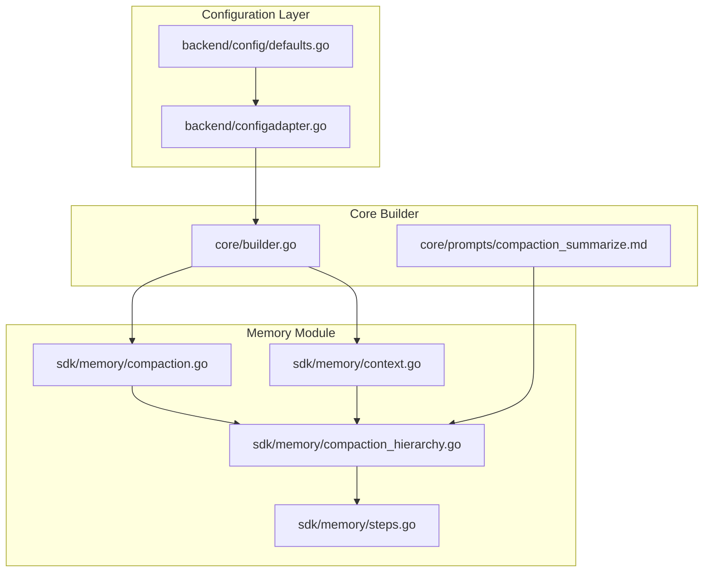
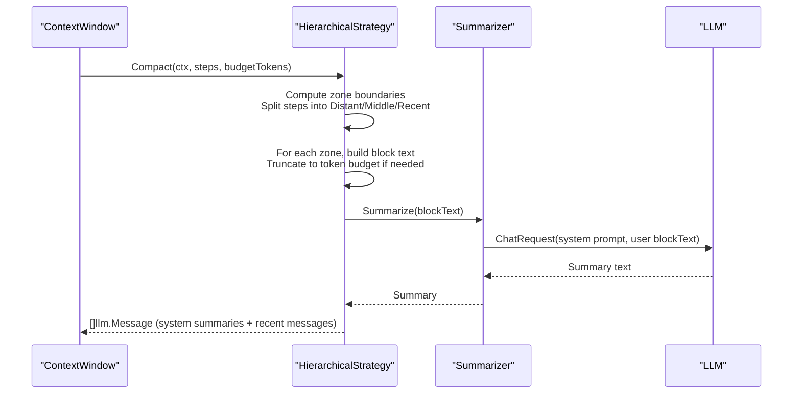
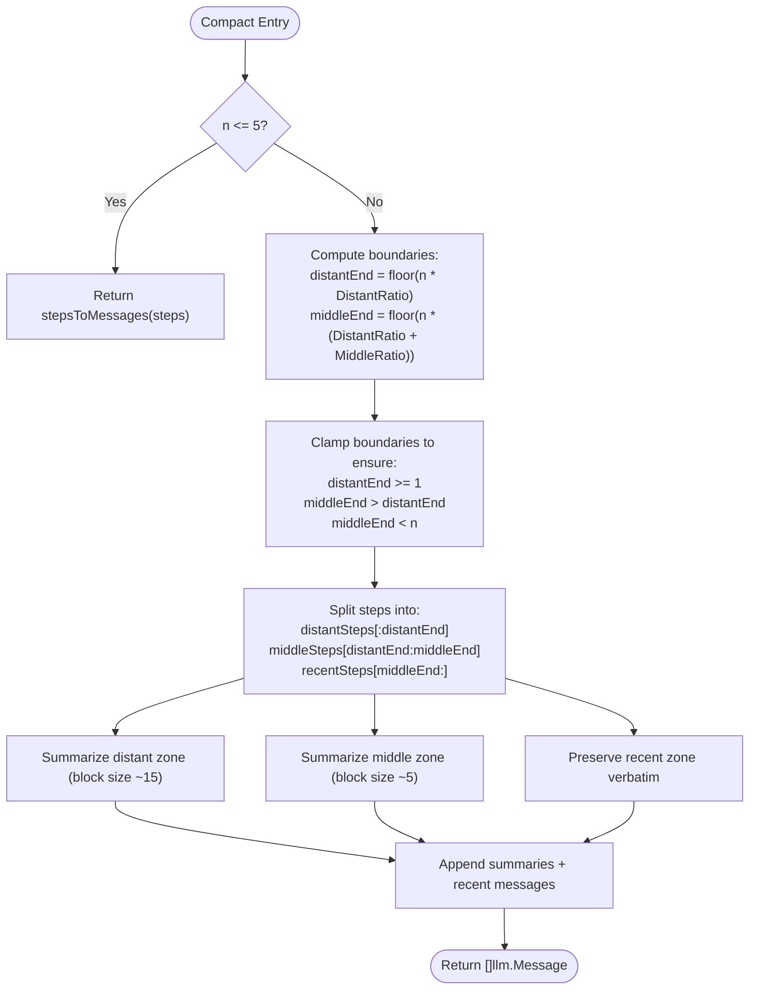
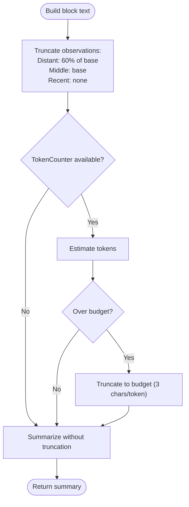
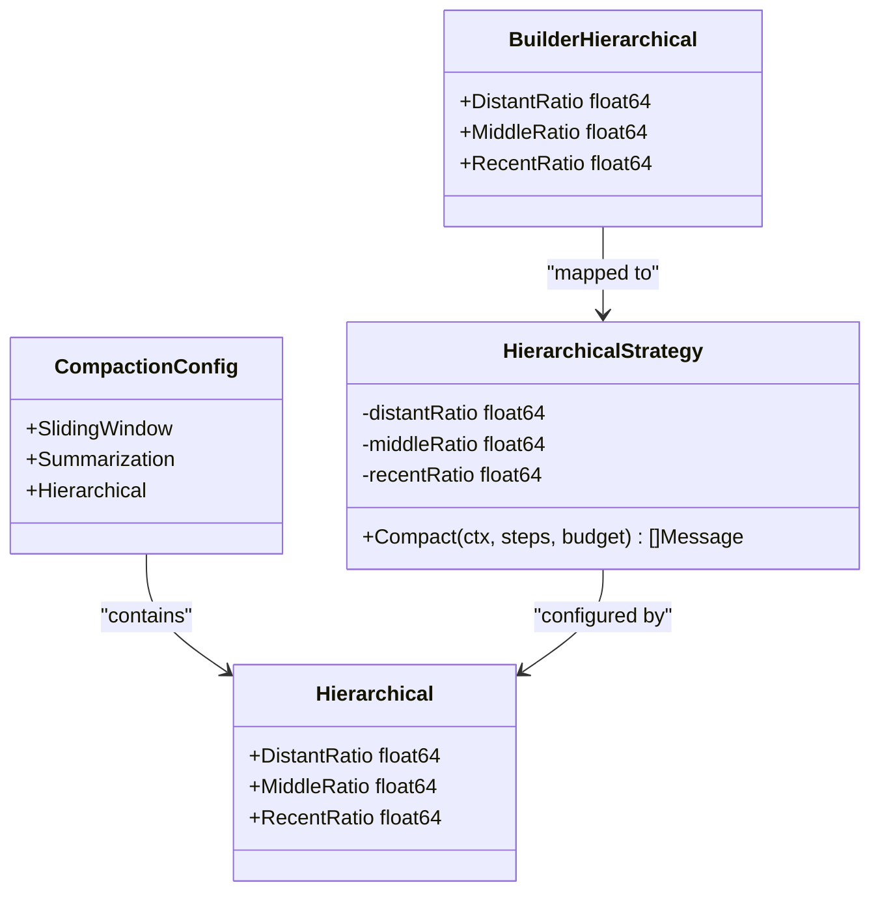
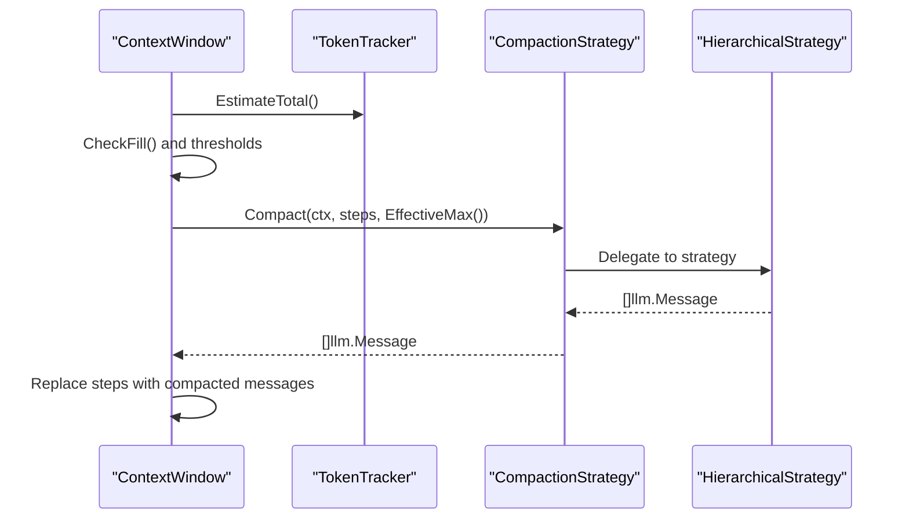
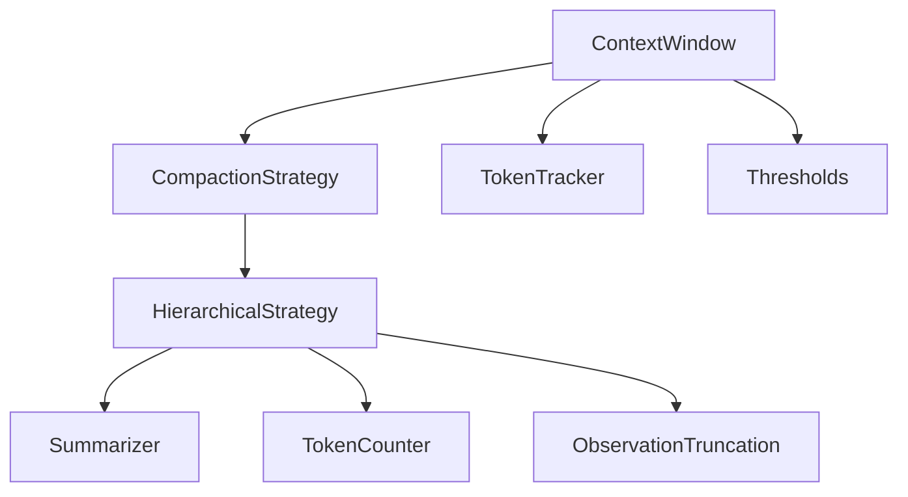

# Hierarchical Strategy

<cite>
**Referenced Files in This Document**
- [compaction.go](file://sdk/memory/compaction.go)
- [compaction_hierarchy.go](file://sdk/memory/compaction_hierarchy.go)
- [context.go](file://sdk/memory/context.go)
- [steps.go](file://sdk/memory/steps.go)
- [compaction_test.go](file://sdk/memory/compaction_test.go)
- [defaults.go](file://backend/config/defaults.go)
- [configadapter.go](file://backend/configadapter.go)
- [builder.go](file://core/builder.go)
- [compaction_summarize.md](file://core/prompts/compaction_summarize.md)
</cite>

## Table of Contents
1. [Introduction](#introduction)
2. [Project Structure](#project-structure)
3. [Core Components](#core-components)
4. [Architecture Overview](#architecture-overview)
5. [Detailed Component Analysis](#detailed-component-analysis)
6. [Dependency Analysis](#dependency-analysis)
7. [Performance Considerations](#performance-considerations)
8. [Troubleshooting Guide](#troubleshooting-guide)
9. [Conclusion](#conclusion)

## Introduction
This document explains the Hierarchical compaction strategy, a multi-level approach that applies different compression ratios to three temporal regions of agent execution history: Distant (oldest), Middle (intermediate), and Recent (most recent). It documents how DistantRatio, MiddleRatio, and RecentRatio determine which steps are preserved verbatim versus summarized, and how the strategy balances memory efficiency with context retention. It also provides practical examples of ratio configurations, their effects on memory usage and context retention, and guidelines for tuning ratios based on task characteristics and available memory budgets.

## Project Structure
The hierarchical strategy is implemented in the memory module and integrated into the broader context window management system. Configuration flows from backend configuration through adapters into the core builder, which constructs the ContextWindow and compaction strategy.

**Diagram sources**
- [defaults.go:43-51](file://backend/config/defaults.go#L43-L51)
- [configadapter.go:79-83](file://backend/configadapter.go#L79-L83)
- [builder.go:501-505](file://core/builder.go#L501-L505)
- [compaction_hierarchy.go:14-27](file://sdk/memory/compaction_hierarchy.go#L14-L27)
- [compaction.go:69-86](file://sdk/memory/compaction.go#L69-L86)
- [context.go:53-74](file://sdk/memory/context.go#L53-L74)
- [steps.go:10-102](file://sdk/memory/steps.go#L10-L102)
- [compaction_summarize.md:1-27](file://core/prompts/compaction_summarize.md#L1-L27)

**Section sources**
- [defaults.go:43-51](file://backend/config/defaults.go#L43-L51)
- [configadapter.go:79-83](file://backend/configadapter.go#L79-L83)
- [builder.go:501-505](file://core/builder.go#L501-L505)
- [compaction_hierarchy.go:14-27](file://sdk/memory/compaction_hierarchy.go#L14-L27)
- [compaction.go:69-86](file://sdk/memory/compaction.go#L69-L86)
- [context.go:53-74](file://sdk/memory/context.go#L53-L74)
- [steps.go:10-102](file://sdk/memory/steps.go#L10-L102)
- [compaction_summarize.md:1-27](file://core/prompts/compaction_summarize.md#L1-L27)

## Core Components
- HierarchicalStrategy: Implements the multi-level compaction by dividing steps into three zones and applying different compression behaviors per zone.
- CompactionConfig and CompactionDeps: Provide configuration and dependencies for compaction strategies, including Hierarchical parameters.
- ContextWindow: Manages the LLM context window, tracks token usage, and triggers compaction using the selected strategy.
- stepsToMessages: Converts raw steps into assistant/tool messages when preserving recent steps verbatim.

Key responsibilities:
- HierarchicalStrategy: Normalizes ratios, computes zone boundaries, builds block texts, truncates to token budget, and summarizes blocks.
- ContextWindow: Determines when compaction is needed, computes token budget, and executes the strategy.
- stepsToMessages: Ensures recent steps are preserved as assistant/tool messages.

**Section sources**
- [compaction_hierarchy.go:14-27](file://sdk/memory/compaction_hierarchy.go#L14-L27)
- [compaction.go:15-42](file://sdk/memory/compaction.go#L15-L42)
- [context.go:27-43](file://sdk/memory/context.go#L27-L43)
- [steps.go:10-102](file://sdk/memory/steps.go#L10-L102)

## Architecture Overview
The hierarchical strategy sits between the ContextWindow and the LLM summarizer. It receives the step history, budget tokens, and a summarizer callback, then produces a reduced set of messages that include system summaries for distant/middle zones and preserved messages for the recent zone.

**Diagram sources**
- [context.go:402-437](file://sdk/memory/context.go#L402-L437)
- [compaction_hierarchy.go:77-124](file://sdk/memory/compaction_hierarchy.go#L77-L124)
- [compaction_hierarchy.go:126-176](file://sdk/memory/compaction_hierarchy.go#L126-L176)
- [compaction_summarize.md:1-27](file://core/prompts/compaction_summarize.md#L1-L27)

## Detailed Component Analysis

### HierarchicalStrategy Implementation
The strategy divides the step history into three zones:
- Distant (oldest): Aggressive summarization with large blocks (~15 steps per summary).
- Middle (intermediate): Moderate summarization with smaller blocks (~5 steps per summary).
- Recent (most recent): Preserved verbatim as assistant/tool messages.

Normalization ensures ratios sum to 1.0 if provided values do not already sum to 1.0. Zone boundaries are computed using floating-point arithmetic and clamped to ensure at least minimal coverage in each zone when possible.

**Diagram sources**
- [compaction_hierarchy.go:77-124](file://sdk/memory/compaction_hierarchy.go#L77-L124)
- [steps.go:16-90](file://sdk/memory/steps.go#L16-L90)

**Section sources**
- [compaction_hierarchy.go:77-124](file://sdk/memory/compaction_hierarchy.go#L77-L124)
- [steps.go:16-90](file://sdk/memory/steps.go#L16-L90)

### Ratio Distribution and Mathematical Basis
- Normalization: If DistantRatio + MiddleRatio + RecentRatio does not equal 1.0, each ratio is divided by the total to normalize.
- Zone sizes: For n steps, the Distant zone covers approximately DistantRatio * n steps, Middle covers approximately MiddleRatio * n steps, and Recent covers the remainder.
- Block sizes: Distant uses ~15 steps per block; Middle uses ~5 steps per block; Recent is preserved verbatim.

Behavioral implications:
- Memory efficiency: Distant and Middle zones reduce token usage by summarizing older steps.
- Context retention: Recent zone preserves the most relevant context for immediate reasoning.

**Section sources**
- [compaction_hierarchy.go:46-57](file://sdk/memory/compaction_hierarchy.go#L46-L57)
- [compaction_hierarchy.go:89-102](file://sdk/memory/compaction_hierarchy.go#L89-L102)
- [compaction_hierarchy.go:113-118](file://sdk/memory/compaction_hierarchy.go#L113-L118)

### Observations Truncation and Token Budget
- Observation truncation: Distant zone observations are truncated to 60% of the base truncation length; Middle zone uses the base truncation length; Recent zone preserves observations as-is.
- Token budget truncation: If a block’s estimated token count exceeds maxSummarizeTokens, the block text is truncated conservatively (3 chars per token) before summarization.

**Diagram sources**
- [compaction_hierarchy.go:178-207](file://sdk/memory/compaction_hierarchy.go#L178-L207)
- [steps.go:92-101](file://sdk/memory/steps.go#L92-L101)

**Section sources**
- [compaction_hierarchy.go:178-207](file://sdk/memory/compaction_hierarchy.go#L178-L207)
- [steps.go:92-101](file://sdk/memory/steps.go#L92-L101)

### Configuration and Defaults
- Backend defaults: Hierarchical ratios default to 0.4, 0.3, 0.3 respectively when not configured.
- Adapter mapping: Configuration values are mapped from backend config to core builder config.
- Strategy factory: The factory creates a HierarchicalStrategy with normalized ratios and default fallbacks.

**Diagram sources**
- [compaction.go:15-31](file://sdk/memory/compaction.go#L15-L31)
- [defaults.go:43-51](file://backend/config/defaults.go#L43-L51)
- [configadapter.go:79-83](file://backend/configadapter.go#L79-L83)
- [builder.go:501-505](file://core/builder.go#L501-L505)
- [compaction_hierarchy.go:18-27](file://sdk/memory/compaction_hierarchy.go#L18-L27)

**Section sources**
- [defaults.go:43-51](file://backend/config/defaults.go#L43-L51)
- [configadapter.go:79-83](file://backend/configadapter.go#L79-L83)
- [builder.go:501-505](file://core/builder.go#L501-L505)
- [compaction.go:69-86](file://sdk/memory/compaction.go#L69-L86)

### ContextWindow Integration
- ContextWindow manages token tracking and determines when compaction is needed based on fill percentage thresholds.
- Compact invokes the strategy with the effective maximum as the budget and replaces the step history with the compacted messages.

**Diagram sources**
- [context.go:83-128](file://sdk/memory/context.go#L83-L128)
- [context.go:402-437](file://sdk/memory/context.go#L402-L437)

**Section sources**
- [context.go:83-128](file://sdk/memory/context.go#L83-L128)
- [context.go:402-437](file://sdk/memory/context.go#L402-L437)

## Dependency Analysis
- HierarchicalStrategy depends on:
  - Summarizer callback for producing summaries.
  - TokenCounter for estimating and truncating block text to budget.
  - Observation truncation parameter for controlling observation length.
- ContextWindow depends on:
  - Strategy interface for compaction.
  - TokenTracker for fill estimation and budget computation.
  - Thresholds for triggering compaction.

**Diagram sources**
- [compaction_hierarchy.go:23-26](file://sdk/memory/compaction_hierarchy.go#L23-L26)
- [context.go:28-43](file://sdk/memory/context.go#L28-L43)

**Section sources**
- [compaction_hierarchy.go:23-26](file://sdk/memory/compaction_hierarchy.go#L23-L26)
- [context.go:28-43](file://sdk/memory/context.go#L28-L43)

## Performance Considerations
- Memory efficiency: Larger blocks in the Distant zone reduce token usage more aggressively than the Middle zone, which in turn reduces usage compared to preserving all steps verbatim.
- Computational overhead: Summarization calls scale with the number of blocks. Distant zone typically yields fewer, larger blocks; Middle zone yields more, smaller blocks; Recent zone yields no summarization overhead.
- Token budgeting: Conservative truncation (3 chars per token) helps avoid exceeding maxSummarizeTokens, reducing retries and failures.
- Observation truncation: More aggressive truncation in the Distant zone reduces noise and improves summarization quality for older steps.

[No sources needed since this section provides general guidance]

## Troubleshooting Guide
Common issues and remedies:
- Summarization failures: The strategy logs errors and falls back to a placeholder summary. Ensure the summarizer is available and responsive.
- Excessive truncation: If blocks are frequently truncated, consider increasing maxSummarizeTokens or reducing observation truncation.
- Insufficient recent context: Increase RecentRatio to preserve more recent steps verbatim.
- Misaligned ratios: If ratios do not sum to 1.0, the strategy normalizes them automatically; verify intended distribution.

**Section sources**
- [compaction_hierarchy.go:154-165](file://sdk/memory/compaction_hierarchy.go#L154-L165)
- [steps.go:92-101](file://sdk/memory/steps.go#L92-L101)

## Conclusion
The Hierarchical compaction strategy provides a principled, mathematically grounded approach to managing long execution histories. By applying different compression levels across Distant, Middle, and Recent zones—guided by DistantRatio, MiddleRatio, and RecentRatio—it preserves the most relevant context while significantly reducing memory usage. Proper configuration of ratios, token budgets, and observation truncation enables efficient and reliable operation across diverse tasks and memory constraints.