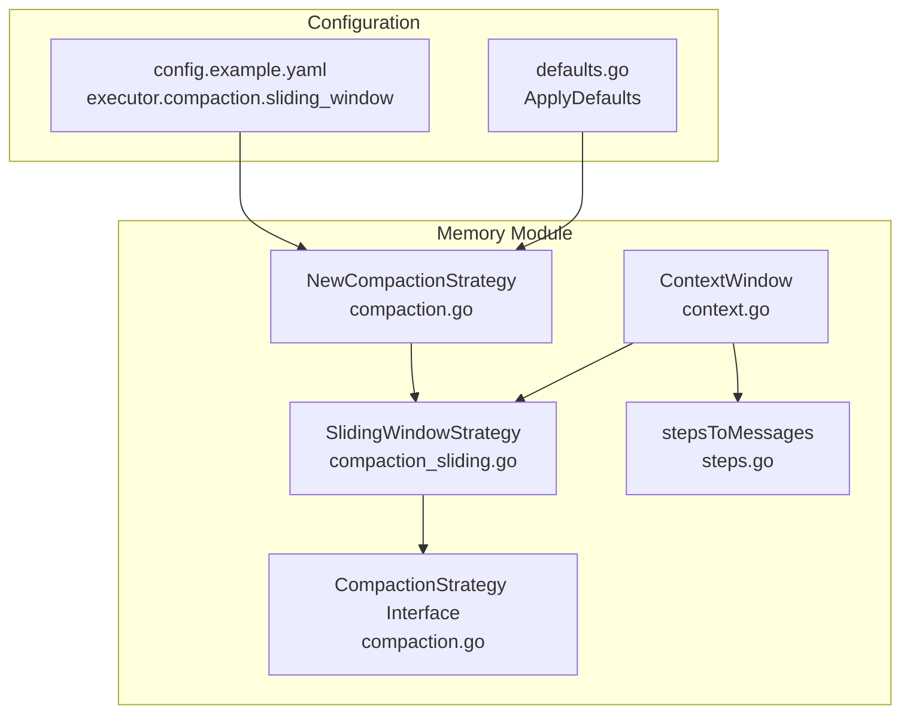
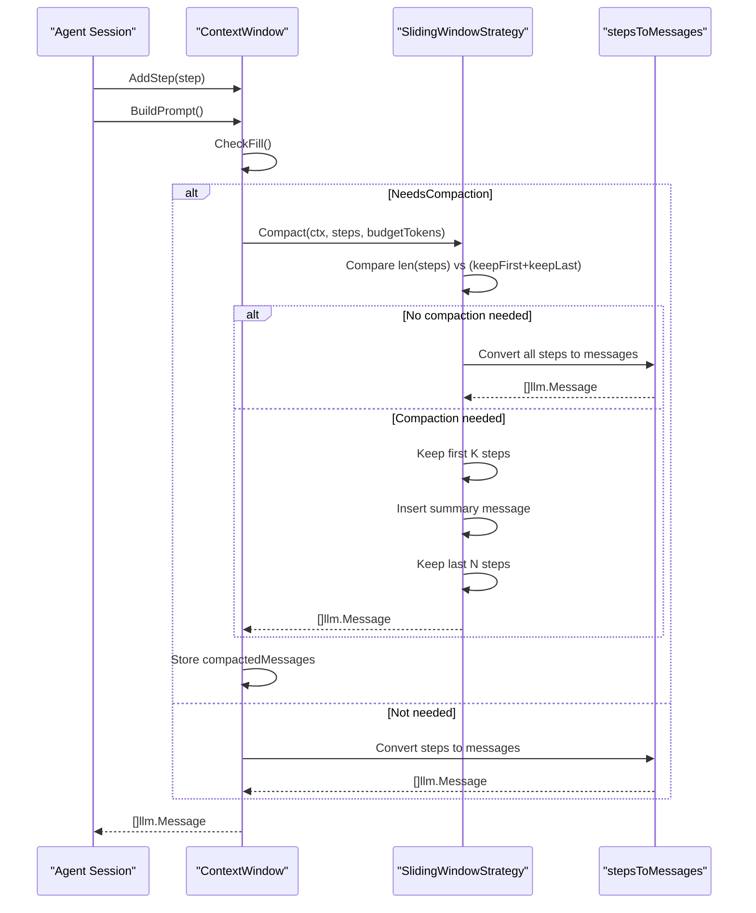
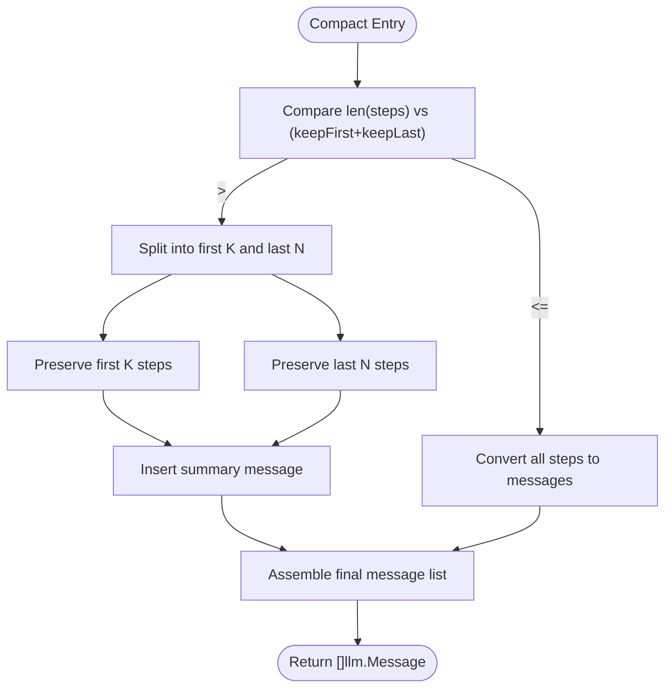
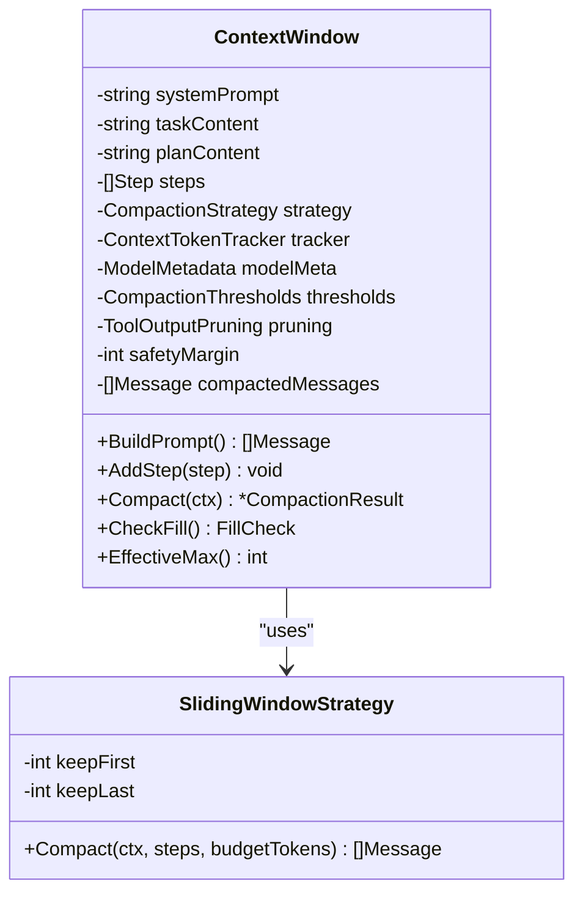
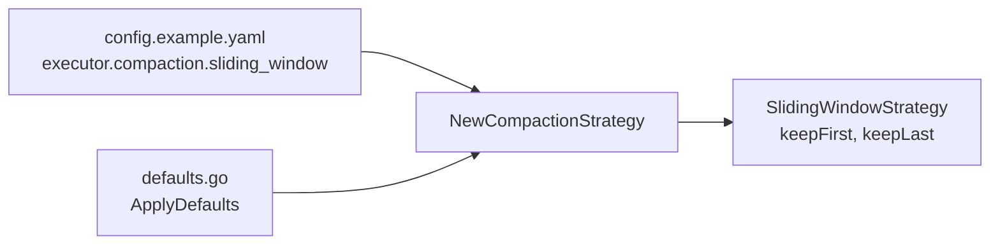
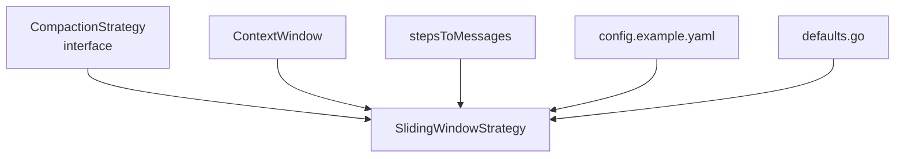

# Sliding Window Strategy

<cite>
**Referenced Files in This Document**
- [compaction_sliding.go](file://sdk/memory/compaction_sliding.go)
- [compaction.go](file://sdk/memory/compaction.go)
- [context.go](file://sdk/memory/context.go)
- [steps.go](file://sdk/memory/steps.go)
- [compaction_test.go](file://sdk/memory/compaction_test.go)
- [context_test.go](file://sdk/memory/context_test.go)
- [config.example.yaml](file://config.example.yaml)
- [defaults.go](file://backend/config/defaults.go)
</cite>

## Table of Contents
1. [Introduction](#introduction)
2. [Project Structure](#project-structure)
3. [Core Components](#core-components)
4. [Architecture Overview](#architecture-overview)
5. [Detailed Component Analysis](#detailed-component-analysis)
6. [Dependency Analysis](#dependency-analysis)
7. [Performance Considerations](#performance-considerations)
8. [Troubleshooting Guide](#troubleshooting-guide)
9. [Conclusion](#conclusion)
10. [Appendices](#appendices)

## Introduction
The Sliding Window compaction strategy maintains a fixed-size window of recent steps by preserving a specified number of initial and final steps while discarding the middle portion. It inserts a concise summary message indicating how many intermediate steps were omitted. This approach provides predictable memory usage and minimal computational overhead, making it ideal for short tasks or environments with constrained computational resources.

## Project Structure
The Sliding Window strategy is implemented within the memory subsystem and integrates with the broader context window management system.

**Diagram sources**
- [compaction_sliding.go:11-55](file://sdk/memory/compaction_sliding.go#L11-L55)
- [compaction.go:10-90](file://sdk/memory/compaction.go#L10-L90)
- [context.go:27-438](file://sdk/memory/context.go#L27-L438)
- [steps.go:10-90](file://sdk/memory/steps.go#L10-L90)
- [config.example.yaml:86-114](file://config.example.yaml#L86-L114)
- [defaults.go:27-60](file://backend/config/defaults.go#L27-L60)

**Section sources**
- [compaction_sliding.go:11-55](file://sdk/memory/compaction_sliding.go#L11-L55)
- [compaction.go:10-90](file://sdk/memory/compaction.go#L10-L90)
- [context.go:27-438](file://sdk/memory/context.go#L27-L438)
- [steps.go:10-90](file://sdk/memory/steps.go#L10-L90)
- [config.example.yaml:86-114](file://config.example.yaml#L86-L114)
- [defaults.go:27-60](file://backend/config/defaults.go#L27-L60)

## Core Components
- SlidingWindowStrategy: Implements the compaction algorithm that preserves K initial steps and N final steps, inserting a summary message for omitted steps.
- ContextWindow: Manages the LLM context window, tracks token usage, and applies compaction strategies.
- stepsToMessages: Converts individual steps into assistant/tool messages for inclusion in prompts.
- NewCompactionStrategy: Factory that constructs the Sliding Window strategy from configuration.

Key configuration parameters:
- KeepFirst: Number of initial steps to preserve.
- KeepLast: Number of final steps to preserve.

**Section sources**
- [compaction_sliding.go:11-55](file://sdk/memory/compaction_sliding.go#L11-L55)
- [context.go:27-438](file://sdk/memory/context.go#L27-L438)
- [steps.go:10-90](file://sdk/memory/steps.go#L10-L90)
- [compaction.go:15-31](file://sdk/memory/compaction.go#L15-L31)

## Architecture Overview
The Sliding Window strategy operates during context compaction when the context window approaches configured thresholds. It transforms step history into a compact representation while maintaining essential context.

**Diagram sources**
- [context.go:400-438](file://sdk/memory/context.go#L400-L438)
- [compaction_sliding.go:25-54](file://sdk/memory/compaction_sliding.go#L25-L54)
- [steps.go:10-90](file://sdk/memory/steps.go#L10-L90)

## Detailed Component Analysis

### SlidingWindowStrategy Implementation
The strategy maintains a fixed-size window by:
- Preserving the first K steps (2 messages each: assistant + tool)
- Inserting a single system message indicating omitted steps
- Preserving the last N steps (2 messages each: assistant + tool)

Algorithm characteristics:
- Linear time complexity O(n) where n is the number of steps
- Minimal computational overhead: simple slicing and concatenation
- Memory footprint proportional to K + N plus a constant summary message

**Diagram sources**
- [compaction_sliding.go:25-54](file://sdk/memory/compaction_sliding.go#L25-L54)

**Section sources**
- [compaction_sliding.go:11-55](file://sdk/memory/compaction_sliding.go#L11-L55)
- [compaction_sliding.go:25-54](file://sdk/memory/compaction_sliding.go#L25-L54)

### ContextWindow Integration
ContextWindow coordinates compaction timing and applies the strategy:
- Tracks token usage and determines when compaction is needed
- Uses effective context window (context window minus output limit minus safety margin)
- Stores compacted messages to avoid recomputation
- Clears compacted messages when new steps are added

**Diagram sources**
- [context.go:27-438](file://sdk/memory/context.go#L27-L438)
- [compaction_sliding.go:11-55](file://sdk/memory/compaction_sliding.go#L11-L55)

**Section sources**
- [context.go:27-438](file://sdk/memory/context.go#L27-L438)

### Configuration and Defaults
Configuration is provided via YAML and defaults:
- YAML: executor.compaction.sliding_window.keep_first, keep_last
- Defaults: KeepFirst=3, KeepLast=10 when not configured

**Diagram sources**
- [config.example.yaml:86-114](file://config.example.yaml#L86-L114)
- [defaults.go:27-60](file://backend/config/defaults.go#L27-L60)
- [compaction.go:44-90](file://sdk/memory/compaction.go#L44-L90)

**Section sources**
- [config.example.yaml:86-114](file://config.example.yaml#L86-L114)
- [defaults.go:27-60](file://backend/config/defaults.go#L27-L60)
- [compaction.go:44-90](file://sdk/memory/compaction.go#L44-L90)

## Dependency Analysis
The Sliding Window strategy depends on:
- CompactionStrategy interface for pluggable algorithms
- ContextWindow for timing and budget management
- stepsToMessages for step-to-message conversion
- Configuration system for KeepFirst/KeepLast parameters

**Diagram sources**
- [compaction.go:10-13](file://sdk/memory/compaction.go#L10-L13)
- [compaction_sliding.go:11-15](file://sdk/memory/compaction_sliding.go#L11-L15)
- [context.go:27-438](file://sdk/memory/context.go#L27-L438)
- [steps.go:10-90](file://sdk/memory/steps.go#L10-L90)
- [config.example.yaml:86-114](file://config.example.yaml#L86-L114)
- [defaults.go:27-60](file://backend/config/defaults.go#L27-L60)

**Section sources**
- [compaction.go:10-13](file://sdk/memory/compaction.go#L10-L13)
- [compaction_sliding.go:11-15](file://sdk/memory/compaction_sliding.go#L11-L15)
- [context.go:27-438](file://sdk/memory/context.go#L27-L438)
- [steps.go:10-90](file://sdk/memory/steps.go#L10-L90)
- [config.example.yaml:86-114](file://config.example.yaml#L86-L114)
- [defaults.go:27-60](file://backend/config/defaults.go#L27-L60)

## Performance Considerations
- Time complexity: O(n) where n is the number of steps
- Space complexity: O(K + N) messages stored post-compaction
- Computational overhead: Minimal—simple array slicing and concatenation
- Memory usage: Proportional to preserved steps plus a constant summary message
- Token estimation: Uses conservative approximations for budget calculations

When to use:
- Short tasks with limited steps
- Environments with constrained computational resources
- Scenarios where immediate context is more valuable than historical detail
- Systems requiring predictable memory usage

## Troubleshooting Guide
Common scenarios and resolutions:
- No compaction occurs: Verify steps <= keepFirst + keepLast
- Excessive memory usage: Increase keepLast to preserve more recent context
- Insufficient context: Decrease keepLast or increase keepFirst
- Configuration not taking effect: Ensure YAML values are set and defaults are not overriding them

Validation examples:
- Sliding Window compaction preserves first and last steps while summarizing the middle
- No compaction when within budget thresholds
- ContextWindow correctly estimates token usage and triggers compaction

**Section sources**
- [compaction_test.go:140-215](file://sdk/memory/compaction_test.go#L140-L215)
- [context_test.go:139-247](file://sdk/memory/context_test.go#L139-L247)

## Conclusion
The Sliding Window compaction strategy offers a simple, efficient mechanism for managing context memory by preserving critical initial and final steps while summarizing intermediate steps. Its linear-time complexity and minimal overhead make it well-suited for resource-constrained environments and short tasks, while configurable parameters allow tuning for specific use cases.

## Appendices

### Configuration Examples
- YAML configuration path: executor.compaction.sliding_window
- Default values: keep_first=3, keep_last=10
- Example values for different scenarios:
  - Conservative: keep_first=5, keep_last=15
  - Aggressive: keep_first=2, keep_last=8
  - Minimal: keep_first=1, keep_last=5

### Performance Benchmarks (Conceptual)
- Time complexity: O(n) for n steps
- Memory usage: O(K + N) messages post-compaction
- Overhead: Negligible compared to other strategies
- Comparison to alternatives:
  - Summarization: Higher computational cost, better long-term retention
  - Hierarchical: Moderate cost, three-zone retention

### Best Practices
- Choose keepFirst/keepLast based on task complexity and available context
- Monitor context fill percentages to tune thresholds
- Use default values as starting points and adjust based on observed performance
- Consider tool output pruning alongside compaction for additional memory savings