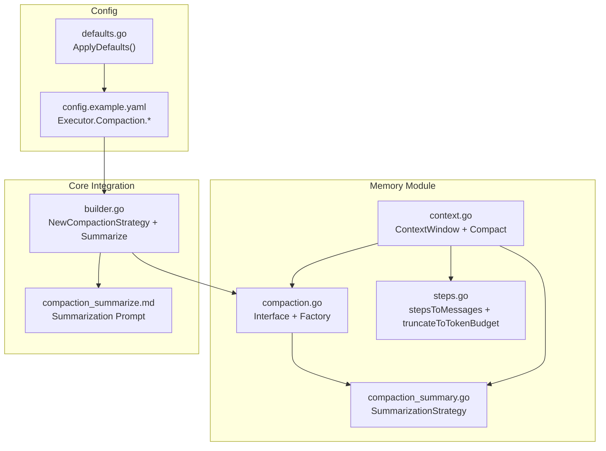
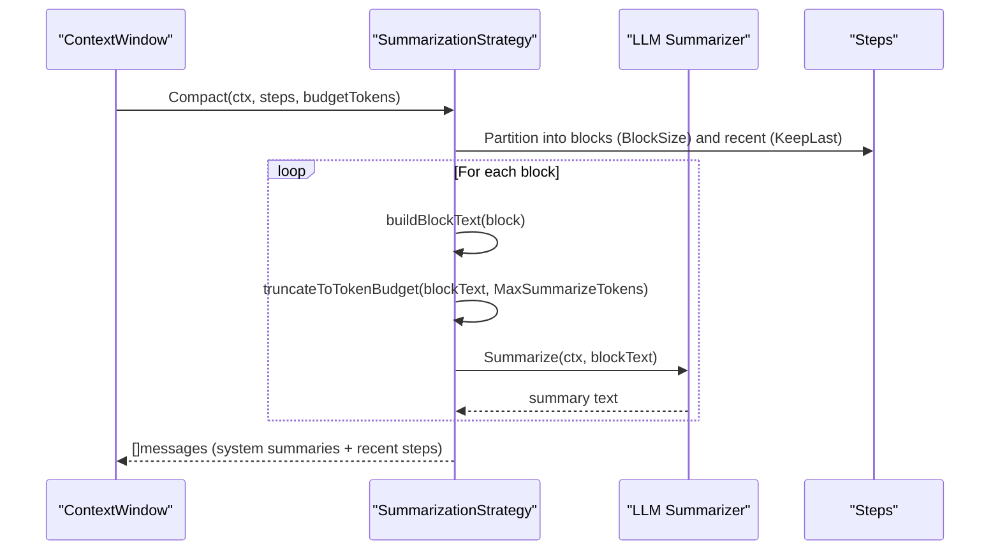
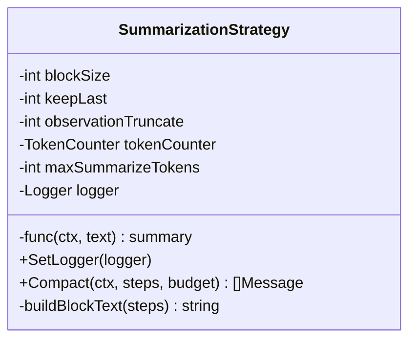
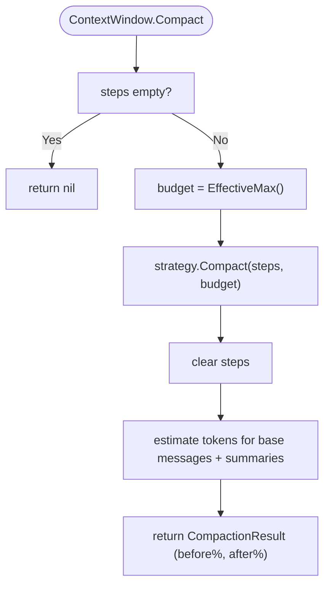
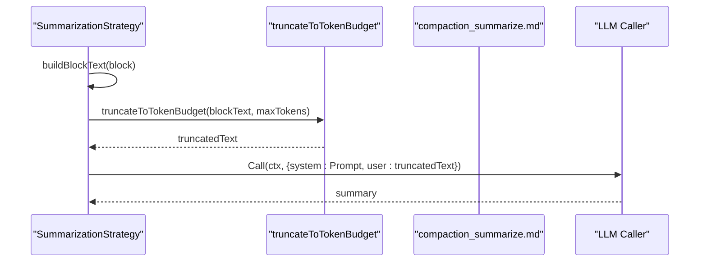
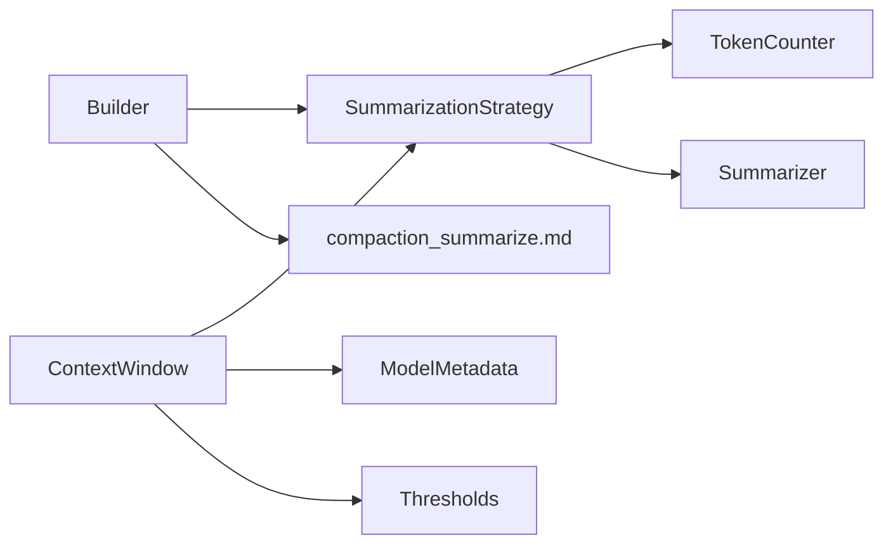

# Summarization Strategy

<cite>
**Referenced Files in This Document**
- [compaction.go](file://sdk/memory/compaction.go)
- [compaction_summary.go](file://sdk/memory/compaction_summary.go)
- [context.go](file://sdk/memory/context.go)
- [steps.go](file://sdk/memory/steps.go)
- [builder.go](file://core/builder.go)
- [compaction_summarize.md](file://core/prompts/compaction_summarize.md)
- [config.example.yaml](file://config.example.yaml)
- [defaults.go](file://backend/config/defaults.go)
- [compaction_test.go](file://sdk/memory/compaction_test.go)
</cite>

## Table of Contents
1. [Introduction](#introduction)
2. [Project Structure](#project-structure)
3. [Core Components](#core-components)
4. [Architecture Overview](#architecture-overview)
5. [Detailed Component Analysis](#detailed-component-analysis)
6. [Dependency Analysis](#dependency-analysis)
7. [Performance Considerations](#performance-considerations)
8. [Troubleshooting Guide](#troubleshooting-guide)
9. [Conclusion](#conclusion)

## Introduction
This document explains the Summarization compaction strategy used to compress long agent execution histories into concise summaries while preserving critical context. It covers how steps are grouped into blocks, how LLM summarization is invoked, and how token budgets are managed. It also documents configuration parameters such as BlockSize, KeepLast, and ObservationTruncate, and provides guidance on tuning them for different workloads.

## Project Structure
The Summarization strategy is implemented in the memory module and integrated into the broader context window management. Key files:
- Strategy definition and factory: sdk/memory/compaction.go
- Strategy implementation: sdk/memory/compaction_summary.go
- Context window integration: sdk/memory/context.go
- Step-to-message conversion and truncation helpers: sdk/memory/steps.go
- Prompt template for summarization: core/prompts/compaction_summarize.md
- Builder wiring and LLM summarization call: core/builder.go
- Configuration defaults and examples: config.example.yaml, backend/config/defaults.go
- Behavioral tests: sdk/memory/compaction_test.go

**Diagram sources**
- [compaction.go:1-105](file://sdk/memory/compaction.go#L1-L105)
- [compaction_summary.go:1-153](file://sdk/memory/compaction_summary.go#L1-L153)
- [context.go:1-438](file://sdk/memory/context.go#L1-L438)
- [steps.go:1-102](file://sdk/memory/steps.go#L1-L102)
- [builder.go:487-525](file://core/builder.go#L487-L525)
- [compaction_summarize.md:1-27](file://core/prompts/compaction_summarize.md#L1-L27)
- [config.example.yaml:86-114](file://config.example.yaml#L86-L114)
- [defaults.go:27-60](file://backend/config/defaults.go#L27-L60)

**Section sources**
- [compaction.go:1-105](file://sdk/memory/compaction.go#L1-L105)
- [compaction_summary.go:1-153](file://sdk/memory/compaction_summary.go#L1-L153)
- [context.go:1-438](file://sdk/memory/context.go#L1-L438)
- [steps.go:1-102](file://sdk/memory/steps.go#L1-L102)
- [builder.go:487-525](file://core/builder.go#L487-L525)
- [compaction_summarize.md:1-27](file://core/prompts/compaction_summarize.md#L1-L27)
- [config.example.yaml:86-114](file://config.example.yaml#L86-L114)
- [defaults.go:27-60](file://backend/config/defaults.go#L27-L60)

## Core Components
- CompactionStrategy interface: Defines the contract for compressing step histories into messages.
- SummarizationStrategy: Groups older steps into blocks and summarizes each block via an LLM, preserving recent steps verbatim.
- ContextWindow: Manages the effective context window, thresholds, and invokes compaction strategies.
- CompactionConfig and CompactionDeps: Provide configuration and external dependencies (token counter, summarizer, max tokens).
- Prompt template: Guides the LLM to produce concise, structured summaries.

Key configuration parameters:
- BlockSize: Number of steps per summary block.
- KeepLast: Number of recent steps to preserve verbatim.
- ObservationTruncate: Maximum characters for observations in summary blocks.
- MaxSummarizeTokens: Upper bound for text sent to the summarizer.
- SafetyMarginPercent: Percentage of context window reserved as safety margin.

**Section sources**
- [compaction.go:10-42](file://sdk/memory/compaction.go#L10-L42)
- [compaction_summary.go:13-63](file://sdk/memory/compaction_summary.go#L13-L63)
- [context.go:13-43](file://sdk/memory/context.go#L13-L43)
- [config.example.yaml:86-114](file://config.example.yaml#L86-L114)
- [defaults.go:27-60](file://backend/config/defaults.go#L27-L60)

## Architecture Overview
The Summarization strategy sits behind the CompactionStrategy interface and is selected by name. The ContextWindow coordinates compaction based on fill thresholds and passes a token budget to the strategy. The strategy builds blocks, truncates to token budget, calls the LLM summarizer, and emits system messages representing summaries, followed by preserved recent steps.

**Diagram sources**
- [context.go:400-437](file://sdk/memory/context.go#L400-L437)
- [compaction_summary.go:69-128](file://sdk/memory/compaction_summary.go#L69-L128)
- [steps.go:92-101](file://sdk/memory/steps.go#L92-L101)
- [builder.go:506-525](file://core/builder.go#L506-L525)

## Detailed Component Analysis

### SummarizationStrategy
The strategy groups the oldest steps into blocks sized by BlockSize, summarizes each block via the LLM, and preserves the most recent KeepLast steps verbatim. Observations are truncated to ObservationTruncate characters to reduce noise and token usage.

Implementation highlights:
- Block formation: Iterates over stepsToSummarize in increments of BlockSize.
- Text building: Concatenates Thought, Action, and Observation into a structured block.
- Token budgeting: Uses a conservative truncation helper when tokenCounter indicates overage.
- Fallback behavior: Emits a system message placeholder if summarization fails or is unavailable.
- Recent preservation: Appends recent steps as assistant/tool messages after summaries.

**Diagram sources**
- [compaction_summary.go:15-63](file://sdk/memory/compaction_summary.go#L15-L63)

**Section sources**
- [compaction_summary.go:69-128](file://sdk/memory/compaction_summary.go#L69-L128)
- [compaction_summary.go:130-152](file://sdk/memory/compaction_summary.go#L130-L152)

### ContextWindow Integration
ContextWindow drives compaction based on fill thresholds and passes the effective maximum as the token budget. After compaction, it estimates post-compaction fill percentage.

Key behaviors:
- EffectiveMax calculation accounts for output limit and safety margin.
- Compact delegates to the configured strategy and clears step history.
- Estimates token usage for system prompt, task, plan, and compacted messages.

**Diagram sources**
- [context.go:400-437](file://sdk/memory/context.go#L400-L437)

**Section sources**
- [context.go:76-81](file://sdk/memory/context.go#L76-L81)
- [context.go:400-437](file://sdk/memory/context.go#L400-L437)

### Text Preprocessing and Summarization Calls
- buildBlockText: Formats each step’s Thought, Action, and Observation into a readable block. Observations exceeding ObservationTruncate are truncated.
- truncateToTokenBudget: Applies a conservative character-to-token ratio to ensure the block fits within MaxSummarizeTokens.
- Summarize call: The builder wires a summarizer that sends a system prompt plus the block text to the LLM provider.

**Diagram sources**
- [compaction_summary.go:130-152](file://sdk/memory/compaction_summary.go#L130-L152)
- [steps.go:92-101](file://sdk/memory/steps.go#L92-L101)
- [compaction_summarize.md:1-27](file://core/prompts/compaction_summarize.md#L1-L27)
- [builder.go:506-525](file://core/builder.go#L506-L525)

**Section sources**
- [compaction_summary.go:130-152](file://sdk/memory/compaction_summary.go#L130-L152)
- [steps.go:92-101](file://sdk/memory/steps.go#L92-L101)
- [compaction_summarize.md:1-27](file://core/prompts/compaction_summarize.md#L1-L27)
- [builder.go:506-525](file://core/builder.go#L506-L525)

### Configuration and Defaults
- Configuration keys:
  - summarization.block_size
  - summarization.keepLast
  - observationTruncate
  - maxSummarizeTokens
  - safetyMarginPercent
- Defaults:
  - BlockSize: 7
  - KeepLast: 5
  - ObservationTruncate: 500
  - MaxSummarizeTokens: 16000
  - SafetyMarginPercent: 5

These values are applied when zero or unset and can be overridden in config files.

**Section sources**
- [config.example.yaml:86-114](file://config.example.yaml#L86-L114)
- [defaults.go:27-60](file://backend/config/defaults.go#L27-L60)

### Examples of Different Block Sizes and Compression Ratios
Behavioral tests demonstrate:
- With BlockSize=5 and KeepLast=5, 20 steps yield 3 summary blocks and 10 recent messages.
- With BlockSize=10 and KeepLast=5, 10 steps are preserved verbatim (no summarization).
- With MaxSummarizeTokens=100, large observations are truncated to fit within budget.

These examples illustrate how BlockSize controls the number of summary blocks and how MaxSummarizeTokens affects whether truncation occurs.

**Section sources**
- [compaction_test.go:43-74](file://sdk/memory/compaction_test.go#L43-L74)
- [compaction_test.go:121-134](file://sdk/memory/compaction_test.go#L121-L134)
- [compaction_test.go:402-439](file://sdk/memory/compaction_test.go#L402-L439)

## Dependency Analysis
- SummarizationStrategy depends on:
  - TokenCounter for budget-aware truncation
  - Summarizer function for LLM calls
  - ContextWindow for budget and invocation
- Builder wires the strategy with:
  - Summarize: a function that constructs a ChatRequest with the prompt and calls the LLM provider
  - MaxSummarizeTokens: derived from configuration
- ContextWindow depends on:
  - Model metadata (context window, output limit)
  - Thresholds for compaction triggers
  - Strategy selection

**Diagram sources**
- [context.go:27-43](file://sdk/memory/context.go#L27-L43)
- [compaction.go:33-42](file://sdk/memory/compaction.go#L33-L42)
- [builder.go:487-525](file://core/builder.go#L487-L525)
- [compaction_summarize.md:1-27](file://core/prompts/compaction_summarize.md#L1-L27)

**Section sources**
- [compaction.go:33-42](file://sdk/memory/compaction.go#L33-L42)
- [context.go:27-43](file://sdk/memory/context.go#L27-L43)
- [builder.go:487-525](file://core/builder.go#L487-L525)

## Performance Considerations
- BlockSize tuning:
  - Smaller blocks increase summarization overhead but improve granularity and recall.
  - Larger blocks reduce calls to the LLM but risk losing fine-grained details.
- ObservationTruncate:
  - Reduces token usage and improves throughput; set conservatively to retain key details.
- MaxSummarizeTokens:
  - Controls payload size; ensure it leaves headroom for prompt tokens and model output.
- SafetyMarginPercent:
  - Prevents overfill by reserving a percentage of the context window.
- KeepLast:
  - Preserving recent steps ensures immediate context remains intact, reducing re-summarization frequency.

[No sources needed since this section provides general guidance]

## Troubleshooting Guide
Common issues and remedies:
- Summarization failures:
  - The strategy logs errors and falls back to a placeholder summary. Investigate provider connectivity, rate limits, or prompt formatting.
- Overly truncated summaries:
  - Increase ObservationTruncate or MaxSummarizeTokens to allow richer context in blocks.
- Context overflow after compaction:
  - Reduce BlockSize or increase SafetyMarginPercent to avoid near-full context windows.
- Recent context lost:
  - Increase KeepLast to preserve more recent steps verbatim.
- No summarization occurring:
  - Ensure BlockSize > 0 and that steps exceed KeepLast.

**Section sources**
- [compaction_summary.go:102-114](file://sdk/memory/compaction_summary.go#L102-L114)
- [compaction_summary.go:94-99](file://sdk/memory/compaction_summary.go#L94-L99)
- [context.go:400-437](file://sdk/memory/context.go#L400-L437)

## Conclusion
The Summarization strategy efficiently compresses long execution histories by grouping steps into blocks, summarizing them with an LLM, and preserving recent context. Proper tuning of BlockSize, KeepLast, ObservationTruncate, and MaxSummarizeTokens balances compression efficiency with context fidelity. The ContextWindow integrates these controls with model metadata and thresholds to maintain safe and effective context usage.