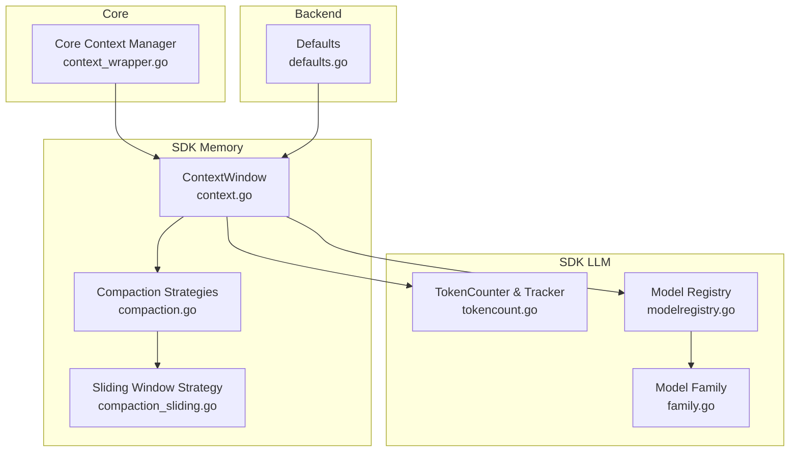
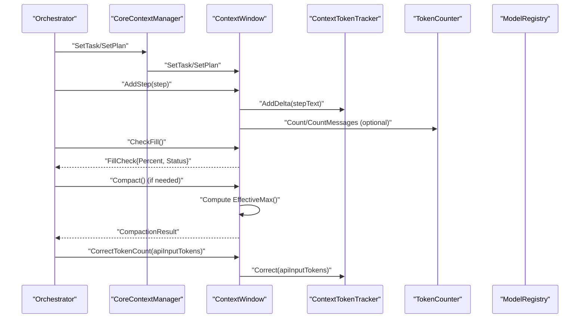
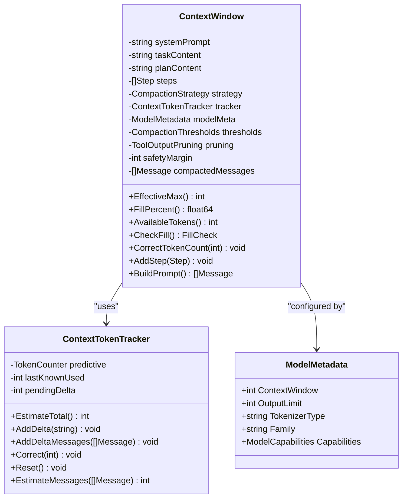
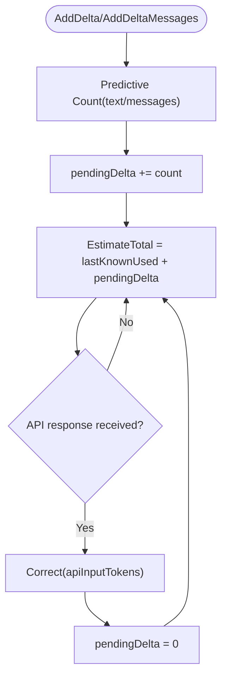
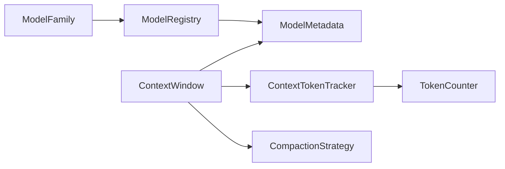

# Context Window Management

<cite>
**Referenced Files in This Document**
- [context.go](file://sdk/memory/context.go)
- [tokencount.go](file://sdk/llm/tokencount.go)
- [modelregistry.go](file://sdk/llm/modelregistry.go)
- [family.go](file://sdk/llm/family.go)
- [compaction.go](file://sdk/memory/compaction.go)
- [compaction_sliding.go](file://sdk/memory/compaction_sliding.go)
- [context_wrapper.go](file://core/context_wrapper.go)
- [context_test.go](file://sdk/memory/context_test.go)
- [tokencount_test.go](file://sdk/llm/tokencount_test.go)
- [defaults.go](file://backend/config/defaults.go)
</cite>

## Table of Contents
1. [Introduction](#introduction)
2. [Project Structure](#project-structure)
3. [Core Components](#core-components)
4. [Architecture Overview](#architecture-overview)
5. [Detailed Component Analysis](#detailed-component-analysis)
6. [Dependency Analysis](#dependency-analysis)
7. [Performance Considerations](#performance-considerations)
8. [Troubleshooting Guide](#troubleshooting-guide)
9. [Conclusion](#conclusion)

## Introduction
This document explains C0WRK’s context window management system. It focuses on the ContextWindow struct and its role in enforcing LLM context limits, including token tracking, safety margins, and fill percentage calculations. It documents context window calculation methods (EffectiveMax, FillPercent, AvailableTokens), token counting mechanisms, compaction strategies, and how the system prevents context overflow. Practical configuration examples and usage patterns for different model families are included.

## Project Structure
The context window system spans several packages:
- Memory: context window lifecycle, prompt building, compaction, and pruning
- LLM: token counting, model metadata, and model family detection
- Core: adapter exposing context window to higher-level orchestration
- Backend: default configuration for compaction and safety margins

**Diagram sources**
- [context.go:27-150](file://sdk/memory/context.go#L27-L150)
- [tokencount.go:123-184](file://sdk/llm/tokencount.go#L123-L184)
- [modelregistry.go:25-50](file://sdk/llm/modelregistry.go#L25-L50)
- [family.go:5-18](file://sdk/llm/family.go#L5-L18)
- [compaction.go:10-105](file://sdk/memory/compaction.go#L10-L105)
- [compaction_sliding.go:11-55](file://sdk/memory/compaction_sliding.go#L11-L55)
- [context_wrapper.go:29-68](file://core/context_wrapper.go#L29-L68)
- [defaults.go:27-60](file://backend/config/defaults.go#L27-L60)

**Section sources**
- [context.go:1-200](file://sdk/memory/context.go#L1-L200)
- [tokencount.go:1-184](file://sdk/llm/tokencount.go#L1-L184)
- [modelregistry.go:1-137](file://sdk/llm/modelregistry.go#L1-L137)
- [compaction.go:1-105](file://sdk/memory/compaction.go#L1-L105)
- [compaction_sliding.go:1-55](file://sdk/memory/compaction_sliding.go#L1-L55)
- [context_wrapper.go:1-68](file://core/context_wrapper.go#L1-L68)
- [defaults.go:27-60](file://backend/config/defaults.go#L27-L60)

## Core Components
- ContextWindow: central component that tracks token usage, enforces effective limits, and builds prompts with system/task/plan/history.
- ContextTokenTracker: predictive token counter with API correction to avoid overflow.
- TokenCounter implementations: approximate and tiktoken-based counters.
- ModelMetadata: per-model context window, output limit, tokenizer type, and capabilities.
- CompactionStrategy: algorithms to reduce context usage (sliding window, summarization, hierarchical).
- CoreContextManager: adapter that exposes context window to orchestration.

Key responsibilities:
- EffectiveMax: computes safe effective capacity considering output limit and safety margin.
- FillPercent: current fill percentage against effective max.
- AvailableTokens: remaining tokens before reaching effective max.
- CheckFill: categorizes fill status (ok, compact, warning, emergency, reject).
- CorrectTokenCount: applies API-reported token counts to tracker.
- BuildPrompt: constructs ordered messages with pruning and tool output protection.

**Section sources**
- [context.go:27-150](file://sdk/memory/context.go#L27-L150)
- [tokencount.go:123-184](file://sdk/llm/tokencount.go#L123-L184)
- [modelregistry.go:25-50](file://sdk/llm/modelregistry.go#L25-L50)
- [compaction.go:10-105](file://sdk/memory/compaction.go#L10-L105)

## Architecture Overview
The system integrates model metadata, token counting, and compaction to maintain safe context usage.

**Diagram sources**
- [context.go:106-138](file://sdk/memory/context.go#L106-L138)
- [tokencount.go:142-177](file://sdk/llm/tokencount.go#L142-L177)
- [modelregistry.go:68-137](file://sdk/llm/modelregistry.go#L68-L137)
- [context_wrapper.go:29-68](file://core/context_wrapper.go#L29-L68)

## Detailed Component Analysis

### ContextWindow: Context Limits and Fill Management
ContextWindow encapsulates:
- Model metadata (context window, output limit, tokenizer type)
- Token tracking via ContextTokenTracker
- Thresholds for compaction (predictive, warning, emergency)
- Safety margin percentage applied to context window
- Pruning policy for tool outputs
- Compaction strategy for reducing context usage

Core methods:
- EffectiveMax: effective capacity = ContextWindow − OutputLimit − (ContextWindow × SafetyMarginPercent / 100)
- FillPercent: (tracker.EstimateTotal / EffectiveMax) × 100
- AvailableTokens: EffectiveMax − tracker.EstimateTotal (clamped to ≥ 0)
- CheckFill: maps percentage to status categories
- CorrectTokenCount: applies API-reported input token count
- AddStep: appends step and updates tracker delta
- BuildPrompt: constructs ordered messages with pruning and trimming

**Diagram sources**
- [context.go:27-150](file://sdk/memory/context.go#L27-L150)
- [tokencount.go:123-184](file://sdk/llm/tokencount.go#L123-L184)
- [modelregistry.go:25-36](file://sdk/llm/modelregistry.go#L25-L36)

**Section sources**
- [context.go:27-150](file://sdk/memory/context.go#L27-L150)
- [context_test.go:380-441](file://sdk/memory/context_test.go#L380-L441)

### Token Counting and Correction
Token counting is performed by TokenCounter implementations:
- SimpleTokenCounter: fast approximate counting using average character-to-token ratio
- TiktokenCounter: precise counting using tiktoken encodings (per model tokenizer)
- ContextTokenTracker: hybrid approach combining predictive estimates with API-corrected actuals

Behavior highlights:
- EstimateTotal: lastKnownUsed + pendingDelta
- AddDelta/AddDeltaMessages: increment pendingDelta using predictive counter
- Correct: replace lastKnownUsed with API-reported input tokens and reset pendingDelta
- Reset: clear both counters

**Diagram sources**
- [tokencount.go:142-177](file://sdk/llm/tokencount.go#L142-L177)
- [tokencount_test.go:419-561](file://sdk/llm/tokencount_test.go#L419-L561)

**Section sources**
- [tokencount.go:11-184](file://sdk/llm/tokencount.go#L11-L184)
- [tokencount_test.go:419-561](file://sdk/llm/tokencount_test.go#L419-L561)

### Model Metadata and Families
ModelRegistry resolves metadata for a model using a 5-tier lookup:
- Overrides (user configuration)
- Built-in registry (hardcoded table)
- HuggingFace API lookup (cached)
- Registered external sources
- Fallback defaults

Built-in registry includes models from providers such as OpenAI, Anthropic, Google Gemini, DeepSeek, and others, each with ContextWindow, OutputLimit, TokenizerType, and capabilities.

ModelFamily detection selects prompt and parameter adaptations based on model ID patterns.

**Section sources**
- [modelregistry.go:68-137](file://sdk/llm/modelregistry.go#L68-L137)
- [modelregistry.go:212-504](file://sdk/llm/modelregistry.go#L212-L504)
- [family.go:20-73](file://sdk/llm/family.go#L20-L73)

### Compaction Strategies
Strategies compress step history to keep within effective context:
- SlidingWindowStrategy: retains first K and last N steps, inserts a summary message for omitted steps
- SummarizationStrategy and HierarchicalStrategy: compress via summarization blocks and ratios (see compaction.go)

ContextWindow integrates a strategy and computes budget as EffectiveMax() for compaction decisions.

**Section sources**
- [compaction.go:10-105](file://sdk/memory/compaction.go#L10-L105)
- [compaction_sliding.go:11-55](file://sdk/memory/compaction_sliding.go#L11-L55)
- [context.go:400-437](file://sdk/memory/context.go#L400-L437)

### Core Context Manager Adapter
CoreContextManager wraps SDK ContextWindow to expose SetTask, SetPlanFromPlan, and ContextTracker for orchestration wiring.

**Section sources**
- [context_wrapper.go:29-68](file://core/context_wrapper.go#L29-L68)

## Dependency Analysis
ContextWindow depends on:
- ModelMetadata for context window and output limits
- ContextTokenTracker for token accounting
- CompactionStrategy for reducing context usage
- TokenCounter for message token estimation

**Diagram sources**
- [context.go:27-150](file://sdk/memory/context.go#L27-L150)
- [tokencount.go:11-18](file://sdk/llm/tokencount.go#L11-L18)
- [modelregistry.go:25-50](file://sdk/llm/modelregistry.go#L25-L50)
- [family.go:5-18](file://sdk/llm/family.go#L5-L18)

**Section sources**
- [context.go:27-150](file://sdk/memory/context.go#L27-L150)
- [tokencount.go:11-18](file://sdk/llm/tokencount.go#L11-L18)
- [modelregistry.go:25-50](file://sdk/llm/modelregistry.go#L25-L50)

## Performance Considerations
- Prefer accurate tokenizers (tiktoken) for models where available to minimize overestimation/underestimation.
- Use sliding window compaction for low-latency, deterministic compression.
- Tune KeepFirst/KeepLast to preserve critical early and recent steps.
- Monitor FillCheck status to proactively compact before nearing limits.
- Safety margin reduces risk of hitting hard limits; adjust based on model behavior and usage patterns.

## Troubleshooting Guide
Common issues and resolutions:
- Context overflow despite FillPercent below 100%:
  - Ensure CorrectTokenCount is called after each API call to update lastKnownUsed.
  - Verify EffectiveMax calculation accounts for model OutputLimit and SafetyMarginPercent.
- Unexpected rejection at or near 100% fill:
  - Confirm thresholds (PredictivePercent, WarningPercent, EmergencyPercent) are set appropriately.
  - Consider increasing safety margin or enabling compaction earlier.
- Tool output pruning not taking effect:
  - Check KeepLastN and ProtectedTools configuration.
  - Ensure ResponseGroups are handled consistently to avoid partial pruning.

Validation references:
- EffectiveMax and FillPercent tests
- CheckFill status transitions
- CorrectTokenCount updates tracker
- Sliding window compaction behavior

**Section sources**
- [context_test.go:380-553](file://sdk/memory/context_test.go#L380-L553)
- [context_test.go:555-582](file://sdk/memory/context_test.go#L555-L582)
- [context_test.go:140-215](file://sdk/memory/context_test.go#L140-L215)

## Conclusion
C0WRK’s context window management balances accuracy and safety through:
- Model-aware metadata and tokenizer selection
- Predictive token tracking with API-driven corrections
- Effective capacity computation accounting for output limits and safety margins
- Flexible compaction strategies to prevent overflow
- Clear fill status signaling to drive proactive mitigation

This design enables robust operation across diverse model families while maintaining predictable and configurable behavior.