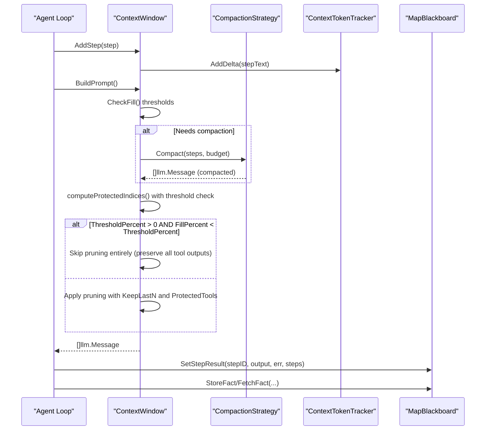
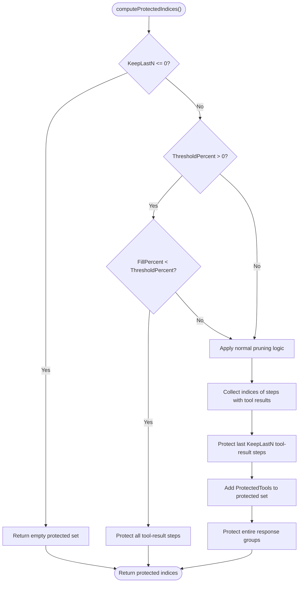
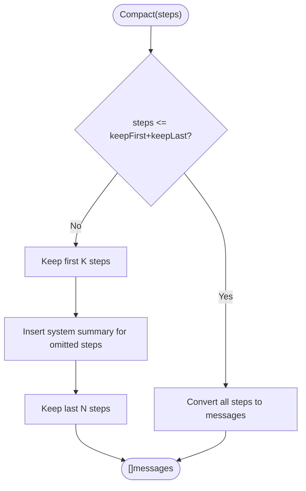
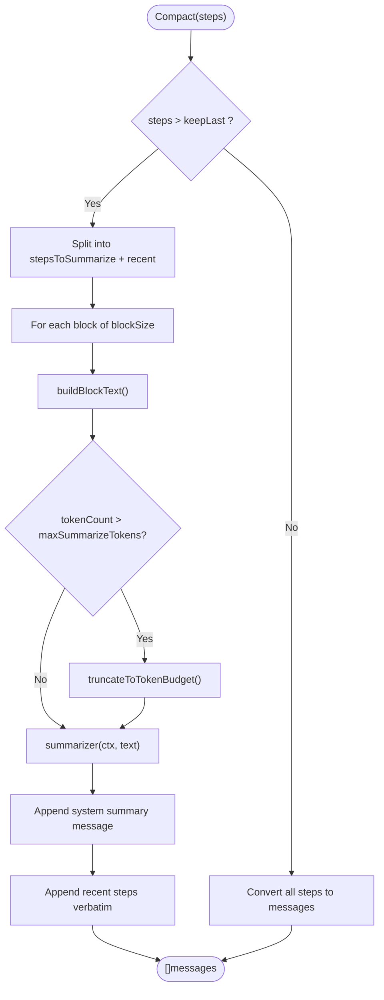
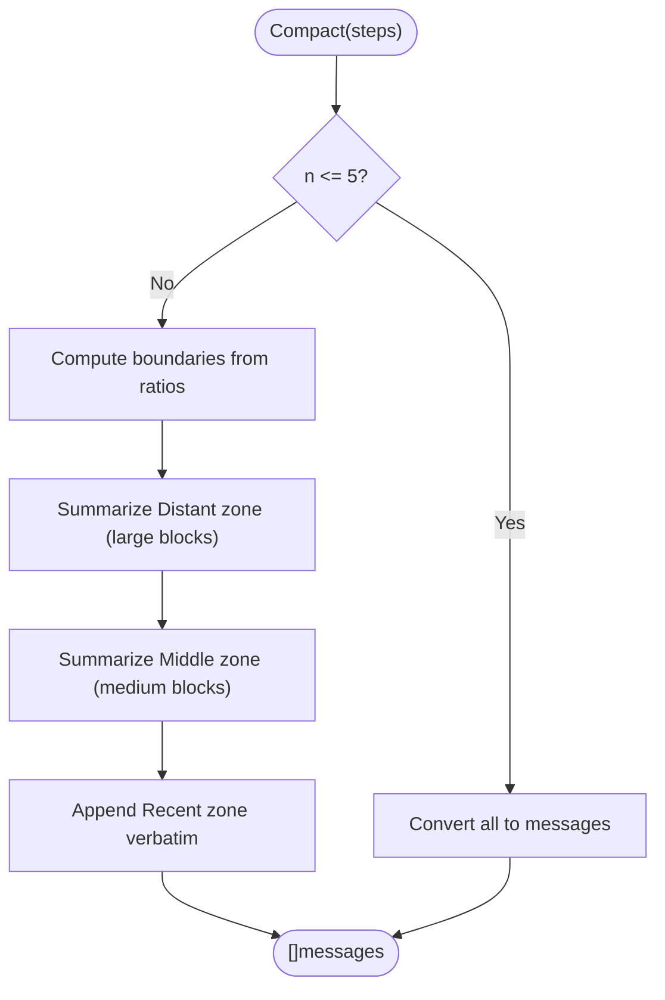
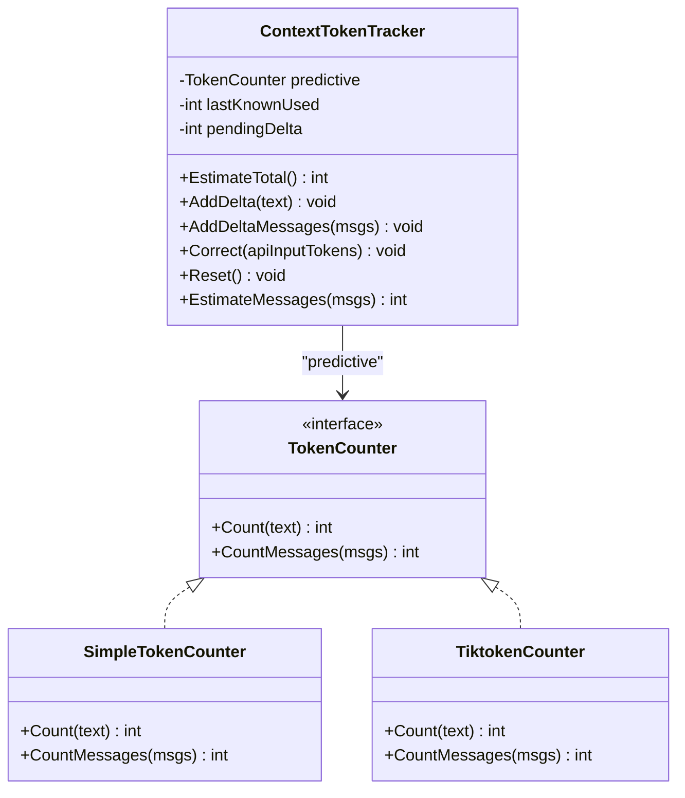
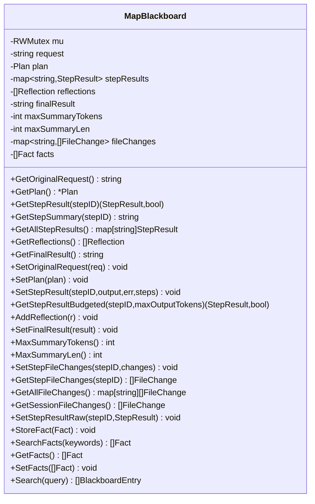
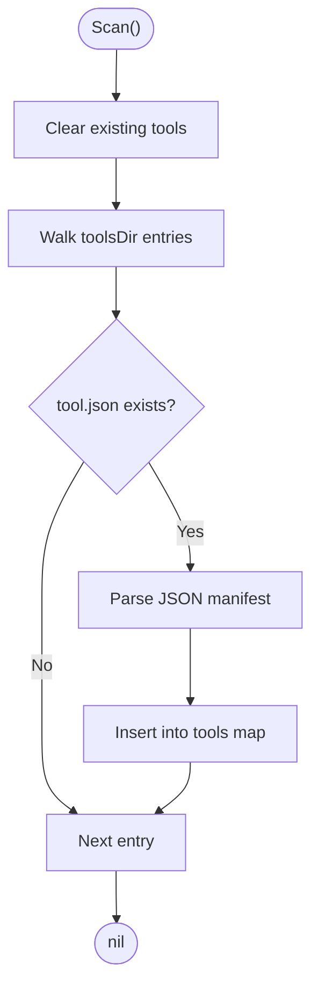
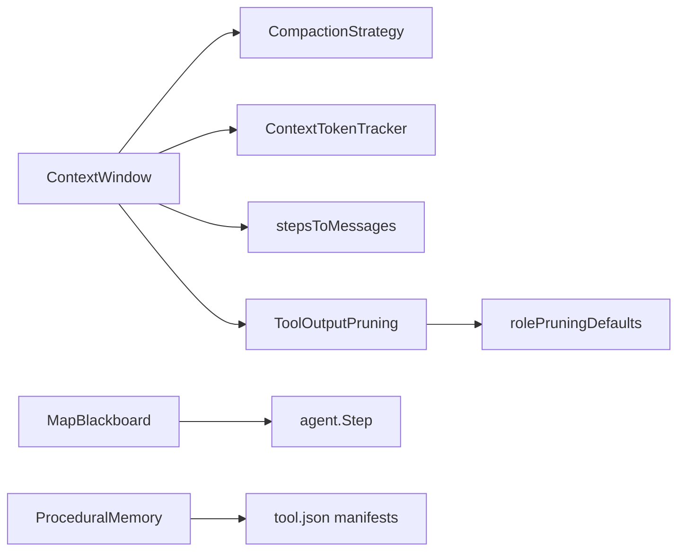

# Memory and Context Management

<cite>
**Referenced Files in This Document**
- [context.go](file://sdk/memory/context.go)
- [compaction.go](file://sdk/memory/compaction.go)
- [compaction_sliding.go](file://sdk/memory/compaction_sliding.go)
- [compaction_summary.go](file://sdk/memory/compaction_summary.go)
- [compaction_hierarchy.go](file://sdk/memory/compaction_hierarchy.go)
- [steps.go](file://sdk/memory/steps.go)
- [tokencount.go](file://sdk/llm/tokencount.go)
- [blackboard.go](file://sdk/orchestration/blackboard.go)
- [bbcontext.go](file://sdk/orchestration/bbcontext.go)
- [config.example.yaml](file://config.example.yaml)
- [context_test.go](file://sdk/memory/context_test.go)
- [compaction_test.go](file://sdk/memory/compaction_test.go)
- [blackboard_test.go](file://sdk/orchestration/blackboard_test.go)
- [stepconfig.go](file://core/stepconfig.go)
- [builder.go](file://core/builder.go)
- [config.go](file://backend/config/config.go)
- [builderconfig.go](file://core/builderconfig.go)
</cite>

## Update Summary
**Changes Made**
- Enhanced documentation for adaptive pruning thresholds with threshold-based pruning behavior
- Added documentation for role-based tool output pruning configurations with role-specific defaults
- Updated tool output pruning section to cover new thresholdPercent parameter and adaptive behavior
- Added documentation for rolePruningDefaults and per-step pruning overrides
- Updated configuration examples to reflect new thresholdPercent parameter

## Table of Contents
1. [Introduction](#introduction)
2. [Project Structure](#project-structure)
3. [Core Components](#core-components)
4. [Architecture Overview](#architecture-overview)
5. [Detailed Component Analysis](#detailed-component-analysis)
6. [Dependency Analysis](#dependency-analysis)
7. [Performance Considerations](#performance-considerations)
8. [Troubleshooting Guide](#troubleshooting-guide)
9. [Conclusion](#conclusion)
10. [Appendices](#appendices)

## Introduction
This document explains C0WRK's memory and context management systems with a focus on:
- Context window modeling and token usage tracking
- Compaction strategies: sliding window, hierarchical, and summary-based
- Long-term retention via procedural memory
- Shared state management via the blackboard architecture
- **Enhanced tool output pruning with adaptive thresholds and role-based configurations**
- Optimization techniques, memory pressure handling, and selection criteria for compaction strategies
- Practical configuration and performance tuning guidance

## Project Structure
The memory and context subsystem spans several packages:
- sdk/memory: context window, compaction strategies, and step-to-message conversion
- sdk/llm: token counting and context tracking
- sdk/orchestration: blackboard for shared state and facts
- core: role-based tool output pruning defaults and step configuration
- backend/config: configuration structures for tool output pruning
- config.example.yaml: memory-related configuration knobs

```mermaid
graph TB
subgraph "SDK Memory"
CW["ContextWindow<br/>context.go"]
STRAT["Compaction Strategies<br/>compaction.go"]
SLIDE["SlidingWindowStrategy<br/>compaction_sliding.go"]
SUMM["SummarizationStrategy<br/>compaction_summary.go"]
HIER["HierarchicalStrategy<br/>compaction_hierarchy.go"]
STEPS["stepsToMessages<br/>steps.go"]
TOKEN["TokenCounter & Tracker<br/>tokencount.go"]
TOOLPRUNE["Tool Output Pruning<br/>context.go"]
END
subgraph "Core"
ROLEPRUNE["Role-Based Pruning Defaults<br/>stepconfig.go"]
END
subgraph "Orchestration"
BB["MapBlackboard<br/>blackboard.go"]
BBCTX["Blackboard Context Keys<br/>bbcontext.go"]
END
subgraph "Backend Config"
CFG["Configuration Structures<br/>config.go"]
END
CW --> STRAT
STRAT --> SLIDE
STRAT --> SUMM
STRAT --> HIER
CW --> STEPS
CW --> TOKEN
CW --> TOOLPRUNE
TOOLPRUNE --> ROLEPRUNE
BBCTX --> BB
CFG --> CW
```

**Diagram sources**
- [context.go:27-43](file://sdk/memory/context.go#L27-L43)
- [compaction.go:10-105](file://sdk/memory/compaction.go#L10-L105)
- [compaction_sliding.go:11-55](file://sdk/memory/compaction_sliding.go#L11-L55)
- [compaction_summary.go:13-153](file://sdk/memory/compaction_summary.go#L13-L153)
- [compaction_hierarchy.go:14-208](file://sdk/memory/compaction_hierarchy.go#L14-L208)
- [steps.go:10-102](file://sdk/memory/steps.go#L10-L102)
- [tokencount.go:11-184](file://sdk/llm/tokencount.go#L11-L184)
- [stepconfig.go:19-41](file://core/stepconfig.go#L19-L41)
- [blackboard.go:16-564](file://sdk/orchestration/blackboard.go#L16-L564)
- [bbcontext.go:5-22](file://sdk/orchestration/bbcontext.go#L5-L22)
- [config.go:127-132](file://backend/config/config.go#L127-L132)

**Section sources**
- [context.go:27-43](file://sdk/memory/context.go#L27-L43)
- [compaction.go:10-105](file://sdk/memory/compaction.go#L10-L105)
- [blackboard.go:16-564](file://sdk/orchestration/blackboard.go#L16-L564)
- [stepconfig.go:19-41](file://core/stepconfig.go#L19-L41)

## Core Components
- ContextWindow: central component that models the LLM context window, tracks token usage, enforces thresholds, and builds the final prompt. It supports three compaction strategies and **enhanced tool output pruning with adaptive thresholds**.
- Compaction strategies: pluggable algorithms that reduce step history size while preserving relevance.
- TokenCounter and ContextTokenTracker: provide fast token estimates and reconcile with actual API usage.
- MapBlackboard: shared state container for plans, step results, reflections, file changes, and facts.
- **Role-based tool output pruning: automatic configuration of pruning parameters based on agent roles with per-step overrides**.
- ProceduralMemory: in-memory catalog of tools for long-term context retention and reuse.

Key capabilities:
- Dynamic compaction selection based on fill percentage thresholds
- **Adaptive pruning that respects context fill thresholds and can skip pruning when context is not under pressure**
- **Role-based automatic configuration of KeepLastN and ProtectedTools parameters**
- Safety margins and output limits respected in effective capacity calculations
- Tool output pruning to preserve critical results while saving tokens
- Hierarchical and summary-based strategies for different task types and budgets

**Section sources**
- [context.go:27-43](file://sdk/memory/context.go#L27-L43)
- [context.go:130-138](file://sdk/memory/context.go#L130-L138)
- [context.go:371-378](file://sdk/memory/context.go#L371-L378)
- [tokencount.go:123-184](file://sdk/llm/tokencount.go#L123-L184)
- [blackboard.go:16-564](file://sdk/orchestration/blackboard.go#L16-L564)
- [stepconfig.go:19-41](file://core/stepconfig.go#L19-L41)

## Architecture Overview
The memory system integrates context modeling, compaction, and shared state with enhanced tool output pruning:



**Diagram sources**
- [context.go:152-160](file://sdk/memory/context.go#L152-L160)
- [context.go:167-200](file://sdk/memory/context.go#L167-L200)
- [context.go:402-437](file://sdk/memory/context.go#L402-L437)
- [context.go:371-378](file://sdk/memory/context.go#L371-L378)
- [context.go:364-435](file://sdk/memory/context.go#L364-435)
- [tokencount.go:123-184](file://sdk/llm/tokencount.go#L123-L184)
- [blackboard.go:157-187](file://sdk/orchestration/blackboard.go#L157-L187)

## Detailed Component Analysis

### ContextWindow and Token Tracking
ContextWindow encapsulates:
- System/task/plan sections and step history
- Compaction thresholds and strategy
- **Enhanced tool output pruning configuration with adaptive thresholds**
- Safety margin and output limit accounting
- Prompt building and compaction lifecycle

Core behaviors:
- EffectiveMax subtracts output limit and safety margin from context window
- FillPercent and CheckFill report utilization and trigger compaction
- **computeProtectedIndices now includes threshold-based pruning logic**
- CorrectTokenCount reconciles tracker with actual API usage
- BuildPrompt constructs ordered messages and applies tool output pruning
- Compact delegates to selected strategy and computes before/after fill

```mermaid
classDiagram
class ContextWindow {
-string systemPrompt
-string taskContent
-string planContent
-[]Step steps
-CompactionStrategy strategy
-ContextTokenTracker tracker
-ModelMetadata modelMeta
-CompactionThresholds thresholds
-ToolOutputPruning pruning
-int safetyMargin
-[]Message compactedMessages
+EffectiveMax() int
+FillPercent() float64
+AvailableTokens() int
+CheckFill() FillCheck
+CorrectTokenCount(int) void
+SetTask(string) void
+SetPlan(string) void
+AddStep(Step) void
+SetStrategy(CompactionStrategy) void
+BuildPrompt() []Message
+Compact(ctx) *CompactionResult
+computeProtectedIndices() map[int]struct{}
}
```

**Diagram sources**
- [context.go:27-43](file://sdk/memory/context.go#L27-L43)
- [context.go:76-104](file://sdk/memory/context.go#L76-L104)
- [context.go:106-128](file://sdk/memory/context.go#L106-L128)
- [context.go:130-138](file://sdk/memory/context.go#L130-L138)
- [context.go:140-150](file://sdk/memory/context.go#L140-L150)
- [context.go:152-160](file://sdk/memory/context.go#L152-L160)
- [context.go:167-200](file://sdk/memory/context.go#L167-L200)
- [context.go:402-437](file://sdk/memory/context.go#L402-L437)
- [context.go:359-435](file://sdk/memory/context.go#L359-435)

**Section sources**
- [context.go:76-128](file://sdk/memory/context.go#L76-L128)
- [context.go:130-138](file://sdk/memory/context.go#L130-L138)
- [context.go:140-160](file://sdk/memory/context.go#L140-L160)
- [context.go:167-200](file://sdk/memory/context.go#L167-L200)
- [context.go:402-437](file://sdk/memory/context.go#L402-L437)
- [context.go:359-435](file://sdk/memory/context.go#L359-435)

### Enhanced Tool Output Pruning with Adaptive Thresholds

**Updated** Enhanced tool output pruning now includes adaptive threshold-based behavior and role-based configuration.

The ToolOutputPruning struct now includes:
- KeepLastN: number of recent tool-result steps to protect
- ProtectedTools: list of tool names whose outputs are never pruned
- PlaceholderText: text used for pruned tool outputs
- **ThresholdPercent: context fill percentage below which pruning is completely skipped (default: 50)**
- Logger: optional logger for pruning diagnostics

**Threshold-based pruning behavior:**
- When ThresholdPercent > 0 and FillPercent < ThresholdPercent: pruning is completely skipped
- When ThresholdPercent = 0: pruning is always active regardless of context fill
- When ThresholdPercent is not set: pruning follows normal KeepLastN and ProtectedTools logic

**Role-based automatic configuration:**
- rolePruningDefaults provides role-specific KeepLastN and ProtectedTools values
- Researchers: KeepLastN=10, ProtectedTools include read_file, search_content, ripgrep, semantic_search
- Coders/Testers: KeepLastN=5, ProtectedTools include store_fact, search_facts
- Automatic application of role defaults when explicit configuration is not provided



**Diagram sources**
- [context.go:364-435](file://sdk/memory/context.go#L364-435)
- [context.go:371-378](file://sdk/memory/context.go#L371-L378)

**Section sources**
- [context.go:22-29](file://sdk/memory/context.go#L22-L29)
- [context.go:364-435](file://sdk/memory/context.go#L364-435)
- [stepconfig.go:19-41](file://core/stepconfig.go#L19-L41)
- [config.go:127-132](file://backend/config/config.go#L127-L132)

### Compaction Strategies

#### Sliding Window Strategy
- Keeps a fixed number of first and last steps; summarizes the middle portion
- Produces a summary message indicating omitted steps
- Suitable for short to medium histories where recent context matters most



**Diagram sources**
- [compaction_sliding.go:25-54](file://sdk/memory/compaction_sliding.go#L25-L54)

**Section sources**
- [compaction_sliding.go:11-55](file://sdk/memory/compaction_sliding.go#L11-L55)

#### Summarization Strategy
- Groups oldest steps into blocks and summarizes each block via an LLM
- Preserves recent steps verbatim
- Applies token budget truncation to block text before summarization
- Useful for long histories where summarization reduces token usage while retaining key insights



**Diagram sources**
- [compaction_summary.go:65-128](file://sdk/memory/compaction_summary.go#L65-L128)
- [steps.go:10-90](file://sdk/memory/steps.go#L10-L90)
- [steps.go:92-102](file://sdk/memory/steps.go#L92-L102)

**Section sources**
- [compaction_summary.go:13-153](file://sdk/memory/compaction_summary.go#L13-L153)
- [steps.go:10-102](file://sdk/memory/steps.go#L10-L102)

#### Hierarchical Strategy
- Divides steps into three zones: Distant (oldest), Middle, and Recent
- Aggressively summarizes Distant zone, moderately Middle, and preserves Recent verbatim
- Uses different block sizes and observation truncation per zone
- Robust fallback behavior when summarization fails



**Diagram sources**
- [compaction_hierarchy.go:77-124](file://sdk/memory/compaction_hierarchy.go#L77-L124)
- [compaction_hierarchy.go:126-176](file://sdk/memory/compaction_hierarchy.go#L126-L176)

**Section sources**
- [compaction_hierarchy.go:14-208](file://sdk/memory/compaction_hierarchy.go#L14-L208)

#### Strategy Factory and Selection
- NewCompactionStrategy selects strategy by name and applies defaults for missing parameters
- StrategyDisplayName provides human-friendly names

**Section sources**
- [compaction.go:44-105](file://sdk/memory/compaction.go#L44-L105)

### Token Counting and Context Tracking
- TokenCounter interface supports approximate and precise counting
- SimpleTokenCounter uses a character-per-token ratio for speed
- TiktokenCounter uses tiktoken for accurate counts
- ContextTokenTracker combines predictive estimates with API-corrected actuals



**Diagram sources**
- [tokencount.go:11-18](file://sdk/llm/tokencount.go#L11-L18)
- [tokencount.go:24-51](file://sdk/llm/tokencount.go#L24-L51)
- [tokencount.go:53-92](file://sdk/llm/tokencount.go#L53-L92)
- [tokencount.go:123-184](file://sdk/llm/tokencount.go#L123-L184)

**Section sources**
- [tokencount.go:11-184](file://sdk/llm/tokencount.go#L11-L184)

### Blackboard Architecture for Shared State
MapBlackboard provides:
- Thread-safe storage for original request, plan, step results, reflections, final result
- Auto-generated summaries with configurable length and token caps
- File change aggregation across steps
- Keyword-tagged facts with search and retrieval
- Context attachment via WithBlackboard/BlackboardFromContext



**Diagram sources**
- [blackboard.go:16-564](file://sdk/orchestration/blackboard.go#L16-L564)

**Section sources**
- [blackboard.go:16-564](file://sdk/orchestration/blackboard.go#L16-L564)
- [bbcontext.go:5-22](file://sdk/orchestration/bbcontext.go#L5-L22)

### Procedural Memory for Long-Term Context Retention
ProceduralMemory:
- Scans a tools directory for tool.json manifests
- Maintains an in-memory registry of tools with metadata
- Supports concurrent access and usage counters



**Diagram sources**
- [procedural.go:65-136](file://backend/memory/procedural.go#L65-L136)

**Section sources**
- [procedural.go:35-178](file://backend/memory/procedural.go#L35-L178)

## Dependency Analysis
- ContextWindow depends on:
  - CompactionStrategy (pluggable)
  - ContextTokenTracker (token accounting)
  - TokenCounter (optional precise counting)
  - stepsToMessages (message assembly)
  - **ToolOutputPruning (enhanced with adaptive thresholds)**
- **ToolOutputPruning depends on:**
  - **rolePruningDefaults (role-based configuration)**
  - **BuilderToolOutputPruning (configuration structure)**
- Compaction strategies depend on:
  - TokenCounter (optional)
  - Summarizer function (optional)
- Blackboard depends on:
  - agent.Step (step data)
  - Internal defensive copying for immutability guarantees
- ProceduralMemory depends on:
  - Tool manifests and filesystem scanning



**Diagram sources**
- [context.go:27-43](file://sdk/memory/context.go#L27-L43)
- [compaction.go:10-105](file://sdk/memory/compaction.go#L10-L105)
- [blackboard.go:16-564](file://sdk/orchestration/blackboard.go#L16-L564)
- [procedural.go:35-178](file://backend/memory/procedural.go#L35-L178)
- [stepconfig.go:19-41](file://core/stepconfig.go#L19-L41)

**Section sources**
- [context.go:27-43](file://sdk/memory/context.go#L27-L43)
- [compaction.go:10-105](file://sdk/memory/compaction.go#L10-L105)
- [blackboard.go:16-564](file://sdk/orchestration/blackboard.go#L16-L564)
- [procedural.go:35-178](file://backend/memory/procedural.go#L35-L178)
- [stepconfig.go:19-41](file://core/stepconfig.go#L19-L41)

## Performance Considerations
- Choose compaction strategy based on history length and task type:
  - Sliding window: short to medium histories, strong emphasis on recent steps
  - Summarization: long histories, moderate budget; block size and keepLast balance cost vs. recall
  - Hierarchical: very long histories; tune ratios to prioritize recent context
- Use precise token counting (TiktokenCounter) for accuracy when budgets are tight
- Apply safety margins and output limits to avoid rejection due to rounding
- **Configure ThresholdPercent appropriately: lower values (e.g., 20-30%) for aggressive pruning, higher values (e.g., 70-80%) for conservative pruning**
- **Use role-based pruning defaults: researchers need higher KeepLastN (10) and broader ProtectedTools, coders/testers need lower KeepLastN (5)**
- **Control tool output pruning to retain critical results while saving tokens**
- Monitor fill status and adjust thresholds to trigger compaction earlier or later

## Troubleshooting Guide
Common issues and resolutions:
- API rejection due to empty assistant messages: ensure assistant messages have either content or tool_calls
- Excessive memory pressure: increase safety margin, enable compaction, or switch to hierarchical strategy
- **Truncated tool outputs: adjust toolOutputPruning.keepLastN and protectedTools, consider setting ThresholdPercent to avoid pruning during critical moments**
- **Adaptive pruning not working: verify ThresholdPercent is set correctly and FillPercent calculation matches expectations**
- **Role-based pruning not applied: ensure AgentProfile.Role is set correctly and rolePruningDefaults contain the expected configuration**
- Summarization failures: configure fallback behavior and reduce maxSummarizeTokens
- Blackboard contention: leverage concurrent-safe APIs and defensive copies

Validation references:
- BuildPrompt ordering and edge cases
- Sliding window compaction behavior
- Summarization and hierarchical strategy tests
- **Tool output pruning with adaptive thresholds and role-based configuration**
- Blackboard concurrency and defensive copies

**Section sources**
- [context_test.go:59-138](file://sdk/memory/context_test.go#L59-L138)
- [context_test.go:140-215](file://sdk/memory/context_test.go#L140-L215)
- [context_test.go:217-264](file://sdk/memory/context_test.go#L217-L264)
- [context_test.go:295-341](file://sdk/memory/context_test.go#L295-L341)
- [context_test.go:1217-1249](file://sdk/memory/context_test.go#L1217-L1249)
- [context_test.go:1253-1305](file://sdk/memory/context_test.go#L1253-L1305)
- [context_test.go:1349-1399](file://sdk/memory/context_test.go#L1349-L1399)
- [compaction_test.go:41-134](file://sdk/memory/compaction_test.go#L41-L134)
- [compaction_test.go:156-294](file://sdk/memory/compaction_test.go#L156-L294)
- [blackboard_test.go:186-259](file://sdk/orchestration/blackboard_test.go#L186-L259)

## Conclusion
C0WRK's memory and context management system balances precision and efficiency:
- ContextWindow and ContextTokenTracker provide robust budgeting and dynamic compaction triggers
- **Enhanced tool output pruning with adaptive thresholds provides intelligent pruning behavior that respects context pressure**
- **Role-based automatic configuration ensures optimal pruning parameters for different agent types**
- Pluggable compaction strategies support diverse workloads—from short ReAct loops to long-running explorations
- Blackboard offers a safe, searchable shared state layer for collaboration and reflection
- ProceduralMemory enables long-term retention of tool capabilities

Select strategies and parameters based on task characteristics, budget constraints, and reliability needs. **Configure ThresholdPercent thoughtfully to balance memory conservation with context preservation during critical operations**.

## Appendices

### Configuration Examples and Tuning
- Context compaction thresholds and strategies
- **Tool output pruning with adaptive thresholds and role-based configuration**
- Token budgeting for summaries and step outputs
- **Role-specific pruning defaults for researchers, coders, testers, and executors**
- Example YAML keys for executor, compaction, and tool result budgets

**Section sources**
- [config.example.yaml:86-136](file://config.example.yaml#L86-L136)
- [config.example.yaml:120-125](file://config.example.yaml#L120-L125)
- [stepconfig.go:19-41](file://core/stepconfig.go#L19-L41)
- [config.go:127-132](file://backend/config/config.go#L127-L132)
- [builderconfig.go:130-134](file://core/builderconfig.go#L130-134)