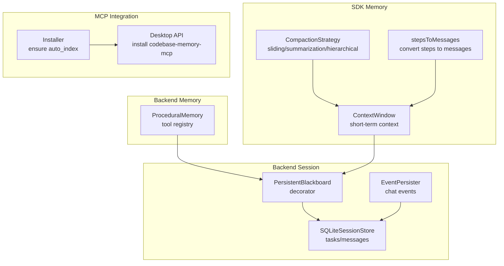
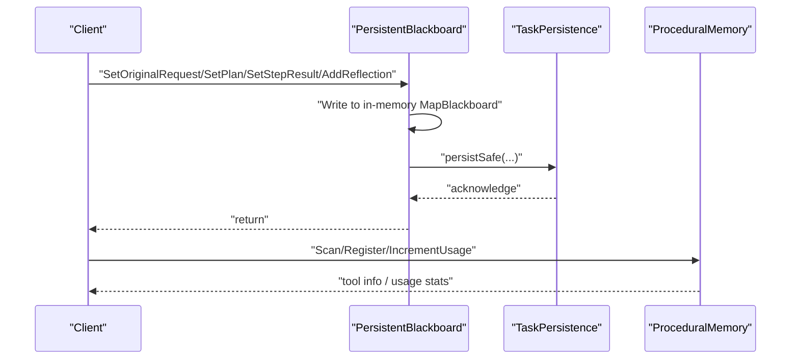
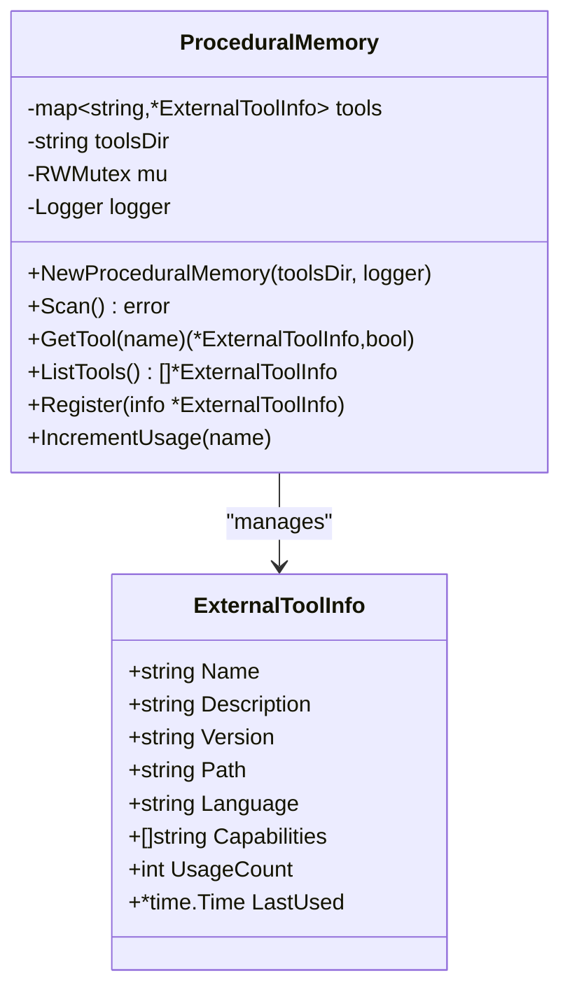
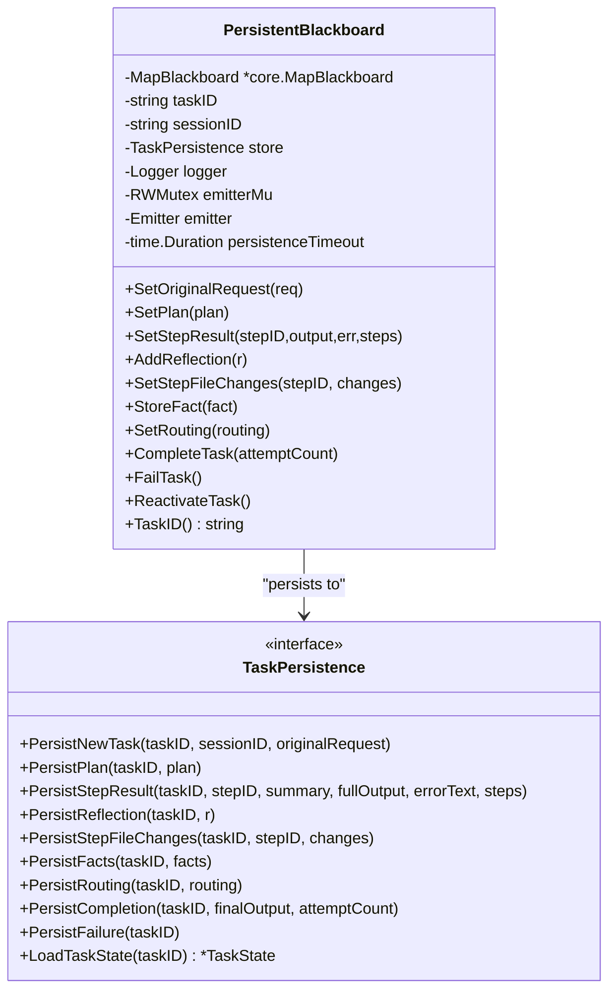
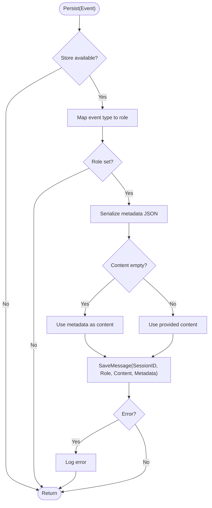
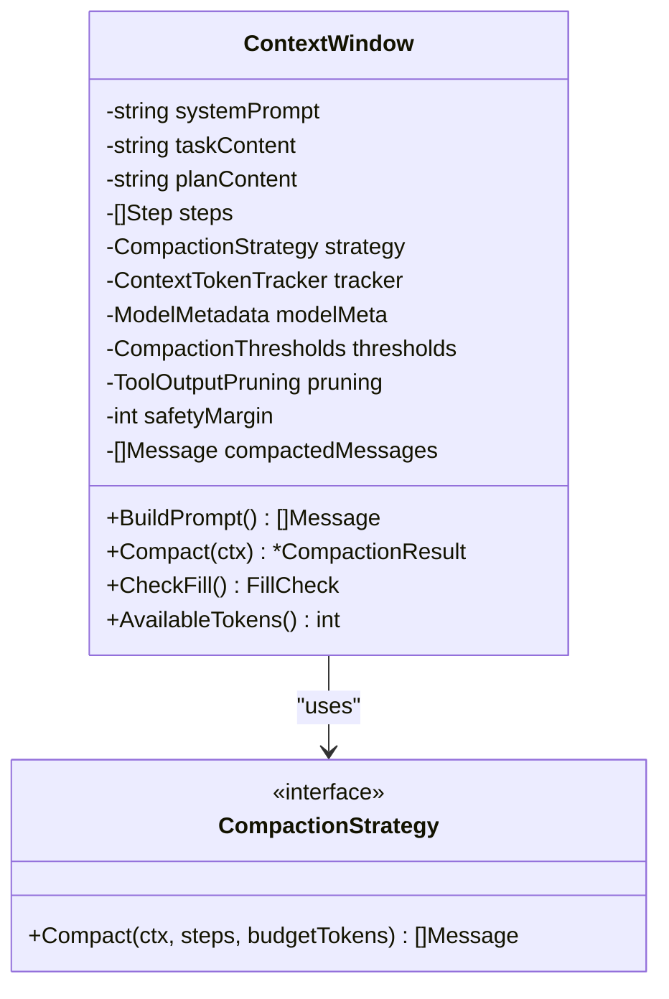
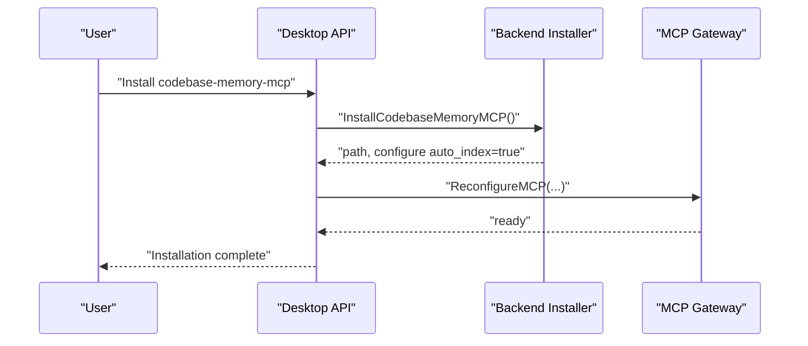
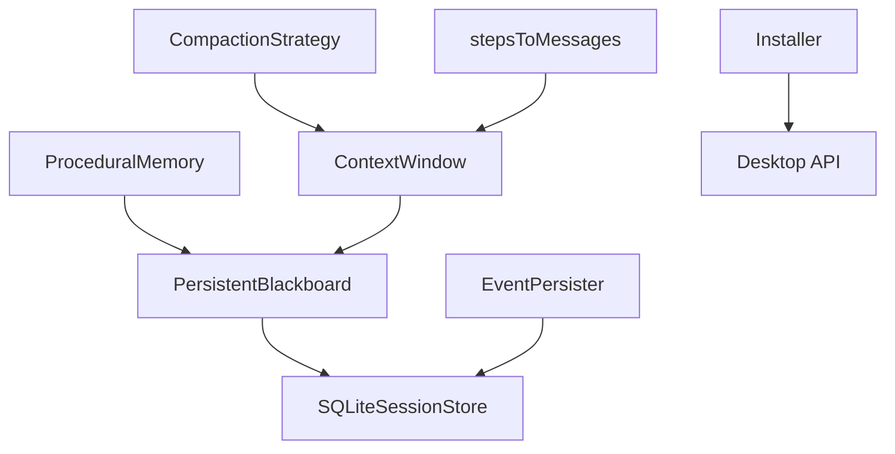

# Procedural Memory System

<cite>
**Referenced Files in This Document**
- [procedural.go](file://backend/memory/procedural.go)
- [procedural_test.go](file://backend/memory/procedural_test.go)
- [persistent_blackboard.go](file://backend/session/persistent_blackboard.go)
- [persistent_blackboard_test.go](file://backend/session/persistent_blackboard_test.go)
- [events.go](file://backend/session/events.go)
- [event_persister.go](file://backend/session/event_persister.go)
- [persistence.go](file://backend/session/persistence.go)
- [context.go](file://sdk/memory/context.go)
- [steps.go](file://sdk/memory/steps.go)
- [compaction.go](file://sdk/memory/compaction.go)
- [installer.go](file://backend/mcp/installer.go)
- [api_mcp.go](file://desktop/api_mcp.go)
- [config.go](file://backend/config/config.go)
</cite>

## Table of Contents
1. [Introduction](#introduction)
2. [Project Structure](#project-structure)
3. [Core Components](#core-components)
4. [Architecture Overview](#architecture-overview)
5. [Detailed Component Analysis](#detailed-component-analysis)
6. [Dependency Analysis](#dependency-analysis)
7. [Performance Considerations](#performance-considerations)
8. [Troubleshooting Guide](#troubleshooting-guide)
9. [Conclusion](#conclusion)

## Introduction
This document explains C0WRK’s procedural memory system designed to maintain long-term context across multiple interactions and sessions beyond the immediate context window. The system provides:
- A registry of available tools with metadata and usage statistics
- Persistent storage of session and task state for continuity across restarts
- Integration with the broader memory management system for short-term context compaction
- Optional integration with external memory tools (e.g., codebase-memory-mcp) for extended knowledge

The goal is to enable continuous learning and context retention across sessions while complementing short-term context management with durable, structured memories.

## Project Structure
The procedural memory system spans backend memory management, session persistence, and SDK memory utilities:
- Backend memory: in-memory tool registry and usage tracking
- Backend session: persistent blackboard and event persistence
- SDK memory: context window, compaction strategies, and step-to-message conversion
- MCP integration: optional external memory tool installation and configuration

**Diagram sources**
- [procedural.go:35-178](file://backend/memory/procedural.go#L35-L178)
- [persistent_blackboard.go:24-276](file://backend/session/persistent_blackboard.go#L24-L276)
- [event_persister.go:9-166](file://backend/session/event_persister.go#L9-L166)
- [persistence.go:41-169](file://backend/session/persistence.go#L41-L169)
- [context.go:27-438](file://sdk/memory/context.go#L27-L438)
- [compaction.go:10-105](file://sdk/memory/compaction.go#L10-L105)
- [steps.go:10-102](file://sdk/memory/steps.go#L10-L102)
- [installer.go:177-233](file://backend/mcp/installer.go#L177-L233)
- [api_mcp.go:199-245](file://desktop/api_mcp.go#L199-L245)

**Section sources**
- [procedural.go:1-178](file://backend/memory/procedural.go#L1-L178)
- [persistent_blackboard.go:1-288](file://backend/session/persistent_blackboard.go#L1-L288)
- [event_persister.go:1-166](file://backend/session/event_persister.go#L1-L166)
- [persistence.go:1-807](file://backend/session/persistence.go#L1-L807)
- [context.go:1-438](file://sdk/memory/context.go#L1-L438)
- [compaction.go:1-105](file://sdk/memory/compaction.go#L1-L105)
- [steps.go:1-102](file://sdk/memory/steps.go#L1-L102)
- [installer.go:177-233](file://backend/mcp/installer.go#L177-L233)
- [api_mcp.go:199-245](file://desktop/api_mcp.go#L199-L245)

## Core Components
- ProceduralMemory: in-memory registry of tools discovered from a tools directory, with support for registering tools and tracking usage metrics.
- PersistentBlackboard: decorator around an in-memory blackboard that persists write operations to a TaskPersistence store with timeouts and best-effort error handling.
- EventPersister: persists chat-visible events to the session store, filtering transient events and serializing metadata.
- ContextWindow and CompactionStrategy: manage short-term context, including compaction thresholds and strategies to keep within model token limits.
- stepsToMessages: converts step histories into structured messages for the LLM API.

These components work together to maintain long-term context continuity and short-term context efficiency.

**Section sources**
- [procedural.go:35-178](file://backend/memory/procedural.go#L35-L178)
- [persistent_blackboard.go:24-276](file://backend/session/persistent_blackboard.go#L24-L276)
- [event_persister.go:36-166](file://backend/session/event_persister.go#L36-L166)
- [context.go:27-438](file://sdk/memory/context.go#L27-L438)
- [compaction.go:10-105](file://sdk/memory/compaction.go#L10-L105)
- [steps.go:10-102](file://sdk/memory/steps.go#L10-L102)

## Architecture Overview
The procedural memory system integrates with session persistence and short-term context management:

**Diagram sources**
- [persistent_blackboard.go:114-214](file://backend/session/persistent_blackboard.go#L114-L214)
- [procedural.go:65-178](file://backend/memory/procedural.go#L65-L178)

## Detailed Component Analysis

### ProceduralMemory: Tool Registry and Usage Tracking
ProceduralMemory maintains an in-memory registry of tools discovered from a tools directory. It supports:
- Scanning a directory for tool manifests and building an index
- Retrieving and listing tools
- Registering tools programmatically
- Incrementing usage counters and updating last-used timestamps

**Diagram sources**
- [procedural.go:12-178](file://backend/memory/procedural.go#L12-L178)

Key behaviors:
- Directory scanning ignores missing or invalid manifests and logs warnings
- Concurrent access is protected by a read-write mutex
- Usage increments atomically update counters and timestamps

**Section sources**
- [procedural.go:35-178](file://backend/memory/procedural.go#L35-L178)
- [procedural_test.go:10-327](file://backend/memory/procedural_test.go#L10-L327)

### PersistentBlackboard: Session and Task Persistence Decorator
PersistentBlackboard wraps an in-memory MapBlackboard and persists write operations to a TaskPersistence store. It:
- Intercepts write operations (original request, plan, step results, reflections, file changes, routing)
- Persists changes safely with timeouts and panic recovery
- Provides restoration from persisted state

**Diagram sources**
- [persistent_blackboard.go:24-276](file://backend/session/persistent_blackboard.go#L24-L276)

Best-effort persistence:
- All persistence operations run with timeouts and panic recovery
- Errors are logged and optionally surfaced to the user via an emitter
- Read operations delegate to the in-memory MapBlackboard

Restoration:
- RestoreBlackboard loads persisted state and hydrates a new PersistentBlackboard

**Section sources**
- [persistent_blackboard.go:24-276](file://backend/session/persistent_blackboard.go#L24-L276)
- [persistent_blackboard_test.go:158-594](file://backend/session/persistent_blackboard_test.go#L158-L594)

### EventPersister: Chat-Visible Event Persistence
EventPersister persists chat-visible events to the session store, filtering transient events and serializing metadata. It:
- Maps event types to roles (e.g., assistant, tool_call, tool_result, reflection)
- Serializes event data as metadata when content is empty
- Skips transient events and logs persistence failures

**Diagram sources**
- [event_persister.go:36-166](file://backend/session/event_persister.go#L36-L166)

**Section sources**
- [event_persister.go:9-166](file://backend/session/event_persister.go#L9-L166)
- [events.go:12-186](file://backend/session/events.go#L12-L186)

### Short-Term Context Management: ContextWindow and Strategies
ContextWindow manages the LLM context window, tracking token usage and applying compaction strategies when approaching limits. It:
- Builds a prioritized message list (system, user, plan, steps)
- Computes fill percentage and triggers compaction based on thresholds
- Applies compaction strategies (sliding window, summarization, hierarchical)

**Diagram sources**
- [context.go:27-438](file://sdk/memory/context.go#L27-L438)
- [compaction.go:10-105](file://sdk/memory/compaction.go#L10-L105)

Integration with session persistence:
- ContextWindow coordinates with PersistentBlackboard to ensure prompt construction aligns with persisted state
- stepsToMessages converts step histories into structured messages for the LLM API

**Section sources**
- [context.go:27-438](file://sdk/memory/context.go#L27-L438)
- [compaction.go:10-105](file://sdk/memory/compaction.go#L10-L105)
- [steps.go:10-102](file://sdk/memory/steps.go#L10-L102)

### Optional External Memory Tools: MCP Integration
C0WRK can integrate with external memory tools via MCP, including codebase-memory-mcp. The system:
- Installs and configures MCP servers
- Ensures auto-index settings for memory tools
- Exposes desktop API to install and configure memory tools

**Diagram sources**
- [api_mcp.go:204-245](file://desktop/api_mcp.go#L204-L245)
- [installer.go:177-233](file://backend/mcp/installer.go#L177-L233)

**Section sources**
- [api_mcp.go:199-245](file://desktop/api_mcp.go#L199-L245)
- [installer.go:177-233](file://backend/mcp/installer.go#L177-L233)

## Dependency Analysis
The procedural memory system depends on:
- Backend memory for tool discovery and usage tracking
- Backend session for persistent state and event persistence
- SDK memory for short-term context management and compaction
- MCP integration for optional external memory capabilities

**Diagram sources**
- [procedural.go:35-178](file://backend/memory/procedural.go#L35-L178)
- [persistent_blackboard.go:24-276](file://backend/session/persistent_blackboard.go#L24-L276)
- [event_persister.go:9-166](file://backend/session/event_persister.go#L9-L166)
- [persistence.go:41-169](file://backend/session/persistence.go#L41-L169)
- [context.go:27-438](file://sdk/memory/context.go#L27-L438)
- [compaction.go:10-105](file://sdk/memory/compaction.go#L10-L105)
- [steps.go:10-102](file://sdk/memory/steps.go#L10-L102)
- [installer.go:177-233](file://backend/mcp/installer.go#L177-L233)
- [api_mcp.go:199-245](file://desktop/api_mcp.go#L199-L245)

**Section sources**
- [procedural.go:35-178](file://backend/memory/procedural.go#L35-L178)
- [persistent_blackboard.go:24-276](file://backend/session/persistent_blackboard.go#L24-L276)
- [event_persister.go:9-166](file://backend/session/event_persister.go#L9-L166)
- [persistence.go:41-169](file://backend/session/persistence.go#L41-L169)
- [context.go:27-438](file://sdk/memory/context.go#L27-L438)
- [compaction.go:10-105](file://sdk/memory/compaction.go#L10-L105)
- [steps.go:10-102](file://sdk/memory/steps.go#L10-L102)
- [installer.go:177-233](file://backend/mcp/installer.go#L177-L233)
- [api_mcp.go:199-245](file://desktop/api_mcp.go#L199-L245)

## Performance Considerations
- ProceduralMemory scanning is O(N) over discovered tool directories and resilient to malformed manifests.
- PersistentBlackboard uses timeouts and panic recovery to prevent blocking persistence operations; persistence failures do not propagate to callers.
- ContextWindow compaction reduces token usage when approaching limits; choose strategies based on workload characteristics.
- EventPersister filters transient events and serializes metadata efficiently.

[No sources needed since this section provides general guidance]

## Troubleshooting Guide
Common issues and resolutions:
- ProceduralMemory scan errors: Non-critical; warnings are logged and scanning continues. Ensure tool manifests are valid JSON and include required fields.
- PersistentBlackboard persistence timeouts: Operations are best-effort; verify store availability and network connectivity. Check logs for warnings and consider increasing timeout.
- EventPersister errors: Transient events are skipped; verify event types and metadata serialization.
- MCP installation/configuration: Confirm auto_index is enabled and MCP gateway is reconfigured after installation.

**Section sources**
- [procedural_test.go:210-266](file://backend/memory/procedural_test.go#L210-L266)
- [persistent_blackboard.go:71-108](file://backend/session/persistent_blackboard.go#L71-L108)
- [event_persister.go:36-166](file://backend/session/event_persister.go#L36-L166)
- [installer.go:177-233](file://backend/mcp/installer.go#L177-L233)

## Conclusion
C0WRK’s procedural memory system combines an in-memory tool registry with robust session and task persistence to maintain long-term context across interactions and sessions. It complements short-term context management through compaction strategies and provides optional integration with external memory tools via MCP. Together, these components enable continuous learning scenarios with reliable durability and performance.