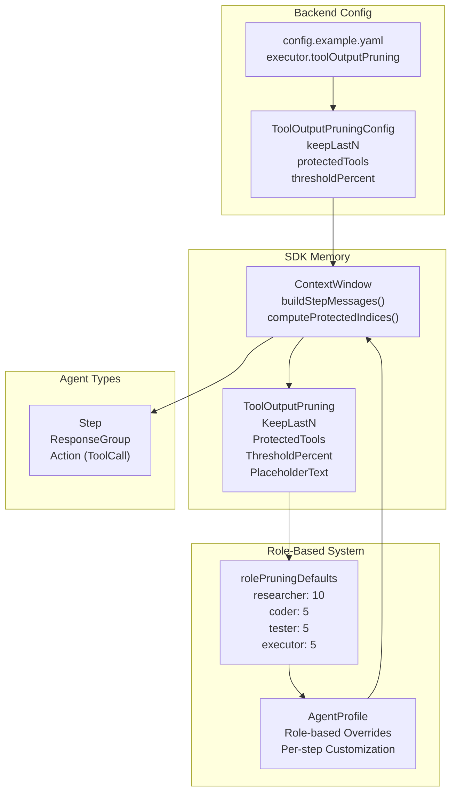
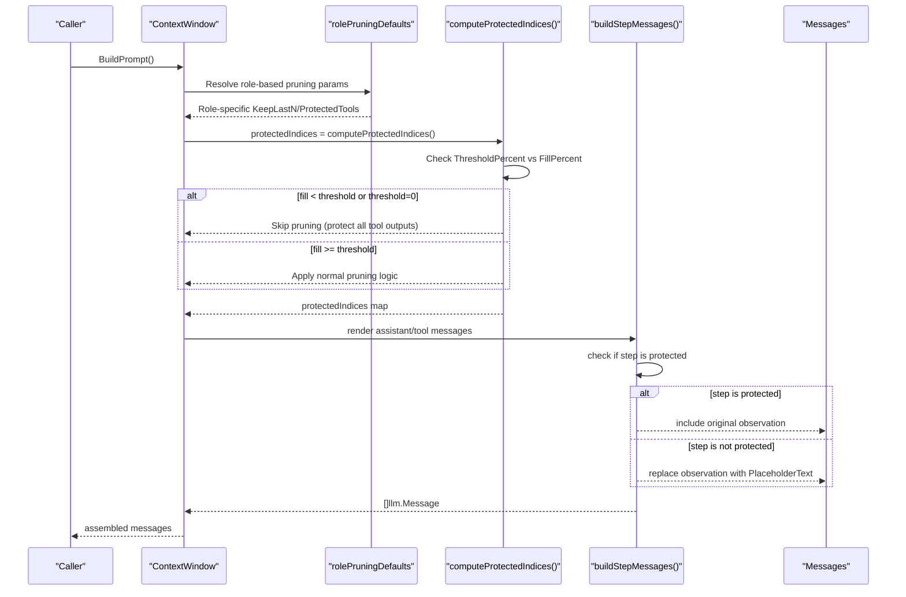
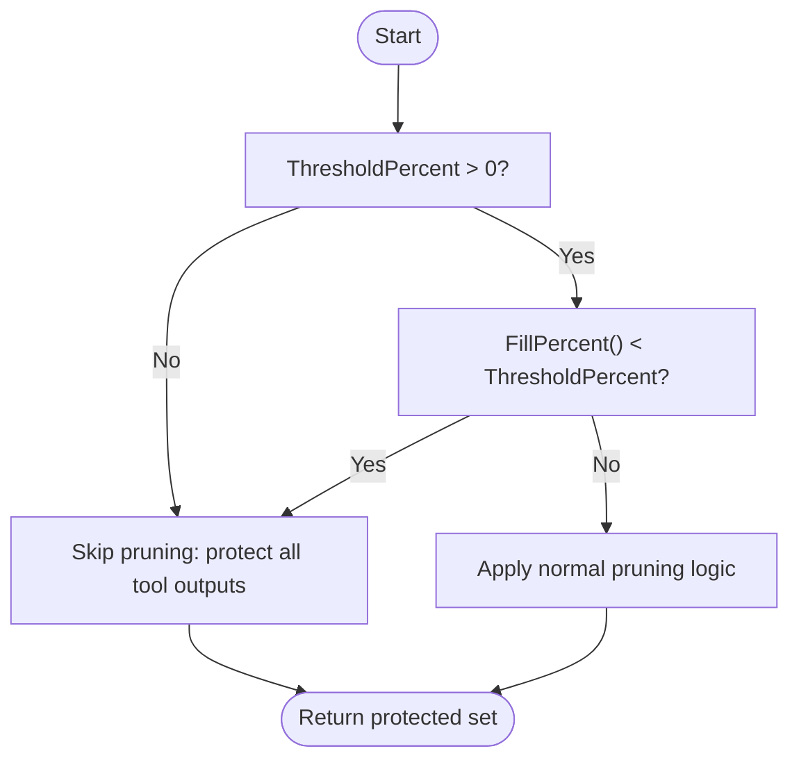
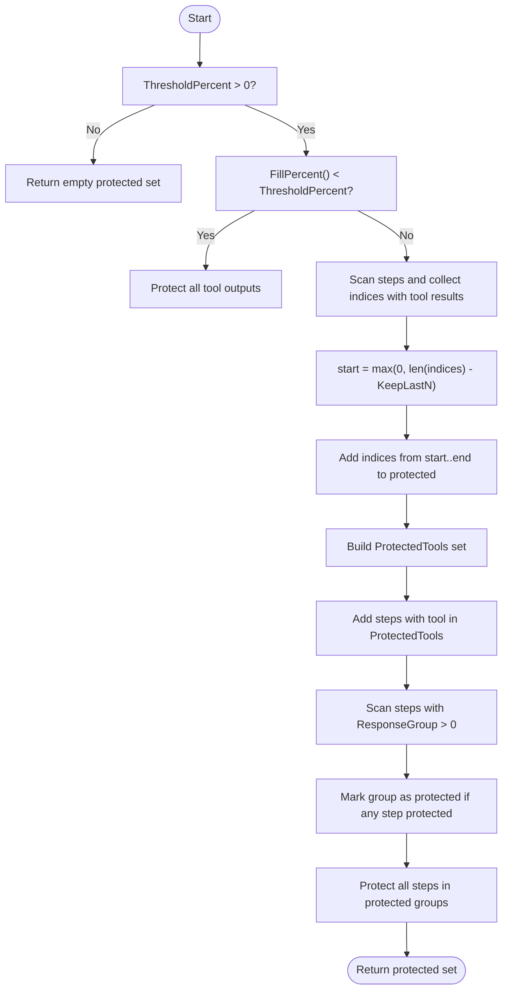
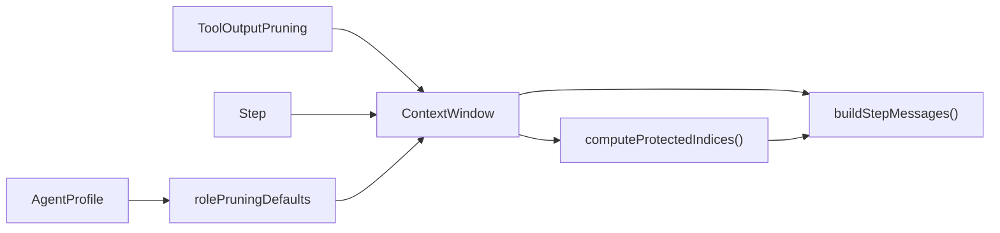

# Tool Output Pruning

<cite>
**Referenced Files in This Document**
- [context.go](file://sdk/memory/context.go)
- [context_test.go](file://sdk/memory/context_test.go)
- [types.go](file://sdk/agent/types.go)
- [config.go](file://backend/config/config.go)
- [config.example.yaml](file://config.example.yaml)
- [defaults.go](file://backend/config/defaults.go)
- [stepconfig.go](file://core/stepconfig.go)
- [types.go](file://core/types.go)
</cite>

## Update Summary
**Changes Made**
- Added adaptive pruning thresholds with thresholdPercent field for dynamic pruning control
- Introduced role-based pruning system with rolePruningDefaults for different agent roles
- Enhanced documentation with new threshold-based pruning logic and role-aware configuration
- Updated configuration examples to reflect adaptive pruning capabilities

## Table of Contents
1. [Introduction](#introduction)
2. [Project Structure](#project-structure)
3. [Core Components](#core-components)
4. [Architecture Overview](#architecture-overview)
5. [Detailed Component Analysis](#detailed-component-analysis)
6. [Dependency Analysis](#dependency-analysis)
7. [Performance Considerations](#performance-considerations)
8. [Troubleshooting Guide](#troubleshooting-guide)
9. [Conclusion](#conclusion)
10. [Appendices](#appendices)

## Introduction
This document explains C0WRK's Tool Output Pruning system, which selectively removes older tool outputs from the context window to optimize token usage while preserving critical information. The system now features adaptive pruning thresholds with configurable thresholdPercent and role-based pruning defaults that automatically adjust pruning behavior based on agent roles and context fill levels.

## Project Structure
The pruning logic lives in the SDK memory module and is driven by configuration from the backend configuration package. The system now includes role-based defaults and adaptive threshold checking that dynamically adjusts pruning behavior based on context utilization.

**Diagram sources**
- [context.go:208-388](file://sdk/memory/context.go#L208-L388)
- [types.go:19-33](file://sdk/agent/types.go#L19-L33)
- [config.go:127-131](file://backend/config/config.go#L127-L131)
- [config.example.yaml:120-124](file://config.example.yaml#L120-L124)
- [stepconfig.go:19-41](file://core/stepconfig.go#L19-L41)
- [types.go:275-285](file://core/types.go#L275-L285)

**Section sources**
- [context.go:208-388](file://sdk/memory/context.go#L208-L388)
- [config.go:127-131](file://backend/config/config.go#L127-L131)
- [config.example.yaml:120-124](file://config.example.yaml#L120-L124)
- [stepconfig.go:19-41](file://core/stepconfig.go#L19-L41)
- [types.go:275-285](file://core/types.go#L275-L285)

## Core Components
- ToolOutputPruning: Defines pruning behavior with:
  - KeepLastN: Number of most recent tool-result steps to protect
  - ProtectedTools: Tool names whose outputs are never pruned
  - ThresholdPercent: Context fill percentage below which pruning is skipped (adaptive mode)
  - PlaceholderText: Text substituted for pruned tool outputs
- ContextWindow: Manages the prompt assembly and applies pruning during BuildPrompt.
- Step: Carries ResponseGroup for grouping multiple tool calls from a single model response.
- rolePruningDefaults: Role-based pruning parameters for different agent types.
- AgentProfile: Per-step configuration that can override role defaults.

Key behaviors:
- computeProtectedIndices determines which step indices are protected based on KeepLastN, ProtectedTools, ThresholdPercent, and ResponseGroup semantics.
- buildStepMessages renders assistant/tool messages and substitutes pruned tool observations with PlaceholderText.
- Role-based pruning automatically adjusts KeepLastN and ProtectedTools based on agent role.
- Threshold-based pruning skips pruning when context fill is below configured threshold.

**Section sources**
- [context.go:22-29](file://sdk/memory/context.go#L22-L29)
- [context.go:328-388](file://sdk/memory/context.go#L328-L388)
- [context.go:208-326](file://sdk/memory/context.go#L208-L326)
- [types.go:19-33](file://sdk/agent/types.go#L19-L33)
- [stepconfig.go:19-41](file://core/stepconfig.go#L19-L41)
- [types.go:275-285](file://core/types.go#L275-L285)

## Architecture Overview
The pruning pipeline now includes adaptive threshold checking and role-based parameter resolution. It computes protected indices considering context fill levels, then renders messages while replacing non-protected tool outputs with placeholders.

**Diagram sources**
- [context.go:208-326](file://sdk/memory/context.go#L208-L326)
- [context.go:328-388](file://sdk/memory/context.go#L328-L388)
- [stepconfig.go:93-108](file://core/stepconfig.go#L93-L108)

## Detailed Component Analysis

### ToolOutputPruning Configuration
- Fields:
  - keepLastN: Controls how many recent tool-result steps are protected from pruning.
  - protectedTools: List of tool names whose outputs are never pruned.
  - thresholdPercent: Context fill percentage below which pruning is skipped (adaptive mode).
  - placeholderText: Replacement text for pruned tool outputs.
- Defaults:
  - PlaceholderText defaults to a descriptive message if not set.
  - ThresholdPercent defaults to 50% via config.ApplyDefaults.
- Backend configuration:
  - ToolOutputPruningConfig mirrors the runtime struct and is loaded under executor.toolOutputPruning in config.example.yaml.

Configuration example locations:
- Backend config struct: [ToolOutputPruningConfig:127-132](file://backend/config/config.go#L127-L132)
- Example YAML: [executor.toolOutputPruning:120-124](file://config.example.yaml#L120-L124)

Best practices:
- Set keepLastN to the minimum number of recent tool results needed to maintain continuity.
- Add critical tools (e.g., evidence-gathering tools) to protectedTools to avoid losing essential context.
- Configure thresholdPercent to balance context efficiency with information retention (50% default).
- Keep placeholderText concise but informative to guide the model to rely on earlier context.

**Section sources**
- [context.go:22-29](file://sdk/memory/context.go#L22-L29)
- [context.go:70-76](file://sdk/memory/context.go#L70-L76)
- [config.go:127-132](file://backend/config/config.go#L127-L132)
- [config.example.yaml:120-124](file://config.example.yaml#L120-L124)
- [defaults.go:85-87](file://backend/config/defaults.go#L85-L87)

### Role-Based Pruning System
The system now includes role-based pruning defaults that automatically adjust pruning parameters based on agent roles:

- **Researcher**: KeepLastN: 10, ProtectedTools: store_fact, search_facts, read_file, search_content, ripgrep, semantic_search
- **Coder**: KeepLastN: 5, ProtectedTools: store_fact, search_facts
- **Tester**: KeepLastN: 5, ProtectedTools: store_fact, search_facts, bash_exec
- **Executor**: KeepLastN: 5, ProtectedTools: store_fact, search_facts

Role-based pruning is resolved during step configuration, with explicit profile overrides taking precedence over role defaults.

**Section sources**
- [stepconfig.go:19-41](file://core/stepconfig.go#L19-L41)
- [stepconfig.go:93-108](file://core/stepconfig.go#L93-L108)
- [types.go:275-285](file://core/types.go#L275-L285)

### Adaptive Threshold-Based Pruning
The system now supports adaptive pruning thresholds controlled by thresholdPercent:

- **Threshold Logic**: Pruning is skipped when context fill percentage is below thresholdPercent.
- **Zero Value Handling**: thresholdPercent = 0 disables threshold checking (backward compatibility).
- **Dynamic Behavior**: When fill < threshold, all tool outputs are preserved; when fill ≥ threshold, normal pruning applies.

**Diagram sources**
- [context.go:371-385](file://sdk/memory/context.go#L371-L385)

**Section sources**
- [context.go:371-385](file://sdk/memory/context.go#L371-L385)
- [context_test.go:1307-1345](file://sdk/memory/context_test.go#L1307-L1345)
- [context_test.go:1347-1399](file://sdk/memory/context_test.go#L1347-L1399)

### Protected Indices Computation
The system identifies protected steps using four rules with adaptive threshold support:
1. **Threshold Check**: If thresholdPercent > 0 and fill < threshold, protect all tool outputs.
2. **Last KeepLastN steps**: Protect the most recent KeepLastN steps with tool results.
3. **ProtectedTools**: Any step whose tool name appears in ProtectedTools is protected.
4. **ResponseGroup Protection**: Entire ResponseGroups are protected if any step in the group is protected.

**Diagram sources**
- [context.go:359-435](file://sdk/memory/context.go#L359-L435)

**Section sources**
- [context.go:359-435](file://sdk/memory/context.go#L359-L435)

### Pruning Strategies and Behavior
- **Selective pruning**:
  - Only tool-result steps (where Action.ID is present) are considered for pruning.
  - Non-tool steps are unaffected.
- **Adaptive threshold behavior**:
  - When fill < thresholdPercent, pruning is completely skipped.
  - When fill ≥ thresholdPercent, normal pruning logic applies.
- **Placeholder substitution**:
  - Non-protected tool observations are replaced with PlaceholderText.
  - Empty observations are normalized to "(no output)" before pruning.
- **ResponseGroup protection**:
  - When multiple tool calls originate from a single model response, they share a ResponseGroup.
  - If any step in the group is protected, the entire group is protected to maintain API message integrity.

Validation via tests:
- Threshold-based pruning with low threshold: [TestPruningThreshold_SmallContextWindow:1347-1399](file://sdk/memory/context_test.go#L1347-L1399)
- Threshold=0 disables pruning: [TestPruningThreshold_ZeroMeansDisabled:1307-1345](file://sdk/memory/context_test.go#L1307-L1345)
- Keeping last N tool results: [TestPruningKeepsLastN:810-854](file://sdk/memory/context_test.go#L810-L854)
- Protecting specific tools: [TestPruningProtectsTools:856-914](file://sdk/memory/context_test.go#L856-L914)
- Skipping non-tool steps: [TestPruningSkipsNonToolSteps:915-973](file://sdk/memory/context_test.go#L915-L973)
- Disabling pruning when KeepLastN is zero: [TestPruningDisabledWhenKeepLastNZero:975-990](file://sdk/memory/context_test.go#L975-L990)
- Group-aware protection: [TestPruningGroupAwareness_ProtectsEntireGroup:1127-1186](file://sdk/memory/context_test.go#L1127-L1186)

**Section sources**
- [context.go:208-326](file://sdk/memory/context.go#L208-L326)
- [context_test.go:1307-1345](file://sdk/memory/context_test.go#L1307-L1345)
- [context_test.go:1347-1399](file://sdk/memory/context_test.go#L1347-L1399)
- [context_test.go:810-854](file://sdk/memory/context_test.go#L810-L854)
- [context_test.go:856-914](file://sdk/memory/context_test.go#L856-L914)
- [context_test.go:915-973](file://sdk/memory/context_test.go#L915-L973)
- [context_test.go:975-990](file://sdk/memory/context_test.go#L975-L990)
- [context_test.go:1127-1186](file://sdk/memory/context_test.go#L1127-L1186)

### ResponseGroup Protection Mechanisms
- ResponseGroup links steps that originated from the same model response with multiple tool calls.
- During rendering, these steps are combined into a single assistant message with multiple tool_calls, followed by individual tool result messages.
- If any step in the group is protected, all tool results in that group are protected to avoid mismatched assistant/tool counts.

Validation via tests:
- Grouped steps rendering: [TestBuildStepMessages_GroupedSteps:1031-1052](file://sdk/memory/context_test.go#L1031-L1052)
- Backward compatibility for ResponseGroup == 0: [TestBuildStepMessages_GroupedStepsBackwardCompat:1188-1212](file://sdk/memory/context_test.go#L1188-L1212)

**Section sources**
- [context.go:222-271](file://sdk/memory/context.go#L222-L271)
- [types.go:28-32](file://sdk/agent/types.go#L28-L32)
- [context_test.go:1031-1052](file://sdk/memory/context_test.go#L1031-L1052)
- [context_test.go:1188-1212](file://sdk/memory/context_test.go#L1188-L1212)

### Placeholder System for Omitted Tool Outputs
- Purpose: Maintain API message integrity by substituting pruned tool outputs with a placeholder.
- Default placeholder text is applied if not configured.
- Empty observations are normalized to "(no output)" before pruning.

Behavior references:
- Placeholder default and normalization: [context.go:250-257](file://sdk/memory/context.go#L250-L257)
- Placeholder default initialization: [context.go:70-76](file://sdk/memory/context.go#L70-L76)

**Section sources**
- [context.go:250-257](file://sdk/memory/context.go#L250-L257)
- [context.go:70-76](file://sdk/memory/context.go#L70-L76)

### Practical Pruning Configuration Examples
- **Minimal pruning (keep last 1)**:
  - keepLastN: 1
  - protectedTools: []
  - thresholdPercent: 50
  - Use case: Very tight context budgets where only the most recent tool result is needed.
- **Balanced pruning (keep last 3 with critical tool protection)**:
  - keepLastN: 3
  - protectedTools: ["read_file", "web_search"]
  - thresholdPercent: 50
  - Use case: General-purpose agents that need recent context plus key tool outputs.
- **Conservative pruning (keep last 5 with strong protection)**:
  - keepLastN: 5
  - protectedTools: ["read_evidence", "analyze_data"]
  - thresholdPercent: 50
  - Use case: Research or analysis tasks requiring broader recent context.
- **Adaptive pruning for research agents**:
  - Role: researcher
  - keepLastN: 10 (role default)
  - protectedTools: ["store_fact", "search_facts", "read_file", "search_content", "ripgrep", "semantic_search"]
  - thresholdPercent: 50
  - Use case: Research tasks requiring extensive context retention with automatic role-based optimization.

Configuration locations:
- Backend config struct: [ToolOutputPruningConfig:127-132](file://backend/config/config.go#L127-L132)
- Example YAML: [executor.toolOutputPruning:120-124](file://config.example.yaml#L120-L124)
- Role-based defaults: [rolePruningDefaults:19-41](file://core/stepconfig.go#L19-L41)

**Section sources**
- [config.go:127-132](file://backend/config/config.go#L127-L132)
- [config.example.yaml:120-124](file://config.example.yaml#L120-L124)
- [stepconfig.go:19-41](file://core/stepconfig.go#L19-L41)

## Dependency Analysis
- ContextWindow depends on:
  - ToolOutputPruning for pruning configuration
  - Step for ResponseGroup and tool call metadata
  - rolePruningDefaults for role-based parameter resolution
- computeProtectedIndices depends on:
  - KeepLastN ordering of tool-result steps
  - ProtectedTools lookup
  - ThresholdPercent vs FillPercent comparison
  - ResponseGroup grouping logic
- buildStepMessages depends on:
  - computeProtectedIndices for protection decisions
  - PlaceholderText for substitutions

**Diagram sources**
- [context.go:22-29](file://sdk/memory/context.go#L22-L29)
- [context.go:28-43](file://sdk/memory/context.go#L28-L43)
- [context.go:208-326](file://sdk/memory/context.go#L208-L326)
- [context.go:328-388](file://sdk/memory/context.go#L328-L388)
- [stepconfig.go:19-41](file://core/stepconfig.go#L19-L41)
- [types.go:275-285](file://core/types.go#L275-L285)

**Section sources**
- [context.go:22-29](file://sdk/memory/context.go#L22-L29)
- [context.go:28-43](file://sdk/memory/context.go#L28-L43)
- [context.go:208-326](file://sdk/memory/context.go#L208-L326)
- [context.go:328-388](file://sdk/memory/context.go#L328-L388)
- [stepconfig.go:19-41](file://core/stepconfig.go#L19-L41)
- [types.go:275-285](file://core/types.go#L275-L285)

## Performance Considerations
- **KeepLastN impacts memory and token usage**:
  - Larger KeepLastN preserves more recent tool outputs, reducing re-execution risk but increasing context size.
  - Smaller KeepLastN saves tokens but risks losing crucial intermediate results.
- **ThresholdPercent optimization**:
  - Lower thresholds preserve more context but may miss pruning opportunities.
  - Higher thresholds enable more aggressive pruning but risk losing important context.
- **Role-based pruning benefits**:
  - Researcher role maintains extensive context for thorough analysis.
  - Coder/tester roles optimize for development workflows with moderate context retention.
- **ProtectedTools reduce re-execution** by ensuring critical outputs remain visible.
- **ResponseGroup protection avoids partial pruning**, preventing malformed assistant/tool message pairs that could cause API errors.

## Troubleshooting Guide
Common issues and resolutions:
- **API errors due to malformed assistant/tool pairs**:
  - Cause: Partial pruning of grouped tool calls.
  - Resolution: Ensure ResponseGroup protection is active; do not set KeepLastN low enough to prune entire protected groups.
  - Reference: [ResponseGroup protection:370-385](file://sdk/memory/context.go#L370-L385)
- **Unexpected pruning of critical tool outputs**:
  - Cause: Missing tool name in ProtectedTools.
  - Resolution: Add tool names to protectedTools in configuration or use role-based defaults.
  - Reference: [ProtectedTools logic:357-368](file://sdk/memory/context.go#L357-L368)
- **Pruning not occurring when expected**:
  - Cause: Context fill below thresholdPercent.
  - Resolution: Increase thresholdPercent or reduce context fill by using compaction strategies.
  - Reference: [Threshold logic:371-385](file://sdk/memory/context.go#L371-L385)
- **Pruning always active despite threshold configuration**:
  - Cause: thresholdPercent = 0 (disabled).
  - Resolution: Set thresholdPercent to desired value or remove to use default (50%).
  - Reference: [Threshold=0 behavior:1307-1345](file://sdk/memory/context_test.go#L1307-L1345)
- **Placeholder text not appearing**:
  - Cause: PlaceholderText not set or pruning disabled (KeepLastN <= 0).
  - Resolution: Set PlaceholderText or increase KeepLastN.
  - Reference: [Placeholder default and condition:70-76](file://sdk/memory/context.go#L70-L76), [Pruning condition:255-257](file://sdk/memory/context.go#L255-L257)
- **Non-tool steps being pruned**:
  - Cause: Misunderstanding; non-tool steps are intentionally not pruned.
  - Resolution: No action needed; this is expected behavior.
  - Reference: [Non-tool step handling:274-324](file://sdk/memory/context.go#L274-L324)

**Section sources**
- [context.go:370-385](file://sdk/memory/context.go#L370-L385)
- [context.go:357-368](file://sdk/memory/context.go#L357-L368)
- [context.go:70-76](file://sdk/memory/context.go#L70-L76)
- [context.go:255-257](file://sdk/memory/context.go#L255-L257)
- [context.go:274-324](file://sdk/memory/context.go#L274-L324)
- [context_test.go:1307-1345](file://sdk/memory/context_test.go#L1307-L1345)

## Conclusion
C0WRK's Tool Output Pruning system provides a robust, configurable mechanism to manage context size while preserving critical information. The enhanced system now features adaptive threshold-based pruning that dynamically adjusts behavior based on context utilization, and role-based pruning defaults that automatically optimize pruning parameters for different agent types. By combining last-N protection, explicit tool protection, threshold-based adaptive logic, and role-aware configuration, it ensures API message integrity and minimizes re-execution risk while maximizing context efficiency across diverse use cases.

## Appendices

### Configuration Reference
- Backend config struct: [ToolOutputPruningConfig:127-132](file://backend/config/config.go#L127-L132)
- Example YAML: [executor.toolOutputPruning:120-124](file://config.example.yaml#L120-L124)
- Role-based defaults: [rolePruningDefaults:19-41](file://core/stepconfig.go#L19-L41)

### Role-Based Pruning Parameters
- **Researcher**: KeepLastN: 10, ProtectedTools: store_fact, search_facts, read_file, search_content, ripgrep, semantic_search
- **Coder**: KeepLastN: 5, ProtectedTools: store_fact, search_facts
- **Tester**: KeepLastN: 5, ProtectedTools: store_fact, search_facts, bash_exec
- **Executor**: KeepLastN: 5, ProtectedTools: store_fact, search_facts

**Section sources**
- [config.go:127-132](file://backend/config/config.go#L127-L132)
- [config.example.yaml:120-124](file://config.example.yaml#L120-L124)
- [stepconfig.go:19-41](file://core/stepconfig.go#L19-L41)