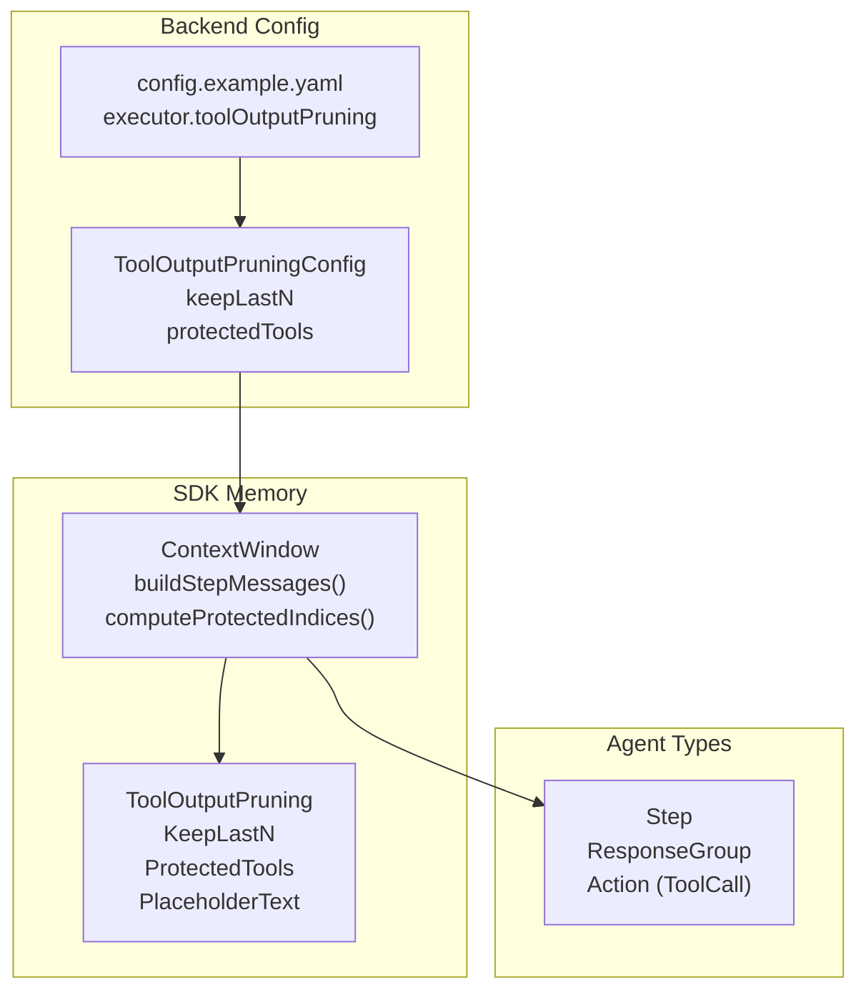
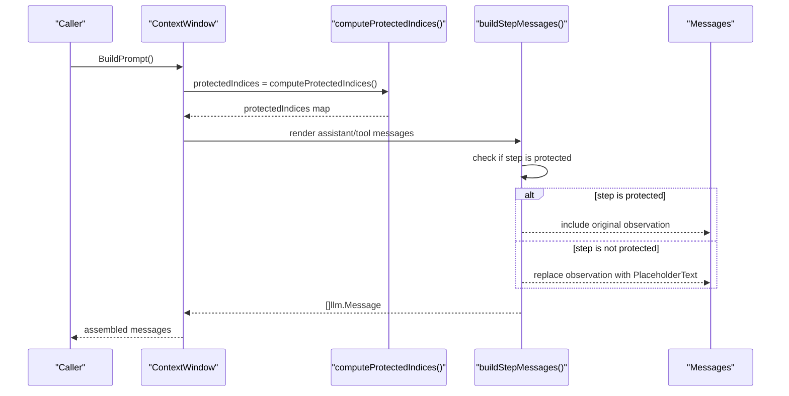
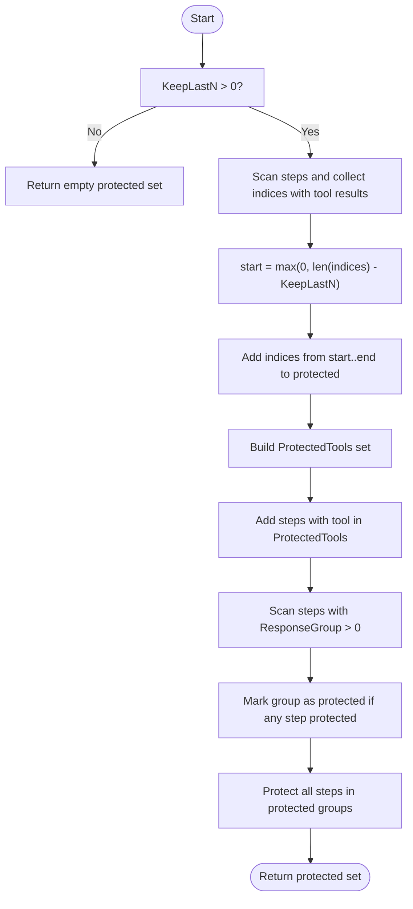
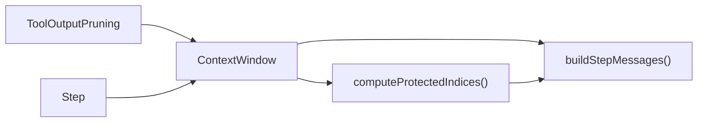

# Tool Output Pruning

<cite>
**Referenced Files in This Document**
- [context.go](file://sdk/memory/context.go)
- [context_test.go](file://sdk/memory/context_test.go)
- [types.go](file://sdk/agent/types.go)
- [config.go](file://backend/config/config.go)
- [config.example.yaml](file://config.example.yaml)
</cite>

## Table of Contents
1. [Introduction](#introduction)
2. [Project Structure](#project-structure)
3. [Core Components](#core-components)
4. [Architecture Overview](#architecture-overview)
5. [Detailed Component Analysis](#detailed-component-analysis)
6. [Dependency Analysis](#dependency-analysis)
7. [Performance Considerations](#performance-considerations)
8. [Troubleshooting Guide](#troubleshooting-guide)
9. [Conclusion](#conclusion)
10. [Appendices](#appendices)

## Introduction
This document explains C0WRK’s Tool Output Pruning system, which selectively removes older tool outputs from the context window to optimize token usage while preserving critical information. It covers the ToolOutputPruning configuration, protective mechanisms for important tools and response groups, placeholder substitution for omitted outputs, and best practices for balancing context efficiency with information retention.

## Project Structure
The pruning logic lives in the SDK memory module and is driven by configuration from the backend configuration package. Tests validate pruning behavior across scenarios such as keeping the last N tool results, protecting specific tools, and handling grouped tool calls.

**Diagram sources**
- [context.go:208-388](file://sdk/memory/context.go#L208-L388)
- [types.go:19-33](file://sdk/agent/types.go#L19-L33)
- [config.go:127-131](file://backend/config/config.go#L127-L131)
- [config.example.yaml:120-124](file://config.example.yaml#L120-L124)

**Section sources**
- [context.go:208-388](file://sdk/memory/context.go#L208-L388)
- [config.go:127-131](file://backend/config/config.go#L127-L131)
- [config.example.yaml:120-124](file://config.example.yaml#L120-L124)

## Core Components
- ToolOutputPruning: Defines pruning behavior with:
  - KeepLastN: Number of most recent tool-result steps to protect
  - ProtectedTools: Tool names whose outputs are never pruned
  - PlaceholderText: Text substituted for pruned tool outputs
- ContextWindow: Manages the prompt assembly and applies pruning during BuildPrompt.
- Step: Carries ResponseGroup for grouping multiple tool calls from a single model response.

Key behaviors:
- computeProtectedIndices determines which step indices are protected based on KeepLastN, ProtectedTools, and ResponseGroup semantics.
- buildStepMessages renders assistant/tool messages and substitutes pruned tool observations with PlaceholderText.
- Default placeholder text is applied when not configured.

**Section sources**
- [context.go:20-25](file://sdk/memory/context.go#L20-L25)
- [context.go:328-388](file://sdk/memory/context.go#L328-L388)
- [context.go:208-326](file://sdk/memory/context.go#L208-L326)
- [types.go:19-33](file://sdk/agent/types.go#L19-L33)

## Architecture Overview
The pruning pipeline runs during prompt construction. It computes protected indices, then renders messages while replacing non-protected tool outputs with placeholders.

**Diagram sources**
- [context.go:208-326](file://sdk/memory/context.go#L208-L326)
- [context.go:328-388](file://sdk/memory/context.go#L328-L388)

## Detailed Component Analysis

### ToolOutputPruning Configuration
- Fields:
  - keepLastN: Controls how many recent tool-result steps are protected from pruning.
  - protectedTools: List of tool names whose outputs are never pruned.
  - placeholderText: Replacement text for pruned tool outputs.
- Defaults:
  - PlaceholderText defaults to a descriptive message if not set.
- Backend configuration:
  - ToolOutputPruningConfig mirrors the runtime struct and is loaded under executor.toolOutputPruning in config.example.yaml.

Configuration example locations:
- Backend config struct: [ToolOutputPruningConfig:127-131](file://backend/config/config.go#L127-L131)
- Example YAML: [executor.toolOutputPruning:120-124](file://config.example.yaml#L120-L124)

Best practices:
- Set keepLastN to the minimum number of recent tool results needed to maintain continuity.
- Add critical tools (e.g., evidence-gathering tools) to protectedTools to avoid losing essential context.
- Keep placeholderText concise but informative to guide the model to rely on earlier context.

**Section sources**
- [context.go:20-25](file://sdk/memory/context.go#L20-L25)
- [context.go:70-72](file://sdk/memory/context.go#L70-L72)
- [config.go:127-131](file://backend/config/config.go#L127-L131)
- [config.example.yaml:120-124](file://config.example.yaml#L120-L124)

### Protected Indices Computation
The system identifies protected steps using three rules:
1. Last KeepLastN steps with tool results are protected.
2. Any step whose tool name appears in ProtectedTools is protected.
3. Entire ResponseGroups are protected if any step in the group is protected.

**Diagram sources**
- [context.go:328-388](file://sdk/memory/context.go#L328-L388)

**Section sources**
- [context.go:328-388](file://sdk/memory/context.go#L328-L388)

### Pruning Strategies and Behavior
- Selective pruning:
  - Only tool-result steps (where Action.ID is present) are considered for pruning.
  - Non-tool steps are unaffected.
- Placeholder substitution:
  - Non-protected tool observations are replaced with PlaceholderText.
  - Empty observations are normalized to "(no output)" before pruning.
- ResponseGroup protection:
  - When multiple tool calls originate from a single model response, they share a ResponseGroup.
  - If any step in the group is protected, the entire group is protected to maintain API message integrity.

Validation via tests:
- Keeping last N tool results: [TestPruningKeepsLastN:810-854](file://sdk/memory/context_test.go#L810-L854)
- Protecting specific tools: [TestPruningProtectsTools:856-914](file://sdk/memory/context_test.go#L856-L914)
- Skipping non-tool steps: [TestPruningSkipsNonToolSteps:915-973](file://sdk/memory/context_test.go#L915-L973)
- Disabling pruning when KeepLastN is zero: [TestPruningDisabledWhenKeepLastNZero:975-990](file://sdk/memory/context_test.go#L975-L990)
- Group-aware protection: [TestPruningGroupAwareness_ProtectsEntireGroup:1127-1186](file://sdk/memory/context_test.go#L1127-L1186)

**Section sources**
- [context.go:208-326](file://sdk/memory/context.go#L208-L326)
- [context_test.go:810-854](file://sdk/memory/context_test.go#L810-L854)
- [context_test.go:856-914](file://sdk/memory/context_test.go#L856-L914)
- [context_test.go:915-973](file://sdk/memory/context_test.go#L915-L973)
- [context_test.go:975-990](file://sdk/memory/context_test.go#L975-L990)
- [context_test.go:1127-1186](file://sdk/memory/context_test.go#L1127-L1186)

### ResponseGroup Protection Mechanisms
- ResponseGroup links steps that originated from the same model response with multiple tool calls.
- During rendering, these steps are combined into a single assistant message with multiple tool_calls, followed by individual tool result messages.
- If any step in the group is protected, all tool results in that group are protected to avoid mismatched assistant/tool counts.

Validation via tests:
- Grouped steps rendering: [TestBuildStepMessages_GroupedSteps:1031-1052](file://sdk/memory/context_test.go#L1031-L1052)
- Backward compatibility for ResponseGroup == 0: [TestBuildStepMessages_GroupedStepsBackwardCompat:1188-1212](file://sdk/memory/context_test.go#L1188-L1212)

**Section sources**
- [context.go:222-271](file://sdk/memory/context.go#L222-L271)
- [types.go:28-32](file://sdk/agent/types.go#L28-L32)
- [context_test.go:1031-1052](file://sdk/memory/context_test.go#L1031-L1052)
- [context_test.go:1188-1212](file://sdk/memory/context_test.go#L1188-L1212)

### Placeholder System for Omitted Tool Outputs
- Purpose: Maintain API message integrity by substituting pruned tool outputs with a placeholder.
- Default placeholder text is applied if not configured.
- Empty observations are normalized to "(no output)" before pruning.

Behavior references:
- Placeholder default and normalization: [context.go:250-257](file://sdk/memory/context.go#L250-L257)
- Placeholder default initialization: [context.go:70-72](file://sdk/memory/context.go#L70-L72)

**Section sources**
- [context.go:250-257](file://sdk/memory/context.go#L250-L257)
- [context.go:70-72](file://sdk/memory/context.go#L70-L72)

### Practical Pruning Configuration Examples
- Minimal pruning (keep last 1):
  - keepLastN: 1
  - protectedTools: []
  - Use case: Very tight context budgets where only the most recent tool result is needed.
- Balanced pruning (keep last 3 with critical tool protection):
  - keepLastN: 3
  - protectedTools: ["read_file", "web_search"]
  - Use case: General-purpose agents that need recent context plus key tool outputs.
- Conservative pruning (keep last 5 with strong protection):
  - keepLastN: 5
  - protectedTools: ["read_evidence", "analyze_data"]
  - Use case: Research or analysis tasks requiring broader recent context.

Configuration locations:
- Backend config struct: [ToolOutputPruningConfig:127-131](file://backend/config/config.go#L127-L131)
- Example YAML: [executor.toolOutputPruning:120-124](file://config.example.yaml#L120-L124)

**Section sources**
- [config.go:127-131](file://backend/config/config.go#L127-L131)
- [config.example.yaml:120-124](file://config.example.yaml#L120-L124)

## Dependency Analysis
- ContextWindow depends on:
  - ToolOutputPruning for pruning configuration
  - Step for ResponseGroup and tool call metadata
- computeProtectedIndices depends on:
  - KeepLastN ordering of tool-result steps
  - ProtectedTools lookup
  - ResponseGroup grouping logic
- buildStepMessages depends on:
  - computeProtectedIndices for protection decisions
  - PlaceholderText for substitutions

**Diagram sources**
- [context.go:20-25](file://sdk/memory/context.go#L20-L25)
- [context.go:28-43](file://sdk/memory/context.go#L28-L43)
- [context.go:208-326](file://sdk/memory/context.go#L208-L326)
- [context.go:328-388](file://sdk/memory/context.go#L328-L388)

**Section sources**
- [context.go:20-25](file://sdk/memory/context.go#L20-L25)
- [context.go:28-43](file://sdk/memory/context.go#L28-L43)
- [context.go:208-326](file://sdk/memory/context.go#L208-L326)
- [context.go:328-388](file://sdk/memory/context.go#L328-L388)

## Performance Considerations
- KeepLastN impacts memory and token usage:
  - Larger KeepLastN preserves more recent tool outputs, reducing re-execution risk but increasing context size.
  - Smaller KeepLastN saves tokens but risks losing crucial intermediate results.
- ProtectedTools reduce re-execution by ensuring critical outputs remain visible.
- ResponseGroup protection avoids partial pruning, preventing malformed assistant/tool message pairs that could cause API errors.

[No sources needed since this section provides general guidance]

## Troubleshooting Guide
Common issues and resolutions:
- API errors due to malformed assistant/tool pairs:
  - Cause: Partial pruning of grouped tool calls.
  - Resolution: Ensure ResponseGroup protection is active; do not set KeepLastN low enough to prune entire protected groups.
  - Reference: [ResponseGroup protection:370-385](file://sdk/memory/context.go#L370-L385)
- Unexpected pruning of critical tool outputs:
  - Cause: Missing tool name in ProtectedTools.
  - Resolution: Add tool names to protectedTools in configuration.
  - Reference: [ProtectedTools logic:357-368](file://sdk/memory/context.go#L357-L368)
- Placeholder text not appearing:
  - Cause: PlaceholderText not set or pruning disabled (KeepLastN <= 0).
  - Resolution: Set PlaceholderText or increase KeepLastN.
  - Reference: [Placeholder default and condition:70-72](file://sdk/memory/context.go#L70-L72), [Pruning condition:255-257](file://sdk/memory/context.go#L255-L257)
- Non-tool steps being pruned:
  - Cause: Misunderstanding; non-tool steps are intentionally not pruned.
  - Resolution: No action needed; this is expected behavior.
  - Reference: [Non-tool step handling:274-324](file://sdk/memory/context.go#L274-L324)

**Section sources**
- [context.go:370-385](file://sdk/memory/context.go#L370-L385)
- [context.go:357-368](file://sdk/memory/context.go#L357-L368)
- [context.go:70-72](file://sdk/memory/context.go#L70-L72)
- [context.go:255-257](file://sdk/memory/context.go#L255-L257)
- [context.go:274-324](file://sdk/memory/context.go#L274-L324)

## Conclusion
C0WRK’s Tool Output Pruning system provides a robust, configurable mechanism to manage context size while preserving critical information. By combining last-N protection, explicit tool protection, and ResponseGroup-aware logic, it ensures API message integrity and minimizes re-execution risk. Proper configuration of keepLastN and protectedTools enables balancing context efficiency with information retention across diverse use cases.

[No sources needed since this section summarizes without analyzing specific files]

## Appendices

### Configuration Reference
- Backend config struct: [ToolOutputPruningConfig:127-131](file://backend/config/config.go#L127-L131)
- Example YAML: [executor.toolOutputPruning:120-124](file://config.example.yaml#L120-L124)

**Section sources**
- [config.go:127-131](file://backend/config/config.go#L127-L131)
- [config.example.yaml:120-124](file://config.example.yaml#L120-L124)