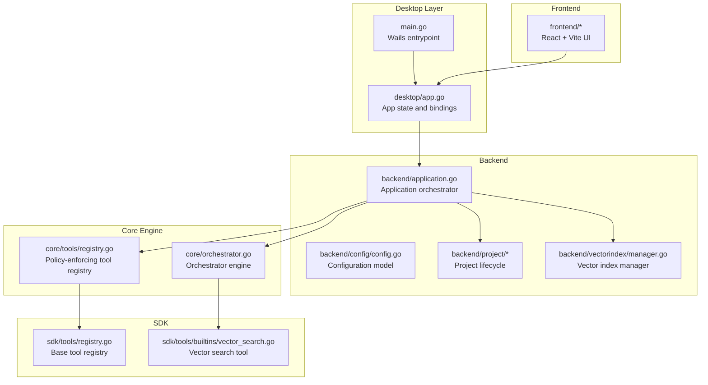
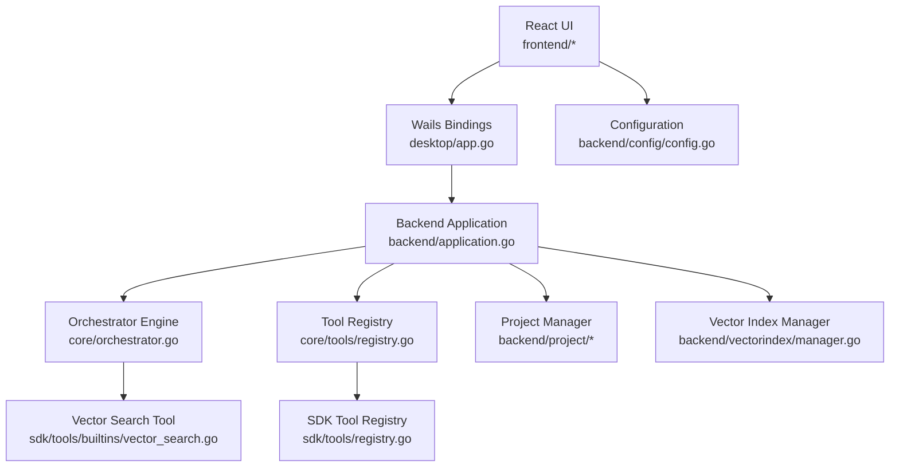
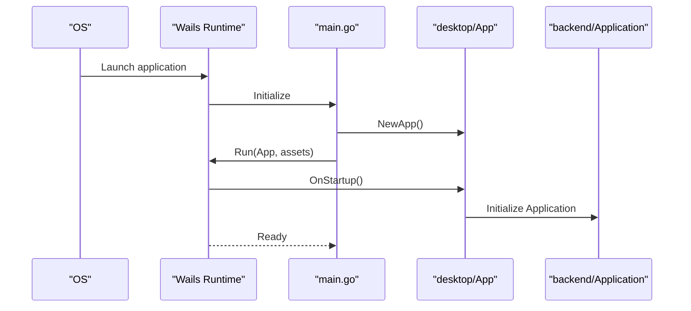
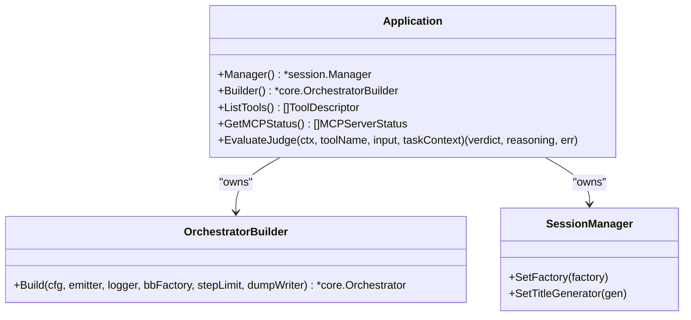
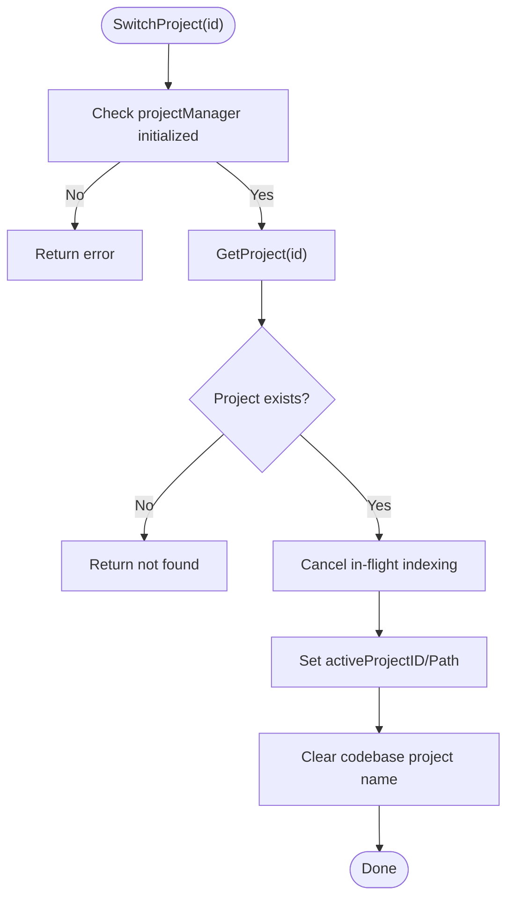
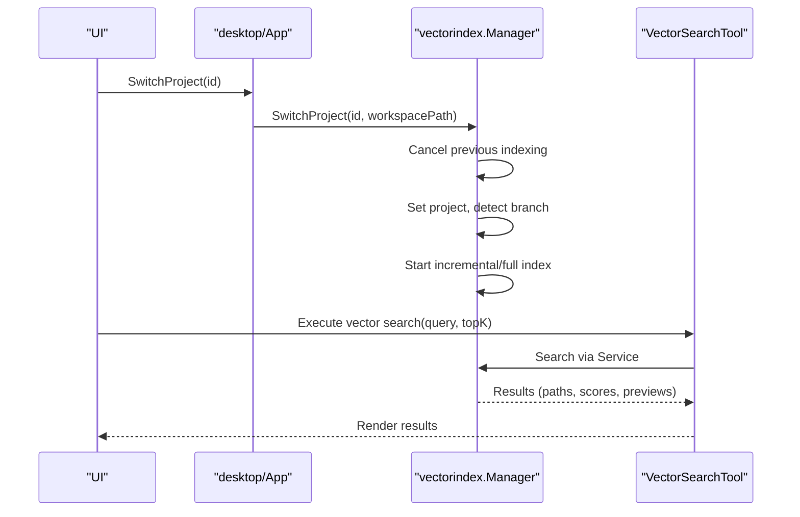
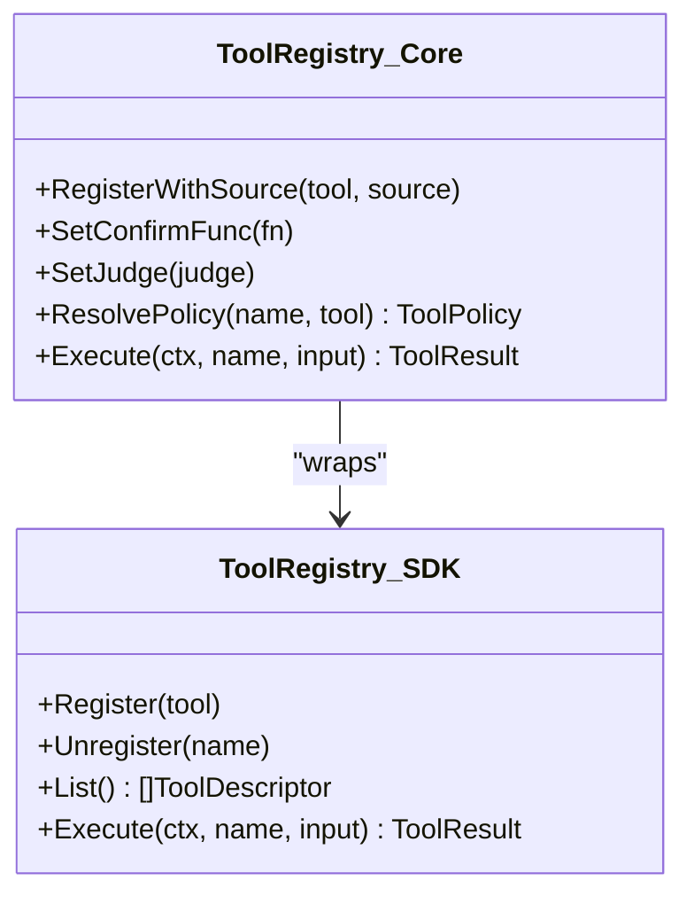
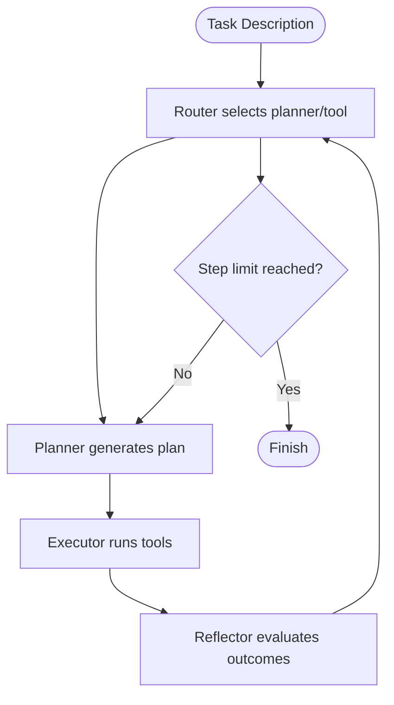
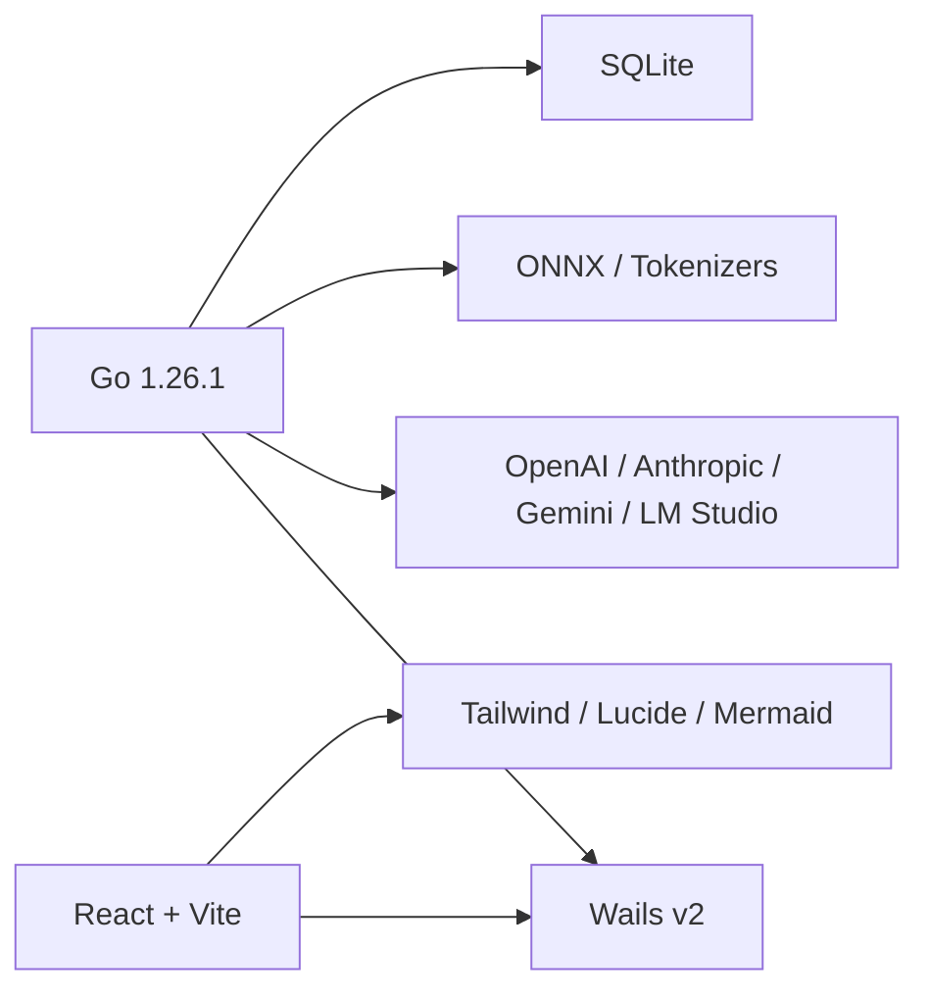

# Project Overview

<cite>
**Referenced Files in This Document**
- [main.go](file://main.go)
- [wails.json](file://wails.json)
- [go.mod](file://go.mod)
- [desktop/app.go](file://desktop/app.go)
- [backend/application.go](file://backend/application.go)
- [backend/config/config.go](file://backend/config/config.go)
- [backend/project/project.go](file://backend/project/project.go)
- [backend/project/manager.go](file://backend/project/manager.go)
- [backend/vectorindex/manager.go](file://backend/vectorindex/manager.go)
- [sdk/tools/builtins/vector_search.go](file://sdk/tools/builtins/vector_search.go)
- [core/orchestrator.go](file://core/orchestrator.go)
- [core/tools/registry.go](file://core/tools/registry.go)
- [sdk/tools/registry.go](file://sdk/tools/registry.go)
- [frontend/package.json](file://frontend/package.json)
</cite>

## Table of Contents
1. [Introduction](#introduction)
2. [Project Structure](#project-structure)
3. [Core Components](#core-components)
4. [Architecture Overview](#architecture-overview)
5. [Detailed Component Analysis](#detailed-component-analysis)
6. [Dependency Analysis](#dependency-analysis)
7. [Performance Considerations](#performance-considerations)
8. [Troubleshooting Guide](#troubleshooting-guide)
9. [Conclusion](#conclusion)
10. [Appendices](#appendices)

## Introduction
C0WRK is an intelligent desktop AI coding assistant designed to augment developers with AI-powered reasoning, planning, and tooling. Its purpose is to streamline complex development tasks by orchestrating AI agents, a rich tool ecosystem, and persistent session management within a secure, isolated workspace. The platform emphasizes:
- Intelligent task orchestration with planning, reflection, and adaptive execution
- AI-powered code assistance powered by configurable LLM providers
- Project-centric workspaces with isolation and persistence
- Extensible tool ecosystem supporting built-in tools, MCP servers, and custom integrations
- Vector-based semantic search for fast, concept-aware codebase exploration

Target audience:
- Software engineers and developers who want a capable AI copilot integrated into their desktop workflow
- Teams needing a secure, local-first environment for AI-assisted coding
- Advanced users comfortable with CLI-backed tools who benefit from a GUI for orchestration and visibility

Core value proposition:
- Reduce cognitive load by turning ambiguous goals into executable plans
- Accelerate codebase onboarding and discovery with semantic search
- Safely automate risky operations with policy enforcement and confirmations
- Keep sessions, plans, and reflections persistent for continuity across sprints

## Project Structure
At a high level, C0WRK is organized into three primary layers:
- Backend: Go-based orchestration, configuration, session management, vector indexing, and project lifecycle
- Core: Agent orchestration engine, planner, router, and tool registry abstractions
- Frontend: React-based UI built with Vite, Tailwind, and TypeScript, communicating with the backend via Wails bindings

**Diagram sources**
- [main.go:18-44](file://main.go#L18-L44)
- [desktop/app.go:19-72](file://desktop/app.go#L19-L72)
- [backend/application.go:43-133](file://backend/application.go#L43-L133)
- [backend/config/config.go:18-32](file://backend/config/config.go#L18-L32)
- [backend/project/manager.go:13-43](file://backend/project/manager.go#L13-L43)
- [backend/vectorindex/manager.go:97-222](file://backend/vectorindex/manager.go#L97-L222)
- [core/orchestrator.go:55-189](file://core/orchestrator.go#L55-L189)
- [core/tools/registry.go:35-100](file://core/tools/registry.go#L35-L100)
- [sdk/tools/registry.go:11-40](file://sdk/tools/registry.go#L11-L40)
- [sdk/tools/builtins/vector_search.go:32-46](file://sdk/tools/builtins/vector_search.go#L32-L46)

**Section sources**
- [main.go:18-44](file://main.go#L18-L44)
- [wails.json:1-13](file://wails.json#L1-L13)
- [frontend/package.json:14-37](file://frontend/package.json#L14-L37)

## Core Components
- Desktop application and bindings
  - The desktop layer initializes the Wails app, binds the backend Application to the frontend, and manages UI lifecycle events.
  - It maintains references to the backend Application, session manager, project manager, vector index manager, and workspace watcher.

- Backend Application
  - Central orchestrator that wires together the orchestrator builder, session manager, event persistence, and optional vector search integration.
  - Provides APIs for tool listing, MCP server status, and on-demand judge evaluations.

- Configuration
  - Strongly typed YAML configuration covering LLM providers, MCP servers, memory, router, executor, security, search, timeouts, and orchestration settings.

- Project Management
  - Manages project lifecycles, including creation, listing, activation, and activity tracking with workspace isolation.

- Vector Index Manager
  - Handles project-scoped vector indexing, incremental updates, and git branch monitoring for semantic search.

- Core Orchestrator
  - Implements the Plan&Execute loop, integrates planner, router, tool registry, and memory compaction strategies, and supports reflection and step limits.

- Tool Registry
  - Policy-enforcing registry layered atop the SDK’s base registry, with support for confirmation callbacks, judge evaluation, filters, and parameter injection.

**Section sources**
- [desktop/app.go:19-72](file://desktop/app.go#L19-L72)
- [backend/application.go:43-133](file://backend/application.go#L43-L133)
- [backend/config/config.go:18-32](file://backend/config/config.go#L18-L32)
- [backend/project/project.go:5-24](file://backend/project/project.go#L5-L24)
- [backend/project/manager.go:13-43](file://backend/project/manager.go#L13-L43)
- [backend/vectorindex/manager.go:97-222](file://backend/vectorindex/manager.go#L97-L222)
- [core/orchestrator.go:55-189](file://core/orchestrator.go#L55-L189)
- [core/tools/registry.go:35-100](file://core/tools/registry.go#L35-L100)
- [sdk/tools/registry.go:11-40](file://sdk/tools/registry.go#L11-L40)

## Architecture Overview
C0WRK combines a Wails desktop runtime with a Go backend and a React frontend. The backend encapsulates the AI orchestration engine, tooling, and persistence, while the frontend provides a rich UI for chat, file browsing, project management, and settings.

**Diagram sources**
- [main.go:18-44](file://main.go#L18-L44)
- [desktop/app.go:19-72](file://desktop/app.go#L19-L72)
- [backend/application.go:43-133](file://backend/application.go#L43-L133)
- [core/orchestrator.go:55-189](file://core/orchestrator.go#L55-L189)
- [core/tools/registry.go:35-100](file://core/tools/registry.go#L35-L100)
- [sdk/tools/registry.go:11-40](file://sdk/tools/registry.go#L11-L40)
- [backend/vectorindex/manager.go:97-222](file://backend/vectorindex/manager.go#L97-L222)
- [sdk/tools/builtins/vector_search.go:32-46](file://sdk/tools/builtins/vector_search.go#L32-L46)
- [backend/config/config.go:18-32](file://backend/config/config.go#L18-L32)

## Detailed Component Analysis

### Desktop Application and Wails Integration
- Initializes the Wails app with embedded frontend assets, window sizing, and debug toggles.
- Exposes backend Application methods to the frontend via Wails binding.
- Manages active project state, vector indexing lifecycle, and workspace watcher.

**Diagram sources**
- [main.go:18-44](file://main.go#L18-L44)
- [desktop/app.go:19-72](file://desktop/app.go#L19-L72)
- [backend/application.go:65-133](file://backend/application.go#L65-L133)

**Section sources**
- [main.go:18-44](file://main.go#L18-L44)
- [desktop/app.go:19-72](file://desktop/app.go#L19-L72)

### Backend Application Orchestration
- Builds the orchestrator factory from configuration, sets up persistence and UI emission, and wires vector search if provided.
- Exposes tool listing, MCP status, and judge evaluation for UI and security controls.

**Diagram sources**
- [backend/application.go:43-133](file://backend/application.go#L43-L133)
- [backend/application.go:135-162](file://backend/application.go#L135-L162)

**Section sources**
- [backend/application.go:43-133](file://backend/application.go#L43-L133)

### Project Management with Workspace Isolation
- Projects are persisted with metadata and can be internal (managed workspace) or external (user-selected directory).
- Switching projects updates the active workspace, cancels in-flight indexing, and clears stale codebase project names.

**Diagram sources**
- [backend/project/manager.go:28-43](file://backend/project/manager.go#L28-L43)
- [backend/project/project.go:5-24](file://backend/project/project.go#L5-L24)
- [desktop/api_project.go:226-258](file://desktop/api_project.go#L226-L258)

**Section sources**
- [backend/project/manager.go:28-43](file://backend/project/manager.go#L28-L43)
- [backend/project/project.go:5-24](file://backend/project/project.go#L5-L24)
- [desktop/api_project.go:226-258](file://desktop/api_project.go#L226-L258)

### Vector-Based Code Search
- Vector search is implemented as a built-in tool with a configurable result count and content preview limits.
- The vector index manager supports full/incremental indexing, cancellation, and git branch monitoring for the active project.

**Diagram sources**
- [backend/vectorindex/manager.go:97-222](file://backend/vectorindex/manager.go#L97-L222)
- [sdk/tools/builtins/vector_search.go:32-46](file://sdk/tools/builtins/vector_search.go#L32-L46)

**Section sources**
- [backend/vectorindex/manager.go:97-222](file://backend/vectorindex/manager.go#L97-L222)
- [sdk/tools/builtins/vector_search.go:12-46](file://sdk/tools/builtins/vector_search.go#L12-L46)

### Extensible Tool Ecosystem
- The core tool registry enforces policies, supports confirmation callbacks, and integrates a judge for mutating tools.
- The SDK registry provides the base mechanism for registering tools with names, descriptions, and JSON schemas.
- Tools include built-ins (file operations, vector search, web search) and MCP-managed tools.

**Diagram sources**
- [core/tools/registry.go:35-100](file://core/tools/registry.go#L35-L100)
- [sdk/tools/registry.go:11-40](file://sdk/tools/registry.go#L11-L40)

**Section sources**
- [core/tools/registry.go:35-100](file://core/tools/registry.go#L35-L100)
- [sdk/tools/registry.go:11-40](file://sdk/tools/registry.go#L11-L40)

### AI-Powered Orchestration
- The orchestrator coordinates planning, routing, tool execution, and reflection, with configurable step limits and memory compaction.
- It integrates with the tool registry and optionally with vector search to guide discovery.

**Diagram sources**
- [core/orchestrator.go:55-189](file://core/orchestrator.go#L55-L189)

**Section sources**
- [core/orchestrator.go:55-189](file://core/orchestrator.go#L55-L189)

## Dependency Analysis
- Technology stack highlights:
  - Backend: Go 1.26.1, Wails v2 for desktop runtime, SQLite for persistence, YAML for configuration
  - AI/LLM: OpenAI, Anthropic, Gemini, and LM Studio clients; Chromem embeddings; ONNX runtime
  - Frontend: React 19, Vite, TypeScript, Tailwind, Mermaid, and React Markdown
  - Utilities: Git integration, fsnotify, UUID, and various helpers

**Diagram sources**
- [go.mod:3-119](file://go.mod#L3-L119)
- [frontend/package.json:14-37](file://frontend/package.json#L14-L37)

**Section sources**
- [go.mod:3-119](file://go.mod#L3-L119)
- [frontend/package.json:14-37](file://frontend/package.json#L14-L37)

## Performance Considerations
- Vector indexing is incremental and debounced; switching projects cancels in-flight indexing to avoid contention.
- Tool result budgets and memory compaction reduce context bloat and improve throughput.
- Circuit breakers protect against repetitive or fruitless tool calls.
- Frontend build pipeline uses Vite for fast iteration and optimized production builds.

## Troubleshooting Guide
- Startup failures: Check Wails runtime initialization and asset embedding.
- Project switching issues: Verify project manager initialization and workspace path validity.
- Vector search readiness: Ensure indexing is complete before invoking search; use the provided wait function.
- Tool execution errors: Review tool policies, confirmation callbacks, and judge evaluations.
- MCP connectivity: Confirm server transport configuration and connection status.

**Section sources**
- [main.go:40-44](file://main.go#L40-L44)
- [desktop/api_project.go:226-258](file://desktop/api_project.go#L226-L258)
- [backend/vectorindex/manager.go:97-222](file://backend/vectorindex/manager.go#L97-L222)
- [core/tools/registry.go:164-200](file://core/tools/registry.go#L164-L200)

## Conclusion
C0WRK delivers a powerful, extensible, and secure desktop AI coding assistant. By combining a robust orchestration engine, a flexible tool registry, project-scoped workspaces, and vector-based search, it enables developers to focus on creative problem-solving while automating routine tasks safely and efficiently.

## Appendices

### Use Case Scenarios
- Onboarding to a new codebase: Use vector search to discover related files and concepts, then plan and execute targeted refactorings.
- Debugging complex issues: Leverage semantic search to locate relevant code paths, combine with file editing tools, and iterate with reflection.
- Multi-project maintenance: Switch projects seamlessly with isolated workspaces and persistent sessions.

### System Requirements
- Operating system: Windows/macOS/Linux (as supported by Wails)
- Hardware: Modern CPU and sufficient RAM for local LLM inference or network bandwidth for hosted providers
- Storage: Local disk for agent data, SQLite persistence, and vector index
- Optional: RTK binary for bash tooling, MCP servers for extended capabilities

### Technology Stack Overview
- Backend: Go, Wails, SQLite, YAML, Git
- AI/LLM: OpenAI, Anthropic, Gemini, LM Studio, Chromem, ONNX
- Frontend: React, Vite, TypeScript, Tailwind, Mermaid, React Markdown