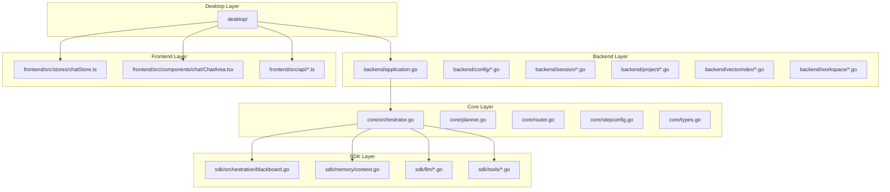
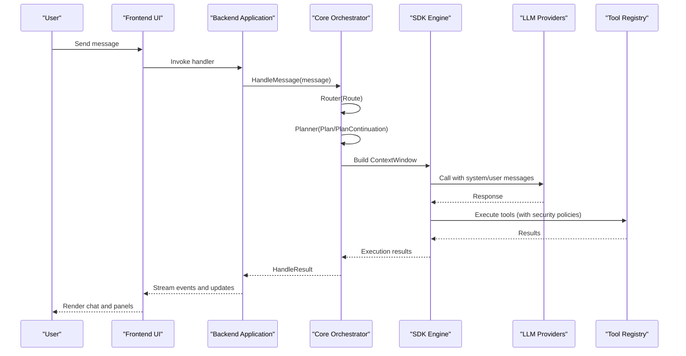

# Roadmap Documentation

<cite>
**Referenced Files in This Document**
- [docs/roadmap.md](file://docs/roadmap.md)
- [README.md](file://README.md)
- [TODO.md](file://TODO.md)
- [backend/application.go](file://backend/application.go)
- [core/orchestrator.go](file://core/orchestrator.go)
- [core/planner.go](file://core/planner.go)
- [core/router.go](file://core/router.go)
- [core/stepconfig.go](file://core/stepconfig.go)
- [core/types.go](file://core/types.go)
- [sdk/orchestration/blackboard.go](file://sdk/orchestration/blackboard.go)
- [sdk/memory/context.go](file://sdk/memory/context.go)
- [frontend/src/stores/chatStore.ts](file://frontend/src/stores/chatStore.ts)
- [frontend/src/components/chat/ChatArea.tsx](file://frontend/src/components/chat/ChatArea.tsx)
- [config.example.yaml](file://config.example.yaml)
</cite>

## Table of Contents
1. [Introduction](#introduction)
2. [Project Structure](#project-structure)
3. [Core Components](#core-components)
4. [Architecture Overview](#architecture-overview)
5. [Detailed Component Analysis](#detailed-component-analysis)
6. [Dependency Analysis](#dependency-analysis)
7. [Performance Considerations](#performance-considerations)
8. [Troubleshooting Guide](#troubleshooting-guide)
9. [Conclusion](#conclusion)

## Introduction

This document presents a comprehensive roadmap for c0wrk, a desktop AI coding agent built with Wails v2 (Go backend + React/TypeScript frontend). The roadmap outlines strategic initiatives across ten tracks, prioritized by impact and feasibility, covering persistent memory and knowledge graphs, multi-agent orchestration, automated verification pipelines, context engineering evolution, multimodality and computer control, headless/CLI/server modes, developer experience improvements, vector search enhancements, specification-driven development, and security governance.

The current state establishes a robust foundation: a desktop application with ReAct-style agent execution, planner/router/reflector orchestration, desktop UI with chat and execution panels, MCP server integration, SQLite persistence, configurable LLM providers, runtime limits, and a React 19 frontend with 25+ event types and 9 domain stores. The roadmap identifies key gaps—such as cross-session project-wide fact search, project knowledge bases, code graph integration, multi-agent conflict detection, automated verification gates, hybrid vector-search, multimodal input, headless modes, cost dashboarding, and security governance—and proposes structured implementations with clear research and implementation phases.

## Project Structure

c0wrk follows a layered architecture with clear separation of concerns:

- **desktop/**: Wails app lifecycle and frontend-exposed API methods
- **backend/**: Application/view-model layer (config, session/project management, persistence)
- **core/**: Orchestration logic (planner, router, reflector, tool registry, MCP gateway)
- **sdk/**: Reusable engine components (agent executor, LLM providers, memory/compaction, prompt/tool primitives)
- **frontend/**: React + TypeScript UI communicating with Go via Wails bindings



**Diagram sources**
- [backend/application.go:1-133](file://backend/application.go#L1-L133)
- [core/orchestrator.go:1-199](file://core/orchestrator.go#L1-L199)
- [sdk/orchestration/blackboard.go:1-564](file://sdk/orchestration/blackboard.go#L1-L564)
- [sdk/memory/context.go:1-485](file://sdk/memory/context.go#L1-L485)
- [frontend/src/stores/chatStore.ts:1-249](file://frontend/src/stores/chatStore.ts#L1-L249)
- [frontend/src/components/chat/ChatArea.tsx:1-149](file://frontend/src/components/chat/ChatArea.tsx#L1-L149)

**Section sources**
- [README.md:26-46](file://README.md#L26-L46)
- [README.md:162-174](file://README.md#L162-L174)

## Core Components

The core orchestration engine coordinates the agent's reasoning cycle:

- **Router**: Classifies user requests by domain and complexity, determines execution strategy, and activates relevant skills
- **Planner**: Generates DAG execution plans using informed exploration or direct planning, with domain-specific guidance and agent profiles
- **Orchestrator**: Manages the end-to-end ReAct loop, integrates context management, tool execution, and reflection
- **Blackboard**: Shared state for step results, file changes, facts, and reflections across execution phases
- **Context Management**: Implements sliding window, summarization, and hierarchical compaction strategies with tool output pruning

Key implementation highlights:
- Router applies domain-based compaction strategy rules and validates routing decisions
- Planner supports both direct and exploration-based planning, with reflection-aware templates
- Orchestrator injects vector search hints for Auto-RAG and wires step configuration via agent profiles
- Blackboard tracks file changes and supports fact storage/search for inter-step communication
- ContextWindow manages token budgets, compaction thresholds, and tool output pruning with protective indices

**Section sources**
- [core/router.go:52-127](file://core/router.go#L52-L127)
- [core/planner.go:269-433](file://core/planner.go#L269-L433)
- [core/orchestrator.go:408-699](file://core/orchestrator.go#L408-L699)
- [sdk/orchestration/blackboard.go:237-334](file://sdk/orchestration/blackboard.go#L237-L334)
- [sdk/memory/context.go:15-80](file://sdk/memory/context.go#L15-L80)

## Architecture Overview

The system architecture integrates desktop, backend, core, and SDK layers with a reactive frontend:



**Diagram sources**
- [backend/application.go:62-133](file://backend/application.go#L62-L133)
- [core/orchestrator.go:408-699](file://core/orchestrator.go#L408-L699)
- [core/planner.go:269-433](file://core/planner.go#L269-L433)
- [sdk/memory/context.go:173-211](file://sdk/memory/context.go#L173-L211)

## Detailed Component Analysis

### Track 1: Persistent Memory and Knowledge Graph

Current state:
- Facts are persisted at task level in SQLite via `PersistentBlackboard.StoreFact()` and restored via `RestoreBlackboard()`
- No cross-session/project-wide fact search, project knowledge base, or code graph integration

Proposed implementations:
- Expand `task_facts` to project scope with normalized schema and `SearchProjectFacts()` for cross-session retrieval
- Add project-level knowledge base (`project_notes`) with markdown-backed storage and semantic injection into orchestrator system prompts
- Integrate lightweight graph store (e.g., SQLite relations) and AST-based indexing for code graph queries
- Implement cross-project learning via `global_insights` table and inject top-N insights into system prompts

Research and metrics:
- Benchmark FTS5 performance for typical project sizes (1K-10K facts)
- Evaluate migration from blobbed JSON to normalized schema
- Measure frequency of conflicts in typical DAG plans for conflict detection strategies

**Section sources**
- [docs/roadmap.md:13-44](file://docs/roadmap.md#L13-L44)
- [sdk/orchestration/blackboard.go:348-433](file://sdk/orchestration/blackboard.go#L348-L433)

### Track 2: Multi-Agent Orchestration

Current state:
- DAG-based parallel execution with `FindReadySteps()` and `RunSubAgentsParallel()` using goroutines
- Agent profiles defined (`AgentProfile`) with roles and tool pruning defaults
- No dedicated verifier agent, no conflict detection/iso, and limited profile assignment

Proposed implementations:
- Add conflict detection for concurrent writes to same files with resolution prompts or git worktree isolation
- Enhance Router to recommend profiles based on domain and complexity; make profile assignment mandatory for complexity ≥ 3
- Implement verifier agent that checks code compilation, test execution, requirement fulfillment, and regressions
- Enable debate mode for complex problems by generating multiple approaches and selecting the best via isolated execution

Research and metrics:
- Instrument real sessions to measure profile assignment frequency and success correlation
- Benchmark multi-approach execution costs vs. single-path execution

**Section sources**
- [docs/roadmap.md:47-78](file://docs/roadmap.md#L47-L78)
- [core/stepconfig.go:43-120](file://core/stepconfig.go#L43-L120)
- [core/planner.go:73-81](file://core/planner.go#L73-L81)

### Track 3: Automated Verification Pipeline

Current state:
- Agent can run tests/lintr via `bash_exec` when explicitly instructed
- No automatic verification pipeline, project detector, target test generation, or regression detection

Proposed implementations:
- Add `ProjectDetector` to auto-detect build/test/lint commands upon project open and persist in project config
- Implement post-modification pipeline: `lint -> typecheck -> test` with failure injection into agent context
- Add `generate_tests` tool with signature extraction via tree-sitter and iterative test execution
- Implement regression detection capturing test results, benchmarks, binary sizes, and coverage deltas

Research and metrics:
- Analyze typical project structures for auto-detection of commands
- Benchmark effectiveness of generated tests against table-driven (Go) and vitest/jest (TypeScript)

**Section sources**
- [docs/roadmap.md:81-112](file://docs/roadmap.md#L81-L112)
- [core/orchestrator.go:311-375](file://core/orchestrator.go#L311-L375)

### Track 4: Context Engineering Evolution

Current state:
- Tool output pruning implemented with placeholder replacement and protected tools
- Adaptive strategy selection based on domain and complexity; complexity hardcoded at 3 in step configurator
- Auto-RAG injection of vector search hints; prompt caching infrastructure for Anthropic

Proposed implementations:
- Evolve pruning to preserve `tool_use` records with intelligent placeholders and track re-query rates
- Pass real complexity from Router to `coreStepConfigurator` and add `CompactionAnalyzer` for dynamic strategy switching
- Extend `injectVectorSearchHints()` to include code fragments and optional per-executor injection with de-duplication
- Expand prompt caching to Gemini and OpenAI-compatible providers and add cache hit rate metrics

Research and metrics:
- Measure pruning effectiveness and re-query rates
- Profile compaction strategy performance across task types
- Benchmark cache hit rates and cost savings

**Section sources**
- [docs/roadmap.md:115-151](file://docs/roadmap.md#L115-L151)
- [core/router.go:182-197](file://core/router.go#L182-L197)
- [core/stepconfig.go:115](file://core/stepconfig.go#L115)
- [core/orchestrator.go:311-375](file://core/orchestrator.go#L311-L375)

### Track 5: Multimodality and Computer Control

Current state:
- Message struct contains only text content; no multipart support; `ModelCapabilities.Attachment` defined but unused
- Frontend chat input does not support image paste/drop

Proposed implementations:
- Extend `sdk/llm/message.go` to support `ContentParts` (text/image) and convert to provider-native formats
- Add screenshot capture tool returning base64 images for visual analysis
- Implement browser automation via MCP (recommended) or native `browser_action` tool
- Create `interpret_diagram` tool to convert visual diagrams to structured representations

Research and metrics:
- Evaluate vision model support across Anthropic, Gemini, and GPT-4+
- Assess cross-platform screenshot libraries and browser automation options

**Section sources**
- [docs/roadmap.md:154-185](file://docs/roadmap.md#L154-L185)
- [core/orchestrator.go:311-375](file://core/orchestrator.go#L311-L375)

### Track 6: Headless/CLI/Server Mode

Current state:
- Only desktop mode via Wails; no CLI or HTTP server entry points
- Core and SDK layers are Wails-independent, enabling headless deployment

Proposed implementations:
- Create `cmd/c0wrk-cli/` entry point instantiating `core.Orchestrator` directly with stdin task input and stdout streaming
- Implement `cmd/c0wrk-server/` with HTTP API supporting task submission, status polling, and SSE streaming
- Add CI/CD integration via `c0wrk-ci` action/command for GitHub Actions/GitLab CI
- Support A2A protocol for agent delegation (both server and client roles)

Research and metrics:
- Design minimal event emitter adapter for headless mode
- Define async API patterns and authentication mechanisms

**Section sources**
- [docs/roadmap.md:188-219](file://docs/roadmap.md#L188-L219)
- [backend/application.go:62-133](file://backend/application.go#L62-L133)

### Track 7: Developer Experience and UI Enhancement

Current state:
- UI settings cover LLM, MCP, Security, Search, Log Level; missing executor tuning, compaction thresholds, tool limits, timeouts
- Token tracking implemented; cost calculation and budget dashboards missing
- File change tracking exists; no interactive change review UI

Proposed implementations:
- Add interactive pending changes panel with unified diffs and per-file accept/reject workflow
- Expose executor tuning, compaction thresholds, tool limits, and timeouts in UI settings
- Implement cost dashboard using `ModelMetadata` pricing to show session/project costs and enforce budget limits
- Create project onboarding wizard to auto-detect build systems and generate recommended AGENTS.md
- Enable inline code editing in chat for small changes with preview and apply workflow

Research and metrics:
- Profile real usage patterns for token costs and session/project expenses
- Evaluate UX of inline editing and change review workflows

**Section sources**
- [docs/roadmap.md:222-259](file://docs/roadmap.md#L222-L259)
- [frontend/src/stores/chatStore.ts:13-46](file://frontend/src/stores/chatStore.ts#L13-L46)
- [frontend/src/components/chat/ChatArea.tsx:22-149](file://frontend/src/components/chat/ChatArea.tsx#L22-L149)

### Track 8: Vector Search and Code Retrieval

Current state:
- Single fixed Jina v2-small embedding model; incremental indexing re-embs entire chunks on file changes
- Only vector search; no FTS5/BM25 hybrid, no cross-project search

Proposed implementations:
- Add FTS5 index alongside vector index and implement reciprocal rank fusion for hybrid retrieval
- Make embedding model configurable via `config.yaml` with migration tool for re-indexing
- Improve incremental indexing to compute per-chunk hashes and re-embed only changed chunks
- Implement `search_across_projects` for cross-project codebase search

Research and metrics:
- Benchmark vector-only vs. keyword-only vs. hybrid search effectiveness
- Profile chunk-level vs. file-level re-embedding performance

**Section sources**
- [docs/roadmap.md:262-293](file://docs/roadmap.md#L262-L293)
- [core/orchestrator.go:311-375](file://core/orchestrator.go#L311-L375)

### Track 9: Specification-Driven Development

Current state:
- Specifications exist as developer documents; not integrated as runtime artifacts
- Planner generates acceptance criteria in step descriptions; reflector analyzes them but not from external spec

Proposed implementations:
- Add `spec_author` tool to create structured markdown specifications from user intent
- Implement pipeline to generate DAG directly from specification sections with traceability
- Add verifier to check each requirement against actual changes using deterministic and semantic checks

Research and metrics:
- Evaluate spec-first vs. traditional router+planner workflows
- Automate acceptance criteria verification

**Section sources**
- [docs/roadmap.md:296-321](file://docs/roadmap.md#L296-L321)
- [core/planner.go:508-545](file://core/planner.go#L508-L545)

### Track 10: Security and Governance

Current state:
- 3-tier tool policies, LLM-based `ToolJudge`, regex blacklist for bash_exec
- No sandbox execution, no persistent audit trail, no policy-as-code, no secret scanning

Proposed implementations:
- Add optional sandbox mode for bash_exec using containers or OS sandboxes
- Implement persistent audit log table capturing tool calls, LLM requests, and user verdicts
- Replace regex blacklist with policy-as-code engine (OPA/Cedar) with repository-committed policies
- Add pre-write secret scanning for write/edit operations with user override

Research and metrics:
- Profile sandbox performance impact vs. security gains
- Evaluate policy-as-code adoption and maintenance overhead

**Section sources**
- [docs/roadmap.md:323-355](file://docs/roadmap.md#L323-L355)

## Dependency Analysis

The orchestration flow demonstrates tight coupling between core components and SDK layers:

```mermaid
classDiagram
class Router {
+Route(ctx, message, tools, history, skills) RoutingDecision
+applyCompactionStrategy(domain, complexity) string
}
class Planner {
+Plan(ctx, task, tools, reflections) Plan
+PlanContinuation(ctx, original, existing, completed, message, tools) Plan
+Replan(ctx, original, completed, failed, reflection, sessionReflections) Plan
}
class Orchestrator {
+HandleMessage(ctx, message, sessionID, opts) HandleResult
+Resume(ctx, bb, routing) HandleResult
+injectVectorSearchHints(ctx, query) context
}
class Blackboard {
+SetStepFileChanges(stepID, changes)
+GetSessionFileChanges() []FileChange
+StoreFact(fact)
+SearchFacts(keywords) []Fact
}
class ContextWindow {
+BuildPrompt() []Message
+Compact(ctx) CompactionResult
+computeProtectedIndices() map[int]struct{}
}
Router --> Planner : "guides domain/complexity"
Planner --> Orchestrator : "produces plan"
Orchestrator --> Blackboard : "manages state"
Orchestrator --> ContextWindow : "context management"
Blackboard --> ContextWindow : "step history"
```

**Diagram sources**
- [core/router.go:52-127](file://core/router.go#L52-L127)
- [core/planner.go:269-433](file://core/planner.go#L269-L433)
- [core/orchestrator.go:408-699](file://core/orchestrator.go#L408-L699)
- [sdk/orchestration/blackboard.go:237-334](file://sdk/orchestration/blackboard.go#L237-L334)
- [sdk/memory/context.go:173-211](file://sdk/memory/context.go#L173-L211)

**Section sources**
- [core/types.go:242-285](file://core/types.go#L242-L285)
- [core/stepconfig.go:43-120](file://core/stepconfig.go#L43-L120)

## Performance Considerations

- Context management: Tool output pruning and adaptive compaction strategies reduce token usage while preserving critical information. The current implementation uses placeholder-based pruning; evolving to preserve `tool_use` records with intelligent placeholders can improve reusability and reduce re-queries.
- Vector search: Hybrid retrieval combining vector and keyword search improves precision and reduces latency compared to pure vector search.
- Parallel execution: Conflict detection and isolation strategies prevent wasted computation from concurrent writes to the same files.
- Cost control: Prompt caching and budget dashboards enable cost-aware usage with configurable limits and real-time reporting.

[No sources needed since this section provides general guidance]

## Troubleshooting Guide

Common issues and mitigation strategies:

- **Missing ONNX runtime or embedding model**: Ensure `make fetch-onnx` and `make fetch-embedding-model` are run after `make build` or `wails build`.
- **Config not detected**: Verify `~/.c0wrk/config.yaml` exists and contains provider credentials and model settings.
- **Frontend-only dev server**: Use `wails dev` for full desktop runtime; `make dev-desktop` runs only the frontend Vite server.
- **Generated Wails bindings drift**: Regenerate via `wails build` or `wails dev` to avoid manual edits to generated files.

**Section sources**
- [README.md:176-183](file://README.md#L176-L183)

## Conclusion

The c0wrk roadmap outlines a comprehensive evolution path from a powerful desktop AI coding agent to a production-grade platform with persistent knowledge, multi-agent orchestration, automated verification, advanced context engineering, multimodal capabilities, headless deployments, enhanced developer experience, hybrid vector search, specification-driven workflows, and robust security governance. By prioritizing key tracks and leveraging the existing layered architecture, c0wrk can achieve competitive advantages in reliability, productivity, and enterprise adoption while maintaining its local-first, privacy-preserving design.