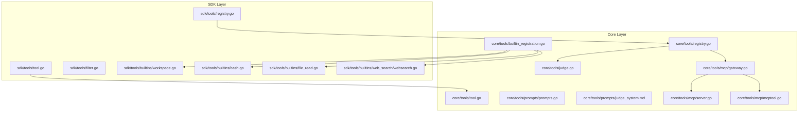
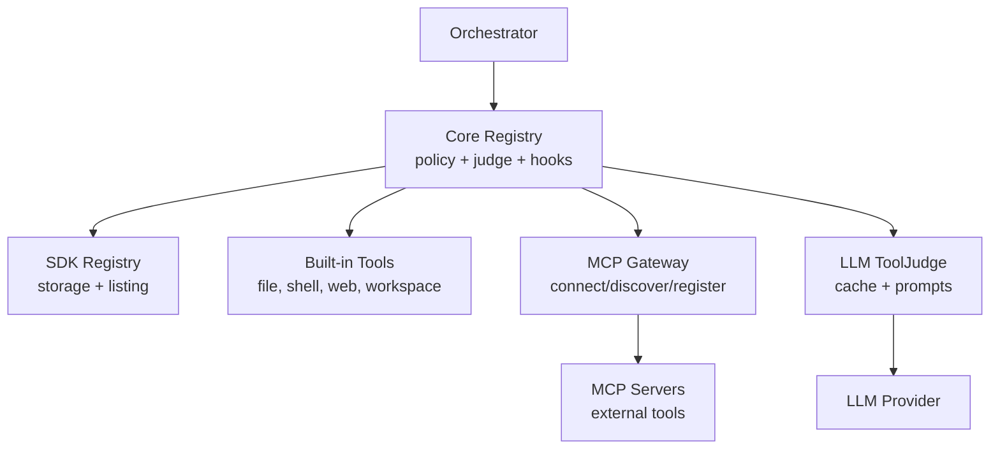
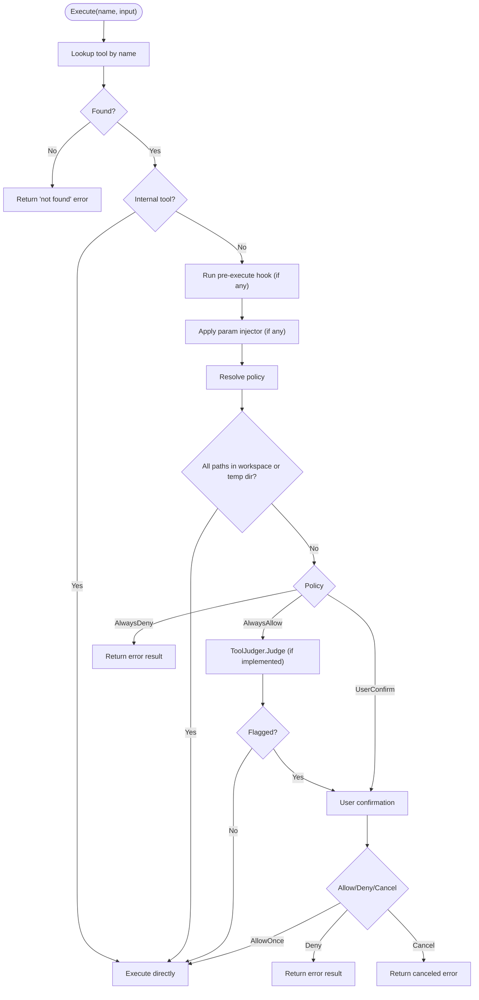
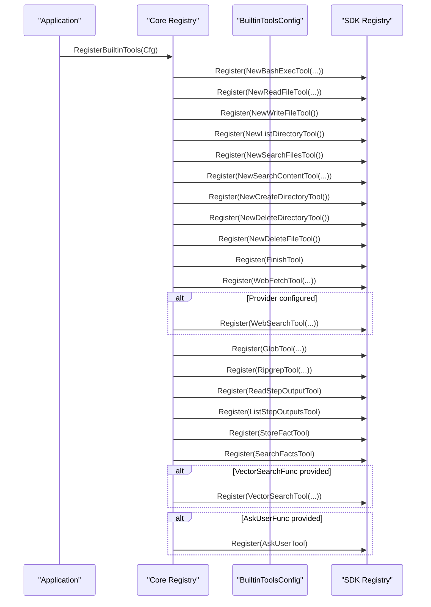
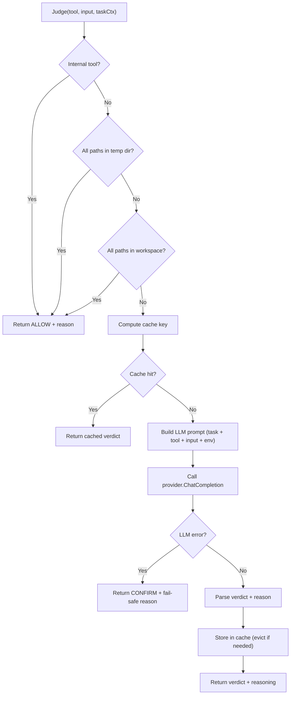
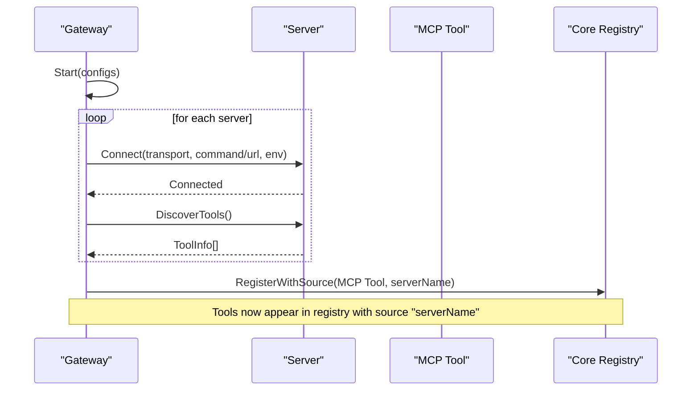
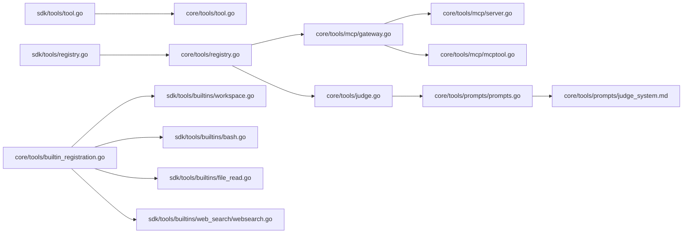

# Tool System

<cite>
**Referenced Files in This Document**
- [tool.go](file://sdk/tools/tool.go)
- [registry.go](file://sdk/tools/registry.go)
- [filter.go](file://sdk/tools/filter.go)
- [tool.go](file://core/tools/tool.go)
- [registry.go](file://core/tools/registry.go)
- [builtin_registration.go](file://core/tools/builtin_registration.go)
- [judge.go](file://core/tools/judge.go)
- [prompts.go](file://core/tools/prompts/prompts.go)
- [judge_system.md](file://core/tools/prompts/judge_system.md)
- [gateway.go](file://core/tools/mcp/gateway.go)
- [mcptool.go](file://core/tools/mcp/mcptool.go)
- [server.go](file://core/tools/mcp/server.go)
- [workspace.go](file://sdk/tools/builtins/workspace.go)
- [bash.go](file://sdk/tools/builtins/bash.go)
- [file_read.go](file://sdk/tools/builtins/file_read.go)
- [websearch.go](file://sdk/tools/builtins/web_search/websearch.go)
</cite>

## Table of Contents
1. [Introduction](#introduction)
2. [Project Structure](#project-structure)
3. [Core Components](#core-components)
4. [Architecture Overview](#architecture-overview)
5. [Detailed Component Analysis](#detailed-component-analysis)
6. [Dependency Analysis](#dependency-analysis)
7. [Performance Considerations](#performance-considerations)
8. [Troubleshooting Guide](#troubleshooting-guide)
9. [Conclusion](#conclusion)
10. [Appendices](#appendices)

## Introduction
This document explains C0WRK’s extensible tool system. It covers the tool registry architecture, dynamic tool registration, security policy enforcement, and the LLM-based safety judgment system. It documents built-in tools (file operations, web search, shell commands, workspace management), MCP (Model Context Protocol) integration for external tool support, and the gateway implementation for tool communication. It also details the tool interface specification, parameter validation, execution context management, result processing, filtering mechanisms, permissions, and practical guidance for developing and integrating custom tools with the orchestrator.

## Project Structure
The tool system spans two layers:
- SDK layer: Defines the universal tool interface, registry, and shared utilities.
- Core layer: Extends the SDK with security policies, LLM-based judgment, built-in tool registration, and MCP integration.

**Diagram sources**
- [tool.go:1-178](file://sdk/tools/tool.go#L1-L178)
- [registry.go:1-137](file://sdk/tools/registry.go#L1-L137)
- [filter.go:1-35](file://sdk/tools/filter.go#L1-L35)
- [tool.go:1-87](file://core/tools/tool.go#L1-L87)
- [registry.go:1-277](file://core/tools/registry.go#L1-L277)
- [judge.go:1-350](file://core/tools/judge.go#L1-L350)
- [prompts.go:1-8](file://core/tools/prompts/prompts.go#L1-L8)
- [judge_system.md:1-32](file://core/tools/prompts/judge_system.md#L1-L32)
- [gateway.go:1-495](file://core/tools/mcp/gateway.go#L1-L495)
- [server.go:1-341](file://core/tools/mcp/server.go#L1-L341)
- [mcptool.go:1-219](file://core/tools/mcp/mcptool.go#L1-L219)
- [workspace.go:1-122](file://sdk/tools/builtins/workspace.go#L1-L122)
- [bash.go:1-232](file://sdk/tools/builtins/bash.go#L1-L232)
- [file_read.go:1-139](file://sdk/tools/builtins/file_read.go#L1-L139)
- [websearch.go:1-163](file://sdk/tools/builtins/web_search/websearch.go#L1-L163)
- [builtin_registration.go:1-136](file://core/tools/builtin_registration.go#L1-L136)

**Section sources**
- [tool.go:1-178](file://sdk/tools/tool.go#L1-L178)
- [registry.go:1-137](file://sdk/tools/registry.go#L1-L137)
- [gateway.go:1-495](file://core/tools/mcp/gateway.go#L1-L495)

## Core Components
- Tool interface and base types (SDK): Defines Tool, ToolResult, ToolPolicy, ToolDescriptor, and context helpers for workspace, temp directory, and task context.
- Tool registry (SDK): Stores tools, supports registration/unregistration, and simple execution without policy enforcement.
- Tool registry (Core): Extends the SDK registry with policy resolution, confirmation callbacks, judge integration, pre-execution hooks, filtering, and parameter injection.
- Built-in tool registration: Centralized configuration and registration of core tools (file ops, web search, shell, workspace, etc.).
- Safety judgment: LLM-based ToolJudge that evaluates tool calls and caches decisions.
- MCP integration: Gateway and server abstractions to connect external MCP servers, discover tools, and proxy calls.

**Section sources**
- [tool.go:1-178](file://sdk/tools/tool.go#L1-L178)
- [registry.go:1-137](file://sdk/tools/registry.go#L1-L137)
- [tool.go:1-87](file://core/tools/tool.go#L1-L87)
- [registry.go:1-277](file://core/tools/registry.go#L1-L277)
- [builtin_registration.go:1-136](file://core/tools/builtin_registration.go#L1-L136)
- [judge.go:1-350](file://core/tools/judge.go#L1-L350)
- [gateway.go:1-495](file://core/tools/mcp/gateway.go#L1-L495)
- [server.go:1-341](file://core/tools/mcp/server.go#L1-L341)
- [mcptool.go:1-219](file://core/tools/mcp/mcptool.go#L1-L219)

## Architecture Overview
The system separates concerns across layers:
- SDK provides the contract and utilities used by both core and frontends.
- Core adds policy, safety, and MCP integration.
- Built-in tools are registered centrally and can be toggled via configuration.
- MCP tools are dynamically discovered and registered with source tagging.

**Diagram sources**
- [registry.go:1-277](file://core/tools/registry.go#L1-L277)
- [gateway.go:1-495](file://core/tools/mcp/gateway.go#L1-L495)
- [server.go:1-341](file://core/tools/mcp/server.go#L1-L341)
- [judge.go:1-350](file://core/tools/judge.go#L1-L350)
- [prompts.go:1-8](file://core/tools/prompts/prompts.go#L1-L8)
- [judge_system.md:1-32](file://core/tools/prompts/judge_system.md#L1-L32)

## Detailed Component Analysis

### Tool Interface Specification and Execution Context
- Tool interface: Name, Description, InputSchema, Execute, DefaultPolicy.
- ToolResult: Content and IsError flags.
- ToolDescriptor: Metadata for planner/executor consumption.
- Context helpers: Attach and extract workspace path, temp directory, and task context to/from context.

Execution context management:
- Workspace path and temp directory are carried in context to enable path-scoped auto-approval and safer defaults.
- Task context is passed to the judge to inform safety decisions.

**Section sources**
- [tool.go:1-178](file://sdk/tools/tool.go#L1-L178)

### Tool Registry (Core)
Extends SDK registry with:
- Policy resolution: Per-tool override, default policy, or tool default.
- Internal tools: Names always allowed and bypass judge/policy.
- Confirmation callback: User confirmation for mutating tools.
- Judge integration: Optional LLM-based safety filter for PolicyAlwaysAllow tools.
- Pre-execute hook: Gate execution (e.g., indexing readiness).
- Filtering and parameter injection: Control registration and mutate inputs before execution.
- Path-scoped auto-approval: If all paths are within workspace or temp directory, auto-execute except AlwaysDeny.

**Diagram sources**
- [registry.go:164-277](file://core/tools/registry.go#L164-L277)
- [tool.go:44-87](file://core/tools/tool.go#L44-L87)

**Section sources**
- [registry.go:1-277](file://core/tools/registry.go#L1-L277)
- [tool.go:1-87](file://core/tools/tool.go#L1-L87)

### Tool Registry (SDK)
- Thread-safe storage keyed by tool name.
- Register/RegisterWithSource, Unregister, UnregisterBySource.
- List returns ToolDescriptor slices with source tagging ("core" vs MCP source).
- Execute delegates to underlying tool without policy enforcement.

**Section sources**
- [registry.go:1-137](file://sdk/tools/registry.go#L1-L137)

### Built-in Tools Registration
Centralized configuration and registration:
- Provides BuiltinToolsConfig to configure limits, timeouts, search provider, ask_user callback, and vector search callbacks.
- Registers file operations, shell commands, web fetch, web search, glob/ripgrep, step output tools, facts tools, semantic search, and ask_user (optional).
- Search provider selection based on configured provider and API key presence.

**Diagram sources**
- [builtin_registration.go:53-101](file://core/tools/builtin_registration.go#L53-L101)
- [websearch.go:36-76](file://sdk/tools/builtins/web_search/websearch.go#L36-L76)
- [workspace.go:17-83](file://sdk/tools/builtins/workspace.go#L17-L83)
- [bash.go:23-61](file://sdk/tools/builtins/bash.go#L23-L61)

**Section sources**
- [builtin_registration.go:1-136](file://core/tools/builtin_registration.go#L1-L136)

### Built-in Tools Catalog
- File operations: read_file, write_file, edit_file, list_directory, search_files, search_content, mkdir, rmdir, delete_file.
- Shell commands: bash_exec with timeouts, blacklist patterns, optional RTK rewriting, and process-group termination.
- Web fetch and search: web_fetch and web_search with configurable providers and limits.
- Workspace tools: read_step_output and list_step_outputs for step output store.
- Facts tools: store_fact and search_facts.
- Semantic search: vector_search (optional).
- Ask user: ask_user (optional).

Validation and execution patterns:
- Input schemas define parameters and required fields.
- Parameter parsing validates inputs and applies defaults.
- Path-based tools resolve paths against context workspace.
- Read-only tools (e.g., read_file) implement ToolJudger to always allow.

**Section sources**
- [workspace.go:1-122](file://sdk/tools/builtins/workspace.go#L1-L122)
- [bash.go:1-232](file://sdk/tools/builtins/bash.go#L1-L232)
- [file_read.go:1-139](file://sdk/tools/builtins/file_read.go#L1-L139)
- [websearch.go:1-163](file://sdk/tools/builtins/web_search/websearch.go#L1-L163)

### Safety Judgment System
- ToolJudge uses an LLM to evaluate tool calls and returns a cached verdict.
- Fast paths: internal tools, temp directory operations, workspace-only operations.
- Cache: SHA-256 of input string plus tool name; full eviction when capacity reached.
- Prompt: Embedded judge_system.md defines classification guide and response format.
- Fail-safe: On LLM errors or parsing failures, defaults to CONFIRM with explanatory reasoning.

**Diagram sources**
- [judge.go:70-188](file://core/tools/judge.go#L70-L188)
- [prompts.go:1-8](file://core/tools/prompts/prompts.go#L1-L8)
- [judge_system.md:1-32](file://core/tools/prompts/judge_system.md#L1-L32)

**Section sources**
- [judge.go:1-350](file://core/tools/judge.go#L1-L350)
- [prompts.go:1-8](file://core/tools/prompts/prompts.go#L1-L8)
- [judge_system.md:1-32](file://core/tools/prompts/judge_system.md#L1-L32)

### MCP Integration and Gateway
Gateway manages connections to multiple MCP servers:
- Start: Connects to configured servers, discovers tools, and registers them with source tagging.
- RegisterTools: Wraps MCP tools and registers them with the core registry.
- Reconfigure: Adds/removes/updates servers, preserves unchanged connections, and re-registers tools.
- Stop: Gracefully closes connections.

Server abstraction:
- Connect supports stdio and HTTP transports with fallback.
- DiscoverTools lists tools and stores their input schemas.
- CallTool executes a named tool with arguments.

MCP Tool wrapper:
- Implements Tool interface and ToolJudger.
- Default policy is PolicyUserConfirm.
- Input schema can be sanitized to hide auto-injected parameters.
- Execute proxies to MCP server and converts results to ToolResult.

**Diagram sources**
- [gateway.go:55-120](file://core/tools/mcp/gateway.go#L55-L120)
- [server.go:71-262](file://core/tools/mcp/server.go#L71-L262)
- [mcptool.go:91-150](file://core/tools/mcp/mcptool.go#L91-L150)

**Section sources**
- [gateway.go:1-495](file://core/tools/mcp/gateway.go#L1-L495)
- [server.go:1-341](file://core/tools/mcp/server.go#L1-L341)
- [mcptool.go:1-219](file://core/tools/mcp/mcptool.go#L1-L219)

### Tool Filtering Mechanisms and Permission Systems
- ToolFilter: Predicate to accept/reject tools during registration.
- ParamInjector: Transforms inputs before execution (e.g., inject project scoping).
- ToolPolicy: Three modes—AlwaysAllow, AlwaysDeny, UserConfirm—with resolution precedence.
- Internal tools: Always allowed and bypass judge/policy.
- Path-scoped auto-approval: If all paths are within workspace or temp directory, auto-execute except AlwaysDeny.
- AskUserFunc: Optional callback for interactive confirmation; absence disables ask_user.

**Section sources**
- [registry.go:29-136](file://core/tools/registry.go#L29-L136)
- [tool.go:44-87](file://core/tools/tool.go#L44-L87)
- [filter.go:1-35](file://sdk/tools/filter.go#L1-L35)

### Result Processing and Error Handling
- ToolResult: Standardized content and error flag.
- ParseInputError: Converts JSON parse errors into ToolResult.
- MCP result conversion: Extracts text content, falls back to structured content serialization, and sets IsError appropriately.
- LLM judge errors: Return CONFIRM with explanatory reasoning.

**Section sources**
- [tool.go:31-69](file://sdk/tools/tool.go#L31-L69)
- [mcptool.go:152-207](file://core/tools/mcp/mcptool.go#L152-L207)
- [judge.go:155-163](file://core/tools/judge.go#L155-L163)

### Examples: Custom Tool Development and Registration
- Implement Tool interface: Provide Name, Description, InputSchema, Execute, and DefaultPolicy.
- Optional ToolJudger: Implement Judge to short-circuit with allow/reason for AlwaysAllow tools.
- Register with source: Use RegisterWithSource to tag MCP tools and enable selective unregistration.
- Configure policies: Set default policy and per-tool overrides on the core registry.
- Integrate with orchestrator: Use registry.List to enumerate tools and ToolRegistry.Execute to invoke.

Registration patterns:
- Centralized registration via BuiltinToolsConfig for core tools.
- Dynamic registration via Gateway.RegisterTools for MCP tools.
- Filtering and parameter injection hooks for advanced scenarios.

**Section sources**
- [tool.go:22-29](file://sdk/tools/tool.go#L22-L29)
- [mcptool.go:13-27](file://core/tools/mcp/mcptool.go#L13-L27)
- [gateway.go:96-120](file://core/tools/mcp/gateway.go#L96-L120)
- [registry.go:100-136](file://core/tools/registry.go#L100-L136)

## Dependency Analysis
- Core registry depends on SDK registry, ToolJudge, and context helpers.
- Built-in tools depend on SDK BaseTool and context helpers.
- MCP gateway depends on server abstraction and wraps tools for the core registry.
- Judge depends on LLM provider and embedded prompts.

**Diagram sources**
- [tool.go:1-178](file://sdk/tools/tool.go#L1-L178)
- [registry.go:1-137](file://sdk/tools/registry.go#L1-L137)
- [tool.go:1-87](file://core/tools/tool.go#L1-L87)
- [registry.go:1-277](file://core/tools/registry.go#L1-L277)
- [judge.go:1-350](file://core/tools/judge.go#L1-L350)
- [prompts.go:1-8](file://core/tools/prompts/prompts.go#L1-L8)
- [judge_system.md:1-32](file://core/tools/prompts/judge_system.md#L1-L32)
- [gateway.go:1-495](file://core/tools/mcp/gateway.go#L1-L495)
- [server.go:1-341](file://core/tools/mcp/server.go#L1-L341)
- [mcptool.go:1-219](file://core/tools/mcp/mcptool.go#L1-L219)
- [workspace.go:1-122](file://sdk/tools/builtins/workspace.go#L1-L122)
- [bash.go:1-232](file://sdk/tools/builtins/bash.go#L1-L232)
- [file_read.go:1-139](file://sdk/tools/builtins/file_read.go#L1-L139)
- [websearch.go:1-163](file://sdk/tools/builtins/web_search/websearch.go#L1-L163)
- [builtin_registration.go:1-136](file://core/tools/builtin_registration.go#L1-L136)

**Section sources**
- [registry.go:1-277](file://core/tools/registry.go#L1-L277)
- [gateway.go:1-495](file://core/tools/mcp/gateway.go#L1-L495)
- [judge.go:1-350](file://core/tools/judge.go#L1-L350)

## Performance Considerations
- Judge caching: Full cache eviction at threshold to balance memory and freshness.
- Pre-execute hooks: Use to gate execution behind readiness conditions (e.g., indexing) to avoid wasted LLM calls.
- Path scanning: Efficiently detect workspace/temp directory containment to skip expensive checks.
- MCP transport: Prefer HTTP with streamable fallback; minimize repeated discovery calls by reusing connections.

## Troubleshooting Guide
Common issues and resolutions:
- Tool not found: Verify registration and names; use registry.List to inspect available tools.
- Policy blocking: Adjust per-tool overrides or default policy; confirm AlwaysDeny is not unintentionally set.
- MCP connection failures: Check transport configuration, environment variables, and server availability; review gateway status.
- LLM judge errors: Inspect logs for judge failures; ensure provider/model configuration is valid.
- Input parsing errors: Validate JSON schema compliance; ensure required fields are present.

**Section sources**
- [registry.go:70-89](file://sdk/tools/registry.go#L70-L89)
- [gateway.go:55-94](file://core/tools/mcp/gateway.go#L55-L94)
- [judge.go:155-163](file://core/tools/judge.go#L155-L163)

## Conclusion
C0WRK’s tool system provides a robust, extensible framework for agent tooling. The core registry enforces security policies, integrates LLM-based judgment, and supports dynamic registration of both built-in and MCP tools. Built-in tools cover essential operations with strict validation and context-aware behavior. MCP integration enables seamless extension with external tool providers. Together, these components offer a secure, flexible, and scalable foundation for agent-driven automation.

## Appendices

### Tool Interface Reference
- Tool: Name, Description, InputSchema, Execute, DefaultPolicy.
- ToolResult: Content, IsError.
- ToolPolicy: AlwaysAllow, AlwaysDeny, UserConfirm.
- ToolDescriptor: Name, Description, InputSchema, Source.

**Section sources**
- [tool.go:10-44](file://sdk/tools/tool.go#L10-L44)

### Built-in Tool Policies
- read_file: AlwaysAllow (read-only).
- bash_exec: UserConfirm (mutating).
- web_search: AlwaysAllow (read-only).
- workspace tools: AlwaysAllow (read-only).
- ask_user: Optional; requires AskUserFunc.

**Section sources**
- [file_read.go:64-67](file://sdk/tools/builtins/file_read.go#L64-L67)
- [bash.go:54-54](file://sdk/tools/builtins/bash.go#L54-L54)
- [websearch.go:71-71](file://sdk/tools/builtins/web_search/websearch.go#L71-L71)
- [workspace.go:37-82](file://sdk/tools/builtins/workspace.go#L37-L82)