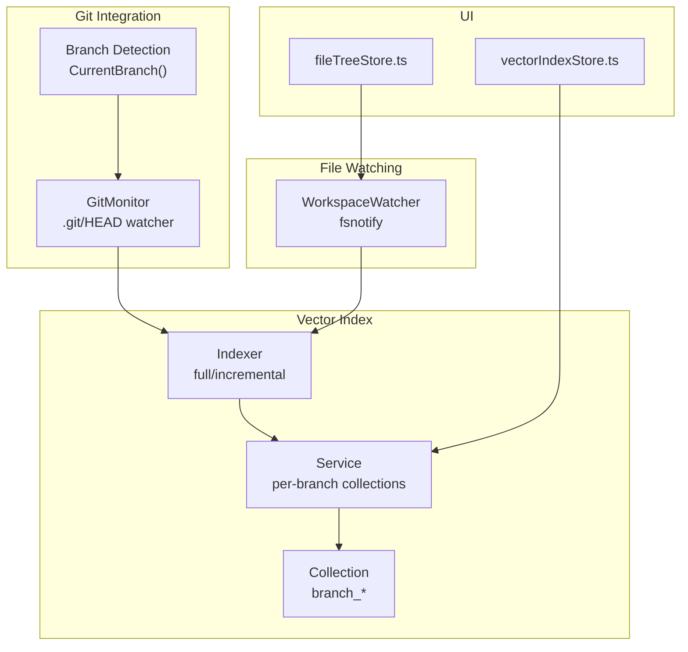
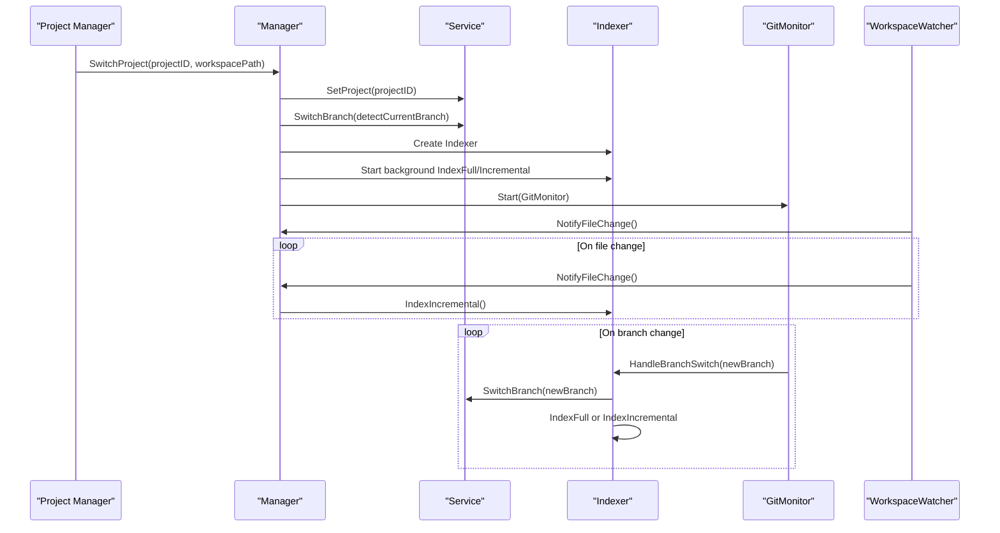
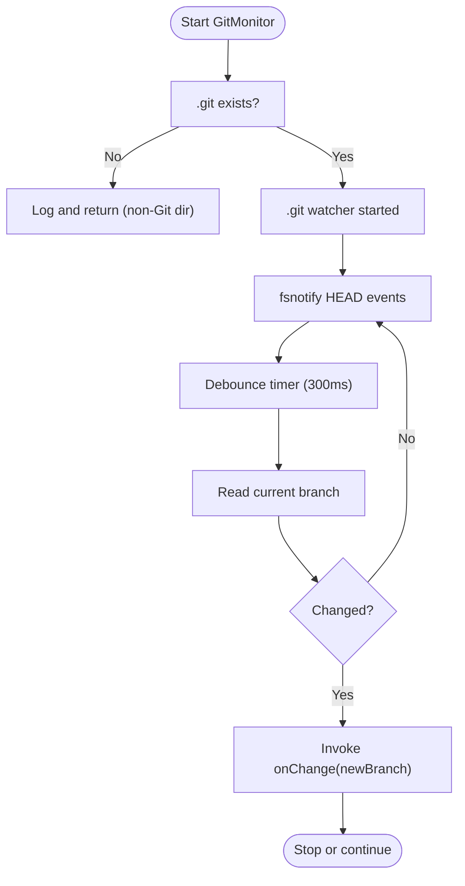
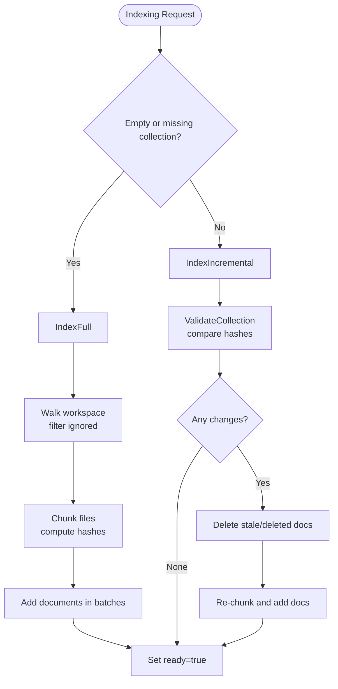
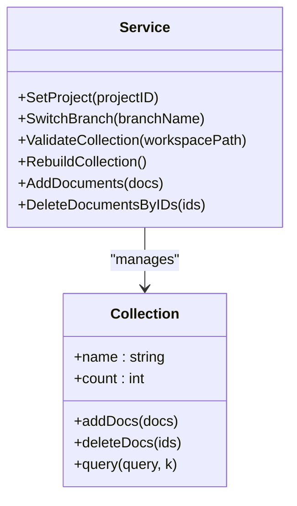
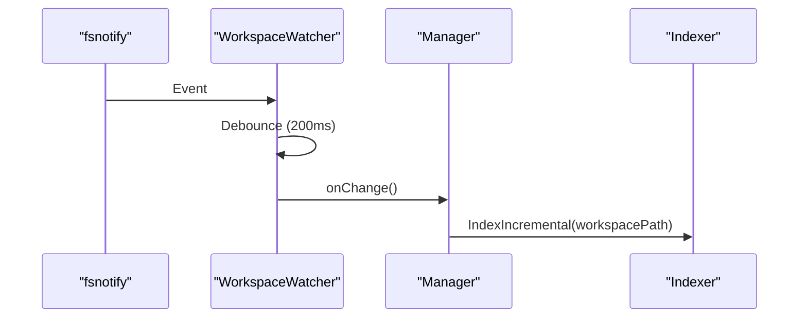
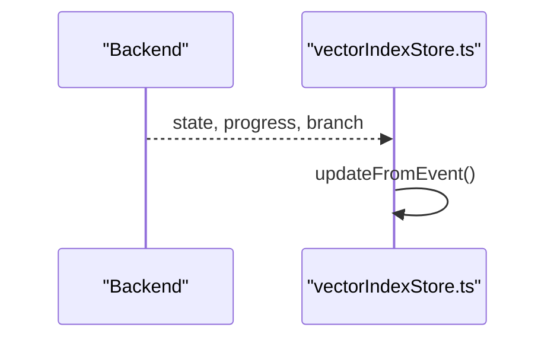
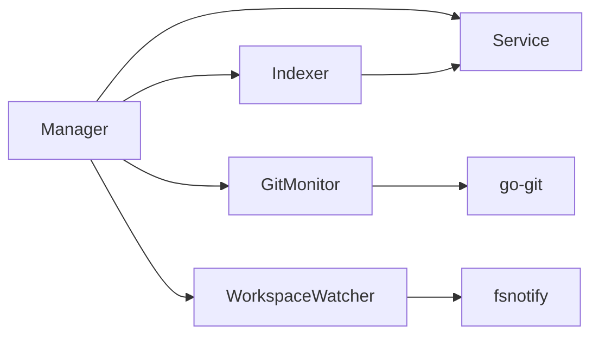

# Git Integration

<cite>
**Referenced Files in This Document**
- [git.go](file://backend/vectorindex/git.go)
- [indexer.go](file://backend/vectorindex/indexer.go)
- [service.go](file://backend/vectorindex/service.go)
- [collection.go](file://backend/vectorindex/collection.go)
- [manager.go](file://backend/vectorindex/manager.go)
- [watcher.go](file://backend/workspace/watcher.go)
- [api_workspace.go](file://desktop/api_workspace.go)
- [vectorIndexStore.ts](file://frontend/src/stores/vectorIndexStore.ts)
- [fileTreeStore.ts](file://frontend/src/stores/fileTreeStore.ts)
- [application.go](file://backend/application.go)
</cite>

## Table of Contents
1. [Introduction](#introduction)
2. [Project Structure](#project-structure)
3. [Core Components](#core-components)
4. [Architecture Overview](#architecture-overview)
5. [Detailed Component Analysis](#detailed-component-analysis)
6. [Dependency Analysis](#dependency-analysis)
7. [Performance Considerations](#performance-considerations)
8. [Troubleshooting Guide](#troubleshooting-guide)
9. [Conclusion](#conclusion)

## Introduction
This document explains how the vector index system integrates with Git to track codebase changes, maintain index consistency across Git operations, and support real-time updates. It covers branch-aware indexing, automatic index updates triggered by file system events, and the relationship between Git history and vector search relevance. The system supports full and incremental indexing, branch switching, and graceful handling of Git operations such as commits, merges, rebases, and branch switches.

## Project Structure
The Git integration spans several modules:
- Vector index service and indexer: manage collections per branch, validate and update documents, and expose search.
- Git monitor: watches .git/HEAD for branch changes.
- Workspace watcher: observes file system changes and triggers incremental indexing.
- Manager: orchestrates initialization, project switching, and lifecycle.
- Frontend stores: surface indexing status and branch information to the UI.

**Diagram sources**
- [git.go:24-179](file://backend/vectorindex/git.go#L24-L179)
- [indexer.go:61-293](file://backend/vectorindex/indexer.go#L61-L293)
- [service.go:32-245](file://backend/vectorindex/service.go#L32-L245)
- [collection.go:31-264](file://backend/vectorindex/collection.go#L31-L264)
- [watcher.go:21-174](file://backend/workspace/watcher.go#L21-L174)
- [vectorIndexStore.ts:1-55](file://frontend/src/stores/vectorIndexStore.ts#L1-L55)
- [fileTreeStore.ts:88-243](file://frontend/src/stores/fileTreeStore.ts#L88-L243)

**Section sources**
- [git.go:1-180](file://backend/vectorindex/git.go#L1-L180)
- [indexer.go:1-583](file://backend/vectorindex/indexer.go#L1-L583)
- [service.go:1-245](file://backend/vectorindex/service.go#L1-L245)
- [collection.go:1-264](file://backend/vectorindex/collection.go#L1-L264)
- [manager.go:1-280](file://backend/vectorindex/manager.go#L1-L280)
- [watcher.go:1-174](file://backend/workspace/watcher.go#L1-L174)
- [vectorIndexStore.ts:1-55](file://frontend/src/stores/vectorIndexStore.ts#L1-L55)
- [fileTreeStore.ts:88-243](file://frontend/src/stores/fileTreeStore.ts#L88-L243)

## Core Components
- GitMonitor: Watches .git/ directory for HEAD changes and debounces branch transitions. Emits branch changes to the indexer.
- Indexer: Performs full or incremental indexing, computes content hashes, chunks files, and updates the collection.
- Service: Manages per-branch collections, readiness state, and search operations.
- Collection utilities: Switch branches, validate collection against disk, enumerate stored file hashes, and rebuild collections.
- WorkspaceWatcher: Watches workspace root and .git directory for changes, debouncing to avoid excessive re-indexing.
- Manager: Creates embedder, service, indexer, and GitMonitor; coordinates project switching and background indexing.

**Section sources**
- [git.go:24-179](file://backend/vectorindex/git.go#L24-L179)
- [indexer.go:61-293](file://backend/vectorindex/indexer.go#L61-L293)
- [service.go:32-245](file://backend/vectorindex/service.go#L32-L245)
- [collection.go:31-264](file://backend/vectorindex/collection.go#L31-L264)
- [manager.go:31-280](file://backend/vectorindex/manager.go#L31-L280)
- [watcher.go:21-174](file://backend/workspace/watcher.go#L21-L174)

## Architecture Overview
The system initializes a project, detects the current branch, and starts background indexing. A GitMonitor watches .git/HEAD for branch changes and triggers branch-aware re-indexing. A WorkspaceWatcher listens for file system changes and triggers incremental indexing. The Service exposes search and readiness state, while the Indexer ensures the collection remains consistent with the workspace.

**Diagram sources**
- [manager.go:97-212](file://backend/vectorindex/manager.go#L97-L212)
- [git.go:92-161](file://backend/vectorindex/git.go#L92-L161)
- [indexer.go:275-293](file://backend/vectorindex/indexer.go#L275-L293)
- [service.go:69-98](file://backend/vectorindex/service.go#L69-L98)
- [watcher.go:40-84](file://backend/workspace/watcher.go#L40-L84)

## Detailed Component Analysis

### Git Monitoring and Branch Switching
- Branch detection: Uses go-git to open the repository and resolve HEAD to a branch name or detached commit hash.
- Monitor: Watches .git directory for HEAD changes, debouncing to avoid thrashing during rapid HEAD updates.
- Callback: On branch change, the monitor invokes a handler that switches the Service’s branch collection and triggers re-indexing.

**Diagram sources**
- [git.go:92-161](file://backend/vectorindex/git.go#L92-L161)

**Section sources**
- [git.go:36-62](file://backend/vectorindex/git.go#L36-L62)
- [git.go:66-90](file://backend/vectorindex/git.go#L66-L90)
- [git.go:92-161](file://backend/vectorindex/git.go#L92-L161)

### Indexing Pipeline: Full and Incremental
- Full indexing: Walks the workspace, filters ignored paths, chunks files, computes content hashes, and adds documents to the collection in batches.
- Incremental indexing: Validates the collection against disk using stored content hashes, identifies stale/new/deleted files, deletes stale/deleted documents, and reindexes affected files.
- Progress reporting: Emits state, counts, and current file to the UI.

**Diagram sources**
- [indexer.go:105-163](file://backend/vectorindex/indexer.go#L105-L163)
- [indexer.go:165-273](file://backend/vectorindex/indexer.go#L165-L273)
- [collection.go:57-139](file://backend/vectorindex/collection.go#L57-L139)

**Section sources**
- [indexer.go:105-163](file://backend/vectorindex/indexer.go#L105-L163)
- [indexer.go:165-273](file://backend/vectorindex/indexer.go#L165-L273)
- [collection.go:57-139](file://backend/vectorindex/collection.go#L57-L139)

### Branch-Aware Collections and Validation
- Per-branch collections: The Service creates or retrieves a collection named after the branch, ensuring isolation across branches.
- Validation: Enumerates stored file hashes and compares them to current disk content to determine stale/new/deleted files.
- Rebuild: Deletes and recreates the current branch collection when necessary.

**Diagram sources**
- [service.go:32-245](file://backend/vectorindex/service.go#L32-L245)
- [collection.go:31-264](file://backend/vectorindex/collection.go#L31-L264)

**Section sources**
- [service.go:69-98](file://backend/vectorindex/service.go#L69-L98)
- [service.go:32-67](file://backend/vectorindex/service.go#L32-L67)
- [collection.go:31-55](file://backend/vectorindex/collection.go#L31-L55)
- [collection.go:185-208](file://backend/vectorindex/collection.go#L185-L208)

### Workspace Watcher and Real-Time Updates
- Watches the workspace root and .git directory to capture staging/unstaging changes and file edits.
- Debounces events to avoid repeated re-indexing during rapid saves.
- Triggers incremental indexing on change notifications.

**Diagram sources**
- [watcher.go:87-113](file://backend/workspace/watcher.go#L87-L113)
- [manager.go:214-234](file://backend/vectorindex/manager.go#L214-L234)

**Section sources**
- [watcher.go:21-84](file://backend/workspace/watcher.go#L21-L84)
- [watcher.go:87-113](file://backend/workspace/watcher.go#L87-L113)
- [manager.go:214-234](file://backend/vectorindex/manager.go#L214-L234)

### UI Integration and Status Reporting
- vectorIndexStore.ts: Receives progress and state events from the backend to render indexing status and current branch.
- fileTreeStore.ts: Initializes watchers for the workspace and fetches Git status from the backend.

**Diagram sources**
- [vectorIndexStore.ts:12-45](file://frontend/src/stores/vectorIndexStore.ts#L12-L45)

**Section sources**
- [vectorIndexStore.ts:1-55](file://frontend/src/stores/vectorIndexStore.ts#L1-L55)
- [fileTreeStore.ts:88-243](file://frontend/src/stores/fileTreeStore.ts#L88-L243)

## Dependency Analysis
- Manager depends on Service, Indexer, GitMonitor, and WorkspaceWatcher to coordinate lifecycle and indexing.
- Indexer depends on Service for collection operations and on core chunking/embedding utilities.
- GitMonitor depends on fsnotify and go-git for branch detection.
- WorkspaceWatcher depends on fsnotify and watches .git to capture staging changes.
- Frontend stores depend on backend events for UI updates.

**Diagram sources**
- [manager.go:34-90](file://backend/vectorindex/manager.go#L34-L90)
- [git.go:3-13](file://backend/vectorindex/git.go#L3-L13)
- [watcher.go:3-14](file://backend/workspace/watcher.go#L3-L14)

**Section sources**
- [manager.go:34-90](file://backend/vectorindex/manager.go#L34-L90)
- [git.go:3-13](file://backend/vectorindex/git.go#L3-L13)
- [watcher.go:3-14](file://backend/workspace/watcher.go#L3-L14)

## Performance Considerations
- Debouncing: Both GitMonitor (HEAD changes) and WorkspaceWatcher use timers to coalesce rapid events, reducing redundant indexing.
- Batched embeddings: Documents are added in batches to minimize overhead.
- Incremental validation: Uses stored content hashes to avoid full re-indexing when only a subset of files changes.
- Ignoring noise: Default ignores for hidden directories, compiled binaries, caches, and common lock files reduce indexing workload.
- Large repositories: Prefer incremental indexing and ensure .gitignore is properly configured to exclude irrelevant paths.

[No sources needed since this section provides general guidance]

## Troubleshooting Guide
- GitMonitor not starting: If .git directory is missing, the monitor logs and exits gracefully. Ensure the workspace is a Git repository or accept default branch behavior.
- Branch detection failures: If go-git fails to open the repo, the system falls back to a default branch identifier. Verify repository integrity.
- Incremental indexing no-ops: If no changes are detected, the system reports readiness without re-indexing. Confirm file modifications and .gitignore patterns.
- Stale collections: Use collection rebuild to drop and recreate the current branch collection when corruption or inconsistencies are suspected.
- UI not updating: Ensure backend progress callbacks are emitted and the frontend stores are subscribed to events.

**Section sources**
- [git.go:92-109](file://backend/vectorindex/git.go#L92-L109)
- [git.go:144-161](file://backend/vectorindex/git.go#L144-L161)
- [collection.go:185-208](file://backend/vectorindex/collection.go#L185-L208)
- [vectorIndexStore.ts:12-45](file://frontend/src/stores/vectorIndexStore.ts#L12-L45)

## Conclusion
The vector index system provides robust Git-aware indexing by combining a GitMonitor for branch changes, a WorkspaceWatcher for file changes, and an Indexer that performs full or incremental updates. Collections are isolated per branch, ensuring accurate search results scoped to the active branch. The UI receives live progress updates, enabling users to track indexing and branch transitions. For large repositories, incremental indexing and careful .gitignore configuration yield significant performance benefits.