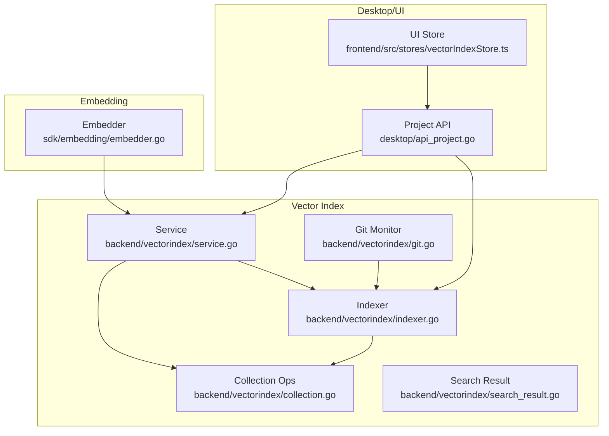
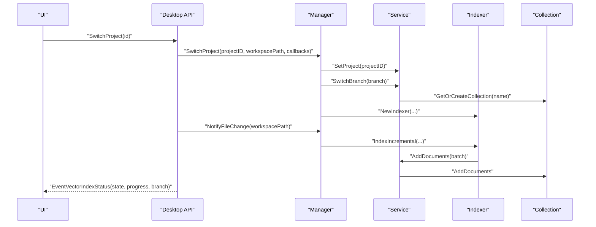
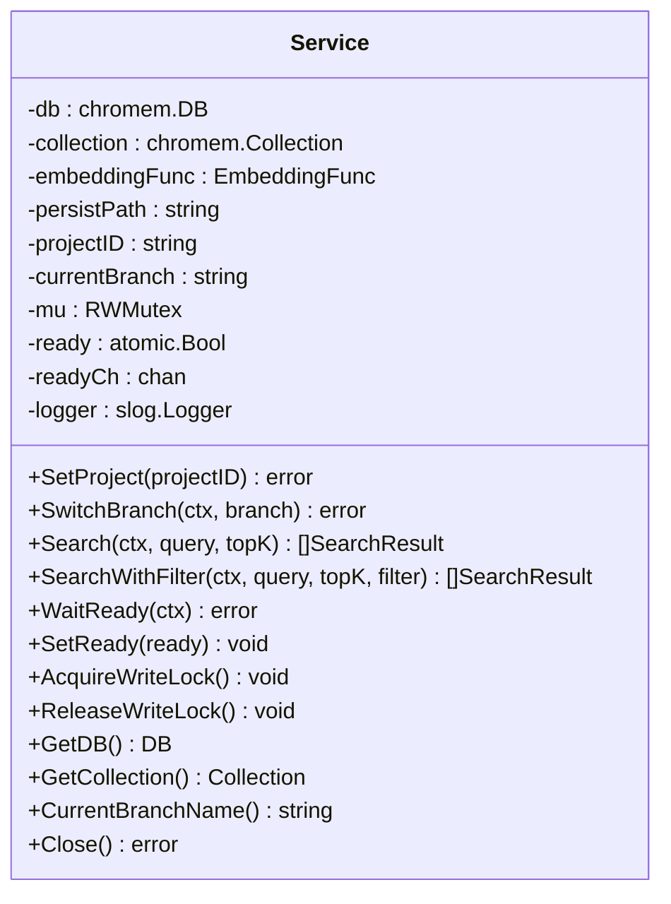
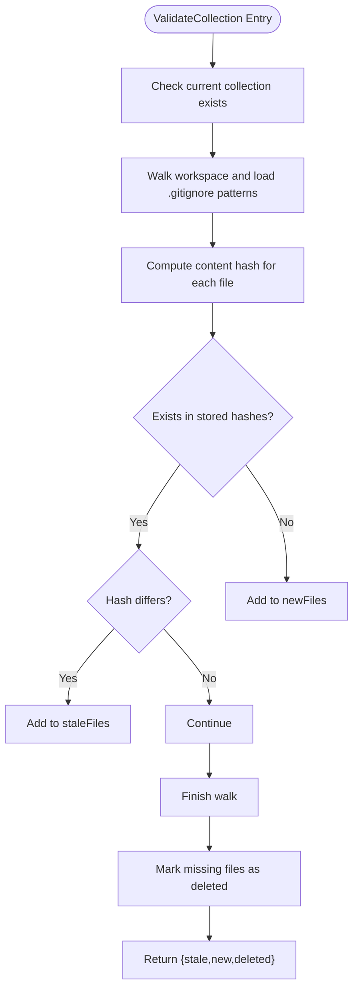
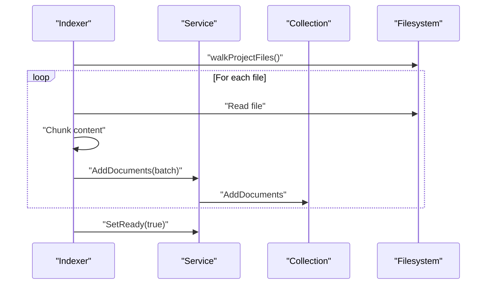
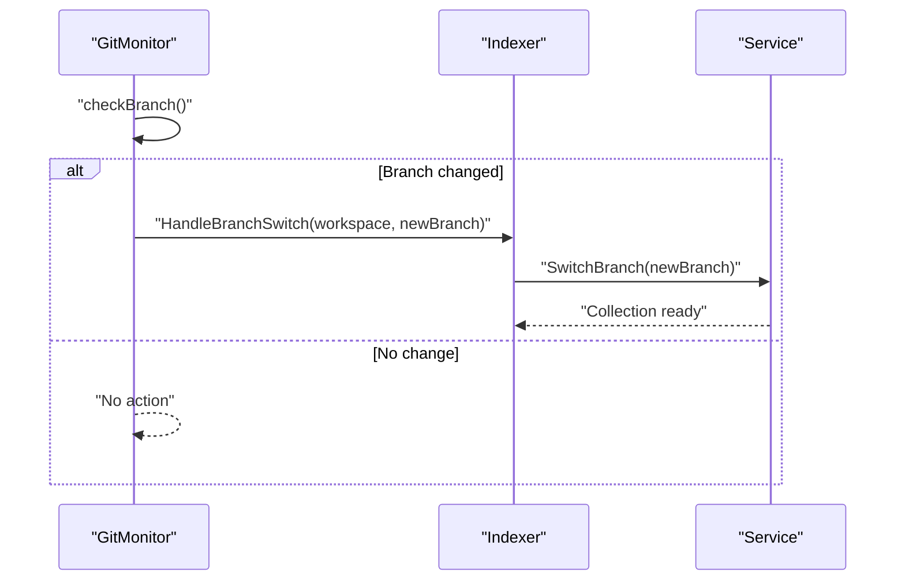
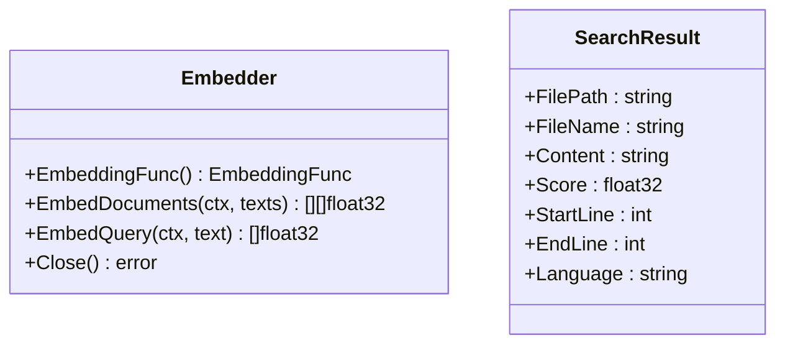
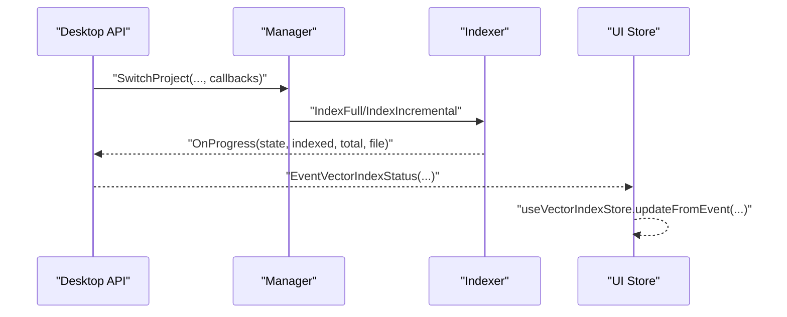
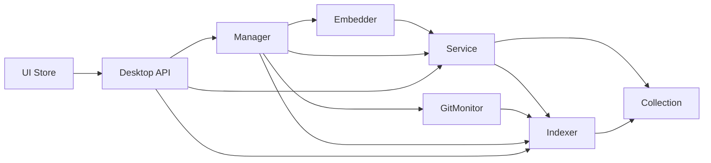

# Vector Collection Management

<cite>
**Referenced Files in This Document**
- [collection.go](file://backend/vectorindex/collection.go)
- [service.go](file://backend/vectorindex/service.go)
- [manager.go](file://backend/vectorindex/manager.go)
- [indexer.go](file://backend/vectorindex/indexer.go)
- [git.go](file://backend/vectorindex/git.go)
- [search_result.go](file://backend/vectorindex/search_result.go)
- [embedder.go](file://sdk/embedding/embedder.go)
- [vectorIndexStore.ts](file://frontend/src/stores/vectorIndexStore.ts)
- [api_project.go](file://desktop/api_project.go)
</cite>

## Table of Contents
1. [Introduction](#introduction)
2. [Project Structure](#project-structure)
3. [Core Components](#core-components)
4. [Architecture Overview](#architecture-overview)
5. [Detailed Component Analysis](#detailed-component-analysis)
6. [Dependency Analysis](#dependency-analysis)
7. [Performance Considerations](#performance-considerations)
8. [Troubleshooting Guide](#troubleshooting-guide)
9. [Conclusion](#conclusion)
10. [Appendices](#appendices)

## Introduction
This document explains vector collection management within the chromem-go framework in the repository. It covers the lifecycle of vector collections, creation and configuration, branch-aware switching, persistence and memory strategies, storage of embeddings and metadata, search capabilities, optimization and cleanup, and integration with the broader vector index service and indexing pipeline.

## Project Structure
The vector index subsystem resides under backend/vectorindex and integrates with the embedding subsystem under sdk/embedding. The desktop layer wires project switching and indexing progress to the UI.

**Diagram sources**
- [service.go:32-46](file://backend/vectorindex/service.go#L32-L46)
- [collection.go:31-55](file://backend/vectorindex/collection.go#L31-L55)
- [indexer.go:61-70](file://backend/vectorindex/indexer.go#L61-L70)
- [git.go:24-34](file://backend/vectorindex/git.go#L24-L34)
- [search_result.go:3-12](file://backend/vectorindex/search_result.go#L3-L12)
- [embedder.go:44-54](file://sdk/embedding/embedder.go#L44-L54)
- [api_project.go:293-315](file://desktop/api_project.go#L293-L315)
- [vectorIndexStore.ts:1-56](file://frontend/src/stores/vectorIndexStore.ts#L1-L56)

**Section sources**
- [service.go:32-46](file://backend/vectorindex/service.go#L32-L46)
- [collection.go:31-55](file://backend/vectorindex/collection.go#L31-L55)
- [indexer.go:61-70](file://backend/vectorindex/indexer.go#L61-L70)
- [git.go:24-34](file://backend/vectorindex/git.go#L24-L34)
- [search_result.go:3-12](file://backend/vectorindex/search_result.go#L3-L12)
- [embedder.go:44-54](file://sdk/embedding/embedder.go#L44-L54)
- [api_project.go:293-315](file://desktop/api_project.go#L293-L315)
- [vectorIndexStore.ts:1-56](file://frontend/src/stores/vectorIndexStore.ts#L1-L56)

## Core Components
- Service: Manages chromem-go DB and collection lifecycle, readiness signaling, and search.
- Collection: Branch-aware collection operations, validation, rebuild, add/delete documents, and metadata enumeration.
- Indexer: Full and incremental indexing, batching, progress reporting, and branch-switch handling.
- GitMonitor: Watches .git/HEAD for branch changes and notifies the system.
- Embedder: Provides chromem-go compatible embedding function backed by ONNX.
- UI Integration: Emits indexing progress and branch state to the frontend.

Key responsibilities:
- Service.SetProject initializes persistence per project and DB.
- Service.SwitchBranch selects or creates a collection per branch.
- Indexer.IndexFull and Indexer.IndexIncremental maintain collection state.
- Collection.ValidateCollection compares stored hashes with disk to drive incremental updates.
- Search returns SearchResult objects enriched with metadata.

**Section sources**
- [service.go:69-98](file://backend/vectorindex/service.go#L69-L98)
- [service.go:32-46](file://backend/vectorindex/service.go#L32-L46)
- [collection.go:31-55](file://backend/vectorindex/collection.go#L31-L55)
- [indexer.go:105-163](file://backend/vectorindex/indexer.go#L105-L163)
- [indexer.go:165-273](file://backend/vectorindex/indexer.go#L165-L273)
- [collection.go:57-139](file://backend/vectorindex/collection.go#L57-L139)
- [git.go:36-62](file://backend/vectorindex/git.go#L36-L62)
- [embedder.go:171-177](file://sdk/embedding/embedder.go#L171-L177)
- [vectorIndexStore.ts:1-56](file://frontend/src/stores/vectorIndexStore.ts#L1-L56)

## Architecture Overview
The vector index architecture centers on a Service that owns a chromem-go DB and a current Collection. An Indexer orchestrates indexing against the current Collection, while a GitMonitor tracks branch changes. The desktop API coordinates project switching and forwards progress to the UI.

**Diagram sources**
- [api_project.go:293-315](file://desktop/api_project.go#L293-L315)
- [manager.go:97-212](file://backend/vectorindex/manager.go#L97-L212)
- [service.go:69-98](file://backend/vectorindex/service.go#L69-L98)
- [service.go:32-55](file://backend/vectorindex/service.go#L32-L55)
- [indexer.go:105-163](file://backend/vectorindex/indexer.go#L105-L163)
- [indexer.go:165-273](file://backend/vectorindex/indexer.go#L165-L273)
- [collection.go:210-240](file://backend/vectorindex/collection.go#L210-L240)

## Detailed Component Analysis

### Service: Project and Collection Lifecycle
Responsibilities:
- Initialize persistent or in-memory DB per project.
- Manage current branch and collection.
- Expose search with optional file filters.
- Control readiness state and notify waiters.
- Provide DB and Collection accessors for Indexer.

Important behaviors:
- SetProject creates a project-scoped directory and opens a persistent DB when PersistPath is set; otherwise uses an in-memory DB.
- SwitchBranch sanitizes branch names, ensures deterministic collection naming, and lazily creates the collection with the configured embedding function.
- SearchWithFilter blocks on WaitReady and applies optional glob filtering on file paths.
- SetReady toggles readiness and wakes blocked WaitReady callers.

**Diagram sources**
- [service.go:32-46](file://backend/vectorindex/service.go#L32-L46)
- [service.go:69-98](file://backend/vectorindex/service.go#L69-L98)
- [service.go:100-143](file://backend/vectorindex/service.go#L100-L143)
- [service.go:145-195](file://backend/vectorindex/service.go#L145-L195)
- [service.go:197-228](file://backend/vectorindex/service.go#L197-L228)

**Section sources**
- [service.go:69-98](file://backend/vectorindex/service.go#L69-L98)
- [service.go:32-55](file://backend/vectorindex/service.go#L32-L55)
- [service.go:100-143](file://backend/vectorindex/service.go#L100-L143)
- [service.go:145-195](file://backend/vectorindex/service.go#L145-L195)
- [service.go:197-228](file://backend/vectorindex/service.go#L197-L228)

### Collection Operations: Validation, Rebuild, and Metadata
Responsibilities:
- ValidateCollection walks the workspace, computes hashes, and reports stale/new/deleted files compared to stored metadata.
- RebuildCollection deletes and recreates the current branch collection.
- AddDocuments and DeleteDocumentsByIDs manage document lifecycle.
- getCollectionFileHashes enumerates stored file metadata by querying the collection and extracting file_path and content_hash.

**Diagram sources**
- [collection.go:57-139](file://backend/vectorindex/collection.go#L57-L139)
- [indexer.go:375-418](file://backend/vectorindex/indexer.go#L375-L418)
- [indexer.go:537-565](file://backend/vectorindex/indexer.go#L537-L565)

**Section sources**
- [collection.go:57-139](file://backend/vectorindex/collection.go#L57-L139)
- [collection.go:185-208](file://backend/vectorindex/collection.go#L185-L208)
- [collection.go:210-240](file://backend/vectorindex/collection.go#L210-L240)
- [collection.go:150-183](file://backend/vectorindex/collection.go#L150-L183)

### Indexer: Full and Incremental Indexing
Responsibilities:
- IndexFull: Walks project files, chunks content, builds chromem documents with metadata, and batches additions to the collection.
- IndexIncremental: Validates collection, deletes stale/deleted documents, reindexes changed/new files, and updates readiness.
- HandleBranchSwitch: Switches branch collection and runs full or incremental indexing depending on collection emptiness.
- collectDocumentIDs: Queries collection to retrieve document IDs for given file paths.
- File filtering: Uses .gitignore semantics and default ignores for directories and extensions.

**Diagram sources**
- [indexer.go:105-163](file://backend/vectorindex/indexer.go#L105-L163)
- [indexer.go:165-273](file://backend/vectorindex/indexer.go#L165-L273)
- [indexer.go:275-293](file://backend/vectorindex/indexer.go#L275-L293)
- [indexer.go:343-373](file://backend/vectorindex/indexer.go#L343-L373)
- [indexer.go:375-418](file://backend/vectorindex/indexer.go#L375-L418)

**Section sources**
- [indexer.go:105-163](file://backend/vectorindex/indexer.go#L105-L163)
- [indexer.go:165-273](file://backend/vectorindex/indexer.go#L165-L273)
- [indexer.go:275-293](file://backend/vectorindex/indexer.go#L275-L293)
- [indexer.go:343-373](file://backend/vectorindex/indexer.go#L343-L373)
- [indexer.go:375-418](file://backend/vectorindex/indexer.go#L375-L418)

### Git Monitoring and Branch Switching
Responsibilities:
- Detect current branch or fall back to a default when outside a git repository.
- Watch .git/HEAD for changes with a debounce to avoid spurious triggers.
- Notify the Indexer to handle branch transitions.

**Diagram sources**
- [git.go:144-161](file://backend/vectorindex/git.go#L144-L161)
- [indexer.go:275-293](file://backend/vectorindex/indexer.go#L275-L293)
- [service.go:32-55](file://backend/vectorindex/service.go#L32-L55)

**Section sources**
- [git.go:36-62](file://backend/vectorindex/git.go#L36-L62)
- [git.go:92-110](file://backend/vectorindex/git.go#L92-L110)
- [git.go:112-142](file://backend/vectorindex/git.go#L112-L142)
- [git.go:144-161](file://backend/vectorindex/git.go#L144-L161)
- [indexer.go:275-293](file://backend/vectorindex/indexer.go#L275-L293)

### Embedding Function and Search Results
- Embedder exposes an EmbeddingFunc compatible with chromem-go, enabling collection creation with embeddings.
- Search results are mapped to SearchResult with fields for file path, name, content, similarity score, line range, and language.

**Diagram sources**
- [embedder.go:171-177](file://sdk/embedding/embedder.go#L171-L177)
- [search_result.go:3-12](file://backend/vectorindex/search_result.go#L3-L12)

**Section sources**
- [embedder.go:171-177](file://sdk/embedding/embedder.go#L171-L177)
- [search_result.go:3-12](file://backend/vectorindex/search_result.go#L3-L12)

### UI Integration and Progress Reporting
- The desktop API emits vector index status events containing state, progress, counts, current file, and branch.
- The frontend store consumes these events to render progress and branch information.

**Diagram sources**
- [api_project.go:293-315](file://desktop/api_project.go#L293-L315)
- [manager.go:97-212](file://backend/vectorindex/manager.go#L97-L212)
- [indexer.go:30-34](file://backend/vectorindex/indexer.go#L30-L34)
- [vectorIndexStore.ts:12-28](file://frontend/src/stores/vectorIndexStore.ts#L12-L28)

**Section sources**
- [api_project.go:293-315](file://desktop/api_project.go#L293-L315)
- [vectorIndexStore.ts:1-56](file://frontend/src/stores/vectorIndexStore.ts#L1-L56)

## Dependency Analysis
- Service depends on chromem-go DB and Collection, and on the Embedder’s EmbeddingFunc.
- Indexer depends on Service for collection access and on filesystem traversal utilities.
- GitMonitor depends on filesystem watching and git operations.
- Manager composes Embedder, Service, Indexer, and GitMonitor, coordinating lifecycle and callbacks.
- UI depends on events emitted by the desktop API.

**Diagram sources**
- [embedder.go:171-177](file://sdk/embedding/embedder.go#L171-L177)
- [service.go:32-46](file://backend/vectorindex/service.go#L32-L46)
- [indexer.go:61-70](file://backend/vectorindex/indexer.go#L61-L70)
- [git.go:24-34](file://backend/vectorindex/git.go#L24-L34)
- [manager.go:31-47](file://backend/vectorindex/manager.go#L31-L47)
- [api_project.go:293-315](file://desktop/api_project.go#L293-L315)
- [vectorIndexStore.ts:1-56](file://frontend/src/stores/vectorIndexStore.ts#L1-L56)

**Section sources**
- [embedder.go:171-177](file://sdk/embedding/embedder.go#L171-L177)
- [service.go:32-46](file://backend/vectorindex/service.go#L32-L46)
- [indexer.go:61-70](file://backend/vectorindex/indexer.go#L61-L70)
- [git.go:24-34](file://backend/vectorindex/git.go#L24-L34)
- [manager.go:31-47](file://backend/vectorindex/manager.go#L31-L47)
- [api_project.go:293-315](file://desktop/api_project.go#L293-L315)
- [vectorIndexStore.ts:1-56](file://frontend/src/stores/vectorIndexStore.ts#L1-L56)

## Performance Considerations
- Batching: Indexer batches document additions to reduce overhead; tune batch size for throughput vs. memory trade-offs.
- Readiness signaling: SetReady(false) before indexing and SetReady(true) after completion prevents queries during inconsistent states.
- Incremental indexing: ValidateCollection minimizes work by operating only on changed/new/deleted files.
- Hash computation: Content hashing is O(n) per file; caching or skipping unchanged files improves performance.
- Embedding concurrency: Embedder supports concurrent embedding; ensure appropriate resource allocation for ONNX runtime.
- Memory vs. persistence: Persistent DB scales across restarts; in-memory DB reduces disk IO but loses state.

[No sources needed since this section provides general guidance]

## Troubleshooting Guide
Common issues and remedies:
- No collection available: Ensure SetProject and SwitchBranch are called before search or indexing operations.
- Empty or stale collection: Run IndexFull or rely on IndexIncremental to rebuild or update based on ValidateCollection.
- Branch switching failures: Verify git HEAD monitoring and that HandleBranchSwitch is invoked on branch changes.
- Progress not updating: Confirm desktop API emits EventVectorIndexStatus and UI store receives updateFromEvent.
- Embedding errors: Check Embedder initialization and ONNX runtime availability.

**Section sources**
- [service.go:100-143](file://backend/vectorindex/service.go#L100-L143)
- [indexer.go:165-273](file://backend/vectorindex/indexer.go#L165-L273)
- [git.go:144-161](file://backend/vectorindex/git.go#L144-L161)
- [api_project.go:301-315](file://desktop/api_project.go#L301-L315)
- [vectorIndexStore.ts:37-45](file://frontend/src/stores/vectorIndexStore.ts#L37-L45)

## Conclusion
The vector collection management system provides a robust, branch-aware indexing pipeline powered by chromem-go. It supports both persistent and in-memory storage, incremental maintenance, and seamless UI integration. Proper configuration of the embedding function, readiness signaling, and git monitoring ensures reliable search and efficient updates.

[No sources needed since this section summarizes without analyzing specific files]

## Appendices

### Configuration Options
- ServiceConfig: PersistPath, EmbeddingFunc, Logger.
- ManagerConfig: ModelPath, TokenizerPath, LibraryPath, MaxSeqLength, HiddenDim, PersistPath, Logger.
- IndexerConfig: Service, ChunkFn, HashFn, MaxChunkSize, Overlap, OnProgress, Logger.

**Section sources**
- [service.go:18-30](file://backend/vectorindex/service.go#L18-L30)
- [manager.go:14-24](file://backend/vectorindex/manager.go#L14-L24)
- [indexer.go:50-59](file://backend/vectorindex/indexer.go#L50-L59)

### Cleanup Procedures
- Shutdown Manager to cancel in-flight indexing, stop GitMonitor, close Service, and close Embedder.
- Close Service to release DB and collection references.

**Section sources**
- [manager.go:246-280](file://backend/vectorindex/manager.go#L246-L280)
- [service.go:219-228](file://backend/vectorindex/service.go#L219-L228)