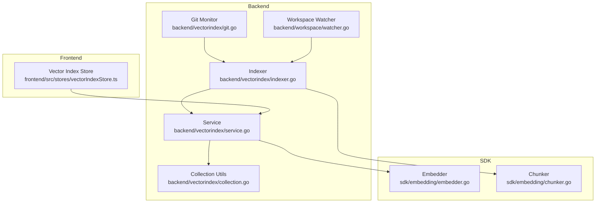
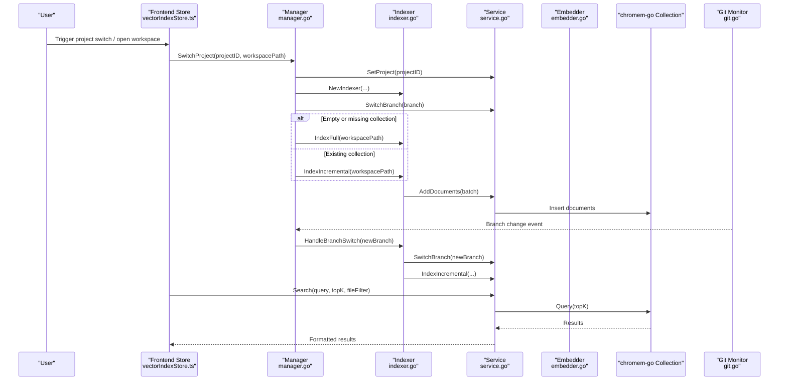
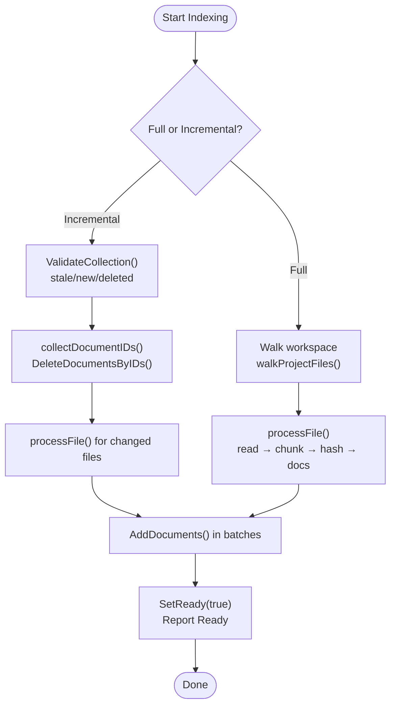
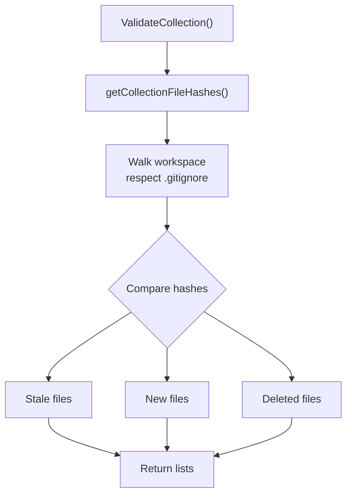
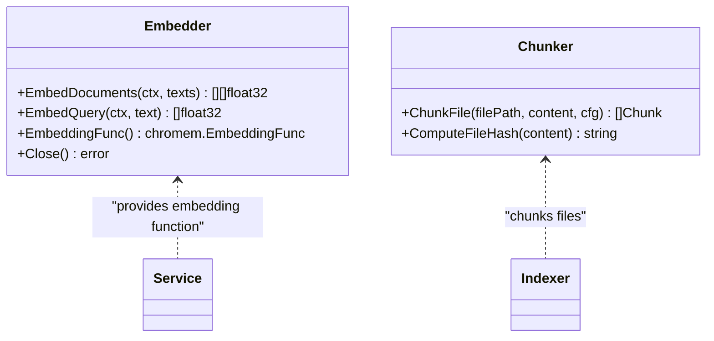
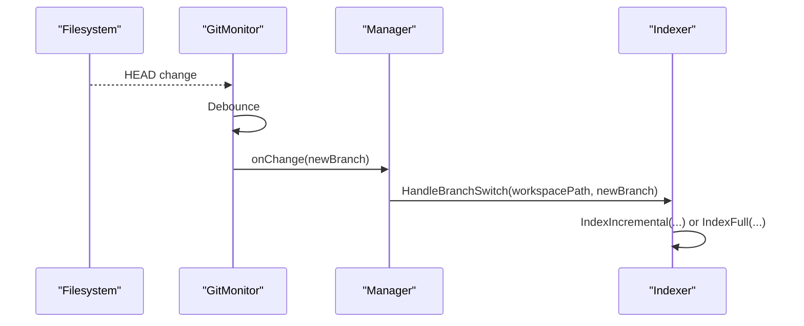
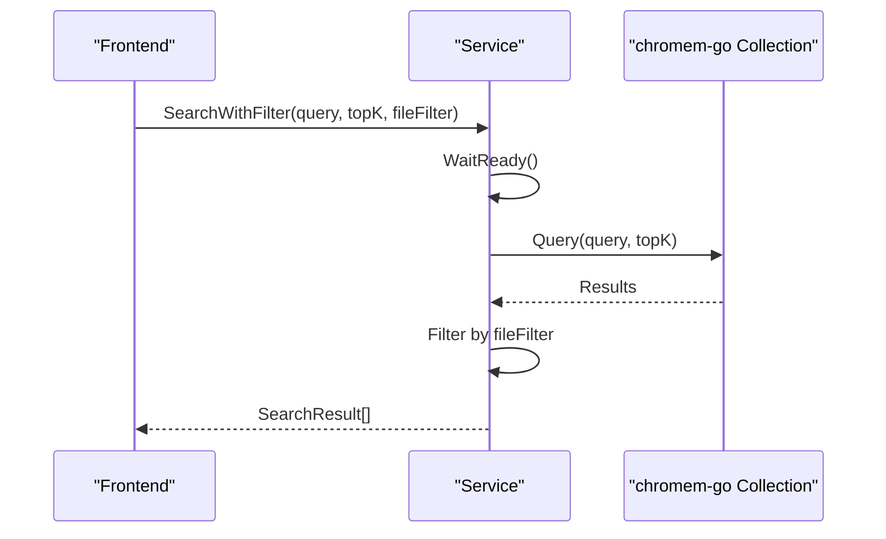
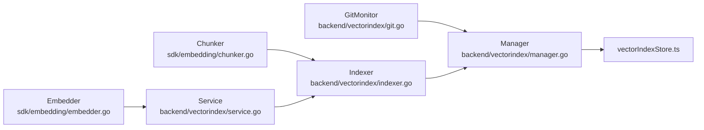

# Vector Index System

<cite>
**Referenced Files in This Document**
- [collection.go](file://backend/vectorindex/collection.go)
- [indexer.go](file://backend/vectorindex/indexer.go)
- [service.go](file://backend/vectorindex/service.go)
- [manager.go](file://backend/vectorindex/manager.go)
- [git.go](file://backend/vectorindex/git.go)
- [watcher.go](file://backend/workspace/watcher.go)
- [embedder.go](file://sdk/embedding/embedder.go)
- [chunker.go](file://sdk/embedding/chunker.go)
- [search_result.go](file://backend/vectorindex/search_result.go)
- [vector_search.go](file://sdk/tools/builtins/vector_search.go)
- [vectorIndexStore.ts](file://frontend/src/stores/vectorIndexStore.ts)
</cite>

## Table of Contents
1. [Introduction](#introduction)
2. [Project Structure](#project-structure)
3. [Core Components](#core-components)
4. [Architecture Overview](#architecture-overview)
5. [Detailed Component Analysis](#detailed-component-analysis)
6. [Dependency Analysis](#dependency-analysis)
7. [Performance Considerations](#performance-considerations)
8. [Troubleshooting Guide](#troubleshooting-guide)
9. [Conclusion](#conclusion)
10. [Appendices](#appendices)

## Introduction
This document explains C0WRK’s vector-based code search and semantic indexing system. It covers how the system builds semantic embeddings using chromem-go, indexes codebases with configurable chunking and hashing, and keeps indexes synchronized with Git branches and file changes. It also details the vector collection management, embedding generation pipeline, search algorithms, and real-time update mechanisms. Finally, it outlines performance optimizations, memory management strategies for large codebases, and practical usage patterns for code analysis and development workflows.

## Project Structure
The vector index system spans several packages:
- backend/vectorindex: core vector index service, indexer, Git monitor, and search result types
- backend/workspace: file system watcher for triggering incremental indexing
- sdk/embedding: ONNX-based embedder and file chunker used for generating embeddings and splitting code
- sdk/tools/builtins: vector search tool for agent workflows
- frontend: UI store for vector index status and progress

**Diagram sources**
- [service.go:34-46](file://backend/vectorindex/service.go#L34-L46)
- [indexer.go:62-70](file://backend/vectorindex/indexer.go#L62-L70)
- [collection.go:34-54](file://backend/vectorindex/collection.go#L34-L54)
- [git.go:26-34](file://backend/vectorindex/git.go#L26-L34)
- [watcher.go:22-30](file://backend/workspace/watcher.go#L22-L30)
- [embedder.go:46-54](file://sdk/embedding/embedder.go#L46-L54)
- [chunker.go:13-21](file://sdk/embedding/chunker.go#L13-L21)
- [vectorIndexStore.ts:5-21](file://frontend/src/stores/vectorIndexStore.ts#L5-L21)

**Section sources**
- [service.go:34-46](file://backend/vectorindex/service.go#L34-L46)
- [indexer.go:62-70](file://backend/vectorindex/indexer.go#L62-L70)
- [collection.go:34-54](file://backend/vectorindex/collection.go#L34-L54)
- [git.go:26-34](file://backend/vectorindex/git.go#L26-L34)
- [watcher.go:22-30](file://backend/workspace/watcher.go#L22-L30)
- [embedder.go:46-54](file://sdk/embedding/embedder.go#L46-L54)
- [chunker.go:13-21](file://sdk/embedding/chunker.go#L13-L21)
- [vectorIndexStore.ts:5-21](file://frontend/src/stores/vectorIndexStore.ts#L5-L21)

## Core Components
- Service: Manages chromem-go database and collections, branch-aware switching, readiness signaling, and search queries with optional file filters.
- Indexer: Orchestrates full and incremental indexing, file walking with .gitignore support, chunking, hashing, batching, and document insertion/deletion.
- Collection Utilities: Validates collection against disk, enumerates stored files, computes deterministic document IDs, and rebuilds collections.
- Git Monitor: Watches .git/HEAD for branch changes and notifies the indexer to switch collections and reindex.
- Workspace Watcher: Debounced file system watcher that triggers incremental indexing on changes.
- Embedder: ONNX-based text embedding with persistent session for fast single-text inference and batch inference for larger loads.
- Chunker: Language-aware file chunking with overlap, designed to preserve semantic coherence for embeddings.
- Vector Search Tool: Agent-facing tool that invokes the vector index, waits for readiness, and formats results.

**Section sources**
- [service.go:34-46](file://backend/vectorindex/service.go#L34-L46)
- [indexer.go:62-70](file://backend/vectorindex/indexer.go#L62-L70)
- [collection.go:34-54](file://backend/vectorindex/collection.go#L34-L54)
- [git.go:26-34](file://backend/vectorindex/git.go#L26-L34)
- [watcher.go:22-30](file://backend/workspace/watcher.go#L22-L30)
- [embedder.go:46-54](file://sdk/embedding/embedder.go#L46-L54)
- [chunker.go:13-21](file://sdk/embedding/chunker.go#L13-L21)
- [vector_search.go:32-37](file://sdk/tools/builtins/vector_search.go#L32-L37)

## Architecture Overview
The system integrates a Git-aware, branch-scoped vector index powered by chromem-go. Embeddings are generated locally using an ONNX-based embedder. The indexer maintains a persistent collection per branch, supports full and incremental reindexing, and exposes a search API with optional file filters.

**Diagram sources**
- [manager.go:97-212](file://backend/vectorindex/manager.go#L97-L212)
- [indexer.go:107-163](file://backend/vectorindex/indexer.go#L107-L163)
- [service.go:100-143](file://backend/vectorindex/service.go#L100-L143)
- [embedder.go:120-157](file://sdk/embedding/embedder.go#L120-L157)
- [git.go:94-161](file://backend/vectorindex/git.go#L94-L161)
- [vectorIndexStore.ts:30-55](file://frontend/src/stores/vectorIndexStore.ts#L30-L55)

## Detailed Component Analysis

### Service: Vector Index Management and Search
The Service encapsulates:
- Project scoping and persistence: initializes chromem-go DB per project, optionally persistent
- Branch-aware collections: creates a collection per branch name derived from sanitized branch identifiers
- Readiness signaling: channels and atomics to coordinate blocking on index readiness
- Search: executes vector similarity queries with optional file path glob filtering
- Utility operations: lock acquisition for write operations, collection accessors, and conversion from chromem-go results to SearchResult

Key behaviors:
- Deterministic collection naming from branch names
- Blocking WaitReady until index is ready
- Optional file filter using doublestar globbing
- Thread-safe read/write locks around collection operations

**Section sources**
- [service.go:34-46](file://backend/vectorindex/service.go#L34-L46)
- [service.go:69-98](file://backend/vectorindex/service.go#L69-L98)
- [service.go:100-143](file://backend/vectorindex/service.go#L100-L143)
- [service.go:145-195](file://backend/vectorindex/service.go#L145-L195)
- [service.go:197-228](file://backend/vectorindex/service.go#L197-L228)
- [search_result.go:3-12](file://backend/vectorindex/search_result.go#L3-L12)

### Indexer: Full and Incremental Indexing
The Indexer coordinates:
- Walking the workspace with .gitignore and default ignores
- Chunking files into semantically coherent segments
- Computing content hashes for change detection
- Batching document insertion and deletion
- Progress reporting and cancellation support

Processing pipeline:
- Full indexing: walks all files, chunks, and inserts documents in batches
- Incremental indexing: validates against disk, deletes stale/deleted, reindexes modified/new, and inserts new batches
- Branch switching: switches collection and decides full vs incremental based on collection presence

**Diagram sources**
- [indexer.go:107-163](file://backend/vectorindex/indexer.go#L107-L163)
- [indexer.go:167-273](file://backend/vectorindex/indexer.go#L167-L273)
- [indexer.go:295-341](file://backend/vectorindex/indexer.go#L295-L341)
- [indexer.go:343-373](file://backend/vectorindex/indexer.go#L343-L373)
- [indexer.go:375-418](file://backend/vectorindex/indexer.go#L375-L418)

**Section sources**
- [indexer.go:107-163](file://backend/vectorindex/indexer.go#L107-L163)
- [indexer.go:167-273](file://backend/vectorindex/indexer.go#L167-L273)
- [indexer.go:295-341](file://backend/vectorindex/indexer.go#L295-L341)
- [indexer.go:343-373](file://backend/vectorindex/indexer.go#L343-L373)
- [indexer.go:375-418](file://backend/vectorindex/indexer.go#L375-L418)

### Collection Utilities: Validation, Enumeration, and Rebuild
- ValidateCollection: compares stored file hashes with current disk state to determine stale/new/deleted files
- getCollectionFileHashes: enumerates stored file paths and hashes by querying the collection
- RebuildCollection: deletes and recreates the current branch collection
- AddDocuments/DeleteDocumentsByIDs: batch insertions and deletions with write locks
- DocumentID: deterministic IDs derived from file path hash and chunk index

**Diagram sources**
- [collection.go:57-139](file://backend/vectorindex/collection.go#L57-L139)
- [collection.go:150-183](file://backend/vectorindex/collection.go#L150-L183)

**Section sources**
- [collection.go:57-139](file://backend/vectorindex/collection.go#L57-L139)
- [collection.go:150-183](file://backend/vectorindex/collection.go#L150-L183)
- [collection.go:185-208](file://backend/vectorindex/collection.go#L185-L208)
- [collection.go:210-240](file://backend/vectorindex/collection.go#L210-L240)
- [collection.go:242-263](file://backend/vectorindex/collection.go#L242-L263)

### Embedding Generation: Embedder and Chunker
- Embedder: ONNX-based embedder with tokenizer and persistent session for fast single-text inference; falls back to batch inference for larger batches
- Chunker: Language-aware chunking with overlap; splits code by logical boundaries, markdown by headers, configs by top-level keys, and falls back to fixed-size splits

**Diagram sources**
- [embedder.go:46-54](file://sdk/embedding/embedder.go#L46-L54)
- [embedder.go:120-157](file://sdk/embedding/embedder.go#L120-L157)
- [chunker.go:13-21](file://sdk/embedding/chunker.go#L13-L21)
- [chunker.go:48-100](file://sdk/embedding/chunker.go#L48-L100)

**Section sources**
- [embedder.go:46-54](file://sdk/embedding/embedder.go#L46-L54)
- [embedder.go:120-157](file://sdk/embedding/embedder.go#L120-L157)
- [chunker.go:48-100](file://sdk/embedding/chunker.go#L48-L100)
- [chunker.go:171-178](file://sdk/embedding/chunker.go#L171-L178)
- [chunker.go:273-295](file://sdk/embedding/chunker.go#L273-L295)
- [chunker.go:297-322](file://sdk/embedding/chunker.go#L297-L322)
- [chunker.go:385-389](file://sdk/embedding/chunker.go#L385-L389)

### Git Integration and Real-Time Updates
- GitMonitor watches .git/HEAD for branch changes with a debounce interval; on change, it invokes a callback to handle branch switching and reindexing
- Manager coordinates project switching, branch detection, indexer creation, and git monitor startup
- Workspace Watcher triggers debounced incremental indexing on file system changes

**Diagram sources**
- [git.go:94-161](file://backend/vectorindex/git.go#L94-L161)
- [manager.go:188-212](file://backend/vectorindex/manager.go#L188-L212)
- [indexer.go:275-293](file://backend/vectorindex/indexer.go#L275-L293)

**Section sources**
- [git.go:26-34](file://backend/vectorindex/git.go#L26-L34)
- [git.go:94-161](file://backend/vectorindex/git.go#L94-L161)
- [manager.go:188-212](file://backend/vectorindex/manager.go#L188-L212)
- [indexer.go:275-293](file://backend/vectorindex/indexer.go#L275-L293)

### Search Workflow and Result Ranking
- SearchWithFilter: waits for readiness, queries the collection, filters by file path glob, and converts results to SearchResult
- Ranking: similarity scores from chromem-go queries are surfaced as-is; higher scores indicate more similar matches
- Frontend store: maps backend state to UI status, progress, and current file

**Diagram sources**
- [service.go:105-143](file://backend/vectorindex/service.go#L105-L143)
- [search_result.go:3-12](file://backend/vectorindex/search_result.go#L3-L12)
- [vectorIndexStore.ts:30-55](file://frontend/src/stores/vectorIndexStore.ts#L30-L55)

**Section sources**
- [service.go:105-143](file://backend/vectorindex/service.go#L105-L143)
- [search_result.go:3-12](file://backend/vectorindex/search_result.go#L3-L12)
- [vectorIndexStore.ts:30-55](file://frontend/src/stores/vectorIndexStore.ts#L30-L55)

### Agent Tool Integration
- VectorSearchTool: agent-facing tool that validates inputs, waits for index readiness, executes search, and formats results with file paths, line ranges, scores, and content previews
- Defaults and caps: topK default and maximum values are enforced

**Section sources**
- [vector_search.go:32-78](file://sdk/tools/builtins/vector_search.go#L32-L78)
- [vector_search.go:87-157](file://sdk/tools/builtins/vector_search.go#L87-L157)

## Dependency Analysis
- Service depends on chromem-go for database and collection operations and on Embedder for the embedding function
- Indexer depends on Service for collection operations, on Chunker for file segmentation, and on Workspace Watcher/Git Monitor for triggering indexing
- Manager composes Embedder, Service, Indexer, and GitMonitor, coordinating lifecycle and callbacks
- Frontend store subscribes to vector index events emitted by the backend

**Diagram sources**
- [embedder.go:46-54](file://sdk/embedding/embedder.go#L46-L54)
- [service.go:34-46](file://backend/vectorindex/service.go#L34-L46)
- [chunker.go:13-21](file://sdk/embedding/chunker.go#L13-L21)
- [indexer.go:62-70](file://backend/vectorindex/indexer.go#L62-L70)
- [git.go:26-34](file://backend/vectorindex/git.go#L26-L34)
- [manager.go:34-47](file://backend/vectorindex/manager.go#L34-L47)
- [vectorIndexStore.ts:5-21](file://frontend/src/stores/vectorIndexStore.ts#L5-L21)

**Section sources**
- [manager.go:34-47](file://backend/vectorindex/manager.go#L34-L47)
- [service.go:34-46](file://backend/vectorindex/service.go#L34-L46)
- [indexer.go:62-70](file://backend/vectorindex/indexer.go#L62-L70)
- [git.go:26-34](file://backend/vectorindex/git.go#L26-L34)
- [embedder.go:46-54](file://sdk/embedding/embedder.go#L46-L54)
- [chunker.go:13-21](file://sdk/embedding/chunker.go#L13-L21)
- [vectorIndexStore.ts:5-21](file://frontend/src/stores/vectorIndexStore.ts#L5-L21)

## Performance Considerations
- Batching: Indexer inserts documents in batches to reduce overhead and improve throughput
- Persistent session: Embedder uses a persistent ONNX session for single-text embeddings, minimizing session creation costs
- Debouncing: Both GitMonitor and Workspace Watcher debounce events to avoid excessive reindexing
- Readiness signaling: Service uses channels and atomics to avoid busy-waiting and to coordinate consumers efficiently
- Memory management:
  - Deterministic document IDs prevent duplicates and simplify deletions
  - Hash-based change detection avoids unnecessary reprocessing
  - Collection enumeration uses broad queries; for very large collections, consider maintaining a separate metadata store for file-to-hash mapping
- Search filtering: File path filtering is applied client-side after retrieval; keep topK reasonable to limit post-filtering cost

[No sources needed since this section provides general guidance]

## Troubleshooting Guide
Common issues and remedies:
- Index not ready: Use WaitReady or the provided wait function in the vector search tool to block until the index is ready
- No collection available: Ensure SetProject and SwitchBranch are called before indexing or searching
- Empty or stale collection: Trigger IndexFull or IndexIncremental depending on desired behavior
- Git branch changes not reflected: Verify GitMonitor is started and branch detection is successful
- Excessive reindexing: Confirm debouncing is effective and ignore patterns are correctly configured
- Slow embeddings: Ensure Embedder persistent session is active and consider adjusting batch sizes

**Section sources**
- [service.go:150-166](file://backend/vectorindex/service.go#L150-L166)
- [vector_search.go:106-111](file://sdk/tools/builtins/vector_search.go#L106-L111)
- [manager.go:188-212](file://backend/vectorindex/manager.go#L188-L212)
- [git.go:94-161](file://backend/vectorindex/git.go#L94-L161)
- [indexer.go:107-163](file://backend/vectorindex/indexer.go#L107-L163)

## Conclusion
C0WRK’s vector index system provides a robust, Git-aware, and real-time semantic search capability over codebases. By combining language-aware chunking, ONNX-based embeddings, and chromem-go collections, it enables efficient discovery and understanding of code. The system’s design emphasizes incremental updates, readiness signaling, and frontend integration, making it suitable for interactive development workflows and agent-driven code analysis.

[No sources needed since this section summarizes without analyzing specific files]

## Appendices

### Practical Usage Patterns
- Investigating code concepts: Use the vector search tool with natural language queries to locate implementations and related functionality
- Exploring architecture: Narrow results with file patterns to focus on specific subsystems or languages
- Agent-assisted refactoring: Combine semantic search with file editing tools to understand and modify code confidently

**Section sources**
- [vector_search.go:12-27](file://sdk/tools/builtins/vector_search.go#L12-L27)
- [vector_search.go:87-157](file://sdk/tools/builtins/vector_search.go#L87-L157)