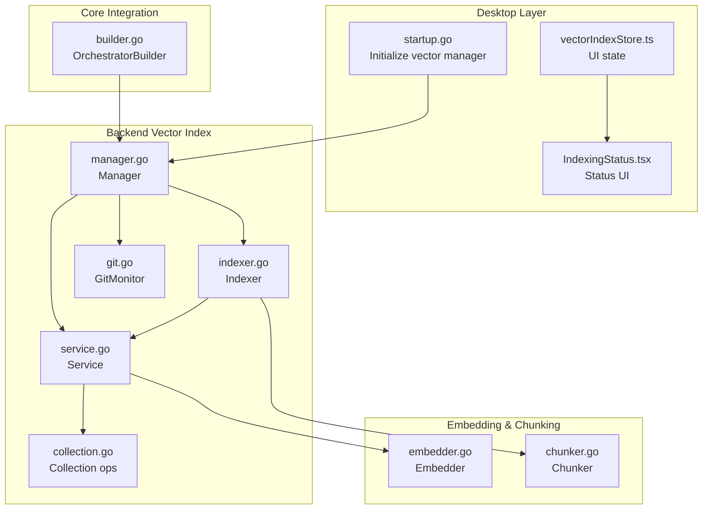
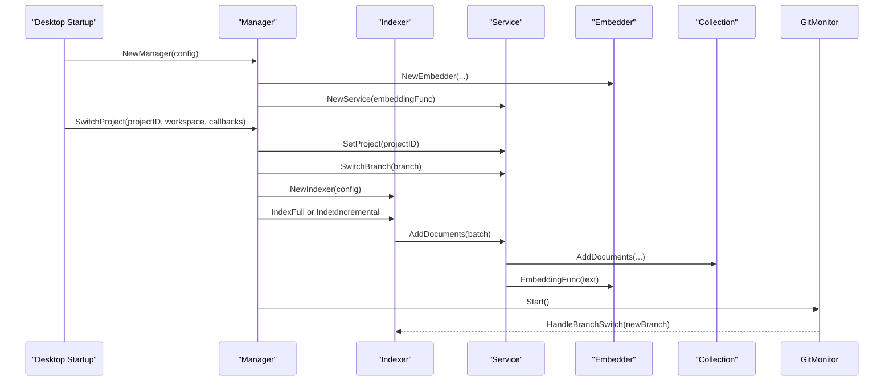
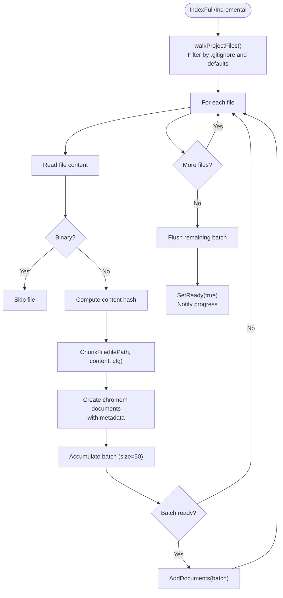
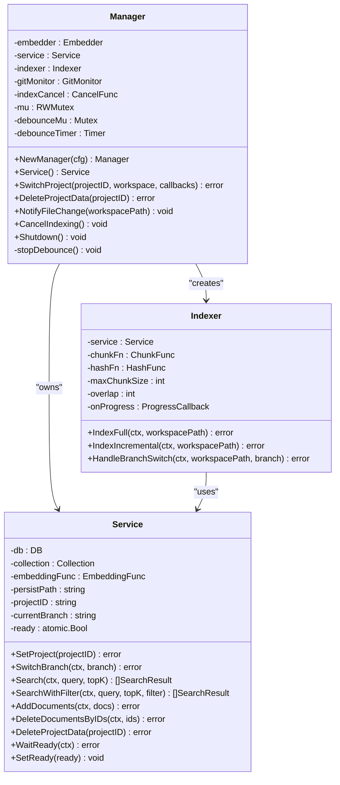
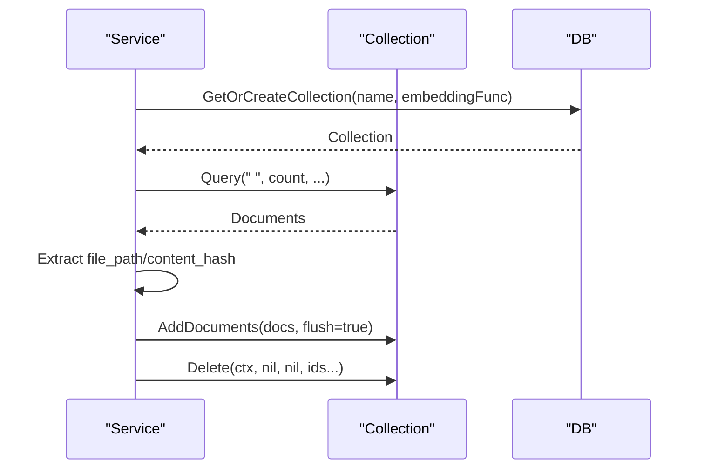
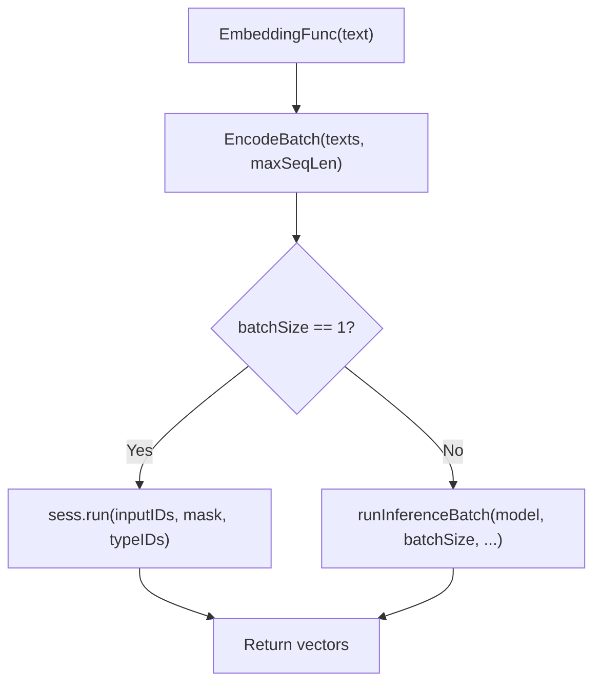
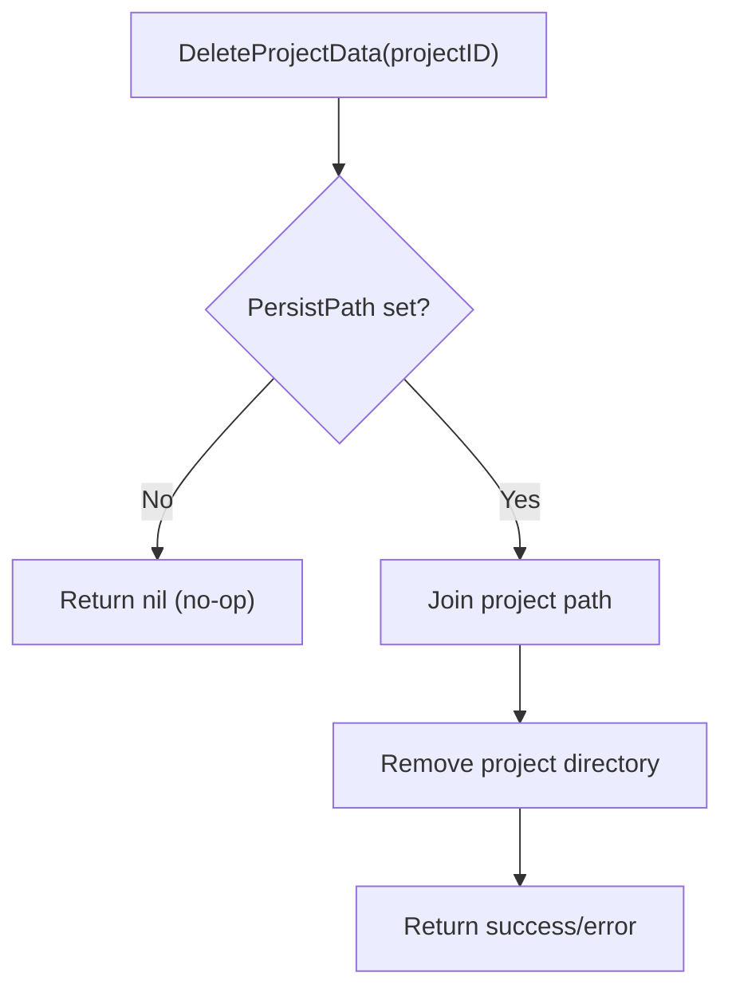
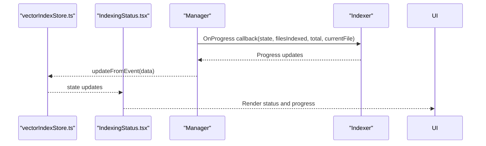
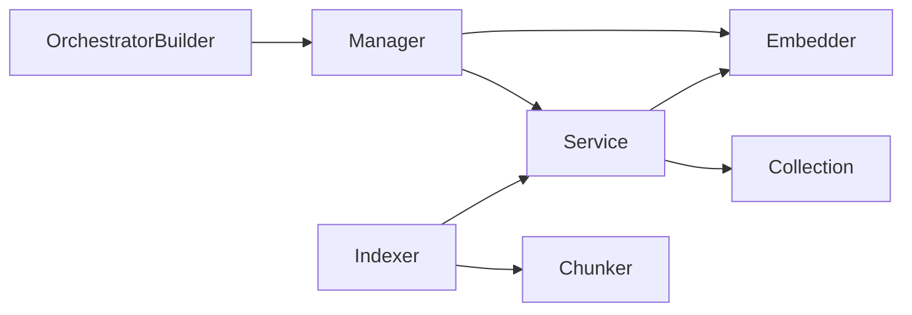

# Vector Indexing Process

<cite>
**Referenced Files in This Document**
- [indexer.go](file://backend/vectorindex/indexer.go)
- [manager.go](file://backend/vectorindex/manager.go)
- [service.go](file://backend/vectorindex/service.go)
- [collection.go](file://backend/vectorindex/collection.go)
- [git.go](file://backend/vectorindex/git.go)
- [search_result.go](file://backend/vectorindex/search_result.go)
- [embedder.go](file://sdk/embedding/embedder.go)
- [chunker.go](file://sdk/embedding/chunker.go)
- [builder.go](file://core/builder.go)
- [startup.go](file://desktop/startup.go)
- [vectorIndexStore.ts](file://frontend/src/stores/vectorIndexStore.ts)
- [IndexingStatus.tsx](file://frontend/src/components/layout/IndexingStatus.tsx)
- [watcher.go](file://backend/workspace/watcher.go)
- [frontend_api_project.go](file://backend/frontend_api_project.go)
</cite>

## Update Summary
**Changes Made**
- Added documentation for the new DeleteProjectData method in Manager and Service
- Enhanced project isolation documentation with improved resource management
- Updated debounce handling section with stopDebounce method
- Added troubleshooting guidance for project data cleanup
- Updated architecture diagrams to reflect enhanced resource management

## Table of Contents
1. [Introduction](#introduction)
2. [Project Structure](#project-structure)
3. [Core Components](#core-components)
4. [Architecture Overview](#architecture-overview)
5. [Detailed Component Analysis](#detailed-component-analysis)
6. [Dependency Analysis](#dependency-analysis)
7. [Performance Considerations](#performance-considerations)
8. [Troubleshooting Guide](#troubleshooting-guide)
9. [Conclusion](#conclusion)

## Introduction
This document explains the vector indexing process in the codebase, focusing on how files are discovered, filtered, chunked, embedded, and stored for semantic search. It covers the Indexer implementation, the indexing manager's coordination of bulk and incremental operations, concurrency handling, and integration with the workspace watcher for real-time updates. It also documents configuration options, chunking strategies, language detection, and troubleshooting techniques.

## Project Structure
The vector indexing capability spans several packages:
- backend/vectorindex: Indexer, Manager, Service, GitMonitor, and collection utilities
- sdk/embedding: Embedder and chunker implementations
- core: OrchestratorBuilder integrates vector search into the tool registry
- desktop: Startup initializes the vector manager and wires UI callbacks
- frontend: Stores and UI components visualize indexing status

**Diagram sources**
- [startup.go:250-325](file://desktop/startup.go#L250-L325)
- [manager.go:31-95](file://backend/vectorindex/manager.go#L31-L95)
- [indexer.go:61-103](file://backend/vectorindex/indexer.go#L61-L103)
- [service.go:32-67](file://backend/vectorindex/service.go#L32-L67)
- [collection.go:31-55](file://backend/vectorindex/collection.go#L31-L55)
- [git.go:24-90](file://backend/vectorindex/git.go#L24-L90)
- [embedder.go:44-118](file://sdk/embedding/embedder.go#L44-L118)
- [chunker.go:48-100](file://sdk/embedding/chunker.go#L48-L100)
- [builder.go:352-364](file://core/builder.go#L352-L364)
- [vectorIndexStore.ts:1-56](file://frontend/src/stores/vectorIndexStore.ts#L1-L56)
- [IndexingStatus.tsx:1-87](file://frontend/src/components/layout/IndexingStatus.tsx#L1-L87)

**Section sources**
- [startup.go:250-325](file://desktop/startup.go#L250-L325)
- [manager.go:31-95](file://backend/vectorindex/manager.go#L31-L95)
- [indexer.go:61-103](file://backend/vectorindex/indexer.go#L61-L103)
- [service.go:32-67](file://backend/vectorindex/service.go#L32-L67)
- [collection.go:31-55](file://backend/vectorindex/collection.go#L31-L55)
- [git.go:24-90](file://backend/vectorindex/git.go#L24-L90)
- [embedder.go:44-118](file://sdk/embedding/embedder.go#L44-L118)
- [chunker.go:48-100](file://sdk/embedding/chunker.go#L48-L100)
- [builder.go:352-364](file://core/builder.go#L352-L364)
- [vectorIndexStore.ts:1-56](file://frontend/src/stores/vectorIndexStore.ts#L1-L56)
- [IndexingStatus.tsx:1-87](file://frontend/src/components/layout/IndexingStatus.tsx#L1-L87)

## Core Components
- Indexer: Orchestrates full and incremental indexing, file filtering, chunking, and document creation with metadata.
- Manager: Lifecycle coordinator for embedder, service, per-project indexing, git monitoring, and graceful shutdown. Now includes project data cleanup functionality.
- Service: Manages chromem collections, readiness state, search, and persistence with enhanced project isolation.
- Collection utilities: Branch-aware collection switching, validation, rebuild, and document operations.
- GitMonitor: Watches .git/HEAD for branch changes and triggers reindexing.
- Embedder: ONNX-based text embedding engine with batching and caching.
- Chunker: Language-aware file chunking with configurable sizes and overlaps.

**Section sources**
- [indexer.go:61-103](file://backend/vectorindex/indexer.go#L61-L103)
- [manager.go:31-95](file://backend/vectorindex/manager.go#L31-L95)
- [service.go:32-67](file://backend/vectorindex/service.go#L32-L67)
- [collection.go:31-55](file://backend/vectorindex/collection.go#L31-L55)
- [git.go:24-90](file://backend/vectorindex/git.go#L24-L90)
- [embedder.go:44-118](file://sdk/embedding/embedder.go#L44-L118)
- [chunker.go:48-100](file://sdk/embedding/chunker.go#L48-L100)

## Architecture Overview
The indexing pipeline integrates file discovery, filtering, chunking, embedding, and storage. The Manager coordinates initialization, project switching, and background indexing. The Indexer drives the file walk, chunking, and batched embedding via the Service. The Embedder provides the embedding function. The GitMonitor keeps the index aligned with branch changes. The desktop startup wires vector search into the tool registry and UI.

**Diagram sources**
- [startup.go:250-325](file://desktop/startup.go#L250-L325)
- [manager.go:97-212](file://backend/vectorindex/manager.go#L97-L212)
- [indexer.go:105-163](file://backend/vectorindex/indexer.go#L105-L163)
- [service.go:209-224](file://backend/vectorindex/service.go#L209-L224)
- [embedder.go:171-177](file://sdk/embedding/embedder.go#L171-L177)
- [git.go:92-110](file://backend/vectorindex/git.go#L92-L110)

## Detailed Component Analysis

### Indexer Implementation
The Indexer coordinates full and incremental indexing:
- Full indexing walks the workspace, filters files, chunks content, and batches embedding submissions.
- Incremental indexing validates the collection against disk, identifies stale/new/deleted files, and updates accordingly.
- It computes content hashes, constructs chromem documents with rich metadata, and manages progress callbacks.

Key behaviors:
- File filtering: Uses .gitignore patterns, default ignores for directories and extensions, and binary detection.
- Chunking: Delegates to the chunker with configurable max chunk size and overlap.
- Metadata: Stores file path, name, last modified, content hash, chunk line range, and language.
- Batching: Submits documents in batches to optimize embedding throughput.

**Diagram sources**
- [indexer.go:105-163](file://backend/vectorindex/indexer.go#L105-L163)
- [indexer.go:295-341](file://backend/vectorindex/indexer.go#L295-L341)
- [indexer.go:375-418](file://backend/vectorindex/indexer.go#L375-L418)
- [chunker.go:48-100](file://sdk/embedding/chunker.go#L48-L100)

**Section sources**
- [indexer.go:105-163](file://backend/vectorindex/indexer.go#L105-L163)
- [indexer.go:165-273](file://backend/vectorindex/indexer.go#L165-L273)
- [indexer.go:295-341](file://backend/vectorindex/indexer.go#L295-L341)
- [indexer.go:375-418](file://backend/vectorindex/indexer.go#L375-L418)
- [indexer.go:460-521](file://backend/vectorindex/indexer.go#L460-L521)
- [indexer.go:523-583](file://backend/vectorindex/indexer.go#L523-L583)

### Indexing Manager Coordination
The Manager:
- Creates the Embedder and Service from flattened configuration.
- Switches projects, detects branches, and sets up the Indexer.
- Runs background indexing (full or incremental) depending on collection state.
- Starts a GitMonitor to track branch changes and triggers reindexing.
- Provides debounced file change notifications for incremental updates.
- Supports cancellation and graceful shutdown.
- **New**: Provides project data cleanup through DeleteProjectData method.

**Diagram sources**
- [manager.go:31-95](file://backend/vectorindex/manager.go#L31-L95)
- [manager.go:97-212](file://backend/vectorindex/manager.go#L97-L212)
- [indexer.go:61-103](file://backend/vectorindex/indexer.go#L61-L103)
- [service.go:32-67](file://backend/vectorindex/service.go#L32-L67)

**Section sources**
- [manager.go:31-95](file://backend/vectorindex/manager.go#L31-L95)
- [manager.go:97-212](file://backend/vectorindex/manager.go#L97-L212)
- [manager.go:214-234](file://backend/vectorindex/manager.go#L214-L234)
- [manager.go:236-280](file://backend/vectorindex/manager.go#L236-L280)
- [manager.go:97-100](file://backend/vectorindex/manager.go#L97-L100)

### Service and Collection Management
The Service:
- Initializes a chromem DB (in-memory or persistent) per project.
- Switches to branch-specific collections and maintains readiness state.
- Exposes search with optional file path filtering and converts results to a normalized format.
- Provides write locks around indexing operations and batched add/delete operations.
- **Enhanced**: Improved project isolation by clearing database references when switching projects.
- **New**: Provides project data cleanup through DeleteProjectData method.

Collection utilities:
- ValidateCollection compares stored hashes with current disk state to determine stale/new/deleted files.
- RebuildCollection deletes and recreates the current branch collection.
- DocumentID generation uses a deterministic hash of the file path plus chunk index.

**Diagram sources**
- [service.go:100-143](file://backend/vectorindex/service.go#L100-L143)
- [collection.go:57-139](file://backend/vectorindex/collection.go#L57-L139)
- [collection.go:185-208](file://backend/vectorindex/collection.go#L185-L208)
- [collection.go:210-240](file://backend/vectorindex/collection.go#L210-L240)
- [collection.go:242-247](file://backend/vectorindex/collection.go#L242-L247)

**Section sources**
- [service.go:69-98](file://backend/vectorindex/service.go#L69-L98)
- [service.go:100-143](file://backend/vectorindex/service.go#L100-L143)
- [service.go:145-195](file://backend/vectorindex/service.go#L145-L195)
- [collection.go:57-139](file://backend/vectorindex/collection.go#L57-L139)
- [collection.go:185-208](file://backend/vectorindex/collection.go#L185-L208)
- [collection.go:210-240](file://backend/vectorindex/collection.go#L210-L240)
- [collection.go:242-247](file://backend/vectorindex/collection.go#L242-L247)

### Embedding Generation Workflow
Embedding is performed via an ONNX-based Embedder:
- Tokenization encodes text batches with a maximum sequence length.
- Single-text embeddings use a persistent session for speed; larger batches use a temporary session.
- The EmbeddingFunc is passed to chromem collections to embed documents during indexing.

**Diagram sources**
- [embedder.go:120-157](file://sdk/embedding/embedder.go#L120-L157)
- [embedder.go:171-177](file://sdk/embedding/embedder.go#L171-L177)

**Section sources**
- [embedder.go:120-157](file://sdk/embedding/embedder.go#L120-L157)
- [embedder.go:171-177](file://sdk/embedding/embedder.go#L171-L177)

### File Filtering and Chunking Strategies
File filtering:
- Ignores hidden directories and common build artifacts by default.
- Respects .gitignore patterns and excludes specific file names and extensions.
- Skips binary files using a null-byte check in the first 512 bytes.

Chunking strategies:
- Code files: Split by double blank lines, then single blank lines, then fixed-size with overlap.
- Markdown: Split by H2 headers, then fallback to fixed-size splitting.
- Configuration files: Split by top-level keys (JSON/YAML), otherwise generic top-level splitting.
- Other files: Fixed-size with overlap.

Language detection:
- Maps file extensions to language identifiers (e.g., go, javascript, python, rust, etc.).

**Section sources**
- [indexer.go:460-521](file://backend/vectorindex/indexer.go#L460-L521)
- [indexer.go:523-583](file://backend/vectorindex/indexer.go#L523-L583)
- [chunker.go:139-144](file://sdk/embedding/chunker.go#L139-L144)
- [chunker.go:146-157](file://sdk/embedding/chunker.go#L146-L157)
- [chunker.go:171-178](file://sdk/embedding/chunker.go#L171-L178)
- [chunker.go:273-295](file://sdk/embedding/chunker.go#L273-L295)
- [chunker.go:297-322](file://sdk/embedding/chunker.go#L297-L322)
- [chunker.go:385-390](file://sdk/embedding/chunker.go#L385-L390)

### Real-Time Updates and Git Integration
GitMonitor:
- Watches the .git directory for HEAD changes.
- Debounces rapid HEAD updates and triggers branch change callbacks.
- Indexer reacts to branch changes by switching collections and reindexing.

Workspace watcher:
- Desktop-level watcher debounces file system events and triggers incremental indexing.
- Manager provides a debounced NotifyFileChange method to avoid thrashing.
- **Enhanced**: Improved debounce handling with stopDebounce method to prevent race conditions.

**Section sources**
- [git.go:92-161](file://backend/vectorindex/git.go#L92-L161)
- [manager.go:214-234](file://backend/vectorindex/manager.go#L214-L234)
- [watcher.go:87-113](file://backend/workspace/watcher.go#L87-L113)

### Project Data Management and Cleanup
**New**: The system now provides comprehensive project data management:

Project Data Cleanup:
- **DeleteProjectData method**: Both Manager and Service expose DeleteProjectData to remove on-disk vector data for a project.
- **Safe operation**: Method is safe to call even if the project was never indexed.
- **Integration**: Automatically called during project deletion to clean up vector data.

Project Isolation:
- **Enhanced SetProject**: Clears database references (collection, branch, projectID, DB) to prevent race conditions.
- **Resource cleanup**: Ensures no lingering references to old project data after switching.
- **Thread safety**: Prevents data corruption during concurrent operations.

**Diagram sources**
- [manager.go:97-100](file://backend/vectorindex/manager.go#L97-L100)
- [service.go:277-288](file://backend/vectorindex/service.go#L277-L288)

**Section sources**
- [manager.go:97-100](file://backend/vectorindex/manager.go#L97-L100)
- [service.go:277-288](file://backend/vectorindex/service.go#L277-L288)
- [frontend_api_project.go:45-48](file://backend/frontend_api_project.go#L45-L48)

### UI Integration and Progress Reporting
The desktop startup wires vector search into the tool registry and exposes readiness wait semantics. The frontend stores and renders indexing status, including progress percentage, files indexed, and current file being processed.

**Diagram sources**
- [startup.go:284-308](file://desktop/startup.go#L284-L308)
- [vectorIndexStore.ts:12-21](file://frontend/src/stores/vectorIndexStore.ts#L12-L21)
- [vectorIndexStore.ts:30-55](file://frontend/src/stores/vectorIndexStore.ts#L30-L55)
- [IndexingStatus.tsx:9-87](file://frontend/src/components/layout/IndexingStatus.tsx#L9-L87)

**Section sources**
- [startup.go:284-308](file://desktop/startup.go#L284-L308)
- [vectorIndexStore.ts:12-21](file://frontend/src/stores/vectorIndexStore.ts#L12-L21)
- [vectorIndexStore.ts:30-55](file://frontend/src/stores/vectorIndexStore.ts#L30-L55)
- [IndexingStatus.tsx:9-87](file://frontend/src/components/layout/IndexingStatus.tsx#L9-L87)

## Dependency Analysis
- Manager depends on Embedder and Service; Indexer depends on Service and Chunker; Service depends on chromem DB and Embedder.
- Indexer progress callbacks integrate with UI stores; Manager coordinates git monitoring and workspace watchers.
- The OrchestratorBuilder registers vector search as a tool when the vector manager is available.
- **Enhanced**: Improved resource management reduces coupling between components during project switching.

**Diagram sources**
- [manager.go:31-95](file://backend/vectorindex/manager.go#L31-L95)
- [indexer.go:61-103](file://backend/vectorindex/indexer.go#L61-L103)
- [service.go:32-67](file://backend/vectorindex/service.go#L32-L67)
- [embedder.go:44-118](file://sdk/embedding/embedder.go#L44-L118)
- [builder.go:352-364](file://core/builder.go#L352-L364)

**Section sources**
- [manager.go:31-95](file://backend/vectorindex/manager.go#L31-L95)
- [indexer.go:61-103](file://backend/vectorindex/indexer.go#L61-L103)
- [service.go:32-67](file://backend/vectorindex/service.go#L32-L67)
- [embedder.go:44-118](file://sdk/embedding/embedder.go#L44-L118)
- [builder.go:352-364](file://core/builder.go#L352-L364)

## Performance Considerations
- Batch size: The indexer uses a fixed batch size for embedding submissions to balance memory and throughput.
- Embedding caching: The Embedder maintains a persistent session for single-text embeddings to reduce overhead.
- Debouncing: Both GitMonitor and workspace watcher debounce rapid events to avoid redundant indexing.
- Readiness signaling: Service.SetReady and WaitReady minimize contention and ensure consumers block until indexing is complete.
- Chunk sizing: Tune MaxChunkSize and Overlap to balance recall and embedding cost; smaller chunks improve precision but increase embedding workload.
- **Enhanced**: Improved project isolation prevents resource leaks and race conditions during concurrent operations.

## Troubleshooting Guide
Common issues and resolutions:
- Vector search disabled: If model paths are empty, the Manager returns nil; verify configuration and ONNX runtime availability.
- Indexing stuck: Check readiness state; use WaitReady to ensure the index is ready before queries.
- Frequent reindexing: Verify .gitignore patterns and default ignores; ensure binary detection is working.
- Slow embeddings: Increase MaxSeqLength or HiddenDim cautiously; consider hardware acceleration for ONNX.
- Branch drift: Confirm GitMonitor is running and branch switching is functioning; reindex after branch changes.
- UI not updating: Ensure progress callbacks are wired and UI store receives events.
- **New**: Project data cleanup issues: Use DeleteProjectData method to remove corrupted vector data; check persistPath permissions.
- **New**: Race conditions during project switching: Enhanced project isolation prevents data corruption; ensure proper cleanup before switching projects.
- **New**: Memory leaks: Improved resource management automatically cleans up references; monitor for proper shutdown sequences.

**Section sources**
- [manager.go:49-90](file://backend/vectorindex/manager.go#L49-L90)
- [service.go:145-195](file://backend/vectorindex/service.go#L145-L195)
- [git.go:92-161](file://backend/vectorindex/git.go#L92-L161)
- [startup.go:284-308](file://desktop/startup.go#L284-L308)
- [manager.go:97-100](file://backend/vectorindex/manager.go#L97-L100)
- [service.go:277-288](file://backend/vectorindex/service.go#L277-L288)

## Conclusion
The vector indexing system combines robust file filtering, language-aware chunking, efficient embedding, and branch-aware persistence to deliver accurate semantic search. The Manager coordinates lifecycle and concurrency, while the Indexer and Service implement reliable bulk and incremental indexing. Integration with GitMonitor and workspace watchers enables real-time updates. The desktop startup and UI provide a cohesive user experience with progress reporting and readiness signaling.

**Enhanced**: Recent improvements include comprehensive project data management with DeleteProjectData functionality, enhanced project isolation preventing race conditions, and improved debounce handling for better resource management. These changes address common issues with project switching, data cleanup, and concurrent operations, making the system more robust and reliable for production use.