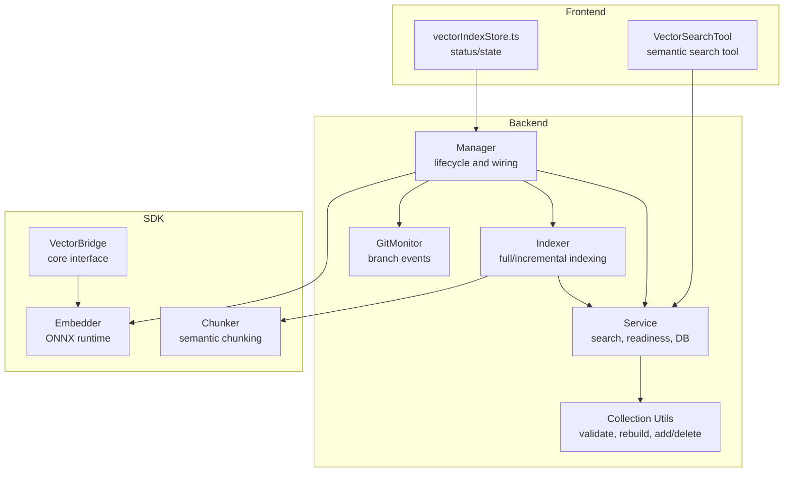
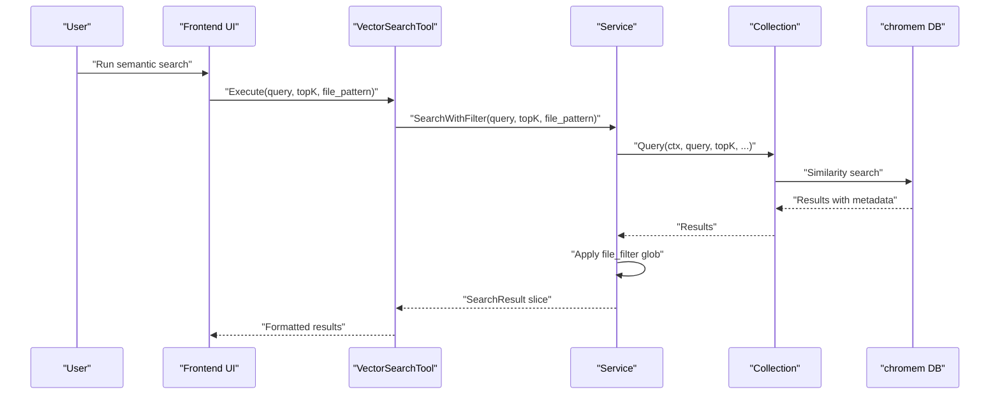
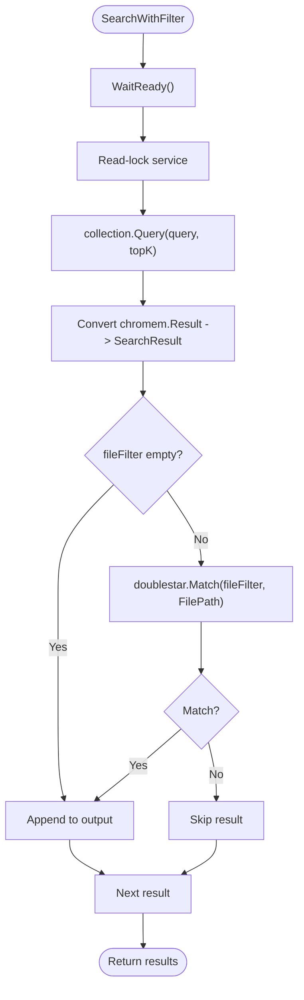
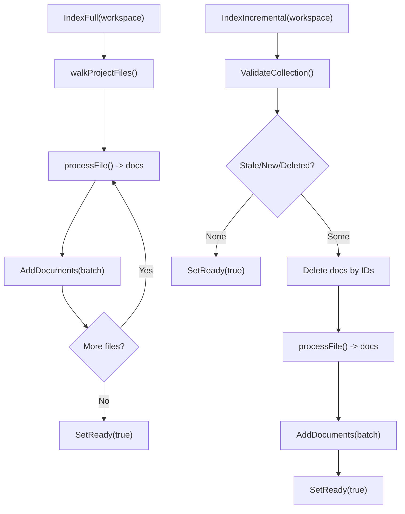
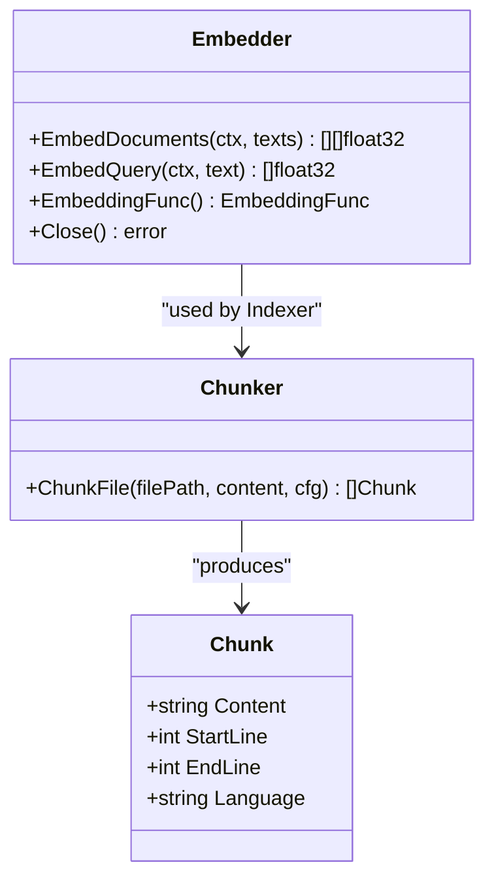
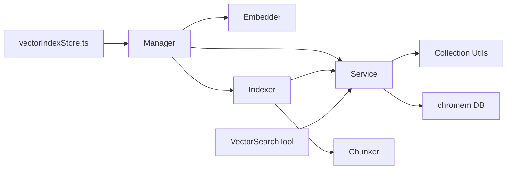

# Vector Search Functionality

<cite>
**Referenced Files in This Document**
- [service.go](file://backend/vectorindex/service.go)
- [search_result.go](file://backend/vectorindex/search_result.go)
- [indexer.go](file://backend/vectorindex/indexer.go)
- [collection.go](file://backend/vectorindex/collection.go)
- [manager.go](file://backend/vectorindex/manager.go)
- [git.go](file://backend/vectorindex/git.go)
- [vector_search.go](file://sdk/tools/builtins/vector_search.go)
- [embedder.go](file://sdk/embedding/embedder.go)
- [chunker.go](file://sdk/embedding/chunker.go)
- [vectorIndexStore.ts](file://frontend/src/stores/vectorIndexStore.ts)
- [vectorbridge.go](file://core/vectorbridge.go)
</cite>

## Table of Contents
1. [Introduction](#introduction)
2. [Project Structure](#project-structure)
3. [Core Components](#core-components)
4. [Architecture Overview](#architecture-overview)
5. [Detailed Component Analysis](#detailed-component-analysis)
6. [Dependency Analysis](#dependency-analysis)
7. [Performance Considerations](#performance-considerations)
8. [Troubleshooting Guide](#troubleshooting-guide)
9. [Conclusion](#conclusion)
10. [Appendices](#appendices)

## Introduction
This document explains the vector search functionality and query processing pipeline. It covers how text is preprocessed into semantic chunks, how embeddings are generated, how similarity is computed, and how results are ranked and filtered. It also documents the SearchResult structure, metadata handling, file path filtering with glob patterns, result formatting, pagination, and integration with the built-in vector search tool. Finally, it provides examples of constructing queries, interpreting results, and optimizing performance.

## Project Structure
The vector search system spans three layers:
- Backend vector index: service, indexer, collection management, and git-aware branch switching
- SDK embedding and chunking: ONNX-based embedder and file chunker
- Frontend integration: vector index status store and tool wrapper for semantic search

**Diagram sources**
- [manager.go:49-95](file://backend/vectorindex/manager.go#L49-L95)
- [service.go:48-67](file://backend/vectorindex/service.go#L48-L67)
- [indexer.go:72-103](file://backend/vectorindex/indexer.go#L72-L103)
- [collection.go:31-55](file://backend/vectorindex/collection.go#L31-L55)
- [git.go:64-90](file://backend/vectorindex/git.go#L64-L90)
- [embedder.go:56-118](file://sdk/embedding/embedder.go#L56-L118)
- [chunker.go:48-100](file://sdk/embedding/chunker.go#L48-L100)
- [vectorbridge.go:44-58](file://core/vectorbridge.go#L44-L58)
- [vectorIndexStore.ts:30-55](file://frontend/src/stores/vectorIndexStore.ts#L30-L55)
- [vector_search.go:48-78](file://sdk/tools/builtins/vector_search.go#L48-L78)

**Section sources**
- [manager.go:49-95](file://backend/vectorindex/manager.go#L49-L95)
- [service.go:48-67](file://backend/vectorindex/service.go#L48-L67)
- [indexer.go:72-103](file://backend/vectorindex/indexer.go#L72-L103)
- [collection.go:31-55](file://backend/vectorindex/collection.go#L31-L55)
- [git.go:64-90](file://backend/vectorindex/git.go#L64-L90)
- [embedder.go:56-118](file://sdk/embedding/embedder.go#L56-L118)
- [chunker.go:48-100](file://sdk/embedding/chunker.go#L48-L100)
- [vectorbridge.go:44-58](file://core/vectorbridge.go#L44-L58)
- [vectorIndexStore.ts:30-55](file://frontend/src/stores/vectorIndexStore.ts#L30-L55)
- [vector_search.go:48-78](file://sdk/tools/builtins/vector_search.go#L48-L78)

## Core Components
- Service: wraps chromem-go DB and collection, exposes search, readiness, and branch switching
- Indexer: orchestrates full and incremental indexing, file walking, chunking, hashing, and batching
- Collection utilities: validate collection against disk, rebuild, add/delete documents, compute file counts
- Manager: wires embedder, service, indexer, and git monitor; manages lifecycle and background indexing
- Embedder: ONNX-based text embedding with fast-path single-text inference
- Chunker: semantic chunking by file type with line-number metadata
- VectorSearchTool: frontend-friendly tool that executes semantic search, formats results, and enforces limits
- VectorIndexStore: frontend state for indexing progress and status

**Section sources**
- [service.go:100-143](file://backend/vectorindex/service.go#L100-L143)
- [indexer.go:105-163](file://backend/vectorindex/indexer.go#L105-L163)
- [collection.go:57-139](file://backend/vectorindex/collection.go#L57-L139)
- [manager.go:97-212](file://backend/vectorindex/manager.go#L97-L212)
- [embedder.go:120-177](file://sdk/embedding/embedder.go#L120-L177)
- [chunker.go:48-100](file://sdk/embedding/chunker.go#L48-L100)
- [vector_search.go:87-157](file://sdk/tools/builtins/vector_search.go#L87-L157)
- [vectorIndexStore.ts:5-11](file://frontend/src/stores/vectorIndexStore.ts#L5-L11)

## Architecture Overview
The system builds a vector index per project and per git branch. Embeddings are generated using an ONNX model, and chromem-go powers the vector database and similarity queries. The frontend integrates with the backend via a semantic search tool and displays indexing status.

**Diagram sources**
- [vector_search.go:87-157](file://sdk/tools/builtins/vector_search.go#L87-L157)
- [service.go:105-143](file://backend/vectorindex/service.go#L105-L143)
- [collection.go:46-54](file://backend/vectorindex/collection.go#L46-L54)

## Detailed Component Analysis

### Service: Search, Readiness, and Branching
- Exposes Search and SearchWithFilter, which delegate to chromem-go’s collection.Query
- Applies file path filtering using doublestar glob patterns post-query
- Manages readiness with a channel-based signaling mechanism
- Provides branch-aware collection switching and persistence path handling

**Diagram sources**
- [service.go:105-143](file://backend/vectorindex/service.go#L105-L143)
- [search_result.go:3-12](file://backend/vectorindex/search_result.go#L3-L12)

**Section sources**
- [service.go:100-143](file://backend/vectorindex/service.go#L100-L143)
- [search_result.go:3-12](file://backend/vectorindex/search_result.go#L3-L12)

### Indexer: Full and Incremental Indexing
- Full indexing walks the workspace, filters ignored files/dirs, chunks content, and batches embedding/add operations
- Incremental indexing compares stored hashes to detect stale/new/deleted files, deletes stale/deleted docs, and reindexes affected files
- Debounced file change notifications trigger incremental reindexing

**Diagram sources**
- [indexer.go:105-163](file://backend/vectorindex/indexer.go#L105-L163)
- [indexer.go:165-273](file://backend/vectorindex/indexer.go#L165-L273)
- [indexer.go:295-341](file://backend/vectorindex/indexer.go#L295-L341)
- [collection.go:57-139](file://backend/vectorindex/collection.go#L57-L139)

**Section sources**
- [indexer.go:105-163](file://backend/vectorindex/indexer.go#L105-L163)
- [indexer.go:165-273](file://backend/vectorindex/indexer.go#L165-L273)
- [indexer.go:295-341](file://backend/vectorindex/indexer.go#L295-L341)
- [collection.go:57-139](file://backend/vectorindex/collection.go#L57-L139)

### Embedding Generation and Chunking
- Embedder loads tokenizer and ONNX model, supports single-text fast-path and batch inference
- Chunker segments files by type: code, markdown, config, or fallback fixed-size chunks; preserves line numbers and language metadata

**Diagram sources**
- [embedder.go:120-177](file://sdk/embedding/embedder.go#L120-L177)
- [chunker.go:48-100](file://sdk/embedding/chunker.go#L48-L100)
- [chunker.go:13-21](file://sdk/embedding/chunker.go#L13-L21)

**Section sources**
- [embedder.go:120-177](file://sdk/embedding/embedder.go#L120-L177)
- [chunker.go:48-100](file://sdk/embedding/chunker.go#L48-L100)

### Collection Utilities: Validation, Rebuild, and Counts
- Validates collection against disk using stored content hashes
- Enumerates unique files and rebuilds collection if needed
- Computes unique file counts for progress reporting

**Section sources**
- [collection.go:57-139](file://backend/vectorindex/collection.go#L57-L139)
- [collection.go:249-257](file://backend/vectorindex/collection.go#L249-L257)

### Manager: Lifecycle and Wiring
- Creates embedder and service, sets project, initializes indexer, and starts background indexing
- Watches git HEAD for branch changes and triggers branch-aware indexing
- Supports cancellation and graceful shutdown

**Section sources**
- [manager.go:97-212](file://backend/vectorindex/manager.go#L97-L212)
- [manager.go:214-244](file://backend/vectorindex/manager.go#L214-L244)
- [manager.go:246-280](file://backend/vectorindex/manager.go#L246-L280)

### Git Monitoring: Branch Awareness
- Monitors .git/HEAD changes with debouncing to avoid spurious triggers
- Detects current branch or falls back to a default identifier

**Section sources**
- [git.go:64-90](file://backend/vectorindex/git.go#L64-L90)
- [git.go:112-161](file://backend/vectorindex/git.go#L112-L161)

### Frontend Integration: Status Store and Semantic Search Tool
- VectorIndexStore tracks indexing state, progress, and current file
- VectorSearchTool enforces topK limits, applies file patterns, waits for readiness, and formats results with previews and metadata

**Section sources**
- [vectorIndexStore.ts:5-11](file://frontend/src/stores/vectorIndexStore.ts#L5-L11)
- [vector_search.go:87-157](file://sdk/tools/builtins/vector_search.go#L87-L157)

## Dependency Analysis
The system composes modular components with clear boundaries:
- Manager depends on Embedder and Service
- Indexer depends on Service and Chunker
- Service depends on chromem-go and doublestar for globbing
- VectorSearchTool depends on Service and formats results
- Frontend depends on VectorSearchTool and VectorIndexStore

**Diagram sources**
- [manager.go:49-95](file://backend/vectorindex/manager.go#L49-L95)
- [indexer.go:72-103](file://backend/vectorindex/indexer.go#L72-L103)
- [service.go:48-67](file://backend/vectorindex/service.go#L48-L67)
- [vector_search.go:48-78](file://sdk/tools/builtins/vector_search.go#L48-L78)
- [vectorIndexStore.ts:30-55](file://frontend/src/stores/vectorIndexStore.ts#L30-L55)

**Section sources**
- [manager.go:49-95](file://backend/vectorindex/manager.go#L49-L95)
- [indexer.go:72-103](file://backend/vectorindex/indexer.go#L72-L103)
- [service.go:48-67](file://backend/vectorindex/service.go#L48-L67)
- [vector_search.go:48-78](file://sdk/tools/builtins/vector_search.go#L48-L78)
- [vectorIndexStore.ts:30-55](file://frontend/src/stores/vectorIndexStore.ts#L30-L55)

## Performance Considerations
- Embedding throughput: prefer single-text fast-path for chromem-go’s typical one-at-a-time calls; batch inference is used for larger batches
- Chunk sizing and overlap: tune MaxChunkSize and Overlap to balance recall and retrieval latency
- Indexing batching: Indexer batches document additions to reduce overhead
- Readiness gating: Search operations block until the index is ready to avoid partial results
- Git monitoring debounce: reduces redundant reindexing on rapid HEAD changes
- Frontend result truncation: limits content preview size to improve rendering performance

[No sources needed since this section provides general guidance]

## Troubleshooting Guide
Common issues and remedies:
- Index not ready: Use the wait function in the tool or rely on Service.Ready to block until indexing completes
- Empty results: Verify topK is within allowed bounds and that the index contains data for the current branch
- Slow queries: Ensure embeddings are generated efficiently and consider reducing topK or applying file filters
- Incorrect file filtering: Confirm glob patterns are valid and anchored appropriately for your workspace
- Incremental indexing not triggered: Check git HEAD monitoring and file change notifications

**Section sources**
- [vector_search.go:106-111](file://sdk/tools/builtins/vector_search.go#L106-L111)
- [service.go:150-166](file://backend/vectorindex/service.go#L150-L166)
- [manager.go:214-234](file://backend/vectorindex/manager.go#L214-L234)

## Conclusion
The vector search system provides robust semantic search over a codebase with git-aware branching, efficient embedding generation, and flexible result filtering. The modular design enables scalable indexing and responsive query performance, while the frontend tool and status store integrate seamlessly into development workflows.

[No sources needed since this section summarizes without analyzing specific files]

## Appendices

### Query Processing Pipeline
- Text preprocessing: Chunker segments files by type and language, preserving line numbers
- Embedding generation: Embedder encodes text into dense vectors using ONNX runtime
- Similarity calculation: chromem-go computes similarity against the vector collection
- Result ranking: Results are scored by similarity; higher scores indicate greater semantic relevance
- Filtering: Optional file path glob filtering is applied post-query

**Section sources**
- [chunker.go:48-100](file://sdk/embedding/chunker.go#L48-L100)
- [embedder.go:120-177](file://sdk/embedding/embedder.go#L120-L177)
- [service.go:119-142](file://backend/vectorindex/service.go#L119-L142)

### SearchResult Structure and Metadata
- Fields: file path, file name, content preview, similarity score, start/end line numbers, language
- Metadata handling: Line numbers and language are parsed from stored metadata; content is the chunk text

**Section sources**
- [search_result.go:3-12](file://backend/vectorindex/search_result.go#L3-L12)
- [service.go:230-244](file://backend/vectorindex/service.go#L230-L244)

### File Path Filtering with Glob Patterns
- Pattern application: After retrieving results, the service applies doublestar glob matching against the file path
- Invalid patterns: Logged warnings; invalid patterns skip affected results

**Section sources**
- [service.go:128-137](file://backend/vectorindex/service.go#L128-L137)

### Result Formatting, Pagination, and Advanced Features
- Formatting: The tool formats results with index, path, line ranges, score, language, and truncated content preview
- Pagination: Not implemented; topK controls the number of returned results
- Advanced features: Branch-aware collections, incremental reindexing, and git HEAD monitoring

**Section sources**
- [vector_search.go:122-154](file://sdk/tools/builtins/vector_search.go#L122-L154)
- [manager.go:188-212](file://backend/vectorindex/manager.go#L188-L212)

### Examples
- Constructing a semantic search query: Provide a natural language description of the concept or functionality to locate
- Interpreting results: Higher similarity scores indicate stronger semantic matches; line ranges help pinpoint relevant code sections
- Applying file filters: Use glob patterns like “**/*.go” to restrict results to Go files or “src/**” to limit to a directory subtree
- Optimizing performance: Reduce topK, apply file filters, ensure embeddings are warmed up, and avoid frequent reindexing

[No sources needed since this section provides general guidance]