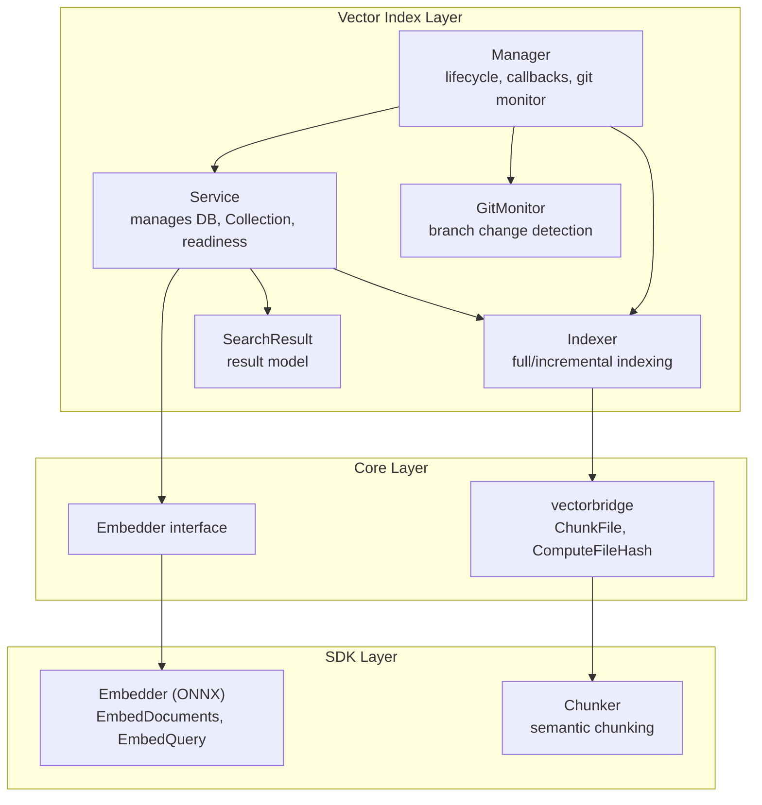
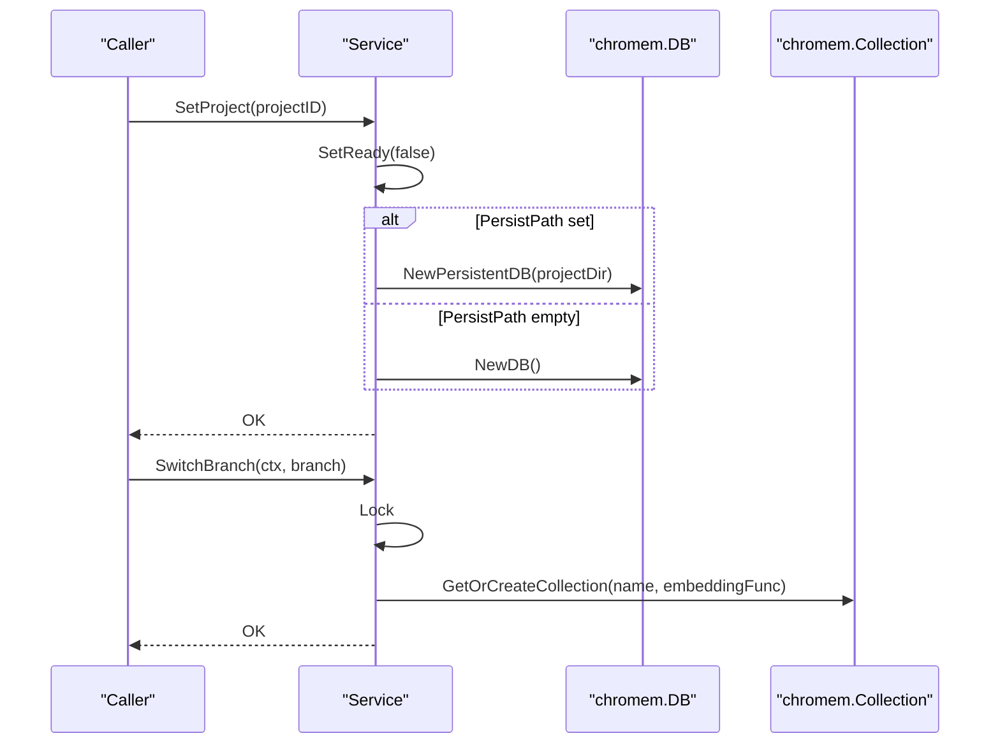
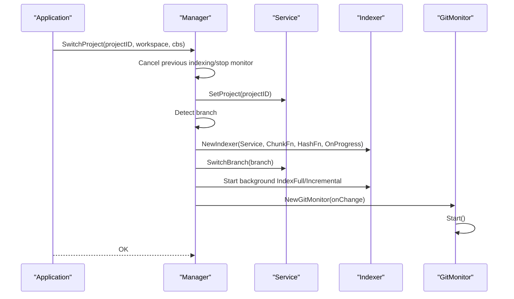
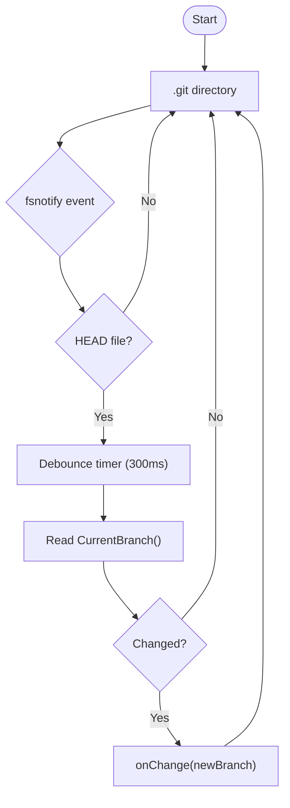
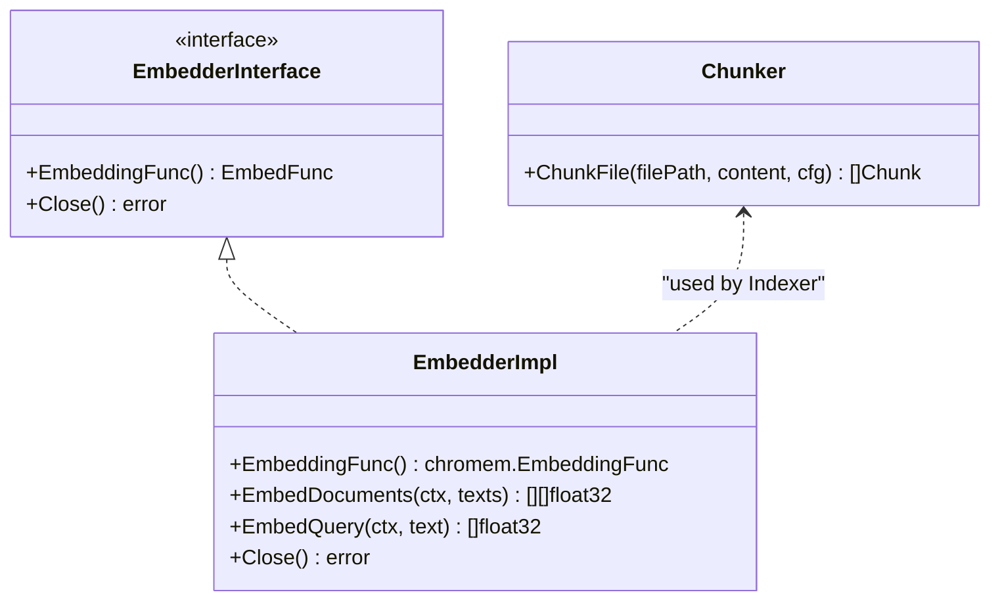
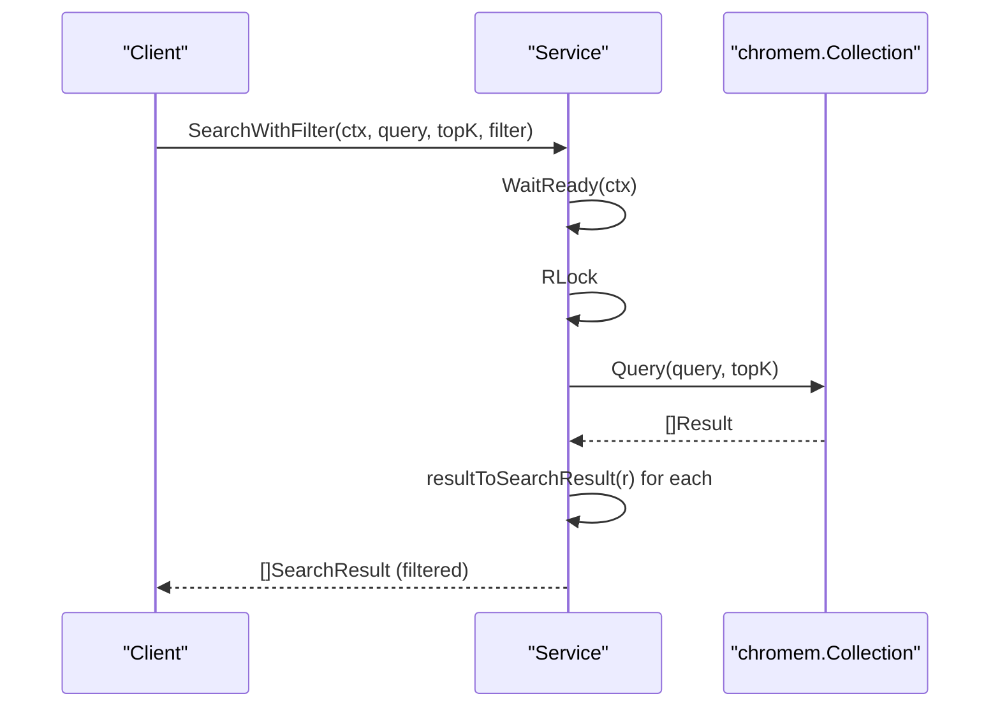
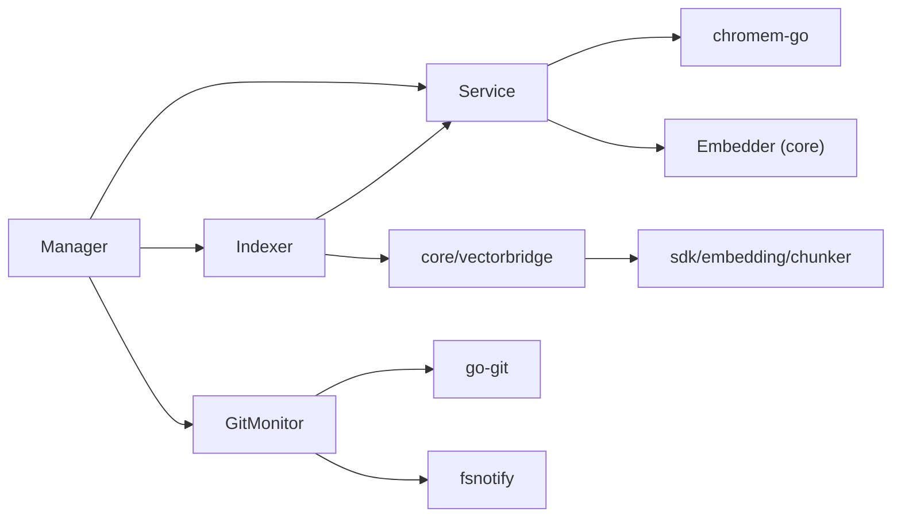

# Vector Service Architecture

<cite>
**Referenced Files in This Document**
- [service.go](file://backend/vectorindex/service.go)
- [collection.go](file://backend/vectorindex/collection.go)
- [indexer.go](file://backend/vectorindex/indexer.go)
- [search_result.go](file://backend/vectorindex/search_result.go)
- [manager.go](file://backend/vectorindex/manager.go)
- [git.go](file://backend/vectorindex/git.go)
- [vectorbridge.go](file://core/vectorbridge.go)
- [embedder.go](file://sdk/embedding/embedder.go)
- [chunker.go](file://sdk/embedding/chunker.go)
- [service_test.go](file://backend/vectorindex/service_test.go)
- [indexer_test.go](file://backend/vectorindex/indexer_test.go)
</cite>

## Table of Contents
1. [Introduction](#introduction)
2. [Project Structure](#project-structure)
3. [Core Components](#core-components)
4. [Architecture Overview](#architecture-overview)
5. [Detailed Component Analysis](#detailed-component-analysis)
6. [Dependency Analysis](#dependency-analysis)
7. [Performance Considerations](#performance-considerations)
8. [Troubleshooting Guide](#troubleshooting-guide)
9. [Conclusion](#conclusion)

## Introduction
This document explains the vector index service architecture used for local code search. It covers the Service design, initialization, configuration, project and branch switching, readiness signaling, thread-safety, and the relationship among Service, DB, Collection, and EmbeddingFunc. It also documents lifecycle management, error handling, resource cleanup, and the conversion from chromem-go results to SearchResult structures.

## Project Structure
The vector index subsystem resides under backend/vectorindex and integrates with core and sdk layers for embedding and chunking:
- backend/vectorindex: Service, Indexer, Manager, GitMonitor, and search result model
- core: Embedder interface and chunking bridge
- sdk/embedding: ONNX-based embedder and file chunker



**Diagram sources**
- [service.go:32-46](file://backend/vectorindex/service.go#L32-L46)
- [indexer.go:61-70](file://backend/vectorindex/indexer.go#L61-L70)
- [manager.go:31-47](file://backend/vectorindex/manager.go#L31-L47)
- [git.go:24-34](file://backend/vectorindex/git.go#L24-L34)
- [search_result.go:3-12](file://backend/vectorindex/search_result.go#L3-L12)
- [vectorbridge.go:67-87](file://core/vectorbridge.go#L67-L87)
- [embedder.go:44-54](file://sdk/embedding/embedder.go#L44-L54)
- [chunker.go:48-100](file://sdk/embedding/chunker.go#L48-L100)

**Section sources**
- [service.go:32-46](file://backend/vectorindex/service.go#L32-L46)
- [indexer.go:61-70](file://backend/vectorindex/indexer.go#L61-L70)
- [manager.go:31-47](file://backend/vectorindex/manager.go#L31-L47)
- [git.go:24-34](file://backend/vectorindex/git.go#L24-L34)
- [search_result.go:3-12](file://backend/vectorindex/search_result.go#L3-L12)
- [vectorbridge.go:67-87](file://core/vectorbridge.go#L67-L87)
- [embedder.go:44-54](file://sdk/embedding/embedder.go#L44-L54)
- [chunker.go:48-100](file://sdk/embedding/chunker.go#L48-L100)

## Core Components
- Service: central coordinator managing chromem DB and Collection, embedding function, project and branch scoping, readiness state, and thread-safe operations.
- Indexer: orchestrates full and incremental indexing, batching, progress reporting, and gitignore-aware file walking.
- Manager: constructs embedder and service, wires project lifecycle, git monitoring, and graceful shutdown.
- GitMonitor: watches .git/HEAD for branch changes with debouncing.
- SearchResult: normalized result structure for search outputs.

Key responsibilities:
- Service: persistence path handling, project-scoped DB, branch-aware collection, readiness signaling, thread-safety, and conversion from chromem results.
- Indexer: file discovery, chunking, hashing, document creation, batched embedding, and collection updates.
- Manager: embedder lifecycle, project switching, background indexing, git branch monitoring, and coordinated shutdown.
- GitMonitor: branch detection and change notifications.

**Section sources**
- [service.go:32-46](file://backend/vectorindex/service.go#L32-L46)
- [indexer.go:61-70](file://backend/vectorindex/indexer.go#L61-L70)
- [manager.go:31-47](file://backend/vectorindex/manager.go#L31-L47)
- [git.go:24-34](file://backend/vectorindex/git.go#L24-L34)
- [search_result.go:3-12](file://backend/vectorindex/search_result.go#L3-L12)

## Architecture Overview
The system is composed of three layers:
- Backend vectorindex: Service, Indexer, Manager, GitMonitor
- Core: vectorbridge exposing ChunkFile and ComputeFileHash
- SDK embedding: ONNX-based embedder and chunker

```mermaid
classDiagram
class Service {
-db : chromem.DB
-collection : chromem.Collection
-embeddingFunc : chromem.EmbeddingFunc
-persistPath : string
-projectID : string
-currentBranch : string
-mu : RWMutex
-ready : atomic.Bool
-readyCh : chan struct{}
-readyMu : Mutex
-logger : slog.Logger
+SetProject(projectID) error
+SwitchBranch(ctx, branch) error
+Search(ctx, query, topK) []SearchResult
+SearchWithFilter(ctx, query, topK, filter) []SearchResult
+IsReady() bool
+WaitReady(ctx) error
+AcquireWriteLock()
+ReleaseWriteLock()
+SetReady(ready)
+GetDB() *chromem.DB
+GetCollection() *chromem.Collection
+GetEmbeddingFunc() chromem.EmbeddingFunc
+CurrentBranchName() string
+Close() error
}
class Indexer {
-service : *Service
-chunkFn : ChunkFunc
-hashFn : HashFunc
-maxChunkSize : int
-overlap : int
-onProgress : ProgressCallback
-logger : slog.Logger
+IndexFull(ctx, workspace) error
+IndexIncremental(ctx, workspace) error
+HandleBranchSwitch(ctx, workspace, branch) error
}
class Manager {
-embedder : core.Embedder
-service : *Service
-indexer : *Indexer
-gitMonitor : *GitMonitor
-indexCancel : context.CancelFunc
-mu : RWMutex
-debounceMu : Mutex
-debounceTimer : *time.Timer
-logger : slog.Logger
+Service() *Service
+SwitchProject(projectID, workspace, cbs) error
+NotifyFileChange(workspace)
+CancelIndexing()
+Shutdown()
}
class GitMonitor {
-repoPath : string
-currentBranch : string
-watcher : fsnotify.Watcher
-onChange : func(newBranch)
-done : chan struct{}
-mu : Mutex
-logger : slog.Logger
+Start() error
+CurrentBranchName() string
+Stop() error
}
class Embedder {
<<interface>>
+EmbeddingFunc() EmbedFunc
+Close() error
}
class EmbedderImpl {
-tokenizer : Tokenizer
-modelPath : string
-maxSeqLen : int
-hiddenDim : int
-logger : slog.Logger
-sess : onnxSession
+EmbedDocuments(ctx, texts) [][]float32
+EmbedQuery(ctx, text) []float32
+EmbeddingFunc() chromem.EmbeddingFunc
+Close() error
}
Service --> Embedder : "uses"
Indexer --> Service : "updates collection"
Manager --> Service : "owns"
Manager --> Indexer : "owns"
Manager --> GitMonitor : "owns"
Embedder <|.. EmbedderImpl : "implements"
```

**Diagram sources**
- [service.go:32-46](file://backend/vectorindex/service.go#L32-L46)
- [indexer.go:61-70](file://backend/vectorindex/indexer.go#L61-L70)
- [manager.go:31-47](file://backend/vectorindex/manager.go#L31-L47)
- [git.go:24-34](file://backend/vectorindex/git.go#L24-L34)
- [vectorbridge.go:25-29](file://core/vectorbridge.go#L25-L29)
- [embedder.go:44-54](file://sdk/embedding/embedder.go#L44-L54)

## Detailed Component Analysis

### Service: Design, Initialization, and Configuration
- Purpose: Manage chromem DB and Collection, track project and branch, coordinate readiness, and expose thread-safe operations.
- Configuration:
  - PersistPath: base directory for vector storage; empty means in-memory only.
  - EmbeddingFunc: chromem-compatible function from the embedder.
  - Logger: structured logging.
- Thread-safety:
  - Read-write lock guards DB, Collection, branch, and projectID.
  - Atomic Bool tracks readiness; channel-based signaling wakes WaitReady callers.
  - Additional mutex protects channel swapping.
- Readiness management:
  - SetReady transitions the channel to closed/unblock waiters or recreates channel when transitioning to false.
  - WaitReady blocks until ready or context cancellation.
- Branch awareness:
  - SwitchBranch creates or retrieves a collection named deterministically from the branch.
  - Collection names are sanitized and prefixed to avoid invalid identifiers.
- Persistence:
  - SetProject initializes a project-scoped DB under PersistPath or uses an in-memory DB when PersistPath is empty.
- Embedding function:
  - Exposed via GetEmbeddingFunc for Indexer to pass to chromem collections.



**Diagram sources**
- [service.go:69-98](file://backend/vectorindex/service.go#L69-L98)
- [collection.go:31-55](file://backend/vectorindex/collection.go#L31-L55)

**Section sources**
- [service.go:18-30](file://backend/vectorindex/service.go#L18-L30)
- [service.go:32-46](file://backend/vectorindex/service.go#L32-L46)
- [service.go:48-67](file://backend/vectorindex/service.go#L48-L67)
- [service.go:69-98](file://backend/vectorindex/service.go#L69-L98)
- [service.go:100-143](file://backend/vectorindex/service.go#L100-L143)
- [service.go:145-195](file://backend/vectorindex/service.go#L145-L195)
- [service.go:197-228](file://backend/vectorindex/service.go#L197-L228)
- [collection.go:21-29](file://backend/vectorindex/collection.go#L21-L29)
- [collection.go:31-55](file://backend/vectorindex/collection.go#L31-L55)

### Indexer: Lifecycle and Operations
- Responsibilities:
  - Full indexing: walk project files, chunk, compute hashes, create documents, batch insert.
  - Incremental indexing: validate collection vs disk, delete stale/new/deleted, re-index affected, batch insert.
  - Branch switching: switch collection and choose full vs incremental based on collection emptiness.
- File filtering:
  - Uses gitignore patterns and default ignores for directories, extensions, and filenames.
  - Binary detection avoids indexing binary files.
- Progress reporting:
  - Callbacks indicate indexing, reindexing, and ready states with counts.
- Batching:
  - Adds documents in batches sized for efficient embedding.

```mermaid
flowchart TD
Start([Start IndexFull]) --> ResetReady["SetReady(false)"]
ResetReady --> Walk["walkProjectFiles(workspace)"]
Walk --> Iterate{"For each file"}
Iterate --> Read["Read file content"]
Read --> Binary{"Binary?"}
Binary --> |Yes| Skip["Skip file"]
Binary --> |No| Chunk["ChunkFile(filePath, content)"]
Chunk --> Docs["Create chromem documents"]
Docs --> Batch["Accumulate batch"]
Batch --> Size{"Batch >= 50?"}
Size --> |Yes| Add["AddDocuments(batch)"]
Add --> Clear["Clear batch"]
Size --> |No| Iterate
Clear --> Iterate
Iterate --> |Done| Flush{"Remaining batch?"}
Flush --> |Yes| AddFinal["AddDocuments(final)"]
Flush --> |No| Done([SetReady(true)])
AddFinal --> Done
```

**Diagram sources**
- [indexer.go:105-163](file://backend/vectorindex/indexer.go#L105-L163)
- [indexer.go:375-418](file://backend/vectorindex/indexer.go#L375-L418)
- [indexer.go:460-521](file://backend/vectorindex/indexer.go#L460-L521)

**Section sources**
- [indexer.go:50-103](file://backend/vectorindex/indexer.go#L50-L103)
- [indexer.go:105-163](file://backend/vectorindex/indexer.go#L105-L163)
- [indexer.go:165-273](file://backend/vectorindex/indexer.go#L165-L273)
- [indexer.go:275-293](file://backend/vectorindex/indexer.go#L275-L293)
- [indexer.go:295-341](file://backend/vectorindex/indexer.go#L295-L341)
- [indexer.go:375-418](file://backend/vectorindex/indexer.go#L375-L418)
- [indexer.go:460-521](file://backend/vectorindex/indexer.go#L460-L521)

### Manager: Lifecycle Management and Integration
- Creates embedder and service when model paths are provided; otherwise vector search is disabled.
- SwitchProject:
  - Cancels in-flight indexing and stops git monitor.
  - Sets project on Service, detects branch, builds chunker adapter, creates Indexer.
  - Switches to branch collection, starts background indexing (full if empty, incremental otherwise), and starts GitMonitor.
- NotifyFileChange: debounced incremental indexing.
- Shutdown: cancels indexing, stops monitor, closes service and embedder.



**Diagram sources**
- [manager.go:97-212](file://backend/vectorindex/manager.go#L97-L212)
- [git.go:64-90](file://backend/vectorindex/git.go#L64-L90)

**Section sources**
- [manager.go:14-24](file://backend/vectorindex/manager.go#L14-L24)
- [manager.go:49-90](file://backend/vectorindex/manager.go#L49-L90)
- [manager.go:97-212](file://backend/vectorindex/manager.go#L97-L212)
- [manager.go:214-244](file://backend/vectorindex/manager.go#L214-L244)
- [manager.go:246-280](file://backend/vectorindex/manager.go#L246-L280)

### GitMonitor: Branch Awareness
- Watches .git directory for HEAD changes with a debounce interval.
- Detects current branch using go-git; falls back to DefaultBranch for non-git directories.
- Calls onChange with the new branch when it changes.



**Diagram sources**
- [git.go:92-110](file://backend/vectorindex/git.go#L92-L110)
- [git.go:112-142](file://backend/vectorindex/git.go#L112-L142)
- [git.go:144-161](file://backend/vectorindex/git.go#L144-L161)

**Section sources**
- [git.go:15-22](file://backend/vectorindex/git.go#L15-L22)
- [git.go:36-62](file://backend/vectorindex/git.go#L36-L62)
- [git.go:64-90](file://backend/vectorindex/git.go#L64-L90)
- [git.go:92-110](file://backend/vectorindex/git.go#L92-L110)
- [git.go:112-142](file://backend/vectorindex/git.go#L112-L142)
- [git.go:144-161](file://backend/vectorindex/git.go#L144-L161)
- [git.go:170-180](file://backend/vectorindex/git.go#L170-L180)

### Embedding Function Integration
- Embedder interface exposed via core/vectorbridge and implemented by sdk/embedding.
- Service receives a chromem-compatible EmbeddingFunc from the embedder.
- Indexer uses ChunkFile from core/vectorbridge, which delegates to sdk/embedding.ChunkFile.



**Diagram sources**
- [vectorbridge.go:25-29](file://core/vectorbridge.go#L25-L29)
- [vectorbridge.go:44-58](file://core/vectorbridge.go#L44-L58)
- [embedder.go:44-54](file://sdk/embedding/embedder.go#L44-L54)
- [embedder.go:171-177](file://sdk/embedding/embedder.go#L171-L177)
- [chunker.go:48-100](file://sdk/embedding/chunker.go#L48-L100)

**Section sources**
- [vectorbridge.go:25-29](file://core/vectorbridge.go#L25-L29)
- [vectorbridge.go:44-58](file://core/vectorbridge.go#L44-L58)
- [embedder.go:44-54](file://sdk/embedding/embedder.go#L44-L54)
- [embedder.go:171-177](file://sdk/embedding/embedder.go#L171-L177)
- [chunker.go:48-100](file://sdk/embedding/chunker.go#L48-L100)

### Search and Result Conversion
- Search/SearchWithFilter:
  - Block on WaitReady, acquire read lock, validate collection, query chromem collection, convert results.
  - Optional file path filter using doublestar globbing.
- Conversion:
  - resultToSearchResult maps chromem.Result metadata to SearchResult fields.



**Diagram sources**
- [service.go:100-143](file://backend/vectorindex/service.go#L100-L143)
- [service.go:230-244](file://backend/vectorindex/service.go#L230-L244)

**Section sources**
- [service.go:100-143](file://backend/vectorindex/service.go#L100-L143)
- [service.go:230-244](file://backend/vectorindex/service.go#L230-L244)
- [search_result.go:3-12](file://backend/vectorindex/search_result.go#L3-L12)

## Dependency Analysis
- Service depends on chromem DB and Collection, and on the EmbeddingFunc provided by the embedder.
- Indexer depends on Service for DB access and collection operations, and on core vectorbridge for chunking and hashing.
- Manager composes Embedder, Service, Indexer, and GitMonitor.
- GitMonitor depends on go-git and fsnotify.



**Diagram sources**
- [service.go:34-37](file://backend/vectorindex/service.go#L34-L37)
- [indexer.go:50-59](file://backend/vectorindex/indexer.go#L50-L59)
- [manager.go:34-38](file://backend/vectorindex/manager.go#L34-L38)
- [git.go:11-13](file://backend/vectorindex/git.go#L11-L13)

**Section sources**
- [service.go:34-37](file://backend/vectorindex/service.go#L34-L37)
- [indexer.go:50-59](file://backend/vectorindex/indexer.go#L50-L59)
- [manager.go:34-38](file://backend/vectorindex/manager.go#L34-L38)
- [git.go:11-13](file://backend/vectorindex/git.go#L11-L13)

## Performance Considerations
- Batching: Indexer batches document additions to reduce overhead; tune batch size for throughput vs latency.
- Embedding path: Embedder uses a persistent session for single-text inference to optimize chromem-go’s common one-at-a-time calls.
- Collection enumeration: Listing all documents to derive file hashes uses a broad query; for very large collections, consider maintaining a dedicated metadata store.
- File filtering: Gitignore and default ignore lists reduce I/O by skipping irrelevant files.
- Readiness signaling: Channel-based signaling avoids busy-wait loops and minimizes contention.

[No sources needed since this section provides general guidance]

## Troubleshooting Guide
Common issues and patterns:
- No collection available:
  - Ensure SetProject and SwitchBranch are called before search or indexing.
- Persistence failures:
  - Verify PersistPath permissions and existence; project subdirectories are created automatically.
- Readiness blocking:
  - WaitReady returns context cancellation error if the context is cancelled; ensure SetReady(true) is invoked after indexing completes.
- Binary files:
  - Binary detection skips indexing; confirm content is not null-byte-heavy.
- Git monitoring:
  - Non-git directories fall back to DefaultBranch; ensure .git exists for branch detection.
- Resource cleanup:
  - Shutdown cancels indexing, stops monitors, closes service and embedder; call Close on Service when appropriate.

**Section sources**
- [service.go:100-143](file://backend/vectorindex/service.go#L100-L143)
- [service.go:145-195](file://backend/vectorindex/service.go#L145-L195)
- [indexer.go:105-163](file://backend/vectorindex/indexer.go#L105-L163)
- [indexer.go:165-273](file://backend/vectorindex/indexer.go#L165-L273)
- [manager.go:246-280](file://backend/vectorindex/manager.go#L246-L280)
- [git.go:36-62](file://backend/vectorindex/git.go#L36-L62)

## Conclusion
The vector index service provides a robust, thread-safe, and branch-aware indexing and search pipeline. It integrates cleanly with chromem-go, supports both in-memory and persistent storage, and offers clear lifecycle management through Manager. The design balances performance with reliability, using batching, readiness signaling, and git-awareness to deliver responsive and accurate code search.