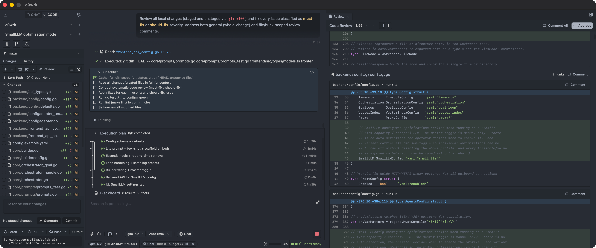

# c0wrk

> [!WARNING]
> **Early Alpha Stage** — This project is under active development and not yet stable.
> Features, APIs, and configuration formats may change without notice.
> Use at your own risk. Do not rely on it for production or critical workflows.

Desktop AI research and development agent for really complex tasks.



## Features

- ReAct-style step execution driven by a **DAG planner**, **router**, and **reflector** (replan on failure)
- **Normal / Advanced** execution modes selectable from the UI (single-step vs full multi-step plan)
- Desktop UI with chat, execution panels (DAG view), workspace tree, and file viewer with diff overlay
- Tool execution with **per-tool / per-skill / default** security policies (`always_allow`, `user_confirm`, `always_deny`) plus an **LLM judge** for risky paths
- **MCP** server integration (stdio and HTTP transports), MCP tools obey the same policy pipeline
- **Built-in PTY terminal** with per-session shell sessions (xterm.js frontend, `creack/pty` backend)
- **Agent skills system** — discoverable, composable skill modules per the AgentSkills.io spec, with priority-ordered directory scanning
- **Built-in web search** via Tavily API with configurable provider settings
- **Configurable reasoning effort** per agent role (orchestrator, planner, coder, tester, researcher, router, reflector, etc.) with automatic role-based adaptation
- **Sub-agent spawning** for parallel or delegated task execution within a session
- **LLM retry with exponential backoff** — configurable max retries, backoff durations for API resilience
- **HTTP/HTTPS proxy support** for all outbound connections (LLM, web search, MCP) with bypass list and custom CA certs
- **Hybrid code search**: ONNX Runtime-embedded vector search (chromem-go, jina-embeddings-v2-small-en model) + BM25 lexical (bleve) with **Reciprocal Rank Fusion** (k=60), partitioned per git branch
- **Cross-session file coherence** with TOCTOU protection
- **Circuit breakers** for repeat / truncation / parse-error / fruitless / same-tool loops
- Configurable **context compaction** (sliding window / summarization / hierarchical) tied to task domain
- SQLite persistence (CGO-free `modernc.org/sqlite`) — full session resume across restarts
- Configurable LLM providers: **Anthropic, OpenAI-compatible, ChatGPT** (Gemini, LM Studio, and other OpenAI-compatible models via `openai_compatible` provider) with per-role reasoning effort
- Configurable runtime limits (timeouts, tool output caps, compaction thresholds, bash blacklist)

## Architecture

High-level layers and responsibilities:

- **`desktop/`** — Wails app lifecycle; embeds `*backend.FrontendAPI` whose promoted methods are exposed to the frontend via Wails bindings.
- **`backend/`** — application/view-model layer: config loading, session/project management, persistence wiring, installer/watcher behavior. Frontend-callable methods split across `backend/frontend_api_*.go` by area.
- **`core/`** — orchestration logic: planner, router, reflector, tool registry, MCP gateway, security policy application.
- **`sdk/`** — sp4rk (reusable agent engine, `github.com/v0lka/sp4rk`): agent executor, LLM providers, memory/compaction, prompt/tool primitives.
- **`frontend/`** — React + TypeScript UI; communicates with Go via generated Wails bindings (`frontend/wailsjs/go/desktop/App`).

> Important layering rule: `backend/` and `desktop/` import `core` and `sdk/` directly. `core/` remains the primary consumer of sp4rk. No convenience re-export layers exist — all types are imported from their source packages. See `specs/decisions/008-backend-sp4rk-direct-import.md`.

### Frontend Stack

- **React 19** + **TypeScript ~5.7** + **Vite 6**
- **Tailwind CSS v4** (One Dark theme via `@theme` custom properties)
- **Zustand 5** for state management (13 domain stores: chat, plan, plan review, session, projects, file tree, file viewer, input mode, execution mode, blackboard, settings, UI, vector index)
- **shadcn/ui** (new-york style) + **Radix UI** primitives
- **lucide-react** icons, **react-markdown** 10, **highlight.js** 11, **Mermaid** 11 (lazy-loaded)
- Communication with Go via Wails-generated RPC bindings + session-scoped events (41+ event types)

## Requirements

Verified from project configuration and build files:

- **Go 1.26.3**
- **Node.js + npm** (used by Wails frontend commands and `frontend/package.json` scripts)
- **Wails v2.12.0 CLI** (`wails build`, `wails dev` are used by Makefile)
- **golangci-lint** (for `make lint`)
- **`git`** — required for CODE mode only; checked on first project switch. CHAT mode (No Project) works without git.
- **`rg` (ripgrep)** — auto-downloaded by the tool-manager on first run; no manual install needed.
- Platform support in Makefile ONNX fetch logic:
  - macOS (`arm64`, `x86_64`)
  - Linux (`aarch64`, `x64`)
  - Windows (`x64`, via zip runtime artifact path)

### Linux System Dependencies

Wails v2 requires native libraries for the WebKit GTK backend:

**Ubuntu/Debian 24.04+:**

```bash
sudo apt install libgtk-3-dev libwebkit2gtk-4.1-dev build-essential pkg-config
```

**Fedora 39+:**

```bash
sudo dnf install gtk3-devel webkit2gtk4.1-devel gcc pkg-config
```

**Arch Linux:**

```bash
sudo pacman -S gtk3 webkit2gtk-4.1 base-devel
```

For CI/headless builds, also install `xvfb` (`sudo apt install xvfb` on Debian/Ubuntu).

**Runtime only** (for end users, not developers):

```bash
# Ubuntu/Debian
sudo apt install libgtk-3-0 libwebkit2gtk-4.1-0
```

## Installation

### 1) Clone repository

```bash
git clone <your-fork-or-repo-url> c0wrk
cd c0wrk
```

### 2) Prepare frontend dependencies

```bash
make frontend-deps
```

### 3) Create user config

Copy the example config and place your runtime config at:

- **`~/.c0wrk/config.yaml`**

Example setup:

```bash
mkdir -p ~/.c0wrk
cp config.example.yaml ~/.c0wrk/config.yaml
```

Then edit provider credentials (for example `ANTHROPIC_API_KEY`, `OPENAI_API_KEY`, `GEMINI_API_KEY`, `TAVILY_API_KEY`) and adjust provider/model settings in `~/.c0wrk/config.yaml`.

## Configuration

Primary config reference: **`config.example.yaml`**.

Key points:

- Environment placeholders are supported as `${ENV_VAR}`.
- Active LLM provider is resolved from `llm.default_model` — the Router looks up which provider has the model in its enabled `models` list.
- MCP servers are configured under `mcp.servers`.
- Security defaults and per-tool policies are configured under `security`.
- Runtime limits are configurable under `toolLimits`, `timeouts`, and `executor`.
- SQLite database is always stored at `~/.c0wrk/database.db` (the `memory.database` config key has been retired).

## Development Commands

Project-level commands (from `Makefile`):

```bash
make frontend-deps   # npm install in frontend/
make test            # go test ./... && cd frontend && npm test (vitest)
make lint            # golangci-lint run && cd frontend && npm run lint
make dev-desktop     # frontend Vite dev server only
make build           # wails build + fetch ONNX runtime + fetch embedding model
make clean           # remove build/bin, .cache, frontend/dist
```

Asset/runtime fetch commands:

```bash
make fetch-onnx            # download/copy ONNX Runtime library into app bundle
make fetch-embedding-model # download/copy embedding model + tokenizer into app bundle
make clean-onnx            # remove ONNX runtime libs from app bundle/cache
```

## Build / Run

### Development

- Frontend-only development server:

```bash
make dev-desktop
```

- Full desktop hot-reload workflow (from repo root):

```bash
wails dev
```

### Production build

```bash
make build
```

This runs:

1. frontend dependency install,
2. `wails build`,
3. ONNX runtime fetch/copy,
4. embedding model/tokenizer fetch/copy.

### ONNX runtime requirement

The app bundle needs the ONNX runtime library in `build/bin/c0wrk-desktop.app/Contents/MacOS/`.

After `make build`, this is handled automatically. If you run `wails build` directly, run this afterward:

```bash
make fetch-onnx
```

## Project Structure

```text
.
├── desktop/        # Wails app entrypoints, lifecycle, embeds backend.FrontendAPI
├── backend/        # App/view-model layer: config/session/project/persistence/workspace services
├── core/           # Planner/router/reflector/orchestration/tool + MCP wiring
├── sdk/            # sp4rk module (github.com/v0lka/sp4rk) — reusable agent engine: LLM, tools, memory, execution primitives
├── frontend/       # React + TS app and generated Wails JS bindings
├── specs/          # System specs: architecture, contracts, domains, decisions (see specs/INDEX.md)
├── config.example.yaml
├── wails.json
└── Makefile
```

## Troubleshooting / Notes

- **Config not detected**: ensure file is exactly at `~/.c0wrk/config.yaml`.
- **App fails after build due to missing ONNX library**: run `make fetch-onnx`.
- **Missing embedding model files**: run `make fetch-embedding-model`.
- **`make dev-desktop` shows only frontend**: this command runs Vite only; use `wails dev` for full desktop runtime loop.
- **Generated Wails bindings drift** (`frontend/wailsjs/go/desktop/App.*`): regenerate via `wails build` or `wails dev` (do not hand-edit generated files).

---

## Contributing

CI runs on pushes to `main` and pull requests targeting `main` (see `.github/workflows/ci.yml`). Before opening a PR, also run the full local validation sequence:

```bash
make build
make lint
make test
```

All three must pass clean. `make test` runs both Go tests (`go test ./...`) and frontend tests (`cd frontend && npm test` via vitest).

## License

Licensed under the [MIT License](LICENSE) — see [LICENSE](LICENSE) for details.

## About

Built by c0wrk team with warmth, love, and c0wrk.
