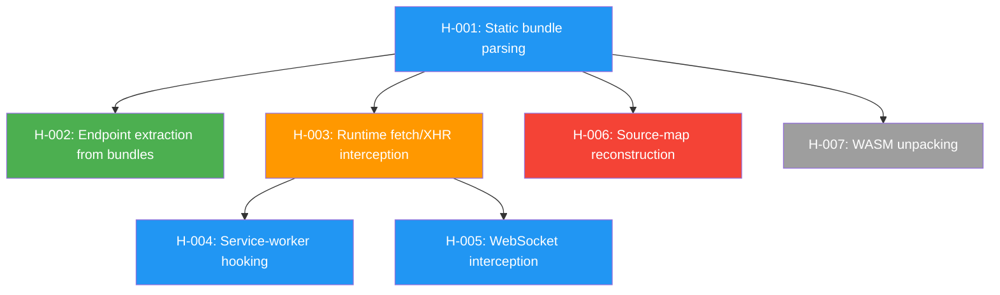

# Hypothesis Graph — R-001

## Diagram

## Hypothesis Catalog

| ID | Hypothesis | Status | Decision | Parent(s) |
|---|---|---|---|---|
| [H-001](H-001.md) | Static bundle parsing | confirmed | continue | — |
| [H-002](H-002.md) | Endpoint extraction from bundles | confirmed | continue | H-001 |
| [H-003](H-003.md) | Runtime fetch/XHR interception | in-progress | continue | H-001 |
| [H-004](H-004.md) | Service-worker hooking | open | — | H-003 |
| [H-005](H-005.md) | WebSocket interception | open | — | H-003 |
| [H-006](H-006.md) | Source-map reconstruction | refuted | kill | H-001 |
| [H-007](H-007.md) | WASM unpacking | cancelled | kill | H-001 |

---

*Each hypothesis card is a separate file in this directory: `H-NNN.md`.*

[Back to Brief](../brief.md)
